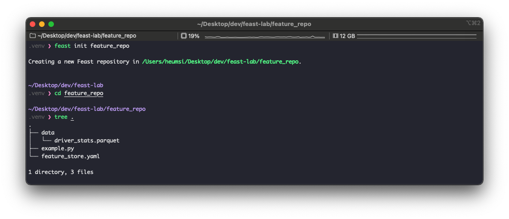
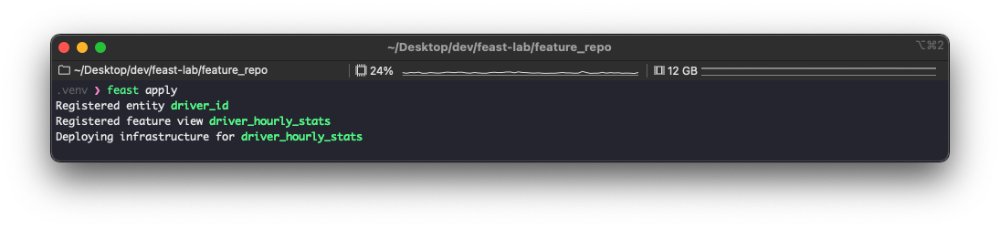
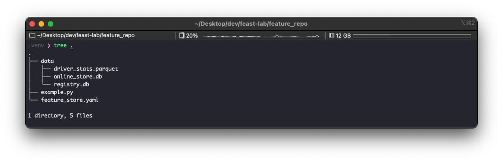
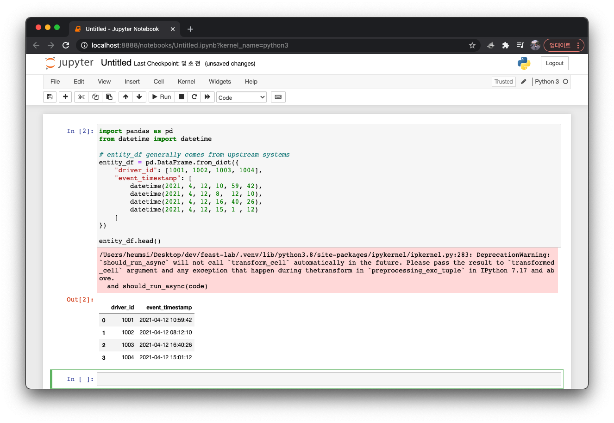
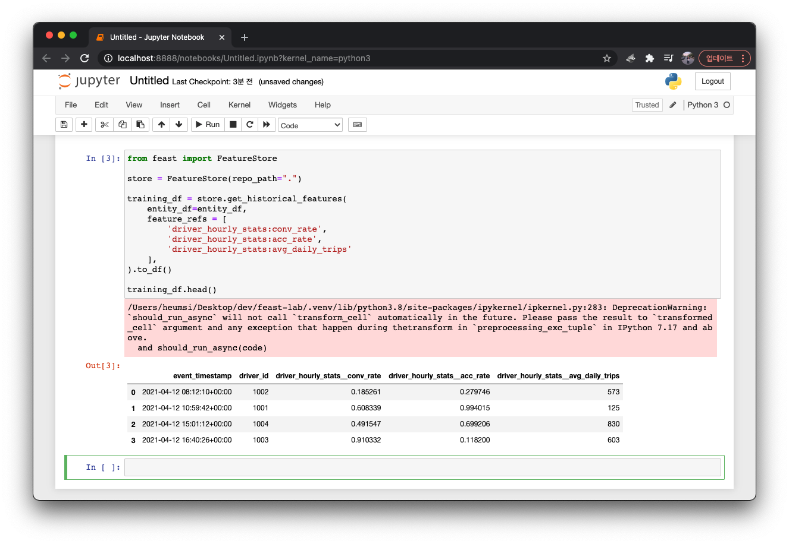
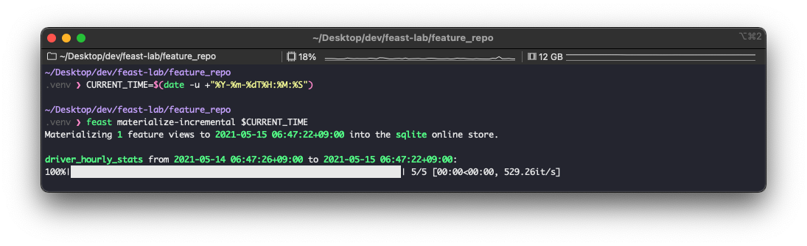
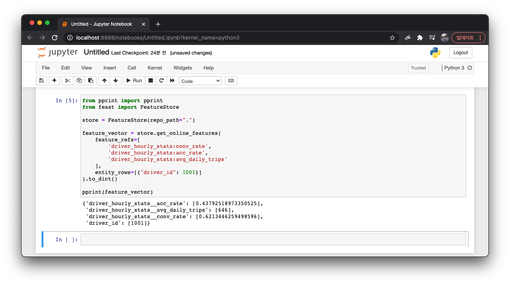
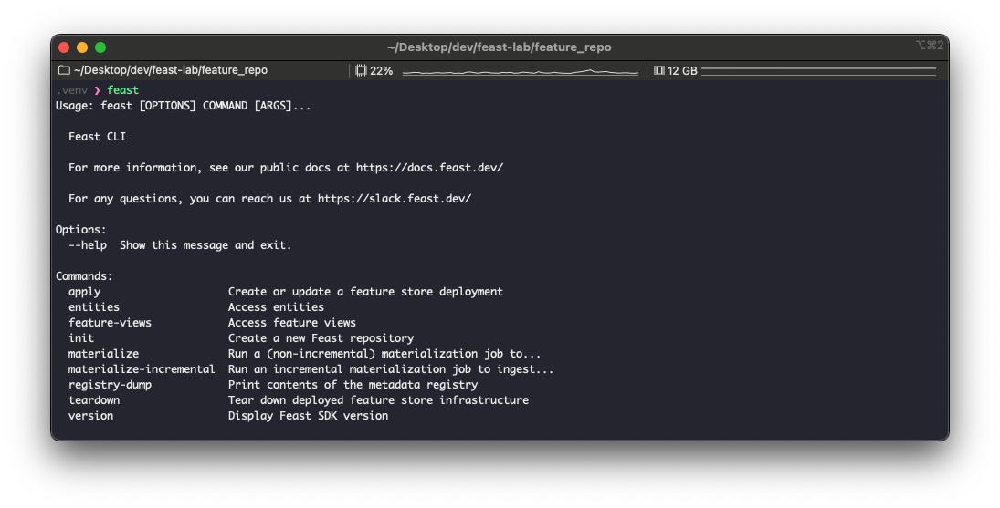
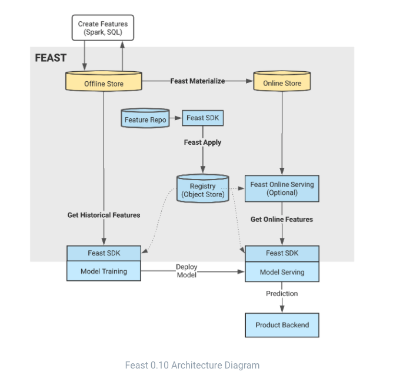

일반적인 정형 데이터 머신러닝 코드에는 데이터를 불러오고 필요한 feature를 뽑아 가공하는 부분이 있다. 보통 데이터 웨어하우스나 아니면 원천 데이터 소스에서 데이터를 불러올텐데, 이렇게 직접 데이터 소스에 붙지 않고 머신러닝에 필요한 데이터 스토어를 별도로 만들어 둘 수 있다. 그리고 여기에 필요한 feature들을 미리 가공하여 저장할 수 있고, 데이터 버전 관리도 도입해볼 수 있다. 

이러한 개념으로 등장한 것이 feature store다. feature store는 머신러닝을 위한 feature 데이터를 모아둔 곳이라고 보면 된다.  
이번 글에서는 feature store 오픈소스 툴인 Feast를 간단히 사용해보고 빠르게 리뷰해본다.


## 사전 준비

- 파이썬 3.8 (나는 3.8.7 을 사용했다.)
- 사용할 가상환경 (나는 virtualenv를 사용했다.)


## 설치

```bash
# 설치
$ pip install feast

# 버전 확인
$ feast version
Feast SDK Version: "feast 0.10.4"
```


##Feature Repo

feature repo는 feature store에 담을 feature들을 생성하는 코드가 모여있는 곳이라 생각하면 된다.  
먼저 이 feature repo를 생성하는 것부터 시작하자.

```bash
$ feast init feature_repo  # feature_repo는 직접 지어준 이름이다.
```



명령어를 실행하고나면 위처럼 feature repo 디렉토리가 생성되고 안에 기본 샘플 파일들이 생성된다.  
이를 하나씩 살펴보자.

먼저 `feature_store.yaml` 에는 이 feature repo가 어떻게 실행될 지 등의 설정 값을 담는다.

```bash
# feature_store.yaml

project: feature_repo
registry: data/registry.db
provider: local
online_store:
    path: data/online_store.db
```

`example.py` 에는 저장할 feature에 대한 정의를 담는다.

```python
# example.py

# This is an example feature definition file

from google.protobuf.duration_pb2 import Duration

from feast import Entity, Feature, FeatureView, ValueType
from feast.data_source import FileSource

# 데이터 소스로부터 데이터를 읽어온다.
# 여기서는 parquet 이라는 로컬 파일을 사용했지만, BigQuery 등에서도 읽어올 수 있다.
driver_hourly_stats = FileSource(
    path="/<cwd>/feature_repo/data/driver_stats.parquet",
    event_timestamp_column="datetime",
    created_timestamp_column="created",
)

# Entity를 정의한다.
# 엔티티는 사용할 feature 들의 대표 ID라고 보면 되는데, 아래에서 예제를 좀 더 보면 이해가 될 것이다.
driver = Entity(name="driver_id", value_type=ValueType.INT64, description="driver id",)

# FeatureView를 정의한다. 
# 위에서 가져온 데이터 소스(parquet) 에서 구체적인 feature를 정의하는 부분이다.
# 위 Entity를 대표 ID로 feature 그룹을 만든다고 보면 된다.
    driver_hourly_stats_view = FeatureView(
    name="driver_hourly_stats",
    entities=["driver_id"],
    ttl=Duration(seconds=86400 * 1),
    features=[
        Feature(name="conv_rate", dtype=ValueType.FLOAT),
        Feature(name="acc_rate", dtype=ValueType.FLOAT),
        Feature(name="avg_daily_trips", dtype=ValueType.INT64),
    ],  # feature가 여기에 정의된다.
    online=True,
    input=driver_hourly_stats,  # 데이터 소스가 여기에 들어간다.
    tags={},
)
```

위 코드가 아직 잘 이해가 안가도 괜찮다. 아래 쓰임새를 보고 다시보면 쉽게 이해갈 것이다.


## Feature Deploy

이제 feature repo를 배포해보자.  
정확히는 `example.py` 에서 정의한 feature store에 등록하는 과정이라고 생각하면 된다.

```bash
$ feast apply
```



위 코드에서 정의한 3개의 feature를 등록했다.  
이렇게 실행하고나면 `feture_store.yaml` 에 설정된 값에 따라 다음처럼 추가적인 파일이 생긴다.



 `data/` 내에 `online_store.db`, `registry.db` 파일이 생긴 것을 알 수 있다. (이는 우리가 `provider: local` 로 설정해서 그렇다.)


##Load feature (offline)

이제 feature store에서 정의하고 저장한 feature를 불러와보자.  
먼저 Jupter Notebook을 실행하여 다음 코드를 실행하자.  
간단한 정형 데이터를 `Pandas.DataFrame` 으로 만드는 코드다.

```python
import pandas as pd
from datetime import datetime

# entity_df generally comes from upstream systems
entity_df = pd.DataFrame.from_dict({
    "driver_id": [1001, 1002, 1003, 1004],
    "event_timestamp": [
        datetime(2021, 4, 12, 10, 59, 42),
        datetime(2021, 4, 12, 8,  12, 10),
        datetime(2021, 4, 12, 16, 40, 26),
        datetime(2021, 4, 12, 15, 1 , 12)
    ]
})

entity_df.head()
```



이제 feature store에서 feature를 불러와 위 데이터 프레임에 추가하자.  
다음처럼 코드를 실행한다.

```python
from feast import FeatureStore

store = FeatureStore(repo_path=".")

training_df = store.get_historical_features(
    entity_df=entity_df,  # 위에서 만든 데이터프레임을 넘겨준다.
    feature_refs = [
        'driver_hourly_stats:conv_rate',
        'driver_hourly_stats:acc_rate',
        'driver_hourly_stats:avg_daily_trips'
    ],  # 불러올 feature를 적는다.
).to_df()

training_df.head()
```



`driver_id` 와 `event_timestamp` 와 join 되어 `driver_hourly_stats__conv_rate` 등 3개의 feature가 데이터프레임에 추가된 것을 볼 수 있다. 


## Load feature (online)

이번에는 feature store에서 가장 최근 등록된 값들만 불러와보자. (이렇게 최근에 등록된 값들만 불러오는 방법은 주로 머신러닝 코드가 주기적으로 실행되어야할 때 쓰인다.)

먼저 feature store에 데이터를 현재 시점 기준으로 등록하자. 이를 `materialize` 라고 한다.  
`materialize` 하는 방법은 여러 방법이 있지만, 여기서는 `materialize-incremental` 방식을 사용한다.

```bash
$ CURRENT_TIME=$(date -u +"%Y-%m-%dT%H:%M:%S")
$ feast materialize-incremental $CURRENT_TIME
```



이전의 `apply` 명령어와 헷갈릴 수 있는데, `apply`는 feature를 새로 정의하고 등록할 때 쓰는 명령어다.  
`materialize` 는 데이터 소스로부터 데이터를 불러와 이렇게 정의된 `feature` 를 도장찍듯 만드는 거라고 보면 된다. 일종의 데이터 버저닝이다.

위 `materialize` 를 매일 한 번씩 실행한다고 하면, 데이터 소스로부터 매번 데이터를 불러와 (데이터 소스의 데이터 역시 매일 다를 것이다), 실행한 날짜로 feature 를 버저닝하여 저장한다고 볼 수 있다.

아무튼 위처럼 feature를 `materialize`  한 뒤, 다음처럼 불러온다.

```python
from pprint import pprint
from feast import FeatureStore

store = FeatureStore(repo_path=".")

feature_vector = store.get_online_features(
    feature_refs=[
        'driver_hourly_stats:conv_rate',
        'driver_hourly_stats:acc_rate',
        'driver_hourly_stats:avg_daily_trips'
    ],  # 불러올 feature를 적는다.
    entity_rows=[{"driver_id": 1001}]  # 불러올 데이터를 Entity 기준으로 적는다.
).to_dict()

pprint(feature_vector)
```



feature store에 최근에 등록된 feature를 잘 가져온 것을 볼 수 있다.


## 그 외

feast에서 제공하는 기타 명령어로는 다음과 같은 것들이 있다.



사실 위에서 소개한 명령어가 거의 핵심 명령어들이고, 기타 명령어들은 크게 뭐 없는거 같긴하다.  
아직 `0.10.x` 버전이라 추후 많은 것들이 추가되고 보안되지 않을까 싶다.


## 아키텍처



ML 프로젝트 전체 프로세스를 아우르는 그림인데, 이 프로세스 안에서 feast가 어떤 역할을 하는지 나타내고 있다.  
먼저 전체 프로세스 과정을 설명하면 다음과 같다.

1. Create Batch Features
    - 피처를 주기적으로(Batch) 생성하여 데이터 하우스에 저장한다. 
    - 이 때는 feature store에 저장하는 것이 아니라 빅쿼리 같은 곳에 저장하는 것이다.
    - 보통 feature store를 고려하기 전에, ETL, ELT 등을 진행하는 플랫폼에서 이를 진행한다고 보면 된다.
2. Feast Apply
    - feature store인 feast를 도입하여 feature를 정의한다.
    - 구체적으론 `feast apply` 명령어를 통해 feast 의 인프라(Store, Registry)를 세팅한다.
3. Feast Materialize
    - `feast materialize` 명령어를 주기적으로 실행한다.
    - 이로써 최신 feature 값들을 feature store에 저장하고, 사용자가 가져갈 수 있도록 한다.
4. Model Training
    - `feast` sdk (파이썬 라이브러리)를 활용하여 머신 러닝 코드 안에서 feast의 feature store로 부터 필요한 feature를 불러온다.

공식 문서에는 Get Historical Features, Deploy Model 등 몇 가지 내용이 더 있는데, feast를 이해하는데 별로 중요한 사항은 아닌 듯 하여 생략한다.

위 프로세스에서 Feast의 컴포넌트는 다음과 같다.

- Feast Registry
    - feature store에 저장된 feature 정의를 담는 오브젝트 스토어다. (GCS나 S3)
    - feast SDK로 Feast Registry에서 필요한 feature를 불러올 수 있다.
- Feast Python SDK/CLI
    - 위에서 봤듯, Feast를 사용하는 구체적인 툴이다.
    - 사용자는 SDK 혹은 CLI로 Feast에서 제공하는 기능들을 사용할 수 있다.
- Online Store
    - 가장 최신 feature 값들을 담는 데이터베이스다.
    - 최신 feature 값들은 `feast materialize` 명령어에 의해 업데이트 된다. 
- Offline Store
    - BigQuery나 S3 같은 외부의 데이터 저장소다.
    - feast의 컴포넌트는 아니지만, feast 가 이를 데이터 소스로 이용한다.
- Feast Online Serving
    - Online Store의 feature 값에 빠르게 접근할 수 있는 컴포넌트다.
    - 선택사항이라고 한다.
    - 사실 여기서 안사용해봐서 잘 모르겠다. 온라인 스토어의 값을 제공해주는 실시간 서버같은 건가?


## 정리

- `feast init <repo_name>` 으로 사용할 feature store repository를 만들 수 있다.
- 이 레포 안에서 `feast` SDK와 파이썬을 이용하여 feature를 정의할 수 있다. 구체적으론 코드에서 다음을 정의한다.
    - `DataSource`
        - 데이터를 가져올 데이터 소스를 지정한다.
        - File, BigQuery 등이 되겠다.
    - `Entity`
        - Feature 그룹의 대표 ID를 지정한다.
    - `FeatureView`
        - 위에서 지정한 `DataSource`, `Entity` 를 가지고 Feature Store에 저장할 Feature 그룹을 지정한다.
- 코드를 작성한 후 `feast apply` 로 feature store를 생성 및 업데이트할 수 있다.
- `feast materialize` 로 최신 feature 값들을 저장 및 버전 관리할 수 있다.
- 머신러닝 코드에서 `feast` SDK로 위 feature store에 정의한 feature 들을 가져올 수 있다.


## 후기

- 아주 직관적이고 사용성이 좋다.
-  공식 문서가 매우 친절히 잘 되어 있다. 
    - 진짜 잘되어 있다. BackLog나 ChangeLog도 아주 깔끔하고.
    - 잡다한 설명이 없다. 그냥 필요한 것만 깔끔하게 말해준다.
- 생각보다 기능이 많지는 않은거 같다.
    - 다만 아직 버전이 `0.10.x` 다. 추후 많이 개발될 거 같다.
- 배포 방법이나 사용법이 어렵지 않은데, 그에 비해 기능이 아주 충실하니 좋은거 같다.

