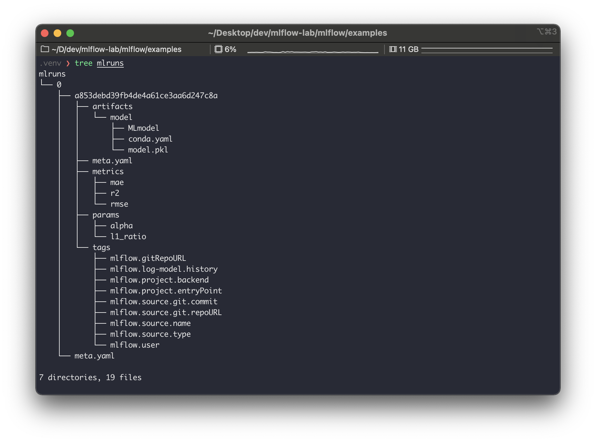
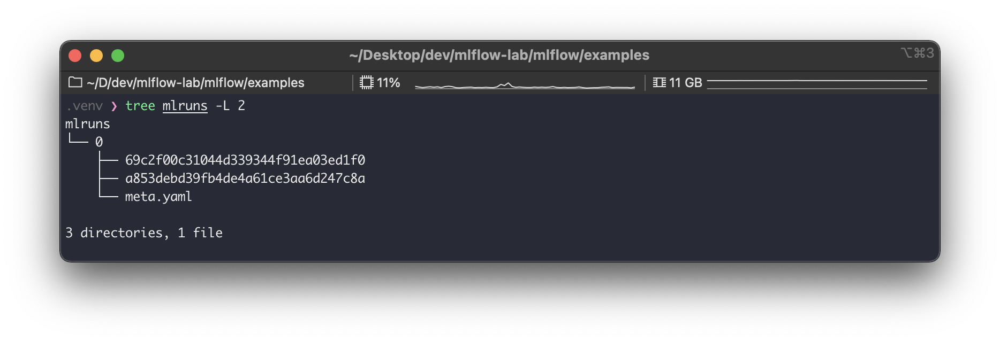
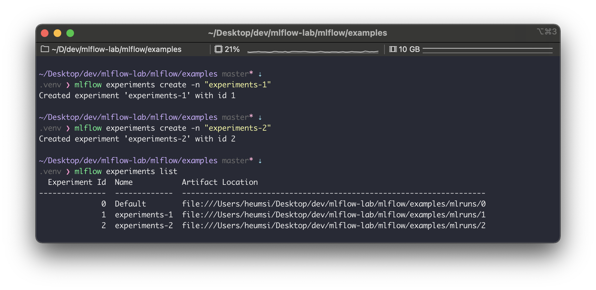
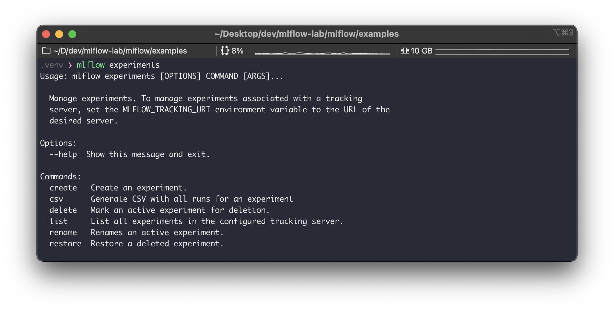
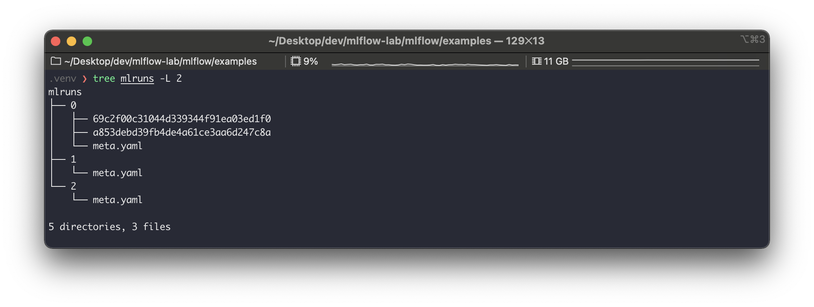
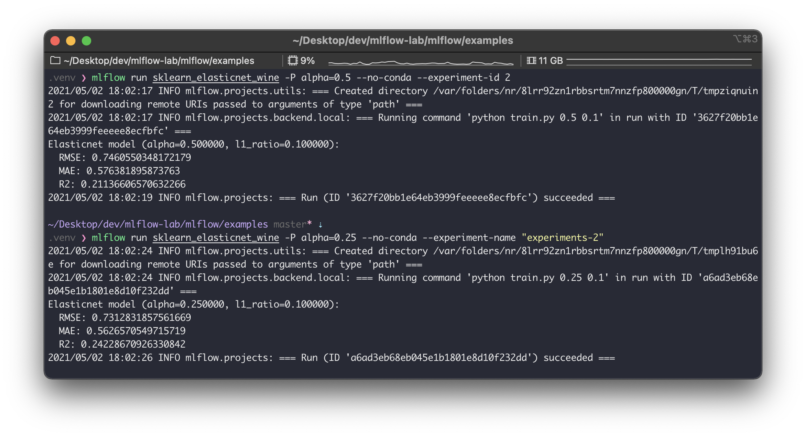
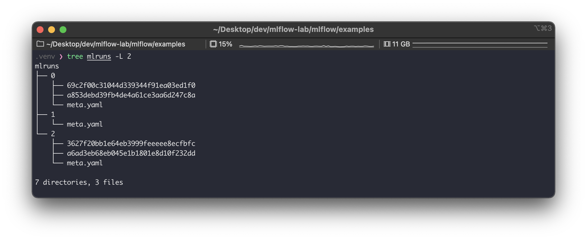

이번에는 mlflow의 실험(experiments)과 실행(runs)에 대해 알아본다.


---

## 사전 준비

다음이 사전에 준비 되어 있어야 한다.

```bash
# 파이썬 버전 확인
$ python --version
Python 3.8.7

# mlflow 설치 & 버전 확인
$ pip install mlflow
$ mlflow --version
mlflow, version 1.16.0

# 예제 파일을 위한 mlflow repo clone
$ git clone https://github.com/mlflow/mlflow.git
$ cd mlflow/examples
```


---

## Experiments & Runs

### 개념

MLflow에는 크게 실험(Experiment)와 실행(Run)이라는 개념이 있다. 실험은 하나의 주제를 가지는 일종의 '프로젝트'라고 보면 된다. 실행은 이 실험 속에서 진행되는 '시행'이라고 볼 수 있다. 하나의 실험은 여러 개의 실행을 가질 수 있다.

직접 눈으로 보며 이해해보자.  
`examples` 에 있는 [`sklearn_elasticnet_wine` MLflow 프로젝트](https://github.com/mlflow/mlflow/tree/master/examples/sklearn_elasticnet_wine)를 실행해본다.

```bash
$ mlflow run sklearn_elasticnet_wine --no-conda
```

실행 결과로  `./mlruns` 경로에 다음과 같은 파일들이 생긴다.



여기서 `0` 은 실험 ID이고, `a853debd39fb4de4a61ce3aa6d247c8a` 은 실행 ID다.  
한번 더 동일한 프로젝트를 실행해보자. 이번에는 파라미터 값을 추가로 넘겨줘본다.

```bash
$ mlflow run sklearn_elasticnet_wine -P alpha=0.5 --no-conda
```

실행 결과로 `mlruns` 경로를 확인해보면 다음과 같다.



`0` 이라는 실행에 `69c2f00c31044d339344f91ea03ed1f0` 이라는 실행이 추가로 생성되었다.  
이렇듯 매 실행은 하나의 실험에 속하여 들어간다. 위의 예시가 매우 직관적이라 실험과 실행의 관계와 활용 방안을 바로 알 수 있을 것이다.


### Experiment 생성 및 조회

위에서 별도의 실험을 생성하지 않았기 때문에 ID가 `0` 인 실험을 자동으로 생성하고 이 실험에서 실행을 생성하였다.  
이번에는 직접 실험을 생성해보자.

실험 생성 은 다음 CLI 명령어로 가능하다.

```bash
$ mlflow experiments create -n "실험 이름"
```

그리고 실험 목록은 다음 CLI 명령어로 가능하다.

```bash
$ mlflow experiments list
```



그 외 `mlflow experiments` 관련된 명령어는 다음의 것들이 있으니 참고하자.



> **CLI가 아닌 코드에서 experiments 및 run을 다루는 방법**
>
> 다음처럼 `mlflow.tracking.MlflowClient` 를 사용하면 된다.
> ```python
> from mlflow.tracking import MlflowClient
> 
> # Create an experiment with a name that is unique and case sensitive.
> client = MlflowClient()
> experiment_id = client.create_experiment("Social NLP Experiments")
> client.set_experiment_tag(experiment_id, "nlp.framework", "Spark NLP")
> 
> # Fetch experiment metadata information
> experiment = client.get_experiment(experiment_id)
> print("Name: {}".format(experiment.name))
> print("Experiment_id: {}".format(experiment.experiment_id))
> print("Artifact Location: {}".format(experiment.artifact_location))
> print("Tags: {}".format(experiment.tags))
> print("Lifecycle_stage: {}".format(experiment.lifecycle_stage))
> ```
>
> 자세한 내용은 [공식 docs](https://www.mlflow.org/docs/latest/python_api/mlflow.tracking.html)를 참고하자.


### Run 생성 및 조회

위에서 실험을 생성했으므로 이번에는 실행을 생성해보자.  
먼저  `mlruns` 내부를 확인해본다.



위에서 새로 만든 `1`, `2` 실험에는 아직 아무런 실행이 없다.  
다음 명령어로 실행을 생성한다.

```bash
$ mlflow run sklearn_elasticnet_wine -P alpha=0.5 --no-conda --experiment-id 2
```

끝에 `--experiment-id` 를 붙여주었다.  
다음처럼 실험 이름으로 할 수도 있다.

```bash
$ mlflow run sklearn_elasticnet_wine -P alpha=0.25 --no-conda --experiment-name "experiments-2"
```



잘 실행된걸 확인했으므로, 이제 결과가 잘 나왔는지 `./mlruns` 경로에서 확인하자. 



`2` 번 실험에 위에서 생성한 실행들이 잘 생성된 것을 볼 수 있다.

> 다음처럼 환경 변수로 실험 ID를 잡아줄 수도 있다.
>
> ```bash
> $ export MLFLOW_EXPERIMENT_ID = 2
> ```


---

## 정리

- MLflow 에는 실험(Experiments)과 실행(Runs)이란 개념이 있다.
- 하나의 ML 프로젝트는 하나의 실험으로 구성할 수 있다.
- 하나의 실험은 여러 개의 실행으로 구성된다.
    - 각 실험마다 ML 모델의 하이퍼 파라미터 조정 등을 다르게 하여 수행할 수 있다.
- CLI 혹은 코드에서 실험과 실행의 생성, 조회, 삭제 등의 명령을 할 수 있다.

