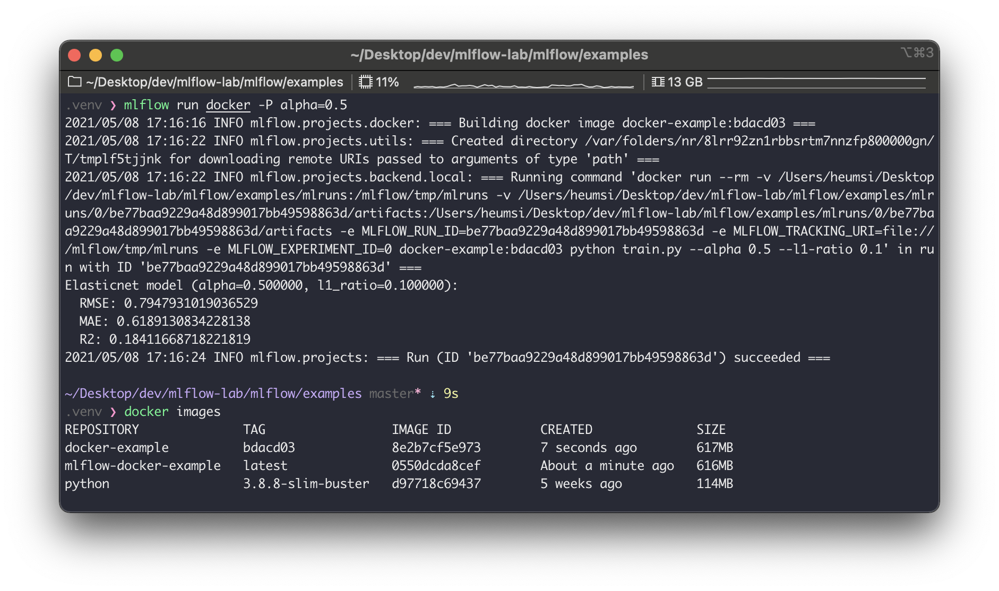
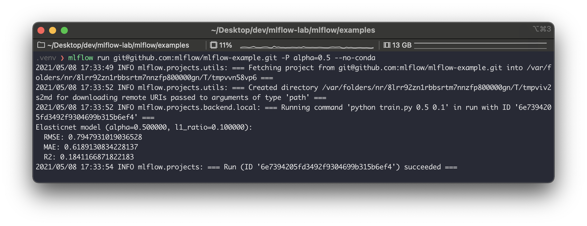

이번에는 MLflow Project 에 대해서 자세히 알아본다.


## 사전 준비

이전 글을 확인하자.


## 개요

MLflow Project는 말 그대로 MLflow에서 유용하게 관리, 사용하기 위해 정의하는 양식이다. 말로 설명하는 것보다 그냥 보고 이해하는게 더 빠를거 같다.

다음은 `examples/sklearn_logistic_regression` 에 있는 예시다. 하나의 MLflow Project는 다음과 같은 구조를 가진다고 보면 된다.

```
sklearn_logistic_regression
├── MLproject
├── conda.yaml
└── train.py
```

 `MLproject` 라는 파일이 존재하는데, 이 파일을 통해 이 프로젝트가 MLflow Project 임을 알 수 있다. MLflow Projet 는 `mlflow run` 명령어로 실행이 가능하다. 위의 경우 `mlflow run  sklearn_logistic_regression` 으로 실행할 수 있다.


## MLProject 살펴보기

MLflow Project 를 `mlflow run` 으로 실행할 때 무엇을 어떻게 실행할 것인지를 알아야하는데, 이에 대한 내용을 `MLproject` 파일이 담고있다.

간단한 예시를 보자. 다음은 `examples/sklearn_elasticnet_wine/MLproject` 파일의 내용이다.

```yaml
name: tutorial

conda_env: conda.yaml

entry_points:
  main:
    parameters:
      alpha: {type: float, default: 0.5}
      l1_ratio: {type: float, default: 0.1}
    command: "python train.py {alpha} {l1_ratio}"
```

하나씩 이해해보자.

- `name`
    - MLProject의 프로젝트 이름이라고 보면 된다.
- `conda_env`
    - 이 MLProject 를 실행할 때 conda 환경을 만든 뒤 실행하게 되는데, 이 때 참고할 conda 환경에 대한 파일이름을 값으로 가진다. 여기서는 이 프로젝트 내 `conda.yaml` 에 이 설정 값들이 있다.
    - conda가 아닌 docker를 사용할 수 있는데, 이 때 `docker_env` 라는 키를 사용하면 된다. 이에 대한 내용은 아래에서 다시 설명하겠다.
- `entry_points`
    - `mlflow run` 으로 실행할 때 `-e` 옵션으로 프로젝트 실행에 여러 진입점을 둘 수 있는데, 이 때 사용되는 값이다.
    - 예를 들면, 위의 경우 `mlflow run -e main sklearn_elastic_wine` 으로 `main` 이라는 진입점으로 실행할 수 있다.
    - 위 명령어가 실행되면 `python train.py {alpha} {l1_ratio}` 명령어를 실행한다. 이 때 `{alpha}` 와 `{l1_ratio}` 는 위 `mlflow run` 시 받는 파라미터 값이다. 이는 `parameters` 에 정의가 되어있다.

다시 정리해보면 위와 같이 정의된 MLflow Project는 다음 명령어로 실행할 수 있다.  
(코드에서는 `mlflow.projects.run()` 명령어로 실행할 수 있다. 이에 대한 내용은 [여기](https://mlflow.org/docs/latest/python_api/mlflow.projects.html#mlflow.projects.run)를 참고하자.)

```bash
$ mlflow run -e main sklearn_elastic_wine -P alpha=0.1 -P l1_ratio=0.5
```

이 명령어는 다시 내부적으로 아래 명령어를 실행하게 된다.

```bash
$ python train.py 0.1 0.5
```


## Docker 환경 사용하여 실행하기

위 `MLproject` 파일 내에서 `conda_env` 를 사용하였다. 이럴 경우 MLflow Project를 실행시키는 환경에 conda가 미리 깔려있어야 실행이 가능하다. conda가 깔려있지 않으면 `mlflow run` 에서 에러를 뱉을 것이다. (`--no-conda` 옵션을 주는 경우도 있지만, 이럴 경우 또 `virtuanlenv` 등으로 가상 환경을 세팅하고 필요한 라이브러리르 일일이 설치해주어야 해서 번거롭다.)

conda를 쓰지 않고 docker 컨테이너 환경으로 실행이 가능한데 이 방법을 살펴보자.  
이번에도 역시 공식 예제를 활용한다. 다음은 `examples/docker` 에 있는 예시다.

```bash
docker
├── Dockerfile
├── MLproject
├── README.rst
├── kubernetes_config.json
├── kubernetes_job_template.yaml
├── train.py
└── wine-quality.csv
```

여기서 주목할만한 파일은 `Dockerfile` 과 `MLproject` 파일이다. 이 둘을 살펴보자.

```dockerfile
# Dockerfile

FROM python:3.8.8-slim-buster

RUN pip install mlflow>=1.0 \
    && pip install numpy \
    && pip install pandas \
    && pip install scikit-learn
    
# 예제 파일을 그대로 실행하면 오류가 생겨서 약간 손을 보았다.
# 베이스 이미지 수정, 필요없는 패키지 및 버전을 지운 정도다.
# 아마 2년 전 예제라 업데이트가 잘 안된 듯 싶다.
```

```yaml
# MLproject

name: docker-example

docker_env:
  image:  mlflow-docker-example

entry_points:
  main:
    parameters:
      alpha: float
      l1_ratio: {type: float, default: 0.1}
    command: "python train.py --alpha {alpha} --l1-ratio {l1_ratio}"
```

`Dockerfile` 파일에서는 환경 구상을 위해 필요한 패키지들을 설치한다.  
`MLproject` 파일에서는 `docker_env` 를 사용하고 있고, 사용할 도커 이미지 이름을 설정한다.

이제 이 MLflow Project 를 실행해보자.
먼저 `mlflow run` 을 하기 전에 `Dockerfile` 을 이용하여 `mlflow-docker-example` 라는 이름의 도커 이미지를 만들어 주어야 한다.

```bash
$ docker build -t mlflow-docker-example -f Dockerfile .
```

이제 `mlflow run` 으로 이 프로젝트를 실행한다.

```bash
$ mlflow run docker -P alpha=0.5
```

이렇게 실행하면 `mlflow` 는 `mlflow-docker-example` 이름의 도커 이미지를 찾아 그 위에 mlflow 코드를 실행하는 도커 이미지를 하나 더 만들고 이 이미지를 실행한다. 결과적으로 이미지를 하나 더 만드는 셈이다. 아래 사진을 보면 `docker-example` 이라는 이미지가 만들어 진 것을 볼 수 있다.



이미 감이 온 사람은 알겠지만, `MLProject` 의 `docker_env.image` 값은 로컬 도커 이미지가 아니여도 된다. Dockerhub나 GCR, ECR 등에 미리 만들어두고 사용해도 된다. 또한 컨테이너 내부의 환경 변수 설정 등도 가능하다. 자세한 내용은 [여기](https://mlflow.org/docs/latest/projects.html#specifying-an-environment)를 참고하자.


## Github에 있는 프로젝트 실행하기

지금까지 로컬에 있는 MLflow Project를 실행했다면 다음처럼 github에 올려둔 MLProject 를 실행시킬 수 있다. 예를 들면 다음과 같다.

```bash
mlflow run git@github.com:mlflow/mlflow-example.git -P alpha=0.5 --no-conda
```




## 쿠버네티스에서 실행하기

`mlflow run` 을 할 때 `--backend` 와 `--backend-config` 파라미터 설정으로 MLflow Project를 쿠버네티스 상에서 실행시킬 수 있다. (Job 리소스로 실행된다.)   
예를 들면 다음과 같다.

```bash
$ mlflow run <project_uri> \
--backend kubernetes \
--backend-config kubernetes_config.json
```

위 명령어를 실행하게 되면 다음의 과정이 일어난다.

1. MLflow Project 실행을 도커 이미지로 만든다.
2. 이 이미지를 사용자가 설정해둔 도커 컨테이너 레지스트리에 푸시한다.
3. 쿠버네티스에서 이 이미지를 Job으로 배포한다.

위 명령어가 실행이 되려면 푸시할 도커 이미지 레지스트리와 쿠버네티스 접속 컨텍스트가 필요한데, 이를 위해  MLflow Project 내에 다음과 같은 파일이 있어야 한다.

```python
# kubernetes_config.json

{
    "kube-context": "docker-for-desktop",
    "kube-job-template-path": "examples/docker/kubernetes_job_template.yaml",
    "repository-uri": "username/mlflow-kubernetes-example"
}
```

```yaml
# kubernetes_job_template.yaml

apiVersion: batch/v1
kind: Job
metadata:
  name: "{replaced with MLflow Project name}"
  namespace: mlflow
spec:
  ttlSecondsAfterFinished: 100
  backoffLimit: 0
  template:
    spec:
      containers:
      - name: "{replaced with MLflow Project name}"
        image: "{replaced with URI of Docker image created during Project execution}"
        command: ["{replaced with MLflow Project entry point command}"]
      resources:
        limits:
          memory: 512Mi
        requests:
          memory: 256Mi
      restartPolicy: Never
```

직접 여기서 시도해보지는 않았지만, 아마도 쿠버네티스에서 MLflow를 배포하고 운영하는 팀에서는 이를 적극적으로 활용하지 않을까 싶다.


## 정리

정리해보자.

- MLflow Project는 MLflow 에서 사용, 관리 가능한 하나의 프로젝트를 의미한다.
    - 프로젝트 루트 폴더에 `MLproject` 파일이 있어야 하고, 이 파일은 프로젝트 실행 및 환경에 대한 내용을 담는다.
    - `mlflow run {{ project_name }}` 으로 실행가능하다.
- MLflow Project는 conda, docker 환경으로 실행이 가능하다.
- 실행할 프로젝트는 로컬 뿐 아니라 Github 상에 있어도 가능하다.
    - MLProject들을 별도로 모아둔 Github Repository를 만들고 이를 최신 공용 저장소로 이용해볼 수도 있을거 같다.
- 쿠버네티스 위에서 Job으로도 실행할 수도 있다.


## 참고

- https://mlflow.org/docs/latest/projects.html