이번에는 MLflow의 Model Registry에 대해서 알아본다.


---

## 사전 준비

음 이제 매번 쓰기 귀찮다.  
어차피 직전 글이랑 이어지므로, 이전 글을 통해 확인하자.


---

## Model Registry

### 개념

Model Registry는 MLflow 프로젝트 실행을 통해 나온 결과물인 모델을 저장하는 중앙 집중식 모델 저장소다.  MLflow로 모델을 기록했다면, 기록한 모델을 Model Registry에 등록할 수 있고, 등록된 모델은 어디서든 불러올 수 있다.


### 모델 등록하기

#### 웹 UI로 등록하기

간단하게 모델을 등록해보자. 직전 글에서 사용한 실습을 그대로 이어간다.  
웹 서버 (Tracking Server) 에 들어간 뒤, 실행했던 실행(Run)을 클릭하여 들어간다. 

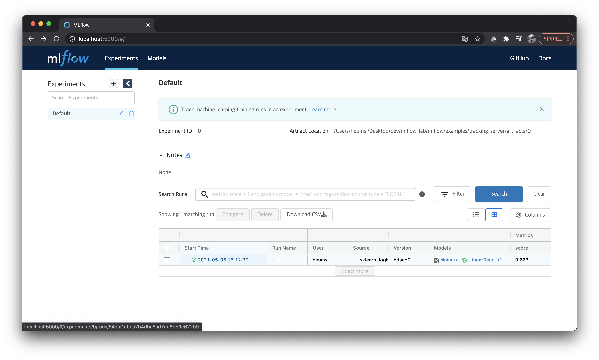

실행 상세페이지 하단에 Artifacts 블록이 있고 이 안에 `Model Register` 버튼이 있다.

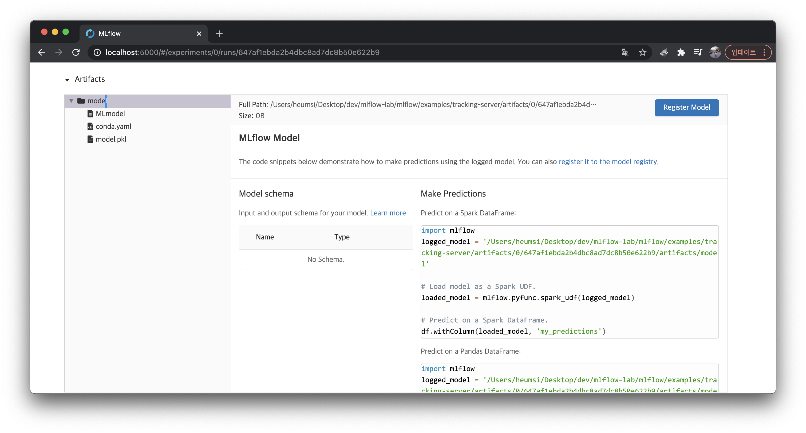

버튼을 클릭하여 다음처럼 `LinearRegression` 이라는 이름으로 모델을 등록해주자.

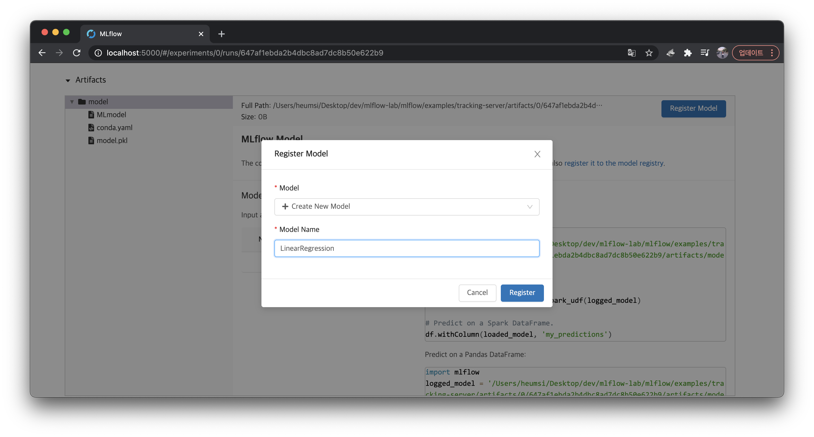

이제 상단 메뉴 중에 Model 탭에 들어가보면 다음처럼 등록된 모델을 확인할 수 있다.  
모델을 처음 등록하는 경우 `Version 1` 이 자동으로 추가된다.

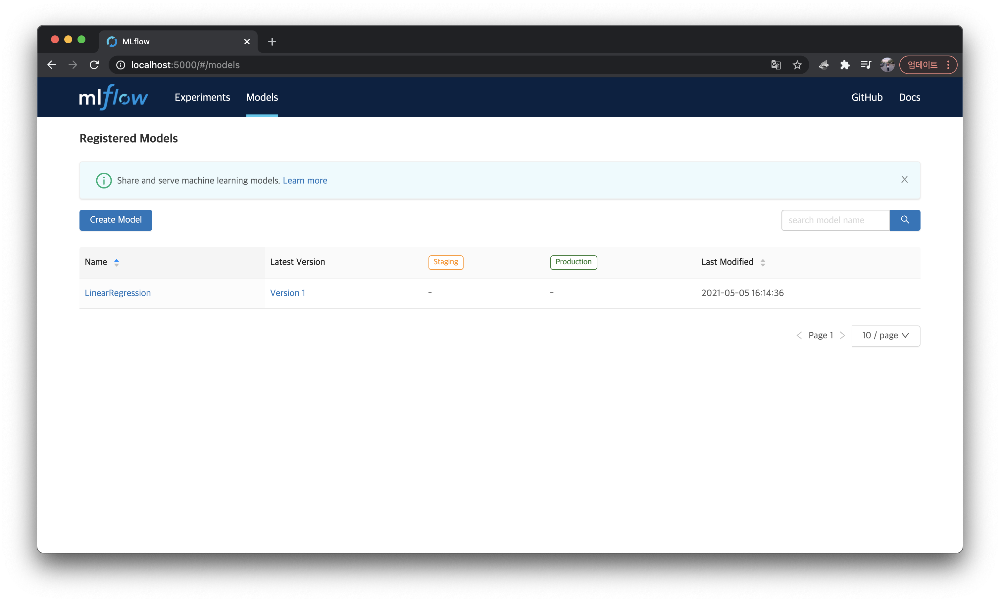

등록된 모델 하나를 클릭하면 아래처럼 상세 페이지가 나온다.

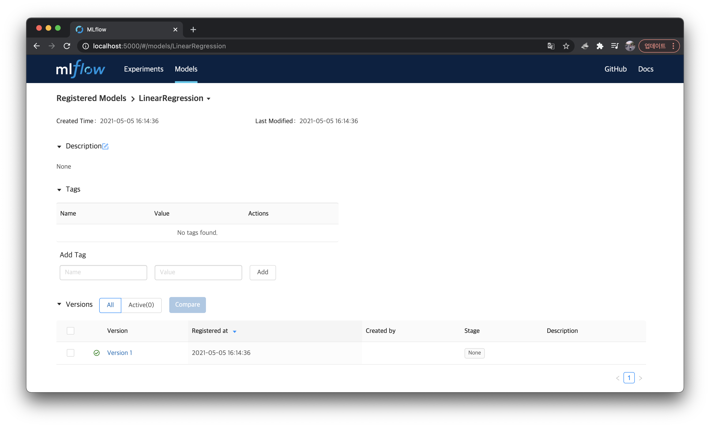

모델 버전을 누르면 다음처럼 해당 버전의 상세 페이지로 들어갈 수 있다.

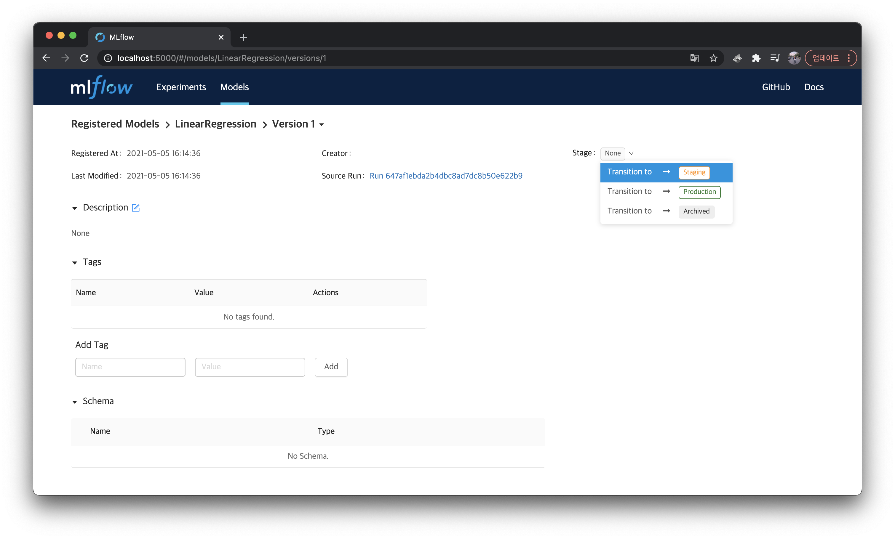

`Stage` 항목에서는 이 모델의 스테이지 상태를 `Staging`, `Production`, `Archived` 중 하나로 바꿀 수 있다. 아무것도 지정하지 않았을 시 기본 값은 `None` 이다.


#### 코드에서 등록하기

위처럼 웹 UI가 아니라 코드에서 직접 등록하는 방법도 있다.  
총 3가지 방법이 있는데 첫 번째 방법은  `mlflow.sklearn.log_model()` 에 `registered_model_name` 의 값을 주는 것이다.

이를 직접 확인하기 위해 이전에 실행했던 `sklearn_logistic_regression` 예제의 `train.py` 를 다음처럼 수정한다.

```python
# sklearn_logistic_regression/train.py

import numpy as np
from sklearn.linear_model import LogisticRegression

import mlflow
import mlflow.sklearn

if __name__ == "__main__":
    X = np.array([-2, -1, 0, 1, 2, 1]).reshape(-1, 1)
    y = np.array([0, 0, 1, 1, 1, 0])
    lr = LogisticRegression()
    lr.fit(X, y)
    score = lr.score(X, y)
    print("Score: %s" % score)
    mlflow.log_metric("score", score)
    # mlflow.sklearn.log_model(lr, "model")  # before
    mlflow.sklearn.log_model(lr, "model", registered_model_name="LinearRegression")  # after
    print("Model saved in run %s" % mlflow.active_run().info.run_uuid)

```

바뀐 부분은 딱 한 줄이다. `mlflow.sklearn.log_model` 함수에 `registered_model_name="LinearRegression"` 인자를 추가하였다. (이 함수에 자세한 내용은 [여기](https://www.mlflow.org/docs/latest/python_api/mlflow.sklearn.html#mlflow.sklearn.log_model)서 확인할 수 있다.)

이제 다시 이 MLflow 프로젝트를 실행하자.  

```bash
$ mlflow run sklearn_logistic_regression --no-conda
```

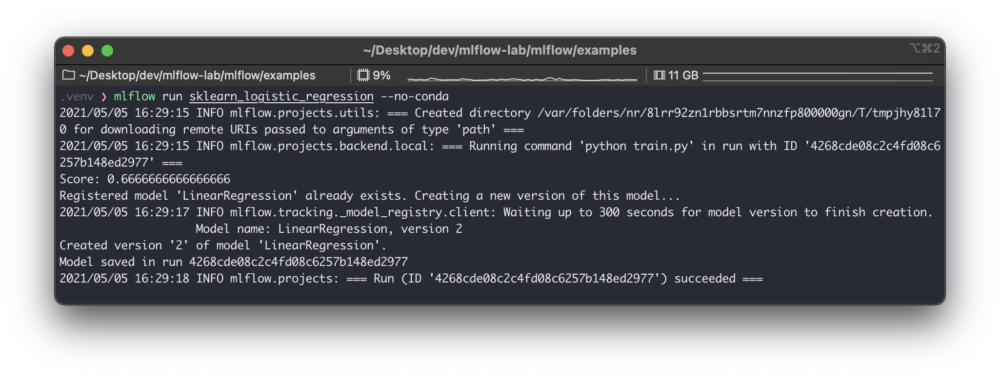

로그를 보면 `LinearRegression` 이 이미 등록된 모델이므로, 등록된 모델의 새 버전을 만든다고 하고 `Version 2` 를 만들었다고 한다.  (만약 ``registered_model_name` 값으로 넘겨준 값이 등록된 모델이 아닌 경우, 모델을 먼저 등록하고 `Version 1` 을 부여한다.)

웹 UI에 가서 확인해보자.

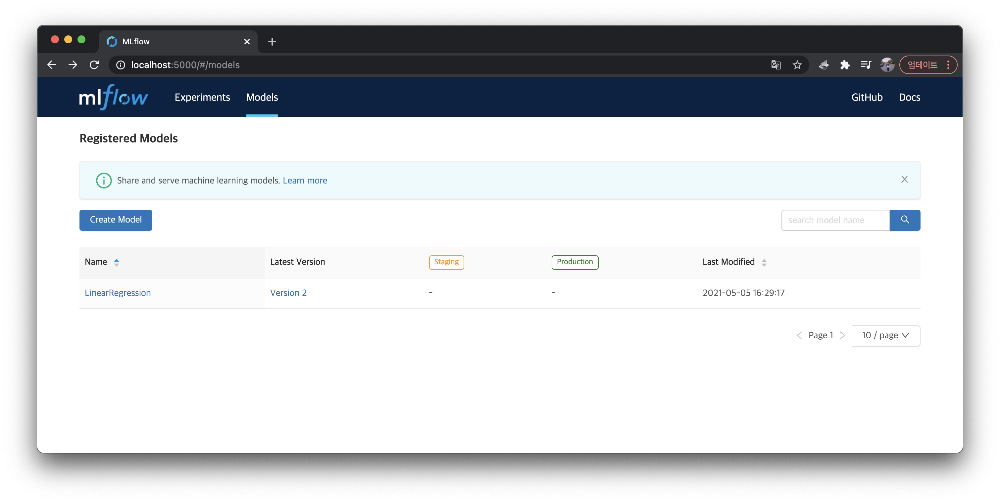

위처럼 `LinearRegression` 모델의 `Latest Version`이 `Version 2` 가 된 것을 볼 수 있고, 등록된 모델 상세 페이지에 들어가보면 아래처럼 `Version 2` 가 추가된 것을 볼 수 있다.

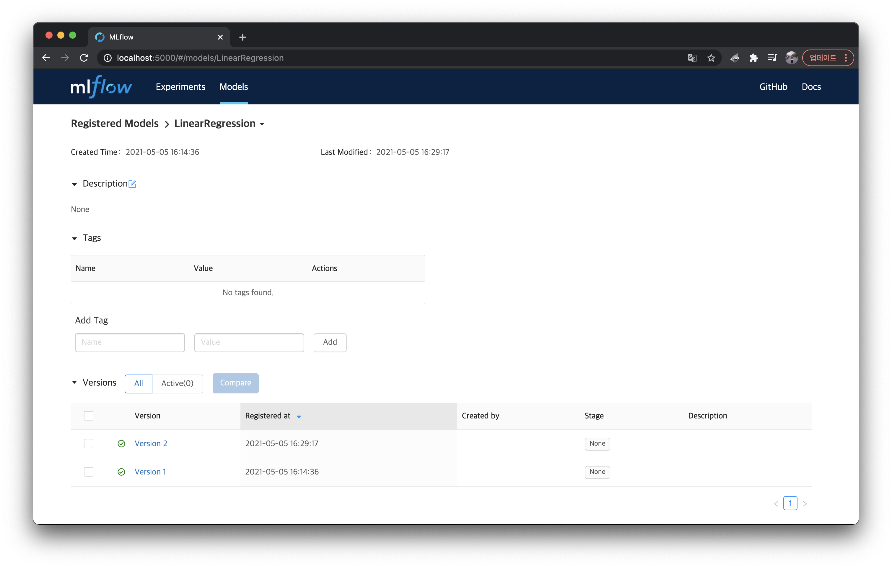

다른 두 번째 방법으로는 `mlflow.register_model()` 를 사용하는 것이다. 이 함수에는 `model_uri` 와  `name` 인자 값을 넘겨줘야 하는데 예시를 보면 바로 알 수 있다.

```python
result = mlflow.register_model(
    model_uri="runs:/4268cde08c2c4fd08c6257b148ed2977/model",
    name="LinearRegresion"
)
```

`model_uri` 는 `run_id` 와 `artifacts` 내에 `model` 이 저장된 경로다.  
`name` 은 등록할 때 사용할 이름이다. 위에서 `registered_model_name` 와 같은 개념이다.  
좀 더 자세한 사용법은 [여기](https://www.mlflow.org/docs/latest/python_api/mlflow.html#mlflow.register_model)를 확인하자.	

세 번째 방법은 `MlflowClient.create_registered_model()` 와 `MlflowClient.create_model_version()` 를 사용하는 것이다. 마찬가지로 예시를 바로 보자.

```python
from mlflow.tracking import MlflowClient

# 모델을 등록한다. 아직 버전이 없기 때문에 비어있다.
client = MlflowClient()
client.create_registered_model("LinearRegression")

# 등록된 모델에 버전을 등록한다.
result = client.create_model_version(
    name="LinearRegression",
    source="artifacts/0/4268cde08c2c4fd08c6257b148ed2977/artifacts/model",
    run_id="4268cde08c2c4fd08c6257b148ed2977"
)

```

이 정도만 설명해도 어느정도 설명이 된다 생각한다. `create_model_version()` 에 대한 자세한 내용은 [여기](https://mlflow.org/docs/latest/python_api/mlflow.tracking.html#mlflow.tracking.MlflowClient.create_registered_model)를 확인하자.


### 등록된 모델 불러오기

Model Registry에 등록된 모델은 어디서든 불러올 수 있다.  
위에서 등록한 모델을 불러오는 실습을 해보자.

먼저 `load_registered_model.py` 를 만들고 다음 코드를 입력하자.

```python
# load_registered_model.py

import mlflow.pyfunc
import numpy as np

# 가져올 등록된 모델 이름
model_name = "LinearRegression"

# 버전을 기준으로 가져오고 싶을 때
model_version = 2
model = mlflow.pyfunc.load_model(
    model_uri=f"models:/{model_name}/{model_version}"
)

# 단계(stage)를 기준으로 가져오고 싶을 때
# stage = 'Staging'
# model = mlflow.pyfunc.load_model(
#     model_uri=f"models:/{model_name}/{stage}"
# )

X = np.array([[1], [2], [3]])
Y = model.predict(X)    
print(Y)
```

이제 MLflow Tracking Server 설정 후, 위 코드를 실행하자

```bash
$ export MLFLOW_TRACKING_URI="http://localhost:5000"
$ python load_registered_model.py
```

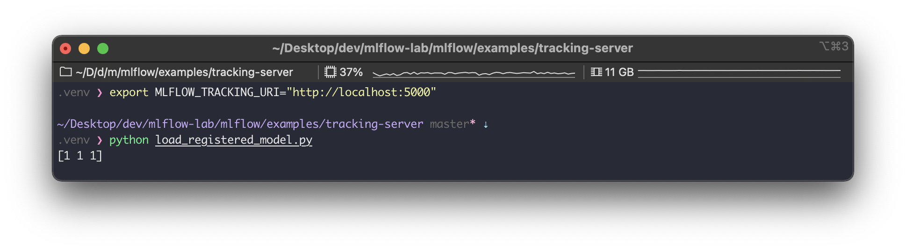

위 사진 처럼 잘 불러와서 실행하는 것을 볼 수 있다.


### 등록된 모델 서빙하기

Model Registry에 등록된 모델은 다음처럼 바로 서빙이 가능하다.  

```bash
# Tracking Server를 설정한다.
$ export MLFLOW_TRACKING_URI="http://localhost:5000"

# 등록된 LinearRegression 모델의 Version 1을 서빙하는 서버를 띄운다.
$ mlflow models serve -m "models:/LinearRegression/1" --port 5001 --no-conda
```

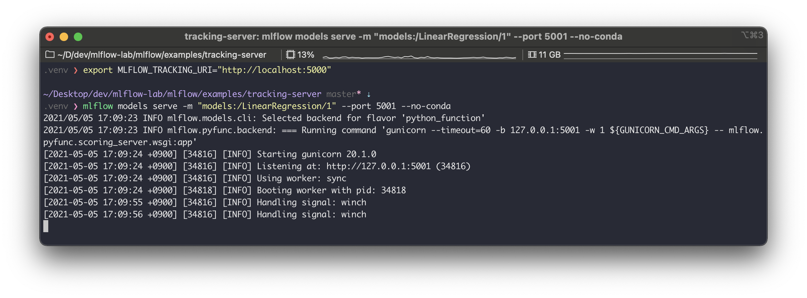

잘 서빙하는지 요청을 날려보자.

```bash
$ curl \
-d '{"columns":["x"], "data":[[1], [-1]]}' \
-H 'Content-Type: application/json; format=pandas-split' \
-X POST localhost:5001/invocations
```

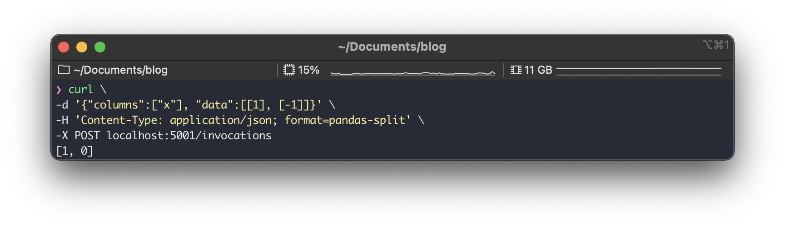

응답이 잘 오는 것을 볼 수 있다.


### 그 외 제공해주는 것들

필수적으로 알아야할 것들은 어느정도 설명한 것 같고... 이 외에 다음과 같은 기능들이 더 있다.

- MLflow 모델 설명 추가 또는 업데이트
- MLflow 모델 이름 바꾸기
- MLflow 모델의 단계(Stage) 전환
- MLflow 모델 나열 및 검색
- MLflow 모델 보관
- MLflow 모델 삭제
- 저장된 모델 등록
- 지원되지 않는 기계학습 모델 등록

특히 모델의 단계 전환, 나열 및 검색 등은 CT(Continous Training)를 구성할 때 추가적으로 활용하면 좋을 거 같다는 생각이 든다. 자세한 내용은 [여기](https://mlflow.org/docs/latest/model-registry.html#api-workflow)를 확인하자.


---

## 정리

- Model Registry는 실험 및 실행에서 기록한 모델들을 등록하고 불러올 수 있는 저장소다.
- Model Registry에 등록되는 모델들은 버전 혹은 단계(Stage)를 가진다.
- Model Registry에 모델을 등록하는 방법은 크게 2가지 방법이 있다.
    - 웹 UI를 사용하거나
    - mlflow 라이브러리에서 다음 3가지 방법을 사용하거나
        - `log_model()` 에 `registered_model_name`  의 값을 함께 넘겨주며 사용한다.
        - `register_model()` 를 사용한다.
        - `create_registered_model()` 과 `create_model_version()` 를 사용한다.
- Model Registry에 등록된 모델은 `mlflow model serve` 명령어로 바로 서빙이 가능하다.
- mlflow 라이브러리는 등록된 모델과 관련된 여러 액션을 제공해준다. 이는 CT등 파이프라인 자동화에서 활용해볼 수 있다.


---

## 참고

- https://mlflow.org/docs/latest/model-registry.html