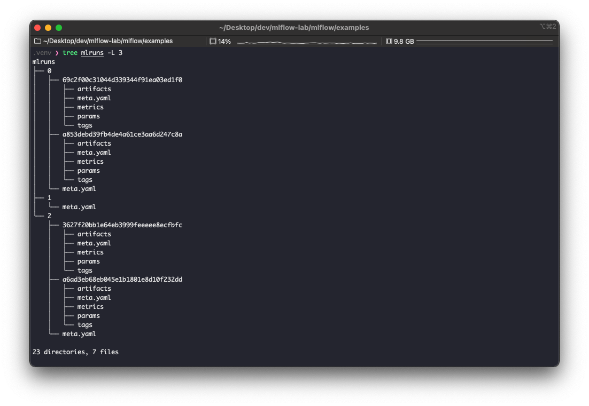
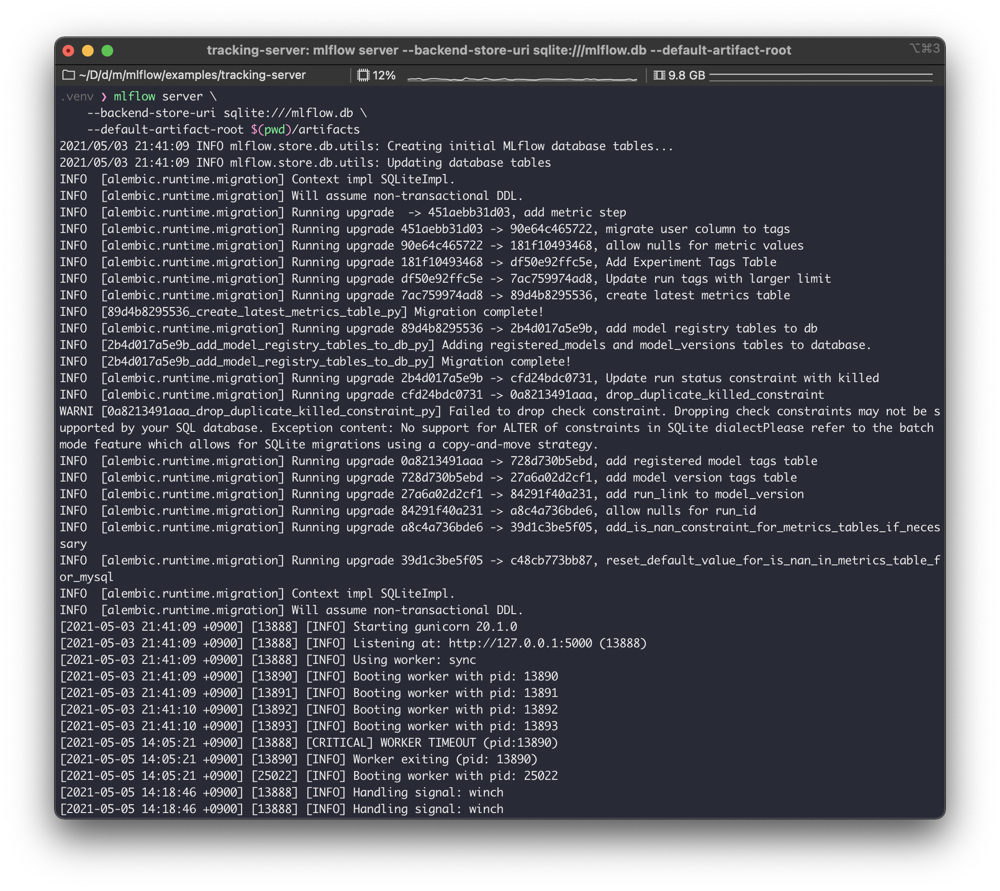
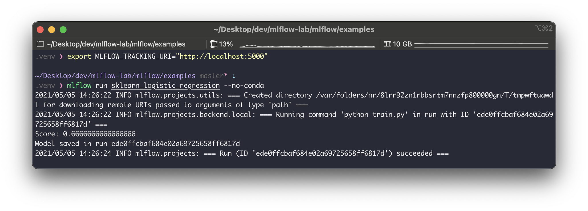
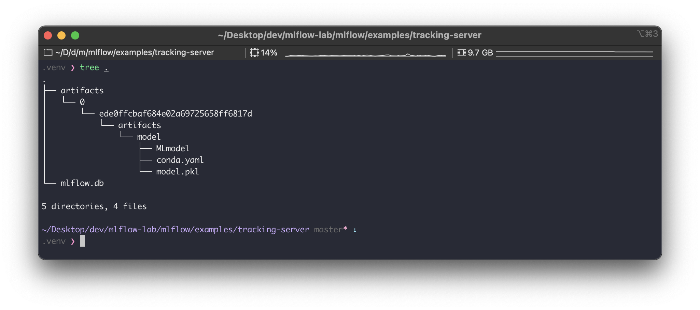
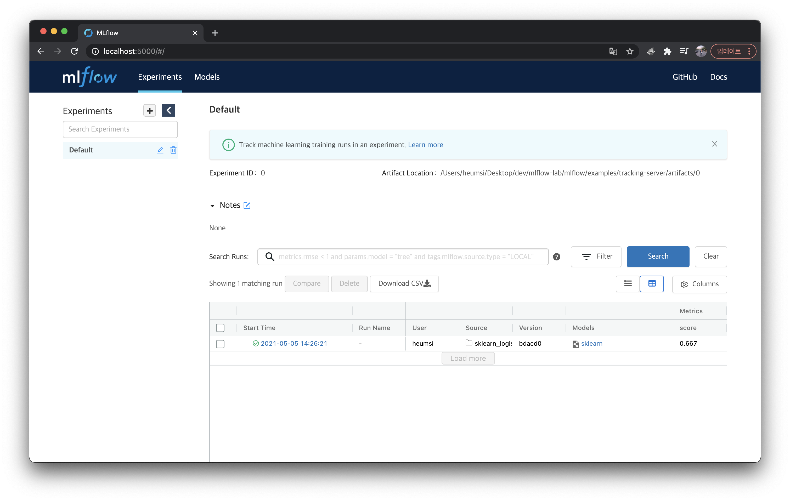
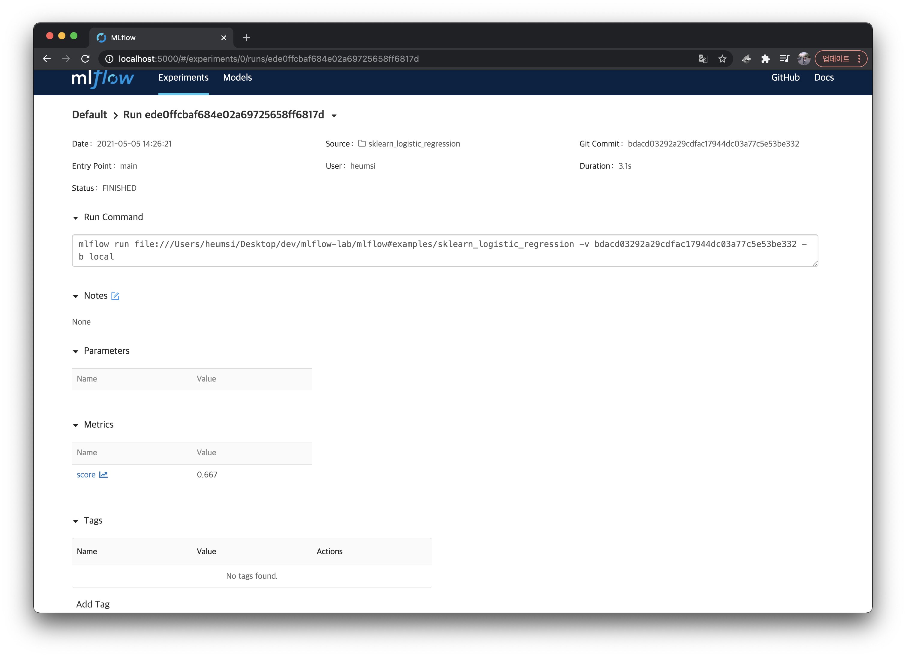
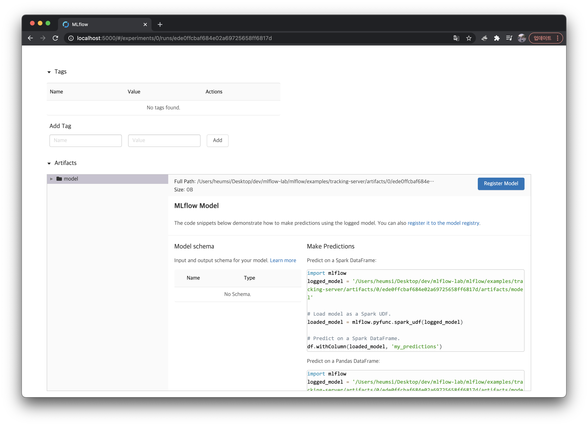

이번에는 MLflow 의 Tracking Server에 대해 알아본다.


---

## 사전 준비

다음이 사전에 준비 되어 있어야 한다.

```bash
# 파이썬 버전 확인
$ python --version
Python 3.8.7

# mlflow 설치 & 버전 확인
$ pip install mlflow
$ mlflow --version
mlflow, version 1.16.0

# 예제 파일을 위한 mlflow repo clone
$ git clone https://github.com/mlflow/mlflow.git
$ cd mlflow/examples
```


---

## Tracking Server

### Tracking 이란?

이전의 글들을 통해 우리는 MLflow가 머신러닝 프로젝트에서 일종의 "기록" 역할을 하는 것임을 알았다.  
여기서 머신러닝의 과정과 결과를 곳곳에서 기록한다는 의미로 "Tracking" 이라는 표현을 사용한다.

Tracking은 실험(Experiment)의 각 실행(Run)에서 일어나고, 구체적으로는 다음 내용들을 기록한다.

- **코드 버전**
    - MLflow 프로젝트에서 실행 된 경우, 실행에 사용 된 Git 커밋 해시
- **시작 및 종료 시간**
    - 실행 시작 및 종료 시간
- **소스**
- **매개 변수**
- **메트릭**
    - 값이 숫자 인 키-값 측정 항목
    - 각 측정 항목은 실행(run) 과정에서 업데이트 될 수 있으며 (예 : 모델의 손실 함수가 수렴되는 방식을 추적하기 위해) MLflow가 측정 항목의 전체 기록을 기록하고 시각화 할 수 있다.
- **아티팩트**
    - 모든 형식의 출력 파일. 
    - 예를 들면
        - 이미지 (예 : PNG), 
        - 모델 (예. picklize한 scikit-learn 모델)
        - 데이터 파일 (예 : [Parquet](https://parquet.apache.org/) 파일) 등


### 기록을 어디에 어떻게 저장하는가?

위에서 기록한 내용들은 실제로 어떻게 저장할까?  
앞의 글들에서 보았듯이 `./mlruns` 에 저장된다.



MLflow 는 별도의 설정 값을 주지 않으면 기본적으로 로컬 경로인  `./mlruns`  에 이 기록물들을 저장한다.  
기록물은 크게 2가지로 나뉜다.

- **Artifacts**
    - 파일, 모델, 이미지 등이 여기에 포함된다.
    - 위에서 `artifacts` 라고 보면 된다.
- **MLflow 엔티티**
    - 실행, 매개 변수, 메트릭, 태그, 메모, 메타 데이터 등이 여기에 포함된다.
    - 위에서 `artifacts` 를 제외한 나머지 (`meta.yaml`, `metrics`, `params`, `tags`) 라고 보면 된다.

위 기록물의 구체적인 내용을 잘 모른다면, [이전 글](https://dailyheumsi.tistory.com/257?category=980484)을 통해 확인해보자.

기본적으로 `./mlruns` 이라는 로컬 경로에 이 두 가지를 동시에 저장하고 있다. 하지만 별도의 설정을 통해 이 둘을 별도로 저장할 수 있다. 그리고 이 저장을 위해 Tracking 서버가 필요하다.


### Tracking Server

MLflow 는 Tracking 역할을 위한 별도의 서버를 제공한다. 이를 Tracking Server라고 부른다.  
이전에는 `mlflow.log_params`, `mlflow.log_metrics` 등을 통해서 `./mlruns` 에 바로 기록물을 저장했다면, 이제는 이 백엔드 서버를 통해서 저장하게 된다.  

간단하게 바로 실습해보자.  
다음 명령어로 Tracking Server를 띄운다.

```bash
# 먼저 별도의 디렉토리를 만들고 들어가자.
$ mkdir tracking-server
$ cd tracking-server

# 이후 Tracking Server를 띄우자.
$ mlflow server \
--backend-store-uri sqlite:///mlflow.db \
--default-artifact-root $(pwd)/artifacts
```



로그가 쭈욱 나오고, `localhost:5000` 에 서버가 떠있는 것을 알 수 있다.  
`--backend-store-uri`, `--default-artifact-root` 라는 개념이 나오는데, 일단은 넘어가고 계속 실습을 진행해보자.  

이제 MLflow 프로젝트를 실행시켜볼건데 그 전에 프로젝트가 이 백엔드 서버와 통신할 수 있게 설정해준다.

```bash
$ export MLFLOW_TRACKING_URI="http://localhost:5000"
```

이제 다시 `mlflow/examples` 경로로 가서 MLflow 프로젝트 예제인 `sklearn_logistic_regression` 를 다음처럼 실행시켜보자.

```bash
$ mlflow run sklearn_logistic_regression --no-conda
```



잘 실행되었다.  
이제 `tracking-server` 디렉토리로 다시 가서 실행 결과물을 확인해보자.



`artifacts/` 와 `mlflow.db` 파일이 생긴 것을 볼 수 있다.  
그리고 이러한 결과물을 트래킹 서버(`localhost:5000`)의 웹 페이지를 통해서도 확인할 수 있다.  



위 실행(Run)을 클릭해서 들어가면 Tracking한 내용을 다음처럼 확인할 수 있다.





---

## 정리

- 우리는 방금 MLflow 프로젝트를 실행시킬 때 `localhost:5000` 에 떠있는 Tracking Server를 사용했고,
- Tracking Server 는 프로젝스 실행의 결과물들을 `artifacts/` 와 `mlflow.db` 에 저장했다.
    - Tracking Server를 사용하지 않았을 때는 `./mlruns` 에 기록했었다.
    - Tracking Server를 사용하면 별도의 저장소에 기록한다
- Tracking Server 가 사용하는 별도의 저장소는 두 가지 파라미터로 지정할 수 있다.
    - `--backend-store-uri` 
        - Mlflow 엔티티가 기록되는 저장소다.
        - 파일 저장소 혹은 DB를 사용할 수 있으며 [SQLAlchemy DB URI](https://docs.sqlalchemy.org/en/latest/core/engines.html#database-urls) 형태로 넘겨주면 된다.
            - `<dialect>+<driver>://<username>:<password>@<host>:<port>/<database>`
        - 우리는 위에서 `sqlite` 를 사용하였다.
    -  `--default-artifact-root` 
        - Artifacts가 기록되는 저장소다.
        - 파일 시스템, 스토리지 등을 사용할 수 있다.
            - AWS S3나 GCS같은 등 외부 스토리지도 사용할 수 있다. [여기](https://mlflow.org/docs/latest/tracking.html#amazon-s3-and-s3-compatible-storage)를 참고.
        - 우리는 위에서 파일 시스템을 사용하였다.

Tracking Server는 Server라는 이름에 맞게 어딘가에 항상 띄워두고 사용하면 될듯 싶다.  
MLflow project 를 작성하는 실험자는 이 Tracking Server와 통신하도록 세팅해두고 Logging 하면 될듯하고.  
이렇게 되면 실험에 대한 모든 기록은 Tracking Server의 웹 대시보드에서 한 눈에 볼 수 있게 된다.


---

## 참고

- https://mlflow.org/docs/latest/tracking.html#

