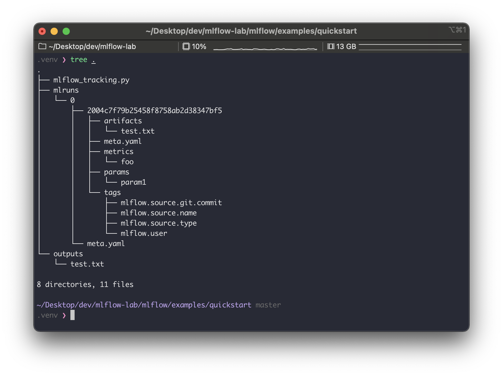
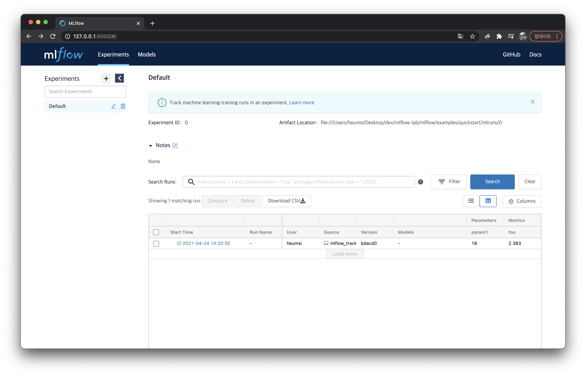
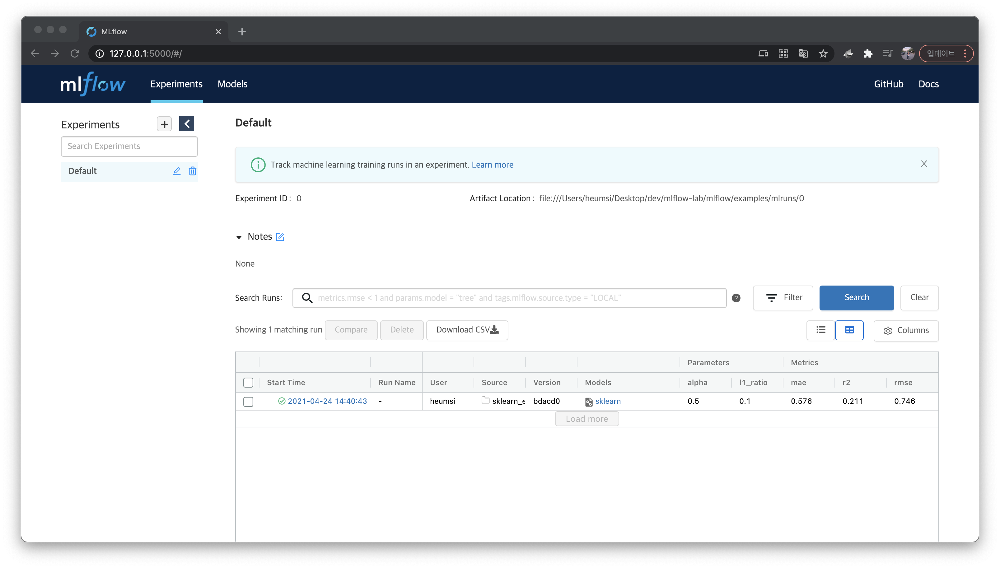
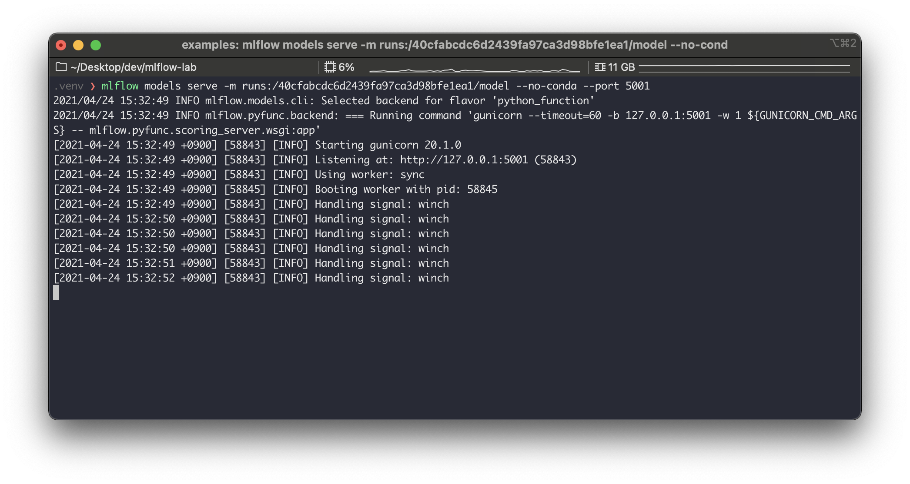
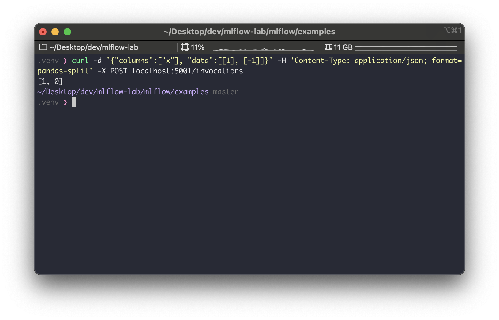
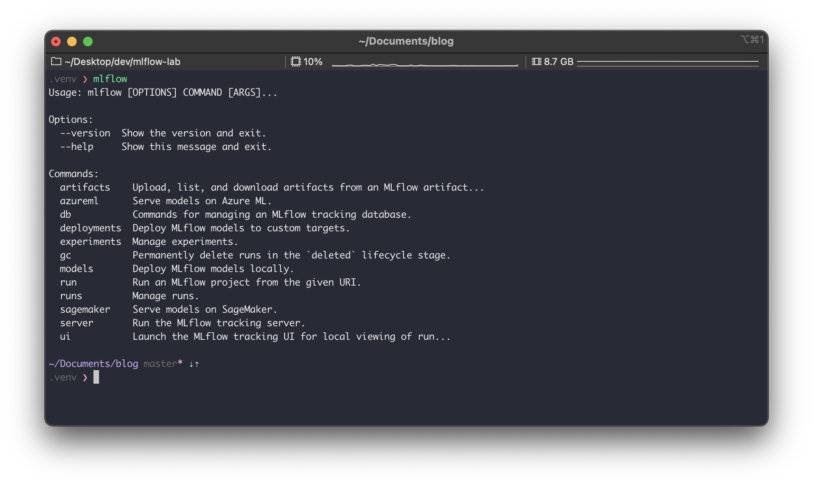

## 사전 준비

- 파이썬 3.8.7과 가상환경

```bash
$ python --version
Python 3.8.7
```


---

## Quick Start

### 설치

```bash
$ pip install mlflow
$ mlflow --version
mlflow, version 1.15.0
```

<br>

### 기본 동작 이해하기

예제 코드를 받기 위해 mlflow 공식 github 코드도 다운받자.  
이후 `examples/quickstart ` 경로로 들어가자

```bash
$ git clone https://github.com/mlflow/mlflow
$ cd mlflow/examples/quickstart
$ ls -al
total 8
drwxr-xr-x   5 heumsi  staff  160  4 24 14:20 .
drwxr-xr-x  31 heumsi  staff  992  4 24 14:18 ..
-rw-r--r--   1 heumsi  staff  494  4 24 14:18 mlflow_tracking.py
```

`mlflow_tracking.py` 라는 파일이 보이는데, 이 파일은 이렇게 생겼다.

```python
# mlflow_tracking.py

import os
from random import random, randint

from mlflow import log_metric, log_param, log_artifacts

if __name__ == "__main__":
    print("Running mlflow_tracking.py")

    log_param("param1", randint(0, 100))

    log_metric("foo", random())
    log_metric("foo", random() + 1)
    log_metric("foo", random() + 2)

    if not os.path.exists("outputs"):
        os.makedirs("outputs")
    with open("outputs/test.txt", "w") as f:
        f.write("hello world!")

    log_artifacts("outputs")
```

mlflow 패키지로부터 다음 세 개를 가져와 사용하는 것을 알 수 있다.

- `log_param`
- `log_metric`
- `log_artifacts`

`log` 라는 이름만 봐도 뭔가를 기록하는 동작을 하는구나하고 감이온다.

이제 이 파일을 파이썬으로 실행해보자.

```bash
$ python mlflow_tracking.py
Running mlflow_tracking.py
```

실행하고 나면 다음과 `mlruns` 와 `outputs` 디렉토리가 생겨있다.

```bash
$ ls -al
total 8
drwxr-xr-x   5 heumsi  staff  160  4 24 14:20 .
drwxr-xr-x  31 heumsi  staff  992  4 24 14:18 ..
-rw-r--r--   1 heumsi  staff  494  4 24 14:18 mlflow_tracking.py
drwxr-xr-x   4 heumsi  staff  128  4 24 14:20 mlruns
drwxr-xr-x   3 heumsi  staff   96  4 24 14:20 outputs
```

어떻게 생겨있는지 `tree` 로 확인해보면




디렉토리를 보면 다음 세 디렉토리가 눈에 띈다.

- `artifacts`
- `metrics`
- `params`

음.. 아까 `log_param` 등의 함수로 기록했던게 여기 있을거 같다.  
위 디렉토리들 내부에 있는 파일을 까서 확인해보자.,


역시 그렇다. 
`log_param`, `log_metric` 함수로 넘겼던 값들이 위 파일들에 기록된다.  
특히 `metric` 의 경우 (위에서 `metrics/foo`, 왼쪽에서 두 번째 파일) 타임스탬프가 같이 기록되는 것을 알 수 있다. 

<br>

### 웹 대시보드 

`mlflow ui` 명령어로 대시보드용 웹서버를 띄울 수 있다고 한다.

```bash
$ mlflow ui

[2021-04-24 15:57:58 +0900] [59547] [INFO] Starting gunicorn 20.1.0
[2021-04-24 15:57:58 +0900] [59547] [INFO] Listening at: http://127.0.0.1:5000 (59547)
[2021-04-24 15:57:58 +0900] [59547] [INFO] Using worker: sync
[2021-04-24 15:57:58 +0900] [59549] [INFO] Booting worker with pid: 59549
```

`http://127.0.0.1:5000` 로 들어가보면



방금 파일로 기록된 내용들이 대시보드에 등장하는 것을 알 수 있다.  
`Artifact Location` 을 보면 웹 서버가 파일을 어느 디렉토리에 마운트해서 읽어오는지 알 수 있다.

<br>

### MLflow 프로젝트

이번엔 실제 ML 모델에 `mlflow` 를 적용해보자.  
`mlflow/examples/` 에 예제가 꽤 많이 있는데, 여기서는 `scikit-learn` 모델을 사용해본다.

먼저 `scikit-learn` 을 설치한다.

```bash
$ pip install sklearn
$ python -c "import sklearn; print(sklearn.__version__)"
0.24.1
```

`mlflow/examples` 에 가보면 중간에 이렇게 `sklearn` 모델 예제들이 있다.

```bash
$ ls -al
...
drwxr-xr-x   5 heumsi  staff   160  4 24 14:18 sklearn_elasticnet_diabetes
drwxr-xr-x   7 heumsi  staff   224  4 24 14:18 sklearn_elasticnet_wine
drwxr-xr-x   5 heumsi  staff   160  4 24 14:18 sklearn_logistic_regression
```

이 중에서 우리는 `sklearn_elasticnet_wine` 을 사용해본다.  

`sklearn_elasticnet_wine` 의 패키지 구조는 다음과 같다.

```bash
$ tree sklearn_elasticnet_wine
sklearn_elasticnet_wine
├── MLproject
├── conda.yaml
├── train.ipynb
├── train.py
└── wine-quality.cs
```

핵심이 되는 `MLproject` 를 먼저 확인해보면

```yaml
# MLProject

name: tutorial

conda_env: conda.yaml

entry_points:
  main:
    parameters:
      alpha: {type: float, default: 0.5}
      l1_ratio: {type: float, default: 0.1}
    command: "python train.py {alpha} {l1_ratio}"
```

`MLProject`  은 `sklearn_elasticnet_wine`  에 대한 전체적인 소개와 설정 값들을 담은 **프로젝트 파일**이라 볼 수 있다.

다음으로  `train.py` 를 확인해보면

```python
# train.py

import os
import warnings
import sys

import pandas as pd
import numpy as np
from sklearn.metrics import mean_squared_error, mean_absolute_error, r2_score
from sklearn.model_selection import train_test_split
from sklearn.linear_model import ElasticNet
from urllib.parse import urlparse
import mlflow
import mlflow.sklearn

import logging

logging.basicConfig(level=logging.WARN)
logger = logging.getLogger(__name__)


def eval_metrics(actual, pred):
    rmse = np.sqrt(mean_squared_error(actual, pred))
    mae = mean_absolute_error(actual, pred)
    r2 = r2_score(actual, pred)
    return rmse, mae, r2


if __name__ == "__main__":
    warnings.filterwarnings("ignore")
    np.random.seed(40)

    # Read the wine-quality csv file from the URL
    csv_url = (
        "http://archive.ics.uci.edu/ml/machine-learning-databases/wine-quality/winequality-red.csv"
    )
    try:
        data = pd.read_csv(csv_url, sep=";")
    except Exception as e:
        logger.exception(
            "Unable to download training & test CSV, check your internet connection. Error: %s", e
        )

    # Split the data into training and test sets. (0.75, 0.25) split.
    train, test = train_test_split(data)

    # The predicted column is "quality" which is a scalar from [3, 9]
    train_x = train.drop(["quality"], axis=1)
    test_x = test.drop(["quality"], axis=1)
    train_y = train[["quality"]]
    test_y = test[["quality"]]

    alpha = float(sys.argv[1]) if len(sys.argv) > 1 else 0.5
    l1_ratio = float(sys.argv[2]) if len(sys.argv) > 2 else 0.5

    with mlflow.start_run():
        lr = ElasticNet(alpha=alpha, l1_ratio=l1_ratio, random_state=42)
        lr.fit(train_x, train_y)

        predicted_qualities = lr.predict(test_x)

        (rmse, mae, r2) = eval_metrics(test_y, predicted_qualities)

        print("Elasticnet model (alpha=%f, l1_ratio=%f):" % (alpha, l1_ratio))
        print("  RMSE: %s" % rmse)
        print("  MAE: %s" % mae)
        print("  R2: %s" % r2)

        mlflow.log_param("alpha", alpha)
        mlflow.log_param("l1_ratio", l1_ratio)
        mlflow.log_metric("rmse", rmse)
        mlflow.log_metric("r2", r2)
        mlflow.log_metric("mae", mae)

        tracking_url_type_store = urlparse(mlflow.get_tracking_uri()).scheme

        # Model registry does not work with file store
        if tracking_url_type_store != "file":

            # Register the model
            # There are other ways to use the Model Registry, which depends on the use case,
            # please refer to the doc for more information:
            # https://mlflow.org/docs/latest/model-registry.html#api-workflow
            mlflow.sklearn.log_model(lr, "model", registered_model_name="ElasticnetWineModel")
        else:
            mlflow.sklearn.log_model(lr, "model")

```

전체적으로 머신러닝 모델을 학습하고 테스트하는 코드다. 다만 중간 중간에 다음 함수들이 눈에 띈다.

- `mlflow.log_param`
- `mlflow.log_metric`
- `mlflow.sklearn.log_model`

 `mlflow` 의 이 함수들을 사용하여 파라미터 값이나 결과 값을 기록하는 것을 알 수 있다.

이제 이 MLflow 프로젝트를 실행해보자. 
`mlflow run` 명령어를 사용한다. (참고로 나는 conda 사용안할거기 때문에 `--no-conda` 옵션을 주었다)

```bash
$ mlflow run sklearn_elasticnet_wine -P alpha=0.5 --no-conda

2021/04/24 14:40:43 INFO mlflow.projects.utils: === Created directory /var/folders/nr/8lrr92zn1rbbsrtm7nnzfp800000gn/T/tmpbdfgejik for downloading remote URIs passed to arguments of type 'path' ===
2021/04/24 14:40:43 INFO mlflow.projects.backend.local: === Running command 'python train.py 0.5 0.1' in run with ID 'f2bec5126785418b9ba84a67a9a86d92' ===
Elasticnet model (alpha=0.500000, l1_ratio=0.100000):
  RMSE: 0.7460550348172179
  MAE: 0.576381895873763
  R2: 0.21136606570632266
2021/04/24 14:40:48 INFO mlflow.projects: === Run (ID 'f2bec5126785418b9ba84a67a9a86d92') succeeded ===
```

위 명령어를 실행하고 나면 동일 경로에 다음처럼 `mlruns` 디렉토리가 생기고, 다음처럼 생겼다.

```bash
$ ls -al
...
drwxr-xr-x   4 heumsi  staff   128  4 24 14:37 mlruns
...

$ tree mlruns -L 3
mlruns
└── 0
    ├── e36ebff4f2444161af4472b3a11d408b
    │   ├── artifacts
    │   ├── meta.yaml
    │   ├── metrics
    │   ├── params
    │   └── tags
    └── meta.yaml
```

전체적인 구성은 위에서 본 예제와 거의 같다.  
다시 `mlflow ui` 명령어로 대시보드 웹서버를 실행시킨 뒤 접속해서 이를 확인해보자

```bash
$ mlflow ui

[2021-04-24 15:57:58 +0900] [59547] [INFO] Starting gunicorn 20.1.0
[2021-04-24 15:57:58 +0900] [59547] [INFO] Listening at: http://127.0.0.1:5000 (59547)
[2021-04-24 15:57:58 +0900] [59547] [INFO] Using worker: sync
[2021-04-24 15:57:58 +0900] [59549] [INFO] Booting worker with pid: 59549
```



방금 돌린 모델이 잘 들어가있는 것을 알 수 있다.

<br>

### 모델 서빙

이번엔 `mlflow/examples` 내에 있는 `sklearn_logistic_regression` MLflow 프로젝트를 살펴보자.  
`sklearn_logistic_regression` 의 내부 구조는 이렇다.

```
$ tree sklearn_logistic_regression
sklearn_logistic_regression
├── MLproject
├── conda.yaml
└── train.py
```

`train.py` 는 이렇게 생겼다.

```python
# train.py

import numpy as np
from sklearn.linear_model import LogisticRegression

import mlflow
import mlflow.sklearn

if __name__ == "__main__":
    X = np.array([-2, -1, 0, 1, 2, 1]).reshape(-1, 1)
    y = np.array([0, 0, 1, 1, 1, 0])
    lr = LogisticRegression()
    lr.fit(X, y)
    score = lr.score(X, y)
    print("Score: %s" % score)
    mlflow.log_metric("score", score)
    mlflow.sklearn.log_model(lr, "model")
    print("Model saved in run %s" % mlflow.active_run().info.run_uuid)
```

위 예제들과 별반 다른바 없는 코드다.
이제 이 파일을 파이썬으로 실행한다.

```bash
$ python sklearn_logistic_regression/train.py --no-conda
Score: 0.6666666666666666
Model saved in run 40cfabcdc6d2439fa97ca3d98bfe1ea1
```

결과물은 역시 `./mlruns` 에 추가된다.
 `40cfabcdc6d2439fa97ca3d98bfe1ea1` 라는 id 를 가지고 새로운 디렉토리가 추가되었음을 알 수 있다.

```bash
mlruns
└── 0
    ├── 40cfabcdc6d2439fa97ca3d98bfe1ea1
    │   ├── artifacts
    │   ├── meta.yaml
    │   ├── metrics
    │   ├── params
    │   └── tags
    ├── e36ebff4f2444161af4472b3a11d408b
    │   ├── artifacts
    │   ├── meta.yaml
    │   ├── metrics
    │   ├── params
    │   └── tags
    └── meta.yaml
```

웹 대시보드에도 역시 추가가 되어있는걸 확인할 수 있다.


이제 이 MLflow 프로젝트를 서빙하는 서버를 띄워보자.  
`mlflow models serve -m runs:/<RUN_ID>/model` 명령어로 가능하다.   
이 때 `RUN_ID` 는 위에서 확인한 `40cfabcdc6d2439fa97ca3d98bfe1ea1` 를 넣어주면 된다.

```bash
$ mlflow models serve -m runs:/40cfabcdc6d2439fa97ca3d98bfe1ea1/model --no-conda --port 5001
...

2021/04/24 15:32:49 INFO mlflow.models.cli: Selected backend for flavor 'python_function'
2021/04/24 15:32:49 INFO mlflow.pyfunc.backend: === Running command 'gunicorn --timeout=60 -b 127.0.0.1:5001 -w 1 ${GUNICORN_CMD_ARGS} -- mlflow.pyfunc.scoring_server.wsgi:app'
[2021-04-24 15:32:49 +0900] [58843] [INFO] Starting gunicorn 20.1.0
[2021-04-24 15:32:49 +0900] [58843] [INFO] Listening at: http://127.0.0.1:5001 (58843)
[2021-04-24 15:32:49 +0900] [58843] [INFO] Using worker: sync
[2021-04-24 15:32:49 +0900] [58845] [INFO] Booting worker with pid: 58845
[2021-04-24 15:32:49 +0900] [58843] [INFO] Handling signal: winch
```



서버가 제대로 잘 동작 하는지 다음처럼 `curl` 로 요청을 날려보자. 엔드포인트는 `/invocations` 다.

```bash
$ curl -d '{"columns":["x"], "data":[[1], [-1]]}' -H 'Content-Type: application/json; format=pandas-split' -X POST localhost:5001/invocations

[1, 0]
```




응답이 잘 오는 것을 확인할 수 있다.


### 그 외

여기서 살펴보지 않았지만, CLI 커맨드만 보면 대략 어떤 기능들이 더 있는지 알 수 있다.




---

## 후기

- MLflow는 머신러닝 모델을 train, test, validation 할 때마다 그 값들을 기록해주는 툴이다.
    - 웹 대시보드가 좀 이쁘네.
    - 아직 뭔가 컨텐츠가 많이는 없는거 같은데, 개발이 더 되거나 플러그인이 더 있지 않을까?
    - 일단 간단하게 시작할 때 써먹기 좋을듯 하다!
- 다만 모델러가 MLflow를 알아야 하는 의존성이 생기긴 하네.
    - 모델러의 코드 파일에 MLflow 코드가 일부 들어갈텐데, 이는 감안해야 하는걸까?
- 변수, 함수명, 프로젝트 패키지 등에서 네이밍이 아주 직관적이고 간단 명료해서 좋았다.
- 서빙까지 지원해주는 것도 인상적이다. 내부적으로 어떻게 돌아가는 걸까?