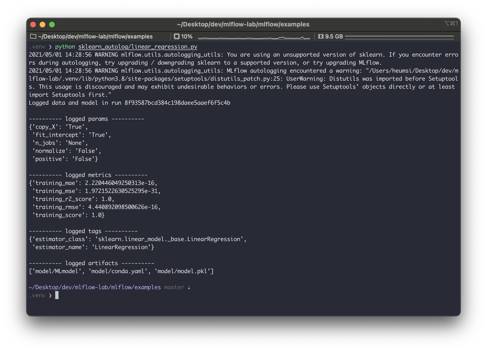
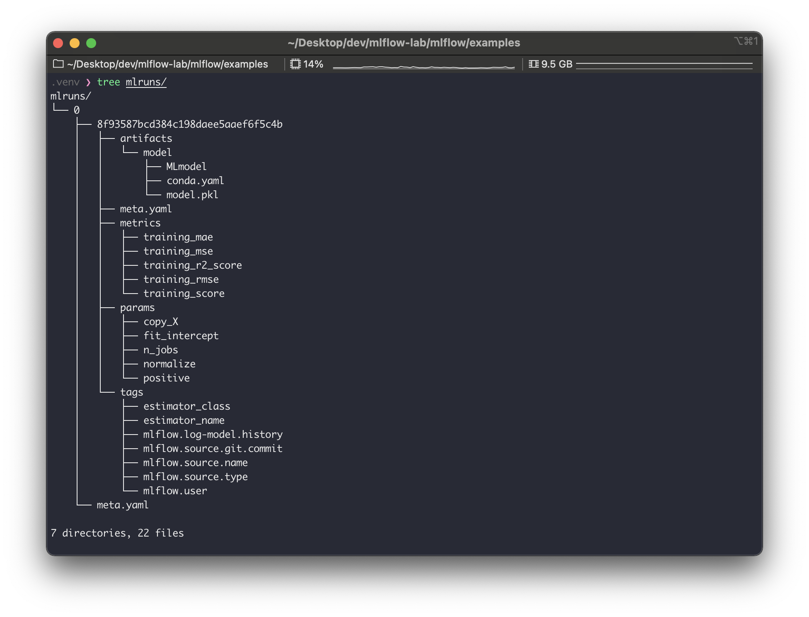
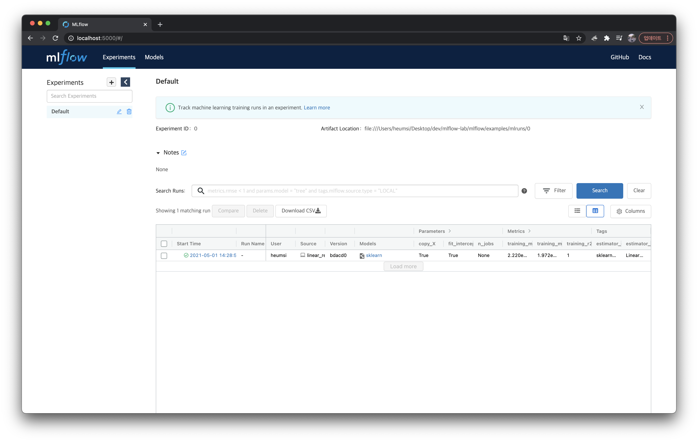
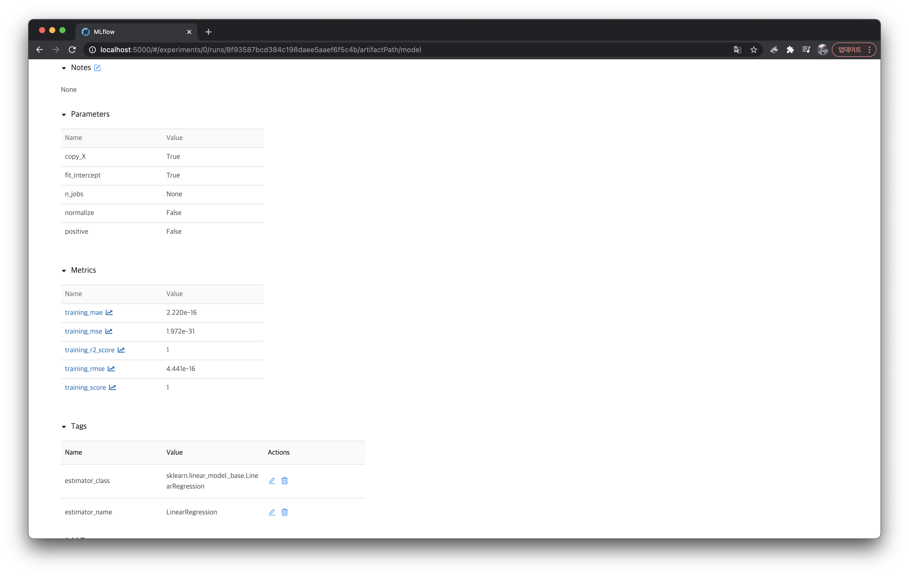
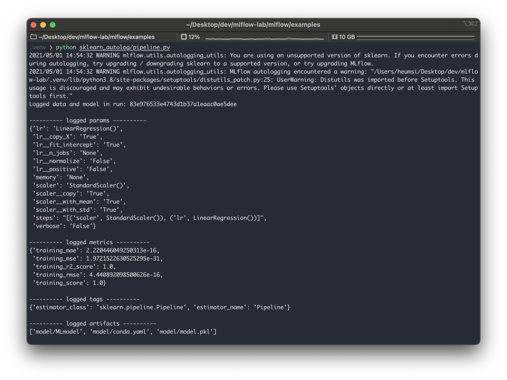
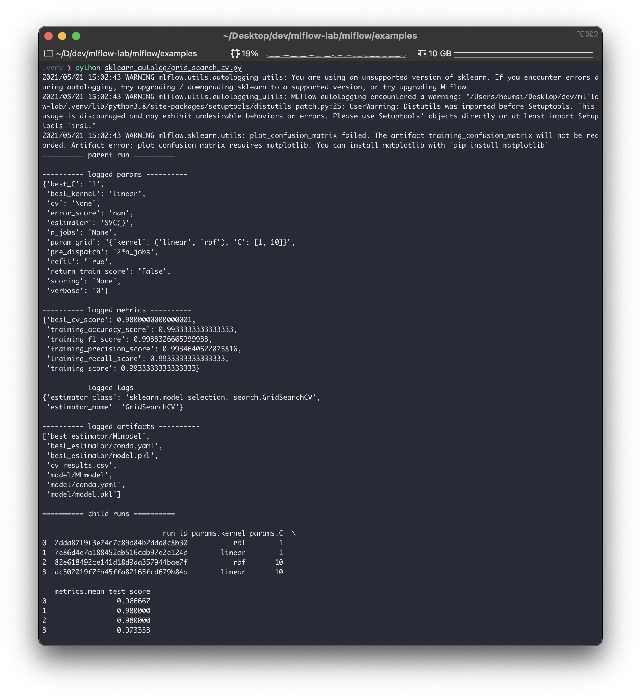
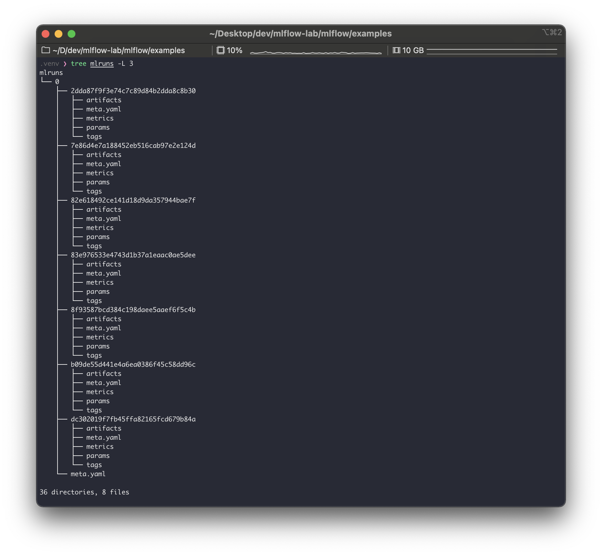
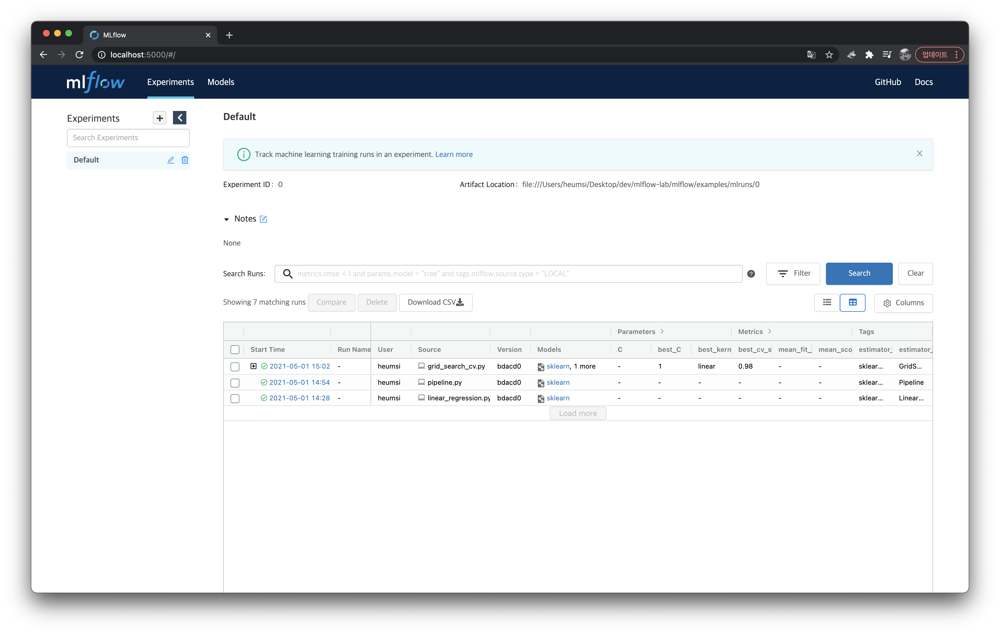
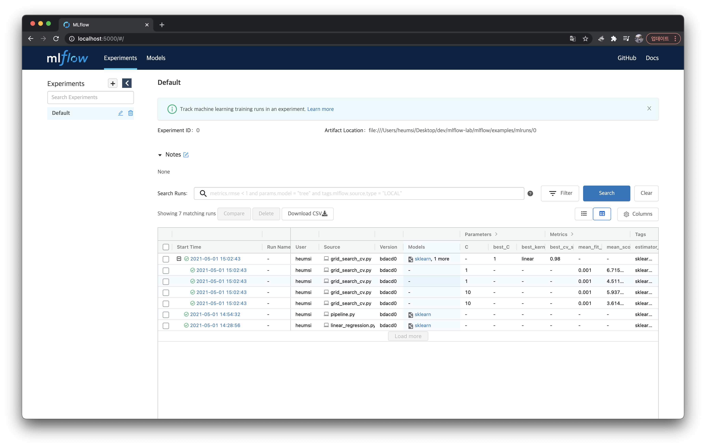
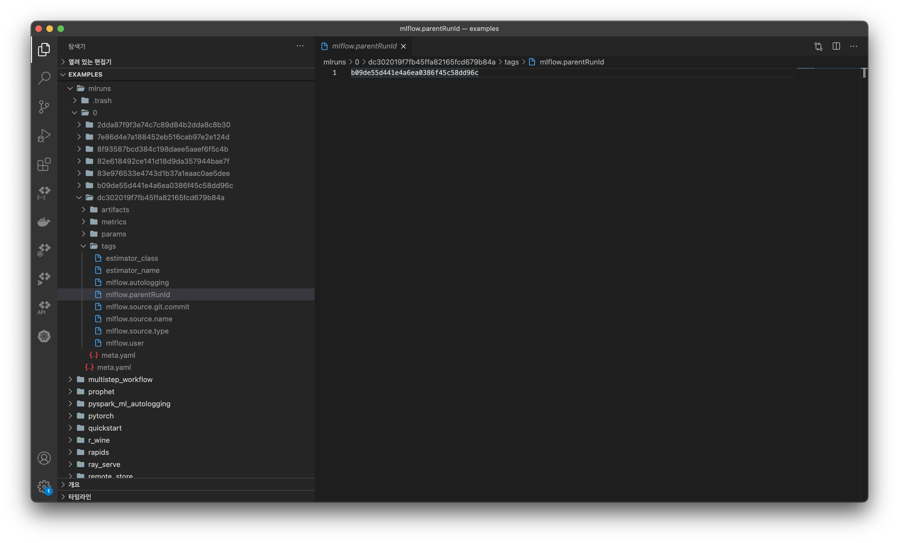

저번 Quick 리뷰 글에 이어 계속해서 작성한다.  
이번 글은 MLflow 에서 제공하는 Automatic Logging 기능 예제들을 살펴본다.  


---

## 사전 준비

다음이 사전에 준비 되어 있어야 한다.

```bash
# mlflow 설치 & 버전 확인
$ pip install mlflow
$ mlflow --version
mlflow, version 1.16.0

# 예제 파일을 위한 mlflow repo clone
$ git clone https://github.com/mlflow/mlflow.git
$ cd mlflow/examples
```


---

## 예제 살펴보기


### `linear_regression.py`

`examples` 내에 있는 많은 예제 중, `skelarn_autolog` 를 사용해보자.  
먼저 `sklearn` 을 설치해준다.

```bash
# sklearn 설치 & 버전 확인
$ pip install sklearn
$ python -c "import sklearn; print(sklearn.__version__)"
0.24.2
```

`skelarn_autolog/linear_regression.py` 를 보면 다음처럼 생겼다.

```python
# skelarn_autolog/linear_regression.py

from pprint import pprint

import numpy as np
from sklearn.linear_model import LinearRegression

import mlflow
from utils import fetch_logged_data


def main():
    # enable autologging
    mlflow.sklearn.autolog()

    # prepare training data
    X = np.array([[1, 1], [1, 2], [2, 2], [2, 3]])
    y = np.dot(X, np.array([1, 2])) + 3

    # train a model
    model = LinearRegression()
    with mlflow.start_run() as run:
        model.fit(X, y)
        print("Logged data and model in run {}".format(run.info.run_id))

    # show logged data
    for key, data in fetch_logged_data(run.info.run_id).items():
        print("\n---------- logged {} - ---------".format(key))
        pprint(data)

    
if __name__ == "__main__":
    main()
```

소스코드가 아주 간결하고 잘 설명되어 있다. 내용은 Linear Regression을 사용하는 간단한 머신러닝 코드다.  
여기서는 2가지 코드가 눈에 띈다.

- `mlflow.sklearn.autolog()`
    - Automatic Logging 기능을 사용하는 설정이다.
    - 코드 앞부분에 들어가야 한다.
- `with mlflow.start_run() as run:`
    - MLflow 의 실행(run) 의 시작을 알리는 컨텍스트 매니저 구문이다.
    - `run` 에는 실행과 관련된 내용이 들어간다.

이제 다음 명령어로 실행해보자.

```bash
$ python sklearn_autolog/linear_regression.py
```



실행하고 나면 위와같은 출력이 나온다.
`warning` 은 일단 무시하면 될듯하고.. 로그를 좀 살펴보면, `run_id` 가 `8f93587bcd384c198daee5aaef6f5c4b` 로 생성되었고, 다음 사항들이 자동으로 기록한 것을 알 수 있다.

- `params` 
    - 모델 생성(위에서는 `LinearRegression`)에 사용하는 `params` 를 기록한다.
    - 부연 설명하면... `copy_X`, `fit_intercept` 등의 파라미터는 `LinearRegression` 의 `__init__` 파라미터다.
- `metrics`
    - 모델 훈련 중에 평가하는 `metrics`를 기록한다.
    - 위의 경우, `mae`, `mse`, `r2_score`, `rmse`, `score` (이건 뭔지 모르겠다.) 를 모두 기록해주었다.
- `tags`
    - 이 실행에 관련된 `tag` 를 기록한다.
    - 기본적으로 모델의 패키지와 클래스 이름을 기록한다.
- `artifacts` 
    - 실행에 대한 메타 정보와 모델 파일을 기록한다.

실제로 잘 생성되었는지 `mlruns/` 에서 확인해보자.

```bash
$ tree mlruns/
```



`8f93587bcd384c198daee5aaef6f5c4b`  디렉토리에 각종 내용들이 로깅된 파일들이 있는 것을 볼 수 있다.  
실제 어떤 값들이 들어가있는지 쉽게 보기위해 yatai 웹서버로 접속해서 봐보자.

```bash
$ mlflow ui
[2021-05-01 14:36:15 +0900] [87757] [INFO] Starting gunicorn 20.1.0
[2021-05-01 14:36:15 +0900] [87757] [INFO] Listening at: http://127.0.0.1:5000 (87757)
[2021-05-01 14:36:15 +0900] [87757] [INFO] Using worker: sync
[2021-05-01 14:36:15 +0900] [87759] [INFO] Booting worker with pid: 87759
```

	`params` , `metrics`, `tags` 등을 좀 더 자세히 확인해보기 위해 `sklearn` 모델을 클릭하여 실행 상세 페이지에 들어가보자.



위에서 출력한 내용들이 모두 잘 들어가있는 것을 볼 수 있다.


### `pipeline.py`

이번엔 `skelarn_autolog/pipeline.py` 예제를 살펴보자.  
이 파일은 다음처럼 생겼다.

```python
from pprint import pprint

import numpy as np
from sklearn.linear_model import LinearRegression
from sklearn.preprocessing import StandardScaler
from sklearn.pipeline import Pipeline

import mlflow
from utils import fetch_logged_data


def main():
    # enable autologging
    mlflow.sklearn.autolog()

    # prepare training data
    X = np.array([[1, 1], [1, 2], [2, 2], [2, 3]])
    y = np.dot(X, np.array([1, 2])) + 3

    # train a model
    pipe = Pipeline([("scaler", StandardScaler()), ("lr", LinearRegression())])
    with mlflow.start_run() as run:
        pipe.fit(X, y)
        print("Logged data and model in run: {}".format(run.info.run_id))

    # show logged data
    for key, data in fetch_logged_data(run.info.run_id).items():
        print("\n---------- logged {} ----------".format(key))
        pprint(data)


if __name__ == "__main__":
    main()
```

`sklearn.pipeline.Pipeline` 을 사용하는 간단한 머신러닝 코드다.  
바로 실행해보자.

```bash
$ python sklearn_autolog/pipeline.py
```



`logged_params` 를 보면 `Pipeline` 에 들어가는 모든 파라미터를 기록하는 것을 볼 수 있다.  
기록된 값 역시 `mlruns/` 에 저장된다.


### `grid_search_cv.py`

마지막으로, `skelarn_autolog/grid_search_cv.py` 예제를 살펴보자.  
다음처럼 생겼다.

```python
from pprint import pprint

import pandas as pd
from sklearn import svm, datasets
from sklearn.model_selection import GridSearchCV

import mlflow
from utils import fetch_logged_data


def main():
    mlflow.sklearn.autolog()

    iris = datasets.load_iris()
    parameters = {"kernel": ("linear", "rbf"), "C": [1, 10]}
    svc = svm.SVC()
    clf = GridSearchCV(svc, parameters)

    with mlflow.start_run() as run:
        clf.fit(iris.data, iris.target)

    # show data logged in the parent run
    print("========== parent run ==========")
    for key, data in fetch_logged_data(run.info.run_id).items():
        print("\n---------- logged {} ----------".format(key))
        pprint(data)

    # show data logged in the child runs
    filter_child_runs = "tags.mlflow.parentRunId = '{}'".format(run.info.run_id)
    runs = mlflow.search_runs(filter_string=filter_child_runs)
    param_cols = ["params.{}".format(p) for p in parameters.keys()]
    metric_cols = ["metrics.mean_test_score"]

    print("\n========== child runs ==========\n")
    pd.set_option("display.max_columns", None)  # prevent truncating columns
    print(runs[["run_id", *param_cols, *metric_cols]])


if __name__ == "__main__":
    main()
```

`iris` 데이터셋을 사용하고, `svm` 모델을 사용하는데, 이 때 `GridSearchCV` 를 사용하여 최적의 모델 파라미터를 찾는 머신러닝 코드다.  
 `# show data logged in the parent run` 아래 부분은 뭔가 양이 많은데, 그냥 로깅된 내용을 출력해주는 부분이므로, 여기서는 주의 깊게 봐지 않아도 된다.

아무튼 이 코드도 실행해보자.

```bash
$ python sklearn_autolog/grid_search_cv.py
```



출력된 내용을 보면 크게 `parent run` 과 `child runs` 으로 구성해볼 수 있다.  
`parent run` 에서는 전체 파이프라인에 들어간 파라미터 값들을 기록하고, 또 이 `GridSearch` 를 통해 찾은 최적의  파라미터 값을 기록한다. (`best_C`, `best_kernel` ). 
`child runs` 에서는 `GridSearch` 진행할 때 각각 파라미터 경우의 수대로 `run` 들을 실행하고 기록한 모습을 볼 수 있다. 이 때 `child runs` 들도 각각 하나의 `run` 이 되므로 `run_id` 를 가지게 된다. 즉 `GridSearch` 에서 파라미터 조합의 경우의 수가 많아지면, 그만큼의 실행(`run`) 이 생기게 된다.

실제 `mlruns` 를 확인해보면 이 `child run` 들이 생긴 것을 볼 수 있다.  
(다만 `parent run` 과 별다른 디렉토리 구분은 없다. 즉 누가 `child run` 인지 디렉토리 구조로는 파악이 잘 안된다.)



그렇다면 yatai 에서는 어떻게 보여줄까?  
yatai에서도 `child run` 들을 `parent run` 들과 구분 없이 보여줄까?  
이를 확인하기 위해 yatai 서버로 접속해서 확인해보자.



재밌게도 yatai 에서는 `parent run` 만 보인다.  
`grid_search_cv.py` 가 있는 행에 `+` 버튼을 눌러보면 아래와 같이 `child runs` 가 나온다.



`run` 자체는 `GridSearch` 에 맞게 독립적으로 여러 개로 생성하되, `run` 간에 Parent, Child 관계를 가질 수 있는 것이다.  
`parent_run_id` 로 `mlruns` 디렉토리를 검색해보면, 이러한 관계가 어떻게 구성될 수 있는지 알 수 있다.



`mlruns` 에서 `child run` 의 디렉토리 구조를 살펴보면 `tags/mlflow.parentRunId` 가 있는 것을 볼 수 있다.  
그리고 이 파일에 위 사진처럼 부모 `run_id` 가 기록되어 있다. (`b09de55d441e4a6ea0386f45c58dd96c` 는 `dc302019f7fb45ffa82165fcd679b84a` 의 `parent run` 이다.) 

그리고 `child run` 은 `artifact` 과 관련하여 어떤 것도 기록하지 않고, `metrics`, `params`, `tags` 만 기록한다. `artifacts` 는 최종적으로 최적화된 모델을 사용하는 `parent run` 에서만 기록한다.


---

## 정리

- `mlflow.sklearn.autolog()` 기능으로 로깅 함수를 쓰지 않아도 자동 로깅을 사용할 수 있다.
    - `autolog()` 는 머신러닝 프레임워크별로 지원한다. 이에 대한 내용은 [여기](https://mlflow.org/docs/latest/tracking.html#automatic-logging)에서 확인하자.
    - `artifacts` ,`params`, `metrics`, `tags` 등을 모두 기록한다.
- `GridSearch` 를 쓰는 경우 여러 개의 `run` 들을 만들어 실행하고 기록한다.
    - `run` 은 `parent run` 과 `child run` 으로 구성된다.
    - `child run` 은 `GridSearch` 에 사용되는 파라미터 별로 실행한다.
    - `parent run` 은 `child run` 중 가장 최적화된 파라미터를 가지고 실행한다.
    - `parent run` 만 `artifacts` 를 기록한다.
    - yatai 에서도 `parent` - `child` 구조를 확인할 수 있다.

이전 글에서 모델러가 로깅을 위해 `mlflow` 를 알고 써야하는 의존성에 대해서 걱정했었는데, 자동 로깅 기능을 사용하면 이러한 걱정이 좀 많이 내려가지 않을까 싶다. 