Workflow 툴인 Prefect에 대해서 Quick하게 리뷰해보려고 한다.  
이게 대체 뭔가 함은... 일단은 Apache Airflow 같이 워크 플로우를 정의하고 스케쥴링 돌리며, 이 모든 것을 체계적으로 매니징하는 오케스트레이션 툴이라고 보면 되겠다.  
그래도 사용하기 전까지는 뭔지 확 감이 안오므로, Quick 하게 사용해보면서 어떤 건지 알아보자.

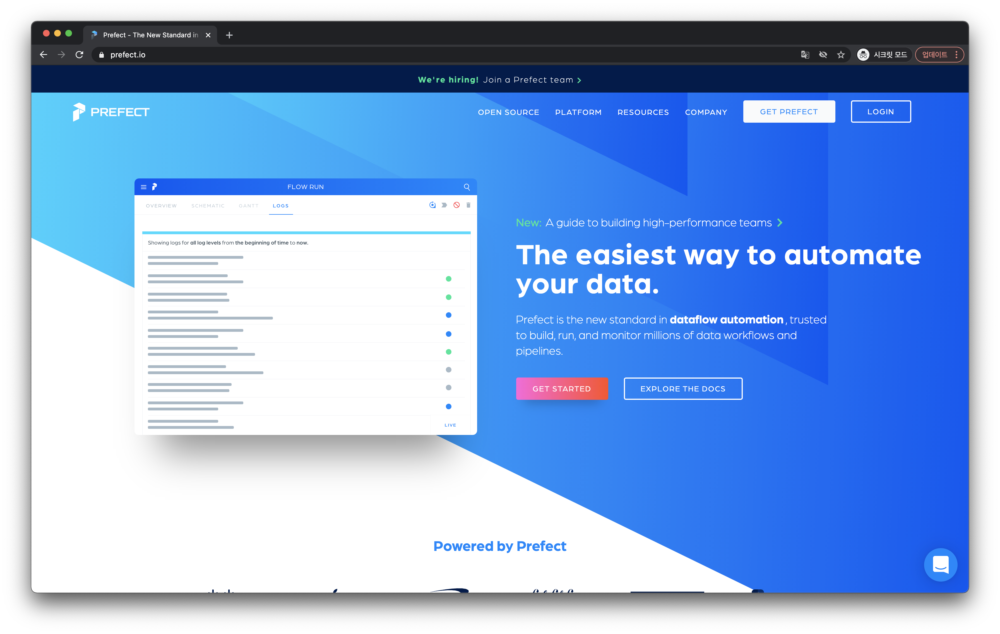


## 사전 준비

- 파이썬 3.8 (나는 3.8.7 을 사용했다.)
- 사용할 가상환경 접속


## 설치

```bash
# 설치
$ pip install prefect

# 버전 확인
$ prefect version
0.14.17
```

아직 1점대가 나오지 않은 걸로 보아... 추후에 많이 바뀔 여지가 있겠다.


## 백엔드 서버 및 에이전트 실행

먼저 로컬에 prefect 와 관련된 세팅을 해보자. 크게 2가지를 세팅해야 한다.

- 백엔드 서버
- 에이전트

먼저 백엔드 서버를 띄워보자.  
Prefect는 두가지 형태로 백엔드 서버를 제공한다.

- 클라우드로 Managed 백엔드 서버
- 직접 호스팅하여 사용할 수 있는 백엔드 서버

여기서 우리는 후자의 선택지인, 직접 백엔드 서버를 로컬에 띄워보자.

```bash
# 클라우드가 아닌 직접 호스팅한 서버를 사용하도록 세팅한다.
$ prefect backend server

# 백엔드 서버를 실행한다.
$ prefect server start
```

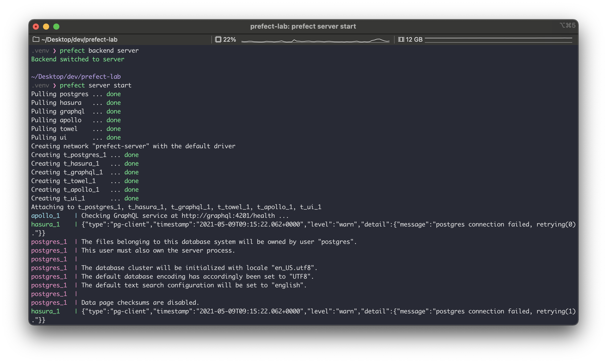

실행하면 백엔드에서 필요한 여러 도커 컨테이너들을 Pull 해온 뒤 Run 시키는 것이 보인다. 이는 아래 도커 명령어로 확인해볼 수 있다.

```bash
$ docker ps
```

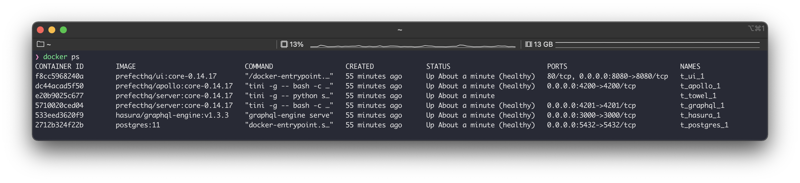

백엔드 서버를 띄웠으므로, 이제 에이전트를 실행해보자. 

```bash
$ prefect agent local start
```

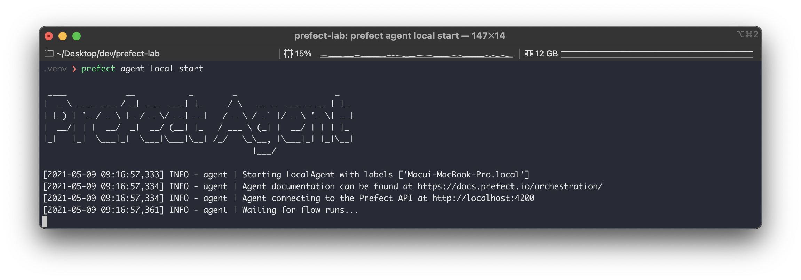

잘 뜬 것을 볼 수 있다.


## 웹 서버 접속

위와 같이 백엔드 서버를 실행시켜두면 브라우저를 통해 `localhost:8080` 에 떠있는 웹서버에 접속할 수 있다. 들어가면 다음처럼 이쁜 대시보드 화면이 나온다.

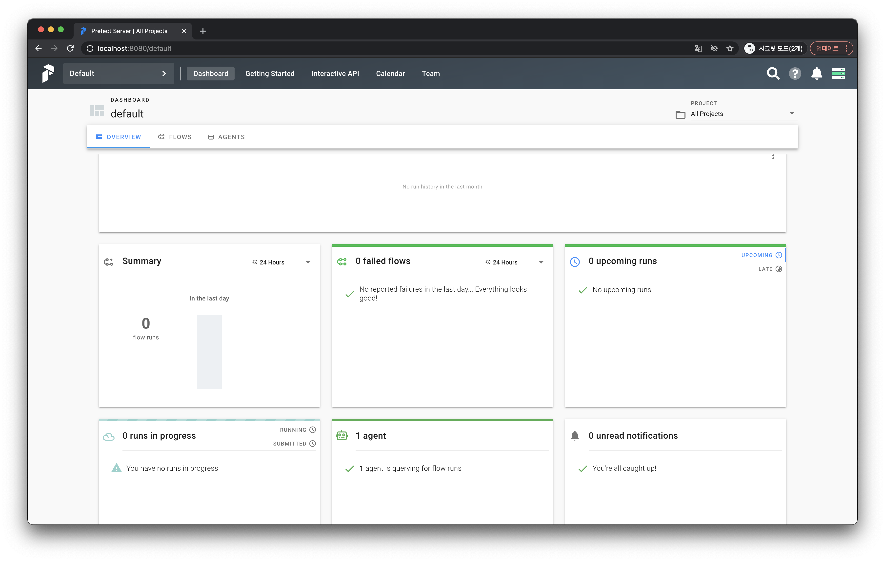

대시보드만 봐도 대충 여러 기능들이 있다는 걸 알 수 있다.  


## 프로젝트 생성

위 대시보드에서 우측 상단에 보면 `PROJECT` 가 보인다. Prefect는 기본적으로 이렇게 프로젝트 단위로 리소스들을 관리할 수 있다. 일단 사용할 프로젝트를 하나 만들어 보자.  
웹 UI에서 생성도 가능하지만, 나는 다음처럼 CLI 명령어로 만들어보겠다.

```bash
$ prefect create project "tutorial"
```

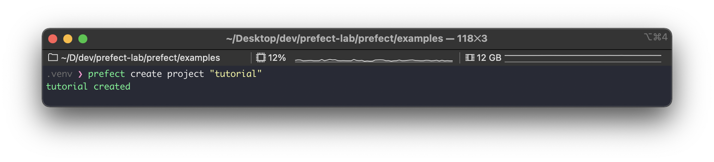

이렇게 만들어진 프로젝트는 다음처럼 웹 대시보드에서도 확인할 수 있다.

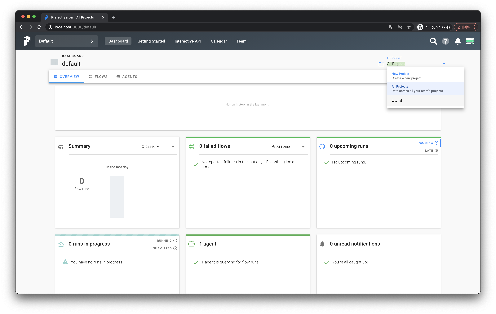


##워크 플로우 작성

이제 파이썬으로 간단한 워크 플로우를 하나 작성해보자.

```python
# hello_flow.py

import prefect
from prefect import task, Flow

# 실행할 테스크를 정의한다.
# 여기서는 함수로 짰지만, 클래스로도 가능하다.
@task
def say_hello():
    logger = prefect.context.get("logger")
    logger.info("Hello, Cloud!")

# 테스크들을 어떻게 실행시킬 지 워크 플로우를 정의한다.
with Flow("hello-flow") as flow:
    say_hello()

# 위 워크 플로우를 프로젝트에 등록한다.
flow.register(project_name="tutorial")
```

이렇게 작성한 코드를 실행한다.

```bash
$ python hello_flow.py
```

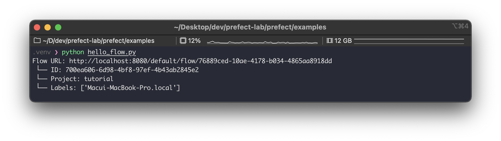

Prefect 프로젝트에 잘 등록되었다는 로그가 등장한다.  

이제 웹서버에 가서 확인해보자.  
`PROJECT` 에서 `tutorial` 프로젝트에 들어간 후 `FLOWS` 탭에 들어가면 아래처럼 위에서 정의한 워크 플로우 (Flow 라고 부른다)가 등장한 것을 볼 수 있다.

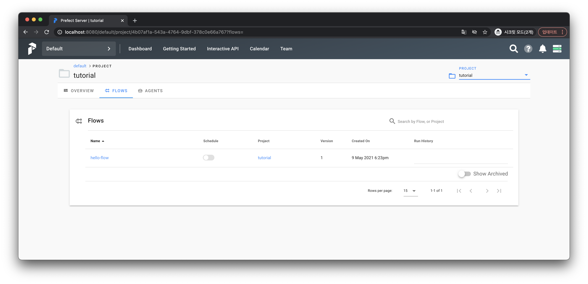


## 워크 플로우 실행

이제 위에 등록된 Flow를 실행해보자. 실행하는 여러 방법이 있겠지만 여기서는 웹 UI를 사용하여 실행해보자.

먼저 위 화면에서 `hello-flow` 를 눌러 Flow 상세 페이지에 들어간다.

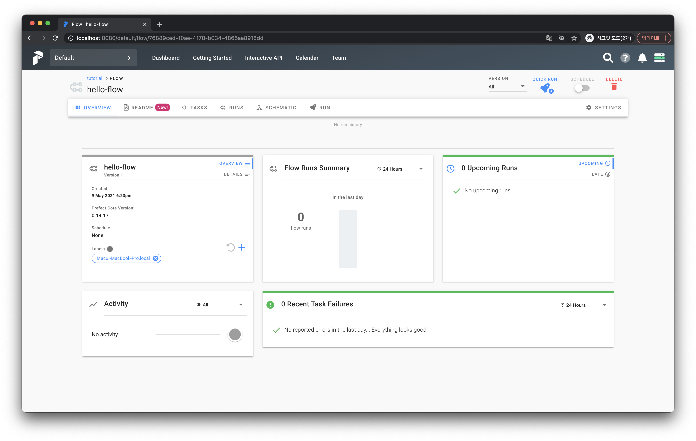

우측 상단에 있는 `QUICK RUN` 버튼을 누른다. 그럼 다음처럼 바로 실행된다.	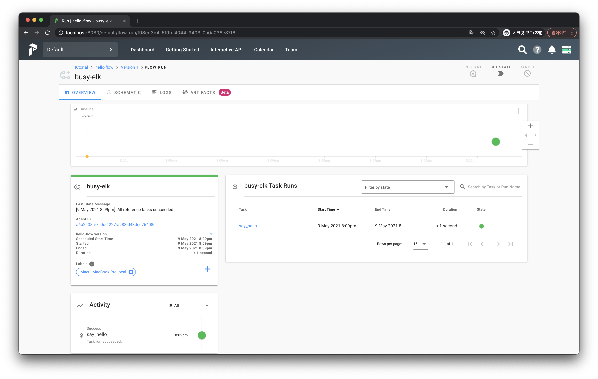

실행은 이 페이지에서 바로 렌더링 된다. (별도의 새로고침을 해서 확인하지 않아도 된다.)  

초록색 표시로 실행이 성공했음을 확인할 수 있다. 언제 실행 되었는지, 실행하는데 얼마나 걸렸는지도 표시된다. 그리고 눈에띄는 점은 실행에는 `busy-elk` 라는 이름이 붙었다는 것이다. 이는 일단 랜덤하게 생성된 것 같다.

Flow 버저닝을 해준 것도 보인다. ( `hello-flow version` 부분)  
워크 플로우 코드를 업데이트할 때마다 이 버전은 2, 3, 4... 이렇게 올라가게 된다.


##워크 플로우 버저닝

워크 플로우 버저닝이 실제로 잘 되는지 확인해보자.  
기존 `hello_flow.py` 코드를 다음처럼 수정하자.

```python
import prefect
from prefect import task, Flow, Parameter

@task
def say_hello(name):
    logger = prefect.context.get("logger")
    logger.info(f"Hello, {name}!")

with Flow("hello-flow") as flow:
    # 파라미터를 정의한다. 
    # 파라미터는 외부에서 주입받는 개념이지만, 기본 값을 설정할 수 있다.
    people = Parameter("people", default=["Arthur", "Ford", "Marvin"])
    
    # 테스크에 각 파라미터를 매핑한다.
    say_hello.map(people)

flow.register(project_name="tutorial")
```

그리고 실행하자.

```bash
$ python hello_flow.py
```

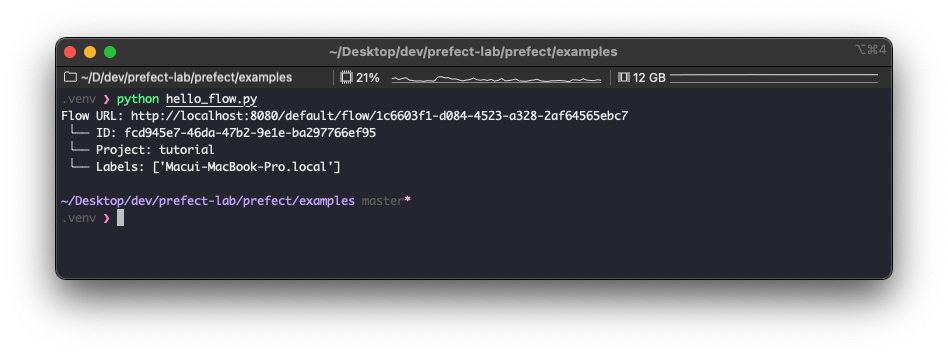

웹 대시보드로 들어가서 확인해보면 아래처럼 `Version 2` 로 버전이 자동으로 업데이트 된 것을 알 수 있다.

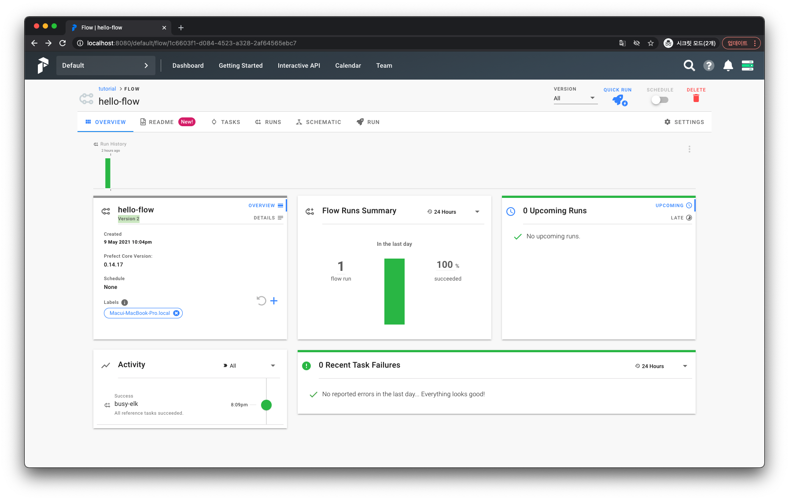


## 워크 플로우 실행 결과 UI 살펴보기

워크 플로우를 실행한 결과를 좀 더 둘러보자.  
먼저 위에서 버저닝 업데이트 한 Flow 를 `QUICK RUN` 버튼을 눌러 실행하고 결과를 보자.

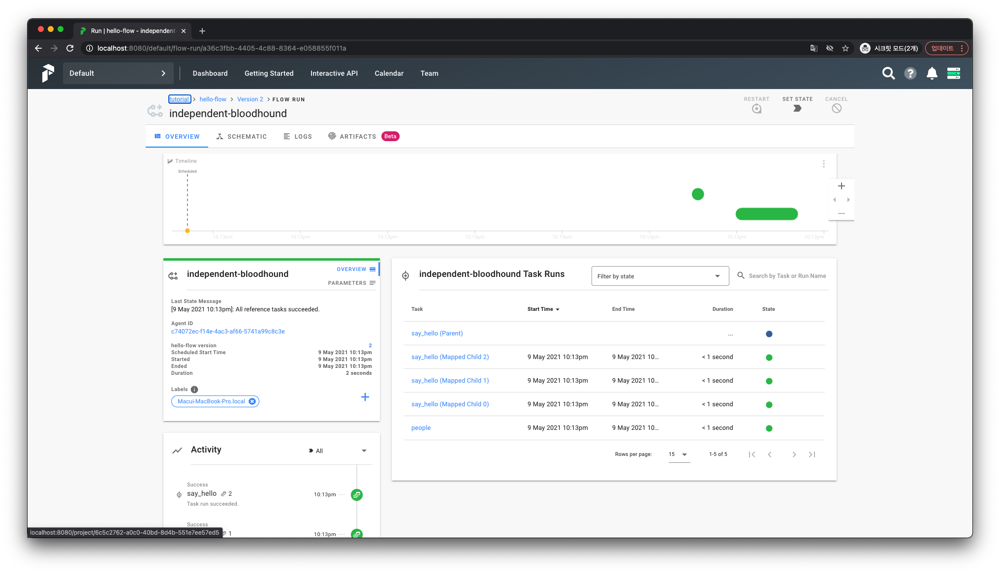

`FLOW RUN` 페이지의 `OVERVIEW` 탭으로 들어가게 되고, 테스크 단위 실행 상태 목록들이 보인다.

`SCHEMATIC` 탭으로 가보면 다음과 테스크를 좀 더 구조적인 형태로 보여준다.

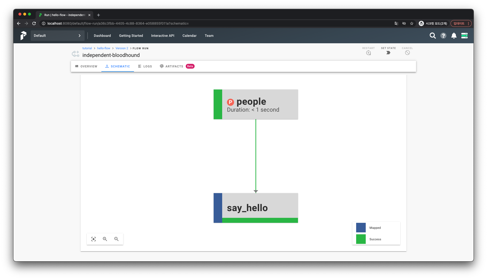

`LOGS` 탭에서는 다음처럼 로그 목록을 이쁘게 보여준다.

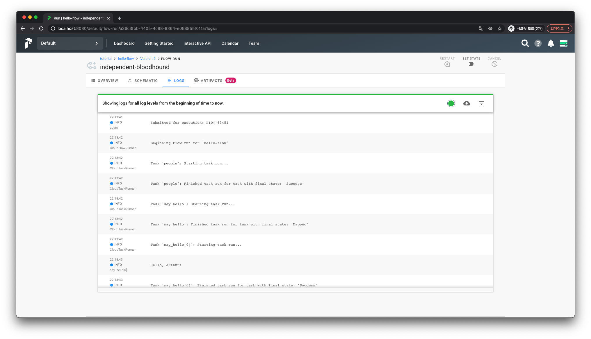

`ARTIFACTS` 탭에 들어가면 아무것도 나오지 않는다.  
아직 실험적인 feature 라고 하는데.. 공식 문서를 봐도 뭔가 명확치는 않아서 일단 넘긴다.

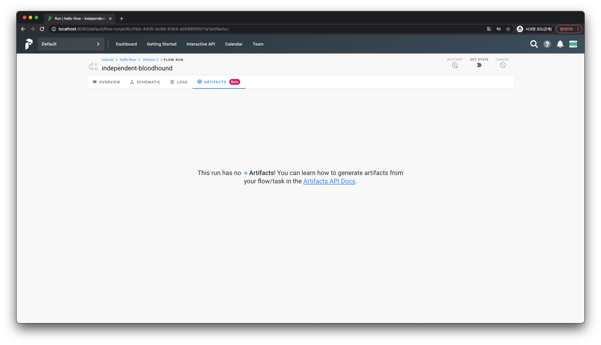

## 워크 플로우 UI 살펴보기

이번엔 워크 플로우 UI를 좀 더 살펴보자.

먼저 `OVERVIEW` 탭은 다음과 같다.  

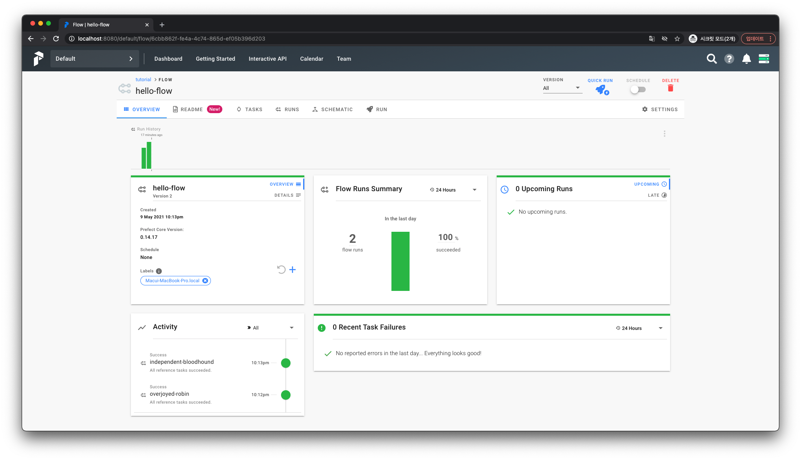

우측 상단에 Version 에 따라 달리 볼 수 있는게 인상적이다.  
또한 Bar Chart 가 타임라인 형태로 되어 있어 지금까지 몇 개의 실행이 있었고, 시간은 얼마나 걸렸는지 한 눈에 파악이 가능하다.  

`README` 탭도 있어서 들어가본다.

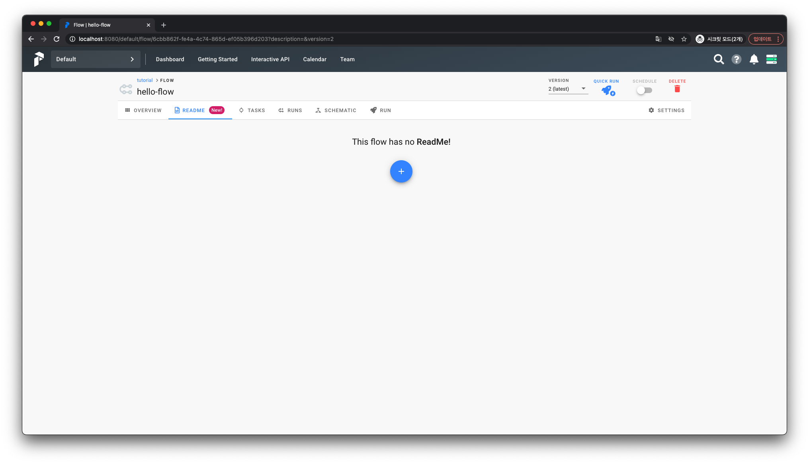

아직 아무 내용이 없다.  
어떻게 작성할 수 있는건지 궁금해서 `+` 버튼을 눌러 작성해봤다.

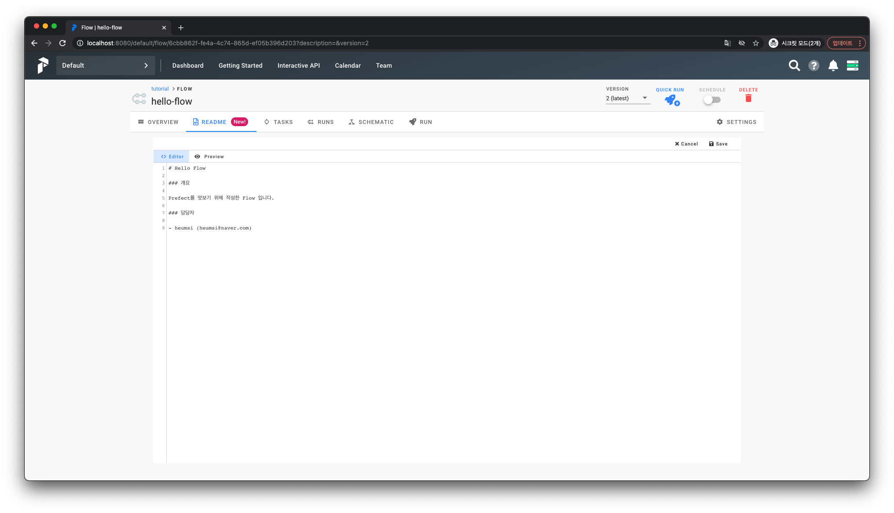

위처럼 마크다운으로 작성할 수 있고, `PREVIEW` 버튼으로 미리 볼 수도 있다.  
작성하여 저장하면 다음처럼 뜬다.

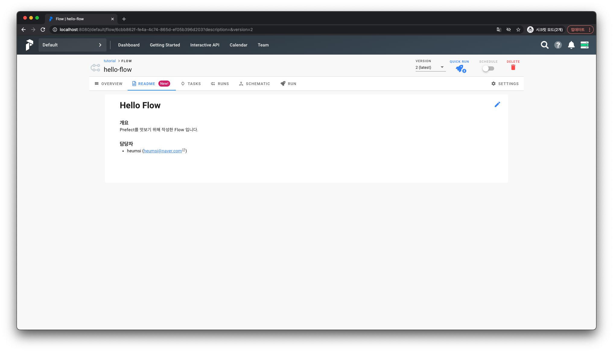

`TASK` 탭에서는 이 워크 플로우의 특정 버전에 있는 테스크들이 나열된다.

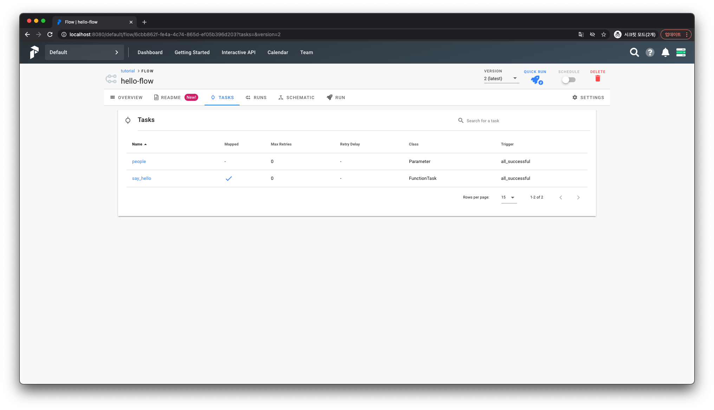

`RUNS` 탭에는 지금까지 실행된 데이터들이 나열된다.

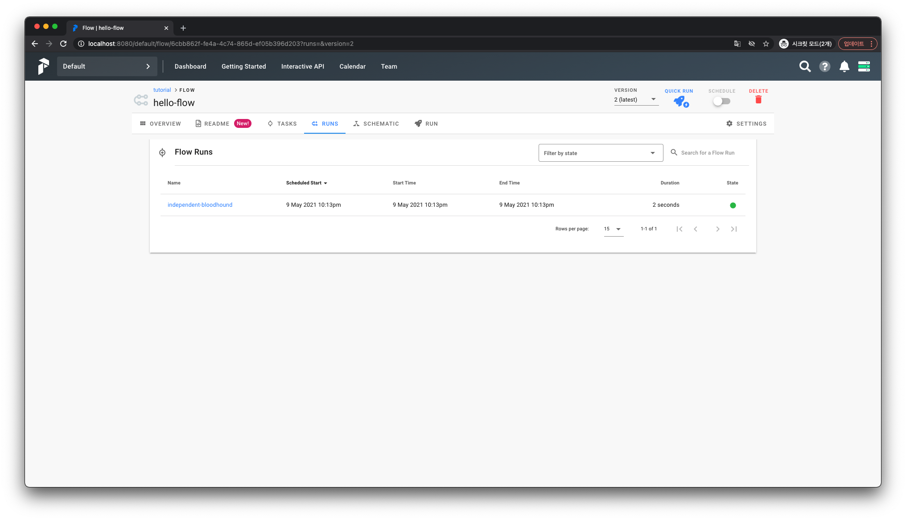

`SCHEMATIC` 에는 이전에 워크 플로우 실행 결과 UI 에서 보았던 `SCHEMATIC` 처럼 워크 플로우를 도식화하여 그려준다. 다만 실행에 대한 상태는 없다.

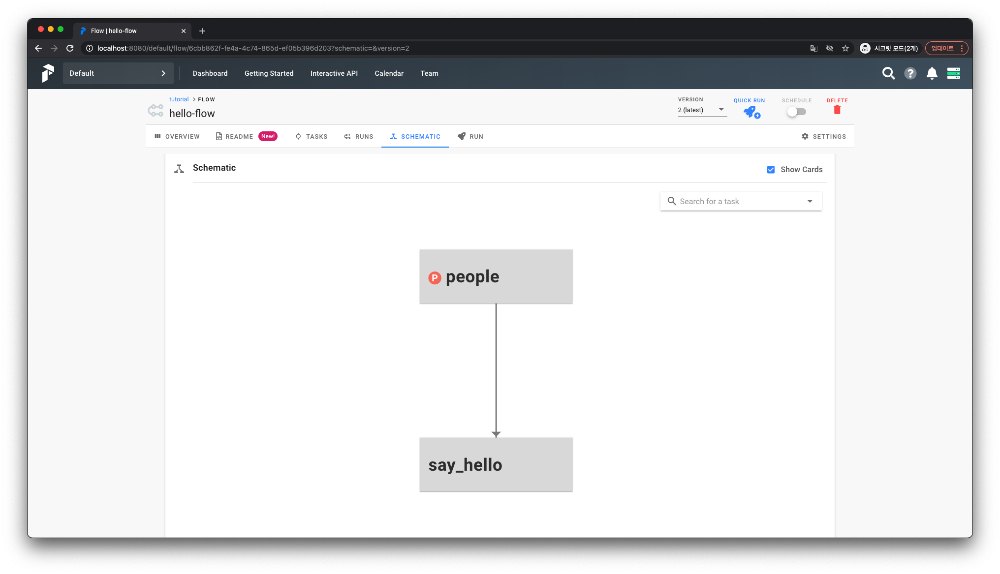

`RUN` 탭에는 이 워크 플로우를 실행해볼 수 있다.  
이 때, 실행에 추가적으로 들어가거나 필요한 입력 등을 받을 수 있다.

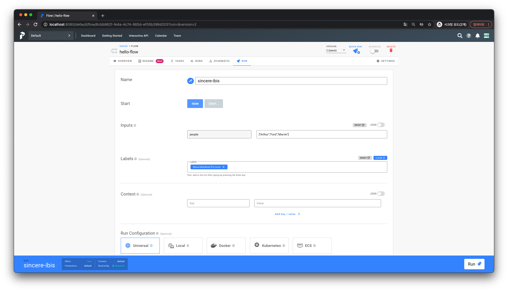

특히 `Start` 항목에서 `later` 버튼을 누르면 아래처럼 달력이 나오는 UI가 아주 인상적이다.

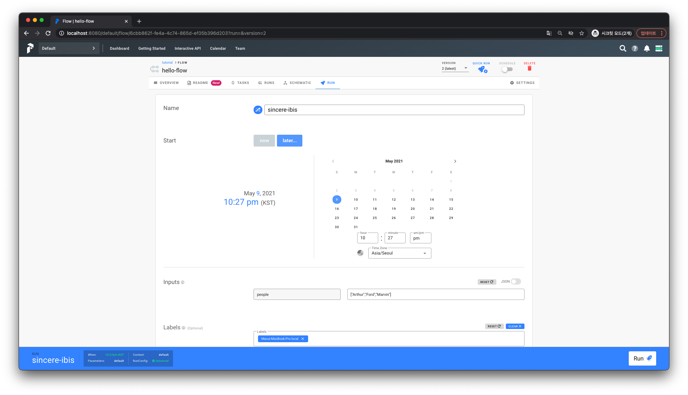

`SETTINGS` 탭에서는 다음과 같은 별도의 설정들을 할 수 있다.  
일단은 뭔지 모르겠으니 보기만 하고 넘어간다.

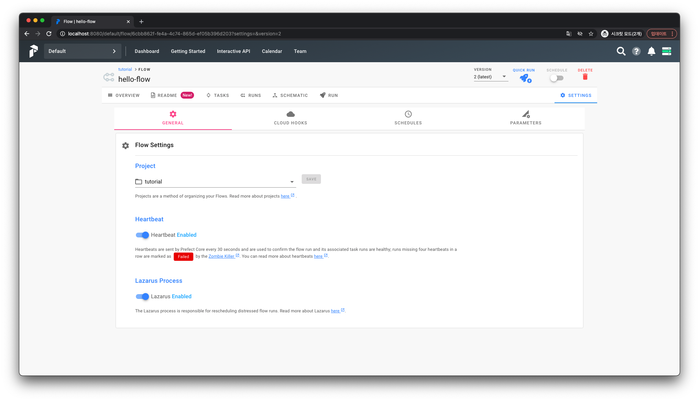


## 정리

- Prefect는 크게 Backend Server, Agent 로 돌아간다.
    - 물론 Backend Server가 단순히 서버 하나만 돌아가는 건 아니고, 데이터베이스 등 여러 도커 컨테이너를 동시에 띄운다.
    - 서버를 띄우면 브라우저를 통해 웹 대시보드에 들어갈 수 있다.
    - Agent는 실제 워크 플로우 (Flow) 를 돌리는데 필요하다.
- 워크 플로우를 파이썬 코드로 작성한다.
    - `prefect` 패키지의 `task`, `Flow`, `Parameter` 등을 사용한다.
    - 작성된 코드는 별도의 함수 혹은 명령어로 백엔드에 등록한다.
    - 이렇게 작성된 워크 플로우는 Flow 라고 부른다.
    - Flow 코드를 수정하여 다시 등록할 때마다 버전이 자동으로 업데이트 된다.
- 웹 UI에서 워크 플로우를 실행하고 결과를 확인할 수 있다.
    - README, 로그 확인, 테스크 확인 등 여러가지 일을 할 수 있다.


## 후기

회사에서 에어플로우 1.10.14 버전을 쓰고있다. 아마 에어플로우를 일년 이상 운영해보신 분들은 비슷하게 느낄거 같은데, 2만개가 넘는 스타 수를 가진 프로젝트 치고는 뭔가 불편한게 많다. 처음에는 별로 못느낄 수 있는데 에어플로우가 처리하는 DAG 수가 늘어날 수록 점점 느껴진다. 에어플로우 2.0이 나오기는 했지만 UI는 여전히 불편한거 같고 (크게 바뀌지도 않은거 같다.), 뭔가 이를 커스텀해놓은 써드파티가 있을거 같기도 한데.. 없다.

Prefect를 만든 사람들 역시 에어플로우의 불편함을 느꼈다고 한다. 이런 불편함을 해결할 대안을 Prefect를 만들며 많이 고민한 거 같다. 이에 대한 내용은 [Prefect 블로그에 있는 "Why Not Airflow?"](https://docs.prefect.io/core/getting_started/why-not-airflow.html) 를 읽어보면 알 수 있다. 나는 이렇게 비교적 최근에 만들어진 워크 플로우 툴인 prefect가 에어플로우랑 어떻게 다른지 맛보고 싶었다. 

위에서 정리한 내용은 사실 Prefect 공식 홈페이지에 Tutorial 로 있는 문서 내용 그대로다. 발만 걸쳐서 진짜 그냥 살짝 맛보기만 해본 수준이다. (길어야 1~2시간 이리저리 써보고 정리한 것이다.)  
잠깐만 사용해봤음에도 개발과 운영을 모두 고려하여 개발했다는 게 확 느껴졌다. 사실 아직 메이저 버전도 등장하지 않았고, 에어플로우보다 인지도도 높지 않지만 충분히 에어플로우의 대안으로 고려해볼만하단 생각이 들었다. 특히 다음 점들이 마음에 들었다.

- 웹 UI가 매우 직관적이고, 운영에 필요한 내용들이 대시보드에 있다. 
    - 현재 워크 플로우들 중 실패한 게 있는지, 워크 플로우를 실행하는데 얼마나 걸렸는지가 한 눈에 들어온다.
    - 웹 UI에서 바로 테스트 가능한 것도 아주 매력적이다.
- 팀, 프로젝트 단위로 워크 플로우 관리가 가능하다.
    - 에어플로우는 메인 페이지에 모든 마운트된 DAG을 다 노출시키는데, 이게 아주 극혐이다.
    - 팀, 프로젝트로 워크 플로우를 나누고, 보고 싶은 워크 플로우만 볼 수 있다.
- 워크 플로우 작성과 등록이 별게로 있다.
    - 에어플로우는 마운트 된 DAG 폴더를 주기적으로 파싱하며 새로운 DAG이 있나 확인하는데, 이 때문에 스케쥴러의 CPU 사용량이 계속해서 높다. DAG의 개수가 늘어나면 부하는 점점 더 높아진다. 이것도 역시 극혐이다.
    - 반면 Prefect는 워크 플로우 작성과 등록이 별게로 있다. 등록은 원할 때 하면 된다. 에어플로우 스케쥴러가 하는 짓(무한 루프를 돌며 DAG을 계속 파싱하는 일)을 하지 않는다. 등록할 때마다 워크 플로우 버저닝도 알아서 해주는 것도 아주 매력적이다.

뭐 이외에 더 있을텐데 일단 그냥 생각나는 것만 적었다. 여하튼 결론만 말하자면, 다음에 워크 플로우 툴을 도입한다면 에어플로우 보단 Prefect를 좀 더 조사해보고 사용해볼거 같다.

Quick Review는 이걸로 끝이지만, 추후 시간이 날 때 틈틈이 더 써보고 정리해볼 예정이다.


## 참고

- https://docs.prefect.io/

