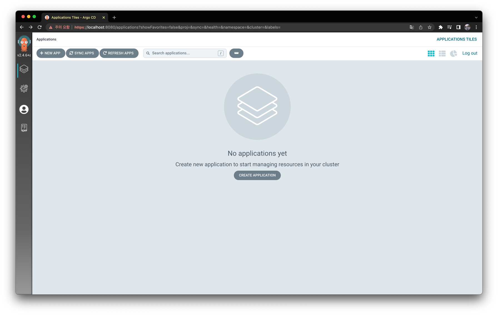
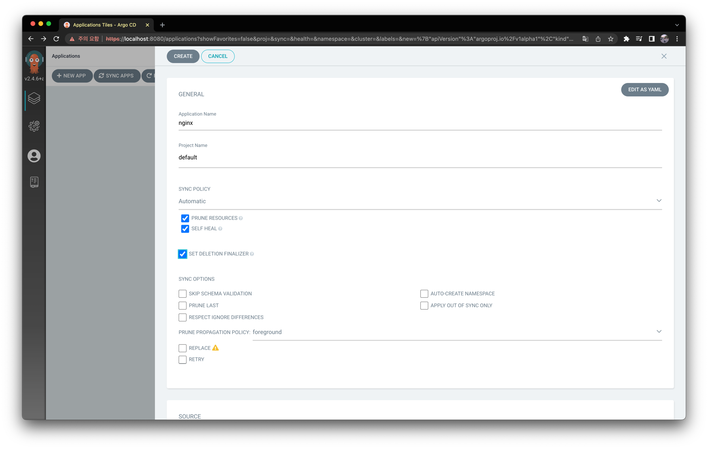
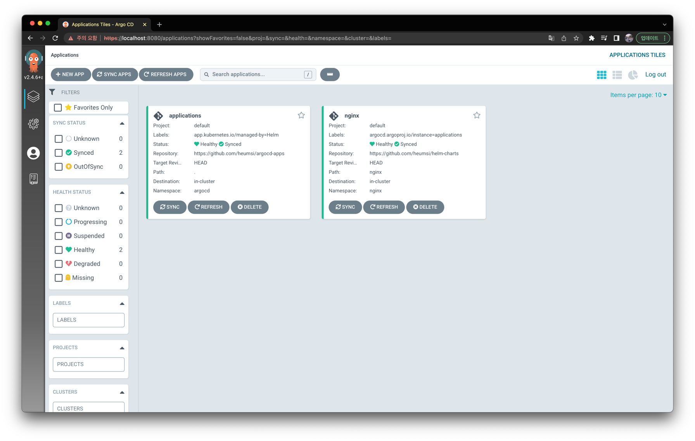
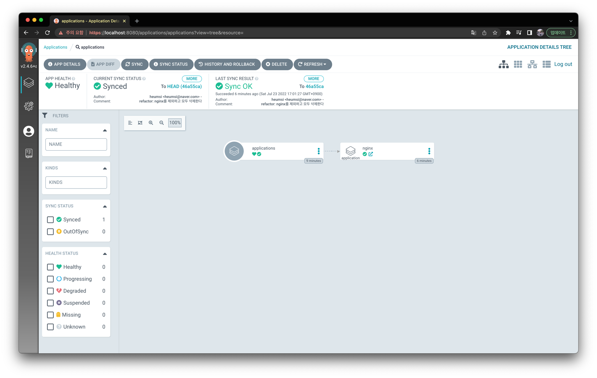
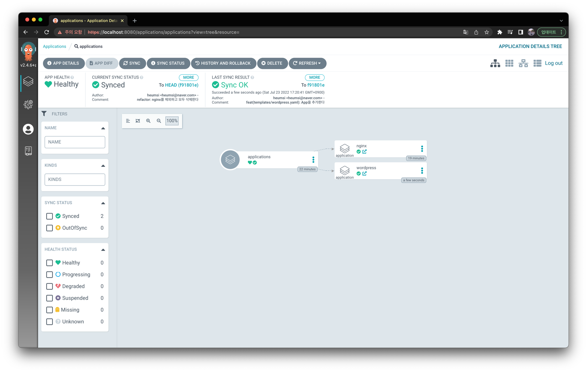
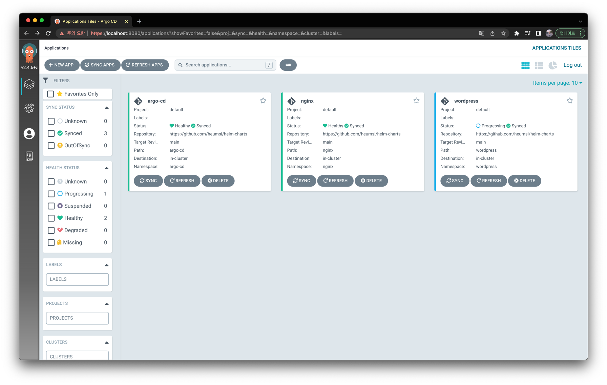

## 들어가며

Argo CD는 내게 GitOps와 Single Source of Truth의 개념을 알려준 매우 멋진 도구다.
여기서 배운 GitOps를 나는 App 배포 뿐 아니라 팀의 문서나 모든 Desired 한 상태 관리에 쓰면 어떨까라고 생각했으니,
Kubernetes의 선언적 배포 개념을 알게 된 이후, Argo CD는 일하는 방식에 대해 내게 정말 큰 임팩트를 준거같다.

이번 글에서는 Argo CD를 통해 GitOps로 App을 배포하는 다음 두가지 방법에 대해 적어본다.

- App of Apps 패턴
- ApplicationSet

Argo CD에 대한 기본적인 설명은 이 글에서 다루지 않는다. 
Argo CD에 대해 이미 알고있으며, 이를 좀 더 잘 사용하고 싶은 분들을 대상으로 글을 적어본다.

> 만약 Argo CD가 처음이고 관심이 있다면, [커피고래님의 블로그 글](https://coffeewhale.com/kubernetes/gitops/argocd/2020/02/10/gitops-argocd/)을 읽어보기를 추천한다. 
> Argo CD가 무엇이고 기본적으로 어떻게 사용하는지 아주 잘 나와있다. 

## Web UI 배포의 문제

먼저 Argo CD에서 Web UI를 통해 App을 배포하는 과정을 리뷰해보자.

Argo CD를 배포하면 다음과 같은 Web UI를 이용할 수 있다.



Argo CD를 처음 접하게 되면, 보통은 다음처럼 이 Web UI를 통해서 App을 배포하게 된다. 



쉽고 간편하다.

하지만 이렇게 App을 배포하는건 문제가 하나 있는데, 바로 App을 배포하는 과정이 GitOps 스럽지 않다는 것이다.
좀 더 구체적으로는 다음과 같은 문제가 있다.

- App을 배포하는 과정이 Git에 남지않고 암묵적이다. 
- 다른 팀원들은 내가 클러스터에 어떤 App을 배포하는지 커밋 내역으로 알 수 없다.
- 현재 클러스터의 App 배포 상태를 재현할 수 있는 소스나 코드가 없다.
- 만약 클러스터를 새로 만들어, 이전 클러스터의 모든 App을 다 옮겨가야한다고 하자. 일일이 Web UI에서 버튼을 누르며 App을 다시 배포해야할까?

여하튼 이런 문제의식으로 등장한 대안이 다음 두 방법이다.

- App of Apps 패턴을 통한 배포
- ApplicationSet 리소스를 통한 배포

두 방법 모두 Web UI를 사용하여 App을 배포하지 않는다. 모두 yaml 파일을 먼저 작성하고, Git 커밋을 남기며 선언적으로 배포한다.
Web UI는 단순히 앱 배포 상태에 대한 Viewer의 역할만 하게된다.

이제 이 두 방법을 하나씩 알아볼 것이다.

> GitOps를 들여다보면, 소프트웨어 아키텍처에서 종종 등장하는 Command와 Query 분리하는 방법론(CQRS)이 떠오른다.
> GitOps에서는 상태 변화를 주는 모든 Command는 Git 커밋으로 진행되어야 한다.
> 그리고 상태를 조회하는 모든 Query는 이 Git Repository를 Source로 이뤄져야 한다.
> 
> Command와 Query를 명확히 분리하면서 시스템은 좀 더 복잡해지긴 하지만, 유즈케이스는 좀 더 명확해지고,
> 컴포넌트가 좀 더 디커플링 되면서 전체적으로 더 유연하고 다양한 변화가 가능한 방식이라는 생각이 든다.


## Application Custom Resource

우리가 Argo CD로 App을 배포하면 Application이라고 하는 CR(Custom Resource)을 만들게 된다.

직접 확인해보자. Argo CD Web UI에서 다음처럼 nginx를 배포한다.


그리고 Argo CD가 배포된 Namespace에서 Application 리소스를 조회해본다.

```bash
$ kubectl get applications

NAME    SYNC STATUS   HEALTH STATUS
nginx   Synced        Healthy
```

`nginx` 라는 이름의 Application 리소스가 생성되어 있다.

어떻게 생겼는지 한번 살펴보자.

```yaml
$ kubectl get applications nginx -o yaml

apiVersion: argoproj.io/v1alpha1
kind: Application
metadata:
  creationTimestamp: "2022-07-20T14:50:01Z"
  finalizers:
  - resources-finalizer.argocd.argoproj.io
  generation: 268
  name: nginx
  namespace: argocd
  resourceVersion: "419286"
  uid: fd68a5d8-0b25-44e8-876a-78dbe17ee617
spec:
  destination:
    namespace: nginx
    server: https://kubernetes.default.svc
  project: default
  source:
    path: nginx
    repoURL: https://github.com/heumsi/helm-charts
    targetRevision: HEAD
  syncPolicy:
    automated:
      prune: true
      selfHeal: true
    syncOptions:
    - Validate=false
    - CreateNamespace=true
status:
  ...
```

이 Application 리소스에서 주요한 부분은 `spec` 내 다음 세 부분이다.

- `source` 
  - 배포할 소스를 지정한다.
  - Github Repository 주소와 경로 또는 Helm Repository 주소가 들어간다.
- `destination`
  - 배포할 환경을 지정한다.
  - 이 Argo CD는 클러스터 내에 배포되어있으므로, `https://kubernetes.default.svc` 로 배포한다는 것은, Argo CD가 배포된 이 클러스터에 배포하겠다는 의미다.
- `syncPolicy`
  - 배포 이후 Sync에 사용할 옵션에 대해 지정한다.

이 값들은 우리가 Web UI에서 App을 생성할 때 입력해준 값들이다.

정리해보면, 우리가 Web UI에서 배포한 리소스는 이 Application 리소스다.
Web UI를 통해 Application 리소스 생성에 필요한 값들을 입력받고, 이를 기반으로 Application 리소스를 만들어 배포하게 된다. 
그리고 이 Application 리소스는 Application Controller에 의해 Soruce Repo를 기반으로 Kubernetes 리소스들을 배포하게 된다.

이 Application 리소스만 잘 작성한 뒤 클러스터에 배포해도 Argo CD Web UI에서 App을 배포한 것과 것과 동일한 효과를 가지며,
Web UI에서도 볼 수 있다.

## Applications in Argo CD Helm Chart

이제 App을 배포한다는 것은 곧 Application 리소스를 배포한다는 것임을 알았다.

그럼 어떻게 하면 이 Application을 GitOps 스타일로 배포 할 수 있을까?
어떻게 하면 현재 클러스터에 배포된 Application들을 Github Repository에 Single Soruce of Truth로 담을 수 있을까?

일단 첫 번째로 생각할 수 있는 방법은 Argo CD Helm Chart 내에 Application을 추가하는 것이다.
Chart 내 `values.yaml` 을 살펴보면 다음처럼 `server.additionalApplications` 항목이 있다.
바로 이 부분에 Argo CD를 배포하면서 같이 배포할 Application들을 추가하면 된다.
(주석으로 어떻게 추가하는지 안내가 되어있다.)

```yaml
# argo-cd/values.yaml

additionalApplications:
- name: nginx
  additionalLabels: {}
  additionalAnnotations: {}
  finalizers:
  - resources-finalizer.argocd.argoproj.io
  project: default
  source:
    repoURL: https://github.com/heumsi/helm-charts
    targetRevision: HEAD
    path: nginx
  destination:
    server: https://kubernetes.default.svc
    namespace: nginx
  syncPolicy:
    automated:
      prune: true
      selfHeal: true
    syncOptions:
    - Validate=false
    - CreateNamespace=true
```

또한 `source.repoURL` 의 값인 `https://github.com/heumsi/helm-charts` 에 접근하기 위해 다음처럼 Credentials 정보도 추가해줘야 한다.
`values.yaml` 를 살펴보면 `config.credentialTemplates` 항목이 있다. 이 부분에 다음처럼 Credentials 정보를 추가하자.

```yaml
# argo-cd/values.yaml

credentialTemplates: 
  https-creds:
    url: https://github.com/heumsi
    password: ghp_xxxx  # Github access token 값을 넣어주면 된다.
    username: heumsi
```

이제 Chart를 다시 배포하면 Argo CD와 더불어 위에서 추가한 Application 리소스도 같이 생성된다.

```bash
$ kubectl get apps -n argocd   
            
NAME    SYNC STATUS   HEALTH STATUS
nginx   Synced        Healthy
```

이제 이 Argo CD Helm Chart는 클러스터 내 Application 배포 상태 정보까지 포함하게 되었다.
새로운 Kubernetes 클러스터를 만든 뒤 이전 클러스터 내 App들을 옮겨가야할 때, 그저 이 Argo CD Helm Chart만 배포하면 되는 것이다!

## App of Apps 패턴

그런데 위처럼 배포할 경우 또 찜찜한게 몇가지 있는데 바로 다음의 것들이다.

- 클러스터 내에 Application을 추가할 때 마다 그럼 `values.yaml` 을 수정해야 하나? 배포하는 Application이 한두개가 아닐거고, 그럼 안그래도 비대한 `values.yaml` 이 더 엄청 비대해질텐데?
- 그리고 실제로 Argo CD 배포 자체는 `helm` 으로하고 있지 않나? 그럼 Application 을 리소스를 추가할 때마다 `helm upgrade` 명령어를 쳐야하나? 
  이 클러스터 내 App 배포 상태가 `values.yaml` 에 남는 건 맞기는 한데, 하지만 배포 방식에서 여전히 커맨드 라인 명령어를 치고있잖아?

특히 전자의 찜찜함을 풀 수 있는 방법이 바로 App of Apps 패턴을 이용하여 배포하는 것이다.

App of Apps는 이름 그대로 Application 안에 Application들을 담는 방법이다.
Application은 사실 그냥 yaml 파일로 직접 작성한 후 배포해도 전혀 문제가 없다고 했다.
그러면 배포하고자 하는 Helm Chart의 templates 안에 Application 리소스들을 가지고 있다면 어떻게 될까?
일반적인 Helm Chart 배포와 마찬가지로 Chart를 배포하면 templates 내 Application들이 모두 같은 Chart로 엮여 배포된다.

한번 실습해보자.
먼저 별도의 `argocd-apps` 라는 별도의 Github Repository를 만든다. 
이 Repository에 Kubernetes 클러스터에 배포할 Helm Chart(Application 들을 담은)를 다음과 같이 담을 예정이다.

```yaml
.
├── Chart.yaml
├── templates
│   ├── argocd.yaml
│   ├── nginx.yaml
└── values.yaml
```

`Chart.yaml` 를 다음처럼 작성한다.

```yaml
# Chart.yaml

apiVersion: v2
name: applications
description: root app for app of apps pattern.
type: application
version: 0.1.0
appVersion: "1.16.0"
```

`version` 이나 `appVersion` 은 여기서는 의미없다. 굳이 의미를 부여한다면, 클러스터의 App 배포 상태에 대한 버전 정도라 볼 수 있을 듯 하다.
(다만 이럴 경우, 이 Chart 내 수정이 일어날 때마다 매번 버전도 같이 수정해줘야 의미가 있다. 이런건 자동화 하는게 좋겠으나, 일단 이 글에서는 별 의미를 두지 않고 넘어간다.)

`templates` 폴더를 만들고, 이 안에 이제 Application 리소스를 추가하자.

먼저 `templates/nginx.yaml` 를 만들어 다음처럼 작성한다.

```yaml
# templates/nginx.yaml

apiVersion: argoproj.io/v1alpha1
kind: Application
metadata:
  name: nginx
  namespace: argocd
  finalizers:
  - resources-finalizer.argocd.argoproj.io
spec:
  # The project the application belongs to.
  project: default
  
  # Source of the application manifests
  source:
    repoURL: {{ .Values.spec.source.repoURL }}
    targetRevision: HEAD
    path: nginx

  # Destination cluster and namespace to deploy the application
  destination:
    server: {{ .Values.spec.destination.server }}
    namespace: nginx
  
  # Sync policy
  syncPolicy:
    {{- .Values.spec.syncPolicy | toYaml | nindent 4 }}
```

우리가 이전에 작성한 Application 별반 다르지 않다. 
다만 Helm의 Template 문법을 이용하여 재사용할 값들은 따로 빼두었다.

이제 재사용할 값들을 `values.yaml` 를 만들어 작성하자.
이 Chart내에 있는 모든 Application들은 특별한 예외가 있지 않은 이상, 이 `values.yaml` 값들을 가져다 사용하자고 약속하자.
(이는 일종의 운영 정책인 셈이다.)

```yaml
# values.yaml

spec:
  destination:
    server: https://kubernetes.default.svc
  source:
    repoURL: https://github.com/heumsi/helm-charts
  syncPolicy:
    automated:
      prune: true
      selfHeal: true
    syncOptions:
    - Validate=false
    - CreateNamespace=true
```

이제 위에서 작성한 Helm Chart를 Argo CD Helm Chart의 `values.yaml` 내 `additionalApplications` 에 다음처럼 추가하자.

```yaml
# argo-cd/values.yaml

additionalApplications: 
- name: applications
  additionalLabels: {}
  additionalAnnotations: {}
  finalizers:
  - resources-finalizer.argocd.argoproj.io
  project: default
  source:
    repoURL: https://github.com/heumsi/argocd-apps
    targetRevision: HEAD
    path: .
  destination:
    server: https://kubernetes.default.svc
  syncPolicy:
    automated:
      prune: true
      selfHeal: true
    syncOptions:
    - Validate=false
    - CreateNamespace=true
```

이름은 `applications` 라 하였다.
이 Application은 Chart 내 다른 Application들을 품고있기 때문에, Root Application이라 부를 수 있을거 같다. 

이제 Argo CD Helm Chart를 다시 배포하자. 
그러면 다음처럼 Root Application인 `applications` 도, 그리고 그 안에 속한 `nginx` 도 잘 배포된 것을 확인할 수 있다.

```bash
$ kubectl get apps

NAME           SYNC STATUS   HEALTH STATUS
applications   Synced        Healthy
nginx          Synced        Healthy
```



`applications` 을 클릭하면 다음처럼 `nginx` 가 `applications` 의 자식 리소스로 포함되어 있는 것도 볼 수 있다.



만약 클러스터 내에 App을 또 배포하고싶으면 어떻게 하면 될까?
이제는 그저 `argocd-apps/templates` 내에 Application를 추가하면 된다.

예를 들어 Wordpress를 추가로 배포하고싶다고 해보자.
그러면 `argocd-apps` Github Repository에 Application를 추가하면 된다.
(이 과정은 branch에 바로 push하는 형태일 수도 있고, PR & Merge 방식일 수도 있다. 후자의 경우, 다른 팀원들에게 배포에 대해 리뷰받을 수 있는 구조가 된다.)

```yaml
# templates/wordpress.yaml

apiVersion: argoproj.io/v1alpha1
kind: Application
metadata:
  name: wordpress
  namespace: argocd
  finalizers:
  - resources-finalizer.argocd.argoproj.io
spec:
  # The project the application belongs to.
  project: default
  
  # Source of the application manifests
  source:
    repoURL: {{ .Values.spec.source.repoURL }}
    targetRevision: HEAD
    path: wordpress

  # Destination cluster and namespace to deploy the application
  destination:
    server: {{ .Values.spec.destination.server }}
    namespace: wordpress
  
  # Sync policy
  syncPolicy:
    {{- .Values.spec.syncPolicy | toYaml | nindent 4 }}
```

Argo CD에서는 곧 새로 추가된 Application를 인지하여 Sync하게 되고, 다음처럼 Application를 조회하면 추가된 `wordpress` 을 확인할 수 있다.

```bash
$ kubectl get apps

NAME           SYNC STATUS   HEALTH STATUS
applications   Synced        Healthy
nginx          Synced        Healthy
wordpress      Synced        Progressing
```



> 이미 배포되어 있는 Argo CD에 대해서도 Application을 추가하여 연동할 수 있다.
> 배포하는 방법은 위와 똑같고, 배포하면 다음처럼 application 으로 리소스가 잡힌다.
> 
> ```bash
> $ kubectl get apps            
>
> NAME           SYNC STATUS   HEALTH STATUS
> applications   Synced        Healthy
> argocd         Synced        Healthy
> nginx          Synced        Healthy
> wordpress      Synced        Healthy
> ```
> 
> 이렇게 Argo CD 역시 Application으로 연동해두면, Argo CD Helm chart 내 변경 사항이 있을 때 마다 helm 커맨드 라인 명령어를 치지 않아도 된다.
> 이는 위에서 언급한 두 번째 찜찜함을 해결해준다.
> 
> 다만 이럴 경우 나중에 Argo CD 자체를 삭제할 때 순서가 꼬일 수 있음에 유의하자.
> `kubectl delete apps argocd` 로 Application을 삭제하면, 클러스터 내 배포된 Argo CD가 모두 내려가게 된다.
> 이 결과로, 다른 application의 삭제를 처리해줄 Application Controller도 사라지기 때문에 남은 Applicaiton 들은 finalizer를 수정하며 일일이 직접 삭제해줘야 한다.

이런 식으로 Application 추가가 곧 새로운 App에 대한 배포가 되고, 이런 과정은 모두 GitOps 형태로 동작한다.

이를 좀 더 잘 활용하면 멀티 클러스터 환경에서 클러스터 단위로 Application 들을 묶을 수도 있다.
루트 Appliation을 클러스터 단위로 두는 것이다.

예를 들어 클러스터 A, B, C, D가 있다고하자. 그러면 `argocd-apps` Repository를 다음처럼 구성할 수 있다.

```
.
├──cluster_a
│   ├──Chart.yaml
│   └──templates
│       └── nginx.yaml
├──cluster_b
│   ├──Chart.yaml
│   └──templates
│       └── nginx.yaml
├──cluster_c
│   ├──Chart.yaml
│   └──templates
│       └── nginx.yaml
└──cluster_d
    ├──Chart.yaml
    └──templates
        └── nginx.yaml
```

만약 멀티 클러스터 환경에서 Argo CD를 클러스터 외부에서 배포했다면, Argo CD Helm Chart 내 `values.yaml` 에 `additionalAppplications` 항목에
클러스터 개수 만큼 Root Application을 추가해주면 된다. 
이 Root Application들의 Source Repository의 Path는 위 `argocd-apps` Repository에서의 cluster 경로가 되겠다.

반면 클러스터 별로 각각 Argo CD가 배포되어 있다면, `values.yaml` 을 `values.cluster_a.yaml`, `values.cluster_b.yaml` 이런 식으로 
클러스터 별로 `values.yaml` 을 만든 뒤 각 파일에서 `additionalAppplications` 에 Root Application을 하나만 두면 된다.

꼭 클러스터가 아니더라도, Root Applcation의 기준을 무엇으로 두느냐에 따라 다양하게 Application들을 묶을 수 있다.

## ApplicationSet

App of Apps는 사용 패턴이다. 
이 말인 즉슨, Argo CD 사용자들이 Application 이라고 하는 리소스를 가지고, 
배포를 좀 더 쉽게할 수 있는 방법을 찾다보니 사용자들에 의해 나오게 된 방법론이라는 것이다.

반면 ApplicationSet은 Argo CD 리소스다.
App of Apps 패턴을 보고 Argo CD 개발팀이 영감을 받아 추가적으로 개발한 결과물이다.
Argo CD v2.3 버전 이전에는 별도의 Plugin으로 존재하다가, v2.3부터 Argo CD Helm Chart에 합류되었다.

App of Apps 패턴을 이해했다면, ApplicationSet에 대한 이해도 별로 어렵지 않다.
다음은 ApplicationSet의 사용 예시다.

```yaml
# applicationset.yaml

apiVersion: argoproj.io/v1alpha1
kind: ApplicationSet
metadata:
  name: applicationset
  namespace: argocd
spec:
  generators:
    - git:
        repoURL: https://github.com/heumsi/helm-charts
        revision: main
        directories:
          - path: "*"
  template:
    metadata:
      name: '{{path.basename}}'
    spec:
      project: default
      syncPolicy:
        automated:
          prune: true
          selfHeal: true
        syncOptions:
        - Validate=false
        - CreateNamespace=true
      source:
        repoURL: https://github.com/heumsi/helm-charts
        targetRevision: main
        path: '{{path}}'
      destination:
        server: https://kubernetes.default.svc
        namespace: '{{path}}'
```

간략히 설명하자면, `https://github.com/heumsi/helm-charts` Repository의 `main` 브랜치에 있는 모든 파일들에 대해 Application 리소스를 생성한다는 의미다.

ApplicationSet의 spec은 다음처럼 크게 2가지로 나뉜다.

- `generators`
  - Application 리소스를 어떤 방법으로 생성할지에 대해 결정한다.
  - 여기에는 다음과 같은 다양한 방법들이 있다.
    - List generator
    - Cluster generator
    - Git generator
    - 등등 더 자세한건 [공식 문서](https://argocd-applicationset.readthedocs.io/en/stable/Generators/)를 확인하자.
- `templates`
  - 생성할 Application 리소스에 들어갈 내용이다.
  - 실제로 내용을 보면 Application의 스펙과 동일하다.

쉽게 말해 ApplicationSet은 `generators` 와 `templates` 을 가지고 Application을 찍어내는 Application Factory라고 보면 된다.
App of Apps 패턴에서 Root Application을 대신하는 역할을 하는 셈이다.
따라서 별도의 `argocd-apps` 와 같은 Repository에 Application을 추가하지 않고, 이 ApplicationSet 안에 추가할 Application spec이 담기도록 하면 된다.

이제 ApplicationSet을 배포해보자. 기존 클러스터를 먼저 깨끗하게 만든 뒤 위 yaml 파일을 배포한다.
(나는 Argo CD Helm Chart를 내렸다가 다시 배포했다. 이 때 `additionalApplications` 은 비어있게 하였다.)

```bash
$ kubectl apply -f applicationset.yaml
```

그러면 다음과 같이 생성된 Applicationset이 조회되고,

```bash
$ kubectl get applicationset

NAME             AGE
applicationset   3s
```

다음처럼 ApplicationSet에 의해 생성된 Application들이 조회된다.

```bash
$ kubectl get apps      

NAME        SYNC STATUS   HEALTH STATUS
nginx       Synced        Healthy
wordpress   OutOfSync     Progressing
```



ApplicationSet을 이용하면 별도로 Root Application을 두지 않게된다.
Root Application 대신 ApplicaitonSet이 이 Application들을 계속해서 제어하기 때문이다.

이제 Argo CD Helm Chart에 이 ApplicationSet을 추가해야 하는데,
`values.yaml` 안에 `additionalApplications` 처럼 `additionalApplicationSets` 이라는 항목은 보이지 않는다.
따라서 Argo CD Helm Chart 내 `templates/` 에 별도로 파일을 만들어 추가해야한다.

## 어떤걸 써야할까?

App of Apps 패턴과 ApplicationSet이 어떤 건지 알아보았다.
그럼 둘 중 어떤걸 써야할까?

개인적인 생각으로는, 아직 Kubernetes를 도입한 초기 단계면 App of Apps 패턴부터 시작해보고,
이후에 Kubernetes 운영이 좀 성숙해지면 그 때 ApplicationSet으로 바꾸는게 좋지 않을까 싶다.
이렇게 생각한 이유는 다음과 같다.

- ApplicaitonSet 스펙은 App of Apps 패턴보다 추상화되어있다. 초기 클러스터 운영을 이제 막 시작한 때에는, 사실 앞으로 클러스터가 어떻게 더 확장되고, 
  운영될지 잘 모른다. 특히 운영 패턴이 어느정도 정착하기 전에는 배포 방법이 자주 바뀔 수가 있는데, 이 때 ApplicationSet이라는 추상화된 리소스를 쓰는 것보다,
  좀 더 Raw한 App of Apps 패턴을 쓰는게 세부적으로 조정하기에 더 좋을 수 있다고 생각한다.
- App of Apps 패턴이 ApplicationSet보다 조금 더 명시적이라고 생각한다. 따라서, 처음에는 ApplicationSet을 쓰는게 더 헷갈리고 복잡할 수도 있다.
  ApplicationSet의 Generator는 종류부터 다양하다. 그렇기 때문에, 초기에 어떤 Generator를 골라야할 지 잘 모를 수 있다. 
  반면 App of Apps 패턴은 직접 Applicaiton을 작성해줘야 하기 때문에 작성에 손이 좀 더 갈 수 있어도, 명시적이고 고민해야할 선택지가 더 적다고 본다.
- App of Apps 패턴을 사용하며 Application들을 일일이 작성해줘야 하기 힘들 때, ApplicationSet이 관리자 관점에서 더 편할 수 있다. 
  꽤 많은 Application들이 클러스터에 자주 올라가고 내려오고, App of Apps 패턴보다 더 정교하게 규칙을 세우고 클러스터를 운영하고자 할 때 ApplicationSet이 활용하기 좋다고 생각한다.

## 나가며

Argo CD에서 핵심이 되는 Application 리소스와 이를 좀 더 GitOps 스럽게 배포하는 전략인 App of Apps 패턴, 그리고 ApplicationSet 리소스에 대해서 알아보았다.
Argo CD는 이미 Kubernetes 클러스터의 De Facto CD 툴로 자리잡았는데, 앞으로는 어떻게 발전해나갈지 개인적으로 참 궁금한 도구이기도 하다.
많은 사람들이 좀 더 Argo CD와 GitOps 스타일에 익숙해지는데 이 글이 기여했으면 좋겠다.

> 이 글에서 사용한 Github Repository는 다음에서 확인할 수 있다.
> - [heumsi/helm-charts](https://github.com/heumsi/helm-charts)
> - [heumsi/argocd-apps](https://github.com/heumsi/argocd-apps)

## 참고한 글

- https://argo-cd.readthedocs.io/en/stable/
- https://itnext.io/level-up-your-argo-cd-game-with-applicationset-ccd874977c4c
- https://blog.argoproj.io/getting-started-with-applicationsets-9c961611bcf0