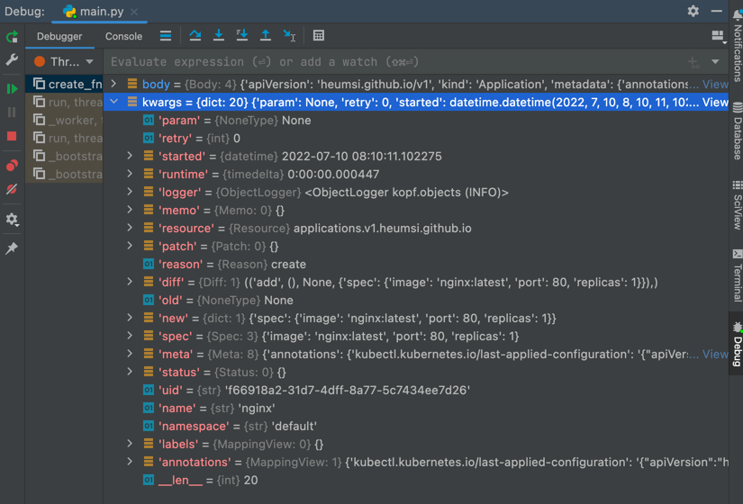

## 들어가며

Kubernetes 위에서 뭔가를 배포하다보면, Deployment, Helm을 알게되고, 그러다 어느순간 CRD와 Operator라는 개념을 마주하게 된다.
처음엔 그저 이게 뭐지하고 사용 하다가, 어느 순간 꽤 많은 애플리케이션들이 자체적인 CRD와 Operator를 쓴다는 것을 느끼게 된다.

Kubernetes CRD와 Operator는 어떻게 구현하는건지 평소에 궁금했었는데, 최근에 Kopf 라는 툴을 알게되어 이에 대해 소개해보고자 한다.
CRD 구현부터 Kopf를 통해 파이썬으로 Operator를 구현하는 것까지 이 글에서 다루어보겠다.

## CRD

### CRD 란?

CRD는 Custom Resource Definition의 약자로, 이름 그대로 사용자가 정의하는 Kubernetes 리소스다. 
우리는 CRD를 먼저 정의하고 배포한 후 CR(Custom Resource)를 배포할 수 있다.

Kubernetes에는 Pod, Deployment, Service 등 기본적인 리소스 유형들이 존재한다.
그런데 이렇게 기본적인 리소스 유형말고 개발자가 직접 리소스 유형을 정의해서 사용할 수 있는데, 이렇게 직접 정의된 리소스들을 CRD라고 부르는 것이다.

사실 CRD는 아예 새로운 것을 만들어내는 것은 아니고, Kubernetes의 기본 리소스 유형을 조합하여 사용에 맞게 추상화한 리소스라고 보면 된다.

> Kubernetes의 리소스 유형 확장 방법으로 CRD가 유일한 것은 아니다. API Aggregation 이라는 방법도 있는데,
> 이에 대해서는 [Alice님 블로그 글](https://blog.naver.com/alice_k106/221579974362)에 잘 소개가 되어 있어 공유해본다.

### CRD 작성하기

먼저, CRD 작성 전에 현재 마주한 문제 상황은 다음과 같다.

보통 Kubernetes에서 앱을 배포하기 위해서는 Deployment와 Service를 배포해야 한다. 
그런데 매번 Deployment와 Service의 yaml 파일을 일일이 다 작성하는게 귀찮다.
개발자는 배포에 다음 설정 값들만 작성해도 충분하다고 해보자.

- Deployment에 어떤 컨테이너 이미지를 쓸지 (image)
- Deployment에 Pod 수는 몇 개로 할지 (replicas)
- Service에 포트는 몇번으로 할지 (port)

위 문제 상황을 해결하기 위해 `Application` 이라는 CR을 만드려고 한다.
`Application` 리소스를 작성할 때 위 3개의 설정 값만 주고, `Application` 을 배포하면 Deployment와 Service가 자동으로 만들어지게끔 할 것이다.

이제 `Application` 의 CRD를 작성을 시작해보자.
`crd.yaml` 을 만들어 다음처럼 작성한다.

```yaml{3-7}
# crd.yaml

apiVersion: apiextensions.k8s.io/v1
kind: CustomResourceDefinition
metadata:
  # name must match the spec fields below, and be in the form: <plural>.<group>
  name: applications.heumsi.github.io
```

- CRD를 작성할 때는 위와 같은 `apiVersion` 과 `kind` 를 사용한다.
- `metadata.name` 값은 CRD의 Full Name이다.
  - 이 값은 `<plural>.<group>` 형태로 작성되어야 하는데, 아래에서 설명하겠다.
  - 리소스의 Full Name은 API Group(위의 경우 `heumsi.github.io`)을 포함하는데, API Group은 리소스 구분을 위한 일종의 네임스페이스라 보면 된다.

계속해서 더 작성해보자.

```yaml{8-22}
# crd.yaml

apiVersion: apiextensions.k8s.io/v1
kind: CustomResourceDefinition
metadata:
  # name must match the spec fields below, and be in the form: <plural>.<group>
  name: applications.heumsi.github.io
spec:
  # group name to use for REST API: /apis/<group>/<version>
  group: heumsi.github.io
  # either Namespaced or Cluster
  scope: Namespaced
  names:
    # plural name to be used in the URL: /apis/<group>/<version>/<plural>
    plural: applications
    # singular name to be used as an alias on the CLI and for display
    singular: application
    # kind is normally the CamelCased singular type. Your resource manifests use this.
    kind: Application
    # shortNames allow shorter string to match your resource on the CLI
    shortNames:
      - app
```

- `spec.group` 의 값은 API Group이다. API Group은 보통 자신의 도메인을 사용한다.
- `spec.scope` 의 값은 이 커스텀 리소스가 배포되었을 때의 유효 범위이다.
  - `Namespaced` 로 주면 커스텀 리소스는 네임스페이스 범위로 배포된다.
  - `Cluster` 로 주면 커스텀 리소스는 클러스터 범위로 배포된다.
  - CRD 자체는 Cluster 범위다. 여기서 말하는 `scoped` 값은 CR(여기선 `Applicaton`)의 범위를 말하는 것이다.
- `spec.names` 에는 이 리소스를 부르는 여러 이름을 담는다.
  - `plural` 의 값은 이 리소스의 복수 형태의 이름이다.
  - `singular` 의 값은 이 리소스의 단수 형태의 이름이다.
  - `kind` 의 값은 이 리소스를 생성할 때 작성하는 단수 형태의 이름이다.
  - `shortNames` 의 값은 이 리소스를 부르는 단축 형태의 이름으로, 일종의 Alias다.

이제 실제로 `Application` 은 어떤 스펙을 담고있어야 하는지 작성해보자.

```yaml{23-52}
# crd.yaml

apiVersion: apiextensions.k8s.io/v1
kind: CustomResourceDefinition
metadata:
  # name must match the spec fields below, and be in the form: <plural>.<group>
  name: applications.heumsi.github.io
spec:
  # group name to use for REST API: /apis/<group>/<version>
  group: heumsi.github.io
  # either Namespaced or Cluster
  scope: Namespaced
  names:
    # plural name to be used in the URL: /apis/<group>/<version>/<plural>
    plural: applications
    # singular name to be used as an alias on the CLI and for display
    singular: application
    # kind is normally the CamelCased singular type. Your resource manifests use this.
    kind: Application
    # shortNames allow shorter string to match your resource on the CLI
    shortNames:
      - app
  # list of versions supported by this CustomResourceDefinition
  versions:
    - name: v1
      # Each version can be enabled/disabled by Served flag.
      served: true
      # One and only one version must be marked as the storage version.
      storage: true
      schema:
        openAPIV3Schema:
          type: object
          properties:
            spec:
              type: object
              x-kubernetes-preserve-unknown-fields: true
              properties:
                image:
                  type: string
                replicas:
                  type: integer
                port:
                  type: integer
              required:
                - image
                - replicas
                - port
            status:
              type: object
              x-kubernetes-preserve-unknown-fields: true
          required:
            - spec
```

- `spec.versions` 내에 버전 단위로 스펙을 작성한다.
  - `served` 와 `storage`는 실제 운영에 제공할 버전에 대한 표시이며, 제공할 버전은 `true` 로 둔다.
  - `schema` 항목에 실제 스펙을 작성하며, 스펙 포맷은 `openAPIV3Schema` 를 사용한다.
    - 우리가 json 스키마를 정의할 때 흔히 쓰는 그 [OpenAPI 스키마](https://swagger.io/specification/)가 맞다.
- `x-kubernetes-preserve-unknown-fields` 를 `true` 로 주면 추후에 동적으로 해당 field 값을 수정할 수 있다. 왠만하면 `true` 로 주자.

> `x-kubernetes-preserve-unknown-fields` 에 대해서 좀 더 알아보고 싶다면, [공식 문서](https://kubernetes.io/docs/tasks/extend-kubernetes/custom-resources/custom-resource-definitions/#controlling-pruning)를 확인해봐도 좋다.

여기서는 위에서 필요하다고 이야기한 설정 값에 맞게 `image`, `replicas`, `port` 이 3개의 속성 값을 `spec` 안에 설정하였다.

### CRD 배포하기

이제 위에서 작성한 CRD를 다음처럼 배포하자.

```bash
$ kubectl apply -f crd.yaml

customresourcedefinition.apiextensions.k8s.io/applications.heumsi.github.io created
```

이제 다음처럼 조회도 되고

```bash
$ kubectl get crd
 
NAME                            CREATED AT
applications.heumsi.github.io   2022-07-13T12:16:19Z
```

다음처럼 확인할 수도 있다.

```bash
$ kubectl describe crd applications.heumsi.github.io

Name:         applications.heumsi.github.io
Namespace:    
Labels:       <none>
Annotations:  <none>
API Version:  apiextensions.k8s.io/v1
Kind:         CustomResourceDefinition
Metadata:
  ...
Spec:
  ...
Status:
  ...
Events:
  ...
```

이렇게 CRD 자체는 클러스터 전역에서 배포된다.

### CR 작성하기

이제 위에서 CRD로 정의한 CR을 작성해보자.
`application.yaml` 을 만들고 다음처럼 작성한다.

```yaml
# application.yaml

apiVersion: heumsi.github.io/v1
kind: Application
metadata:
  name: nginx
spec:
  image: nginx:latest
  replicas: 1
  port: 80
```

위 `crd.yaml` 에서 작성한 `spec` 에 맞춰 `application.yaml` 을 작성하였다.
이제 우리는 이 `application.yaml` 을 배포하면 다음의 일들이 일어나길 기대한다.

- `Deployment` 가 배포된다.
  - Container는 하나이며 `image` 는 `nginx:latest` 이다.
  - `replicas` 는 `1` 이다.
- `Service` 가 배포된다.
  - `Deployment` 로 만들어진 `Pod` 들에 연결된다.
  - 포트는 `80:80` 으로 설정된다.

### CR 배포하기

위에서 작성한 `application.yaml` 을 배포하자.

```bash
$ kubectl apply -f application.yaml

application.heumsi.github.io/nginx created
```

마찬가지로 다음처럼 조회할 수 있다.

```bash
$ kubectl get applications   

NAME    AGE
nginx   35s
```

다음처럼 `crd.yaml` 에서 설정한 `shortNames` 이나 `group` 으로도 조회 가능하다.

```bash
$ kubectl get app
 
NAME    AGE
nginx   2m38s

$ kubectl get applications.heumsi.github.io
 
NAME    AGE
nginx   2m29s
```

CR을 배포했으나 아직 Deployment나 Service는 만들어지지 않았다.
CR을 모니터링하며 어떤 추가적인 작업을 실행하려면 Operator를 만들어야 한다.

## Operator

### Operator 란?

Operator는 위에서 설명한대로, 특정 리소스를 계속 모니터링하며 무언가의 작업을 수행하는 역할을 담당한다.

예를 들어 어떤 CR이 생성되면 추가적인 특정 파드를 띄운다던가, CR에 변경이 일어나면 이러한 내용을 어딘가에 저장하게 할 수 있다.
이렇게 리소스를 모니터링하며 발생하는 이벤트에 따라 사용자가 추가적인 로직을 부여하고 싶을 때 Operator를 사용한다. 

### Kopf 란?

[Kopf](https://github.com/nolar/kopf)는 Kubernetes OPerator Framework의 약자로, 
Python으로 Operator를 만들 수 있게 도와주는 프레임워크다.

말 그대로 프레임워크다 보니, 많은 것들이 추상화 되어있고 우리는 주어진 프레임 안에서 적당히 잘 코딩을 하면 된다.
비슷한 도구로 [CoreOS Operator SDK](https://github.com/operator-framework/operator-sdk)나 
[CoreOS Operator Framework](https://operatorframework.io/)들도 있지만, Kopf 개발자들은 Kopf가 이들보다 사용하기 훨씬 쉬운 프레임워크라고 말한다.

> kopf 대안에 대해 좀 더 자세히 적어둔 글이 있는데, 궁금하면 [공식 문서](https://kopf.readthedocs.io/en/stable/alternatives/)를 확인하자.

그럼 이제 kopf로 Operator를 작성해보자.

### Kopf 설치하기

먼저 다음처럼 `kopf` 를 설치한다.

```bash
$ pip install kopf

kopf --version
kopf, version 1.35.5
```

> [pip](https://pip.pypa.io/en/stable/)는 Python package manager로, Python을 설치하면 같이 설치된다.
> 아직 pip가 설치되지 않았다면, Python 설치를 먼저 진행하자.
> Python은 [pyenv](https://github.com/pyenv/pyenv)로 쉽게 설치할 수 있다.

### yaml 파일 작성하기

먼저 Deployment와 Service로 사용할 yaml 파일을 다음처럼 작성하자.
`service.yaml` 을 만든 뒤 다음처럼 작성한다.

```yaml
# service.yaml

apiVersion: v1
kind: Service
metadata:
  name: "{name}"
spec:
  selector:
    app: "{name}"
  ports:
    - name: http
      protocol: TCP
      port: {port}
      targetPort: {port}
```

`deployment.yaml` 을 만든 뒤 다음처럼 작성한다.

```yaml
# deployment.yaml

apiVersion: apps/v1
kind: Deployment
metadata:
  name: "{name}"
  labels:
    app: "{name}"
spec:
  replicas: {replicas}
  selector:
    matchLabels:
      app: "{name}"
  template:
    metadata:
      labels:
        app: "{name}"
    spec:
      containers:
      - name: "{name}"
        image: "{image}"
        ports:
        - containerPort: {port}
```

`yaml` 파일 내 `{}` 로 표현된 변수들은 Python 코드에서 주입해줄 예정이다.

### CR 생성 이벤트 핸들러 작성하기

이제 진짜로 Operator를 작성해보자. 
`main.py` 를 만든 뒤 다음처럼 작성한다.

```python
# main.py

import kopf


@kopf.on.create('heumsi.github.io', 'v1', 'applications')
def create(name, logger, **kwargs):
    logger.info(f"Application '{name}' is created.")
```

`applications.v1.heumsi.github.io` 리소스가 생성될 때 이를 감지하여 `create` 함수가 실행되는 코드다.
즉 `create` 라고 하는 이벤트의 핸들러를 kopf 에서는 위처럼 작성하게 된다.

위 코드를 다음처럼 실행한다.

```bash
$ kopf run main.py --verbose

[2022-07-13 22:18:08,392] kopf._core.reactor.r [DEBUG   ] Starting Kopf 1.35.5.
[2022-07-13 22:18:08,392] kopf._core.engines.a [INFO    ] Initial authentication has been initiated.
[2022-07-13 22:18:08,392] kopf.activities.auth [DEBUG   ] Activity 'login_via_client' is invoked.
[2022-07-13 22:18:08,417] kopf.activities.auth [DEBUG   ] Client is configured via kubeconfig file.
[2022-07-13 22:18:08,418] kopf.activities.auth [INFO    ] Activity 'login_via_client' succeeded.
[2022-07-13 22:18:08,418] kopf._core.engines.a [INFO    ] Initial authentication has finished.
[2022-07-13 22:18:08,464] kopf._cogs.clients.w [DEBUG   ] Starting the watch-stream for customresourcedefinitions.v1.apiextensions.k8s.io cluster-wide.
[2022-07-13 22:18:08,465] kopf._cogs.clients.w [DEBUG   ] Starting the watch-stream for applications.v1.heumsi.github.io cluster-wide.
[2022-07-13 22:18:08,573] kopf.objects         [DEBUG   ] [default/nginx] Creation is in progress: {'apiVersion': 'heumsi.github.io/v1', 'kind': 'Application', 'metadata': {'annotations': {'kubectl.kubernetes.io/last-applied-configuration': '{"apiVersion":"heumsi.github.io/v1","kind":"Application","metadata":{"annotations":{},"name":"nginx","namespace":"default"},"spec":{"image":"nginx:latest","port":80,"replicas":1}}\n'}, 'creationTimestamp': '2022-07-13T13:18:02Z', 'generation': 1, 'managedFields': [{'apiVersion': 'heumsi.github.io/v1', 'fieldsType': 'FieldsV1', 'fieldsV1': {'f:metadata': {'f:annotations': {'.': {}, 'f:kubectl.kubernetes.io/last-applied-configuration': {}}}, 'f:spec': {'.': {}, 'f:image': {}, 'f:port': {}, 'f:replicas': {}}}, 'manager': 'kubectl-client-side-apply', 'operation': 'Update', 'time': '2022-07-13T13:18:02Z'}], 'name': 'nginx', 'namespace': 'default', 'resourceVersion': '79214', 'uid': 'f6f0f256-aaa8-4a42-83f2-3df27755ab06'}, 'spec': {'image': 'nginx:latest', 'port': 80, 'replicas': 1}}
[2022-07-13 22:18:08,574] kopf.objects         [DEBUG   ] [default/nginx] Handler 'create' is invoked.
[2022-07-13 22:18:08,574] kopf.objects         [INFO    ] [default/nginx] Application 'nginx' is created.
[2022-07-13 22:18:08,576] kopf.objects         [INFO    ] [default/nginx] Handler 'create' succeeded.
[2022-07-13 22:18:08,576] kopf.objects         [INFO    ] [default/nginx] Creation is processed: 1 succeeded; 0 failed.
[2022-07-13 22:18:08,577] kopf.objects         [DEBUG   ] [default/nginx] Patching with: {'metadata': {'annotations': {'kopf.zalando.org/last-handled-configuration': '{"spec":{"image":"nginx:latest","port":80,"replicas":1}}\n'}}}
[2022-07-13 22:18:08,690] kopf.objects         [DEBUG   ] [default/nginx] Something has changed, but we are not interested (the essence is the same).
[2022-07-13 22:18:08,690] kopf.objects         [DEBUG   ] [default/nginx] Handling cycle is finished, waiting for new changes.
```

로그를 보면 핸들러에서 `applications.heumsi.github.io` 리소스가 생성된 것을 감지하고 있다.

또한 생성된 CR의 Events에도 위 Operator가 작업한 이벤트가 기록된다.
        
```yaml{43-47}
$ kubectl describe app nginx

Name:         nginx
Namespace:    default
Labels:       <none>
Annotations:  kopf.zalando.org/last-handled-configuration: {"spec":{"image":"nginx:latest","port":80,"replicas":1}}
API Version:  heumsi.github.io/v1
Kind:         Application
Metadata:
  Creation Timestamp:  2022-07-10T06:45:11Z
  Generation:          1
  Managed Fields:
    API Version:  heumsi.github.io/v1
    Fields Type:  FieldsV1
    fieldsV1:
      f:metadata:
        f:annotations:
          .:
          f:kubectl.kubernetes.io/last-applied-configuration:
      f:spec:
        .:
        f:image:
        f:port:
        f:replicas:
    Manager:      kubectl-client-side-apply
    Operation:    Update
    Time:         2022-07-10T06:45:11Z
    API Version:  heumsi.github.io/v1
    Fields Type:  FieldsV1
    fieldsV1:
      f:metadata:
        f:annotations:
          f:kopf.zalando.org/last-handled-configuration:
    Manager:         kopf
    Operation:       Update
    Time:            2022-07-10T06:45:59Z
  Resource Version:  3413
  UID:               289ff6b3-29a1-4896-b8f3-82c20c4a904e
Spec:
  Image:     nginx:latest
  Port:      80
  Replicas:  1
Events:
  Type    Reason   Age   From  Message
  ----    ------   ----  ----  -------
  Normal  Logging  8s    kopf  Creation is processed: 1 succeeded; 0 failed.
  Normal  Logging  8s    kopf  Handler 'create_fn' succeeded.
```

그러면 이제 `main.py` 내 `create` 함수 내에 Deployment와 Service를 배포하는 코드를 작성해보자.

코드에서 Kubernetes API를 Python SDK 형태로 쓰기 위해 다음 패키지를 설치한다.

```bash
$ pip install kubernetes
$ pip list | grep kubernetes

kubernetes         24.2.0
```

`main.py` 를 다음처럼 수정한다.

```python
import os

import kopf

import kubernetes
import yaml


@kopf.on.create('heumsi.github.io', 'v1', 'applications')
def create(name, spec, namespace, logger, **kwargs):
    logger.info(f"Application '{name}' is created.")
    kapps_v1 = kubernetes.client.AppsV1Api()
    kcore_v1 = kubernetes.client.CoreV1Api()

    # Create Deployment
    path = os.path.join(os.path.dirname(__file__), 'deployment.yaml')
    tmpl = open(path, 'rt').read()
    text = tmpl.format(name=name, **spec)
    data = yaml.safe_load(text)
    kopf.adopt(data)  # Add as child
    deployment = kapps_v1.create_namespaced_deployment(
        namespace=namespace,
        body=data
    )
    logger.info(f"Deployment '{name}' is created.")
    logger.debug(deployment)

    # Create Service
    path = os.path.join(os.path.dirname(__file__), 'service.yaml')
    tmpl = open(path, 'rt').read()
    text = tmpl.format(name=name, **spec)
    data = yaml.safe_load(text)
    kopf.adopt(data)  # Add as child
    service = kcore_v1.create_namespaced_service(
        namespace=namespace,
        body=data
    )
    logger.info(f"Service '{name}' is created.")
    logger.debug(service)

    return {
        "deployment": deployment.metadata.name,
        "service": service.metadata.name,
    }
```

별 다른 내용은 없고, `kubernetes` 패키지로 Deployment와 Service를 생성하는 코드다.
`tmpl.format(name=name, **spec)` 코드를 통해 이전에 작성한 `deployment.yaml` 와 `service.yaml` 에
`name` 및 `spec` 의 데이터를 주입하여 실제로 배포할 yaml 파일을 렌더링한다.
이후 `kubernetes.client` 를 통해 이 yaml 파일을 배포한다.

> `kubernetes.client` 는 리소스의 `apiVersion` 에 따라 나뉜다.
> 예를 들어 `apiVersion` 이 `v1` 인 리소스는 `kubernetes.client.CoreV1Api` 를 사용하면 되고,
> `apiVersion` 이 `apps/v1` 인 리소스는 `kubernetes.client.AppsV1Api` 를 사용하면 된다.

그리고 `kopf.adopt(data)` 코드를 넣어주게 되면, 배포되는 yaml 파일은 이 CR의 자식 리소스가 된다.
즉, 이 CR이 지워질 때 자식 리소스(여기서는 Deployment와 Service)가 같이 지워지게 된다.

마지막에는 `Dict` 를 반환하는데, Key, Value들은 CR의 `status` 항목에 핸들러 함수 이름과 함께 저장된다.
이는 아래에서 CR 배포 후 확인해보자.

> 이벤트 핸들러의 파라미터로 `kwargs` 를 받게 되는데, 이 안에 이벤트에 대한 각종 정보들이 담겨있다.
> `kwargs` 에 어떤 정보가 있는지 직접 디버깅하며 스크린샷을 찍어보았다.
>
> 
>
> 다시 코드로 표현하면 다음과 같다.
>
> ```
> {
>   'annotations': {'kubectl.kubernetes.io/last-applied-configuration': '{"apiVersion":"heumsi.github.io/v1","kind":"Application","metadata":{"annotations":{},"name":"nginx","namespace":"default"},"spec":{"image":"nginx:latest","port":80,"replicas":1}}\n'},
>   'diff': (('add', (), None, {'spec': {'image': 'nginx:latest', 'port': 80, 'replicas': 1}}),),
>   'labels': {},
>   'logger': <ObjectLogger kopf.objects (INFO)>,
>   'memo': {},
>   'meta': {'annotations': {'kubectl.kubernetes.io/last-applied-configuration': '{"apiVersion":"heumsi.github.io/v1","kind":"Application","metadata":{"annotations":{},"name":"nginx","namespace":"default"},"spec":{"image":"nginx:latest","port":80,"replicas":1}}\n'}, 'creationTimestamp': '2022-07-10T08:10:10Z', 'generation': 1, 'managedFields': [{'apiVersion': 'heumsi.github.io/v1', 'fieldsType': 'FieldsV1', 'fieldsV1': {'f:metadata': {'f:annotations': {'.': {}, 'f:kubectl.kubernetes.io/last-applied-configuration': {}}}, 'f:spec': {'.': {}, 'f:image': {}, 'f:port': {}, 'f:replicas': {}}}, 'manager': 'kubectl-client-side-apply', 'operation': 'Update', 'time': '2022-07-10T08:10:10Z'}], 'name': 'nginx', 'namespace': 'default', 'resourceVersion': '9488', 'uid': 'f66918a2-31d7-4dff-8a77-5c7434ee7d26'},
>   'name': 'nginx',
>   'namespace': 'default',
>   'new': {'spec': {'image': 'nginx:latest', 'port': 80, 'replicas': 1}},
>   'old': None,
>   'param': None,
>   'patch': {},
>   'reason': <Reason.CREATE: 'create'>,
>   'resource': applications.v1.heumsi.github.io,
>   'retry': 0,
>   'runtime': datetime.timedelta(microseconds=447),
>   'spec': {'image': 'nginx:latest', 'port': 80, 'replicas': 1},
>   'started': datetime.datetime(2022, 7, 10, 8, 10, 11, 102275),
>   'status': {},
>   'uid': 'f66918a2-31d7-4dff-8a77-5c7434ee7d26'
> }
> ```
>
> 핸들러에서 이 `kwargs` 내 key들을 파라미터로 두고 사용할 수 있다.
> 우리가 위에서 사용한 `name`, `logger` 등이 바로 이 안에 포함된 key라고 보면 된다.

이제 Operator도 다시 실행하고, CR도 지웠다가 다시 생성해보자.

```bash
$ kopf run main.py --verbose
```

```bash
$ kubectl delete -f application.yaml
        
application.heumsi.github.io "nginx" deleted

$ kubectl apply -f application.yaml

application.heumsi.github.io/nginx created
```

이제 정상적으로 CR(Application)와 Deployment, Service가 잘 배포되었는지 확인해보자.

```bash
$ kubectl get app

NAME    AGE
nginx   20s

$ kubectl get deployment

NAME    READY   UP-TO-DATE   AVAILABLE   AGE
nginx   1/1     1            1           24s

$ kubectl get service                   

NAME         TYPE        CLUSTER-IP      EXTERNAL-IP   PORT(S)   AGE
kubernetes   ClusterIP   10.96.0.1       <none>        443/TCP   3d8h
nginx        ClusterIP   10.96.249.187   <none>        80/TCP    27s
```

잘 배포된 것을 확인했다.

배포된 Deployment를 확인해보면 다음처럼 `ownerReferences` 에 CR이 설정된 것을 확인할 수 있다.
이는 Deployment의 상위 리소스가 CR이라는 표현으로, `kopf.adopt(data)` 코드에 의해 생성된 것이다.

```bash{7-13}
$ kubectl get deploy nginx -o yaml

apiVersion: apps/v1
kind: Deployment
metadata:
  ...
  ownerReferences:
  - apiVersion: heumsi.github.io/v1
    blockOwnerDeletion: true
    controller: true
    kind: Application
    name: nginx
    uid: 963a4fd2-effe-4c5e-bdcf-c089a3ea9480
  ...
spec:
  ...
```

한편 핸들러에서 반환한 `Dict` 데이터도 CR의 `status` 에 잘 저장되었는지 확인해보자.

```bash{21-24}
$ kubectl get app nginx -o yaml

apiVersion: heumsi.github.io/v1
kind: Application
metadata:
  annotations:
    kopf.zalando.org/last-handled-configuration: |
      {"spec":{"image":"nginx:latest","port":8080,"replicas":2}}
    kubectl.kubernetes.io/last-applied-configuration: |
      {"apiVersion":"heumsi.github.io/v1","kind":"Application","metadata":{"annotations":{},"name":"nginx","namespace":"default"},"spec":{"image":"nginx:latest","port":80,"replicas":1}}
  creationTimestamp: "2022-07-13T14:55:53Z"
  generation: 4
  name: nginx
  namespace: default
  resourceVersion: "82893"
  uid: 1b31a0d8-81e6-4671-a8b4-f54ace7f101c
spec:
  image: nginx:latest
  port: 8080
  replicas: 2
status:
  create:
    deployment: nginx
    service: nginx
```

`status.create` 내에 데이터가 잘 저장된 것을 확인했다.


### CR 수정 이벤트 핸들러 작성하기

위에서는 CR이 생성되었을 때 동작하는 핸들러를 작성했다.
이번에는 CR이 수정될 때 동작하는 핸들러를 작성해보자.

`main.py` 를 다음처럼 수정한다.

```python{47-81}
import os

import kopf

import kubernetes
import yaml


@kopf.on.create('heumsi.github.io', 'v1', 'applications')
def create(name, spec, namespace, logger, **kwargs):
    logger.info(f"Application '{name}' is created.")
    kapps_v1 = kubernetes.client.AppsV1Api()
    kcore_v1 = kubernetes.client.CoreV1Api()

    # Create Deployment
    path = os.path.join(os.path.dirname(__file__), 'deployment.yaml')
    tmpl = open(path, 'rt').read()
    text = tmpl.format(name=name, **spec)
    data = yaml.safe_load(text)
    kopf.adopt(data)  # Add as child
    deployment = kapps_v1.create_namespaced_deployment(
        namespace=namespace,
        body=data
    )
    logger.info(f"Deployment '{name}' is created.")
    logger.debug(deployment)

    # Create Service
    path = os.path.join(os.path.dirname(__file__), 'service.yaml')
    tmpl = open(path, 'rt').read()
    text = tmpl.format(name=name, **spec)
    data = yaml.safe_load(text)
    kopf.adopt(data)  # Add as child
    service = kcore_v1.create_namespaced_service(
        namespace=namespace,
        body=data
    )
    logger.info(f"Service '{name}' is created.")
    logger.debug(service)

    return {
        "deployment": deployment.metadata.name,
        "service": service.metadata.name,
    }


@kopf.on.update('heumsi.github.io', 'v1', 'applications')
def update(name, status, spec, namespace, logger, **kwargs):
    kapps_v1 = kubernetes.client.AppsV1Api()
    kcore_v1 = kubernetes.client.CoreV1Api()
    
    # Update Deployment
    path = os.path.join(os.path.dirname(__file__), 'deployment.yaml')
    tmpl = open(path, 'rt').read()
    text = tmpl.format(name=name, **spec)
    data = yaml.safe_load(text)
    deployment = kapps_v1.replace_namespaced_deployment(
        name=status["create"]["deployment"],
        namespace=namespace,
        body=data
    )
    logger.info(f"Deployment '{name}' is replaced.")
    logger.debug(deployment)
    
    # Update Service
    path = os.path.join(os.path.dirname(__file__), 'service.yaml')
    tmpl = open(path, 'rt').read()
    text = tmpl.format(name=name, **spec)
    data = yaml.safe_load(text)
    service = kcore_v1.replace_namespaced_service(
        name=status["create"]["service"],
        namespace=namespace,
        body=data
    )
    logger.info(f"Service '{name}' is replaced.")
    logger.debug(service)

    return {
        "deployment": deployment.metadata.name,
        "service": service.metadata.name,
    }
```

새로 추가한 `update` 함수는 `create` 함수와 별로 다르지 않다.
중간에 `create_namespaced_deployment`, `create_namespaced_service` 대신 `replace_namespaced_deployment`, `replace_namespaced_service` 로 변경되었을 뿐이다.
또 `kopf.adopt(data)` 와 같은 코드는 빠졌다.

CR을 수정했을 때 잘 반영되는지 확인해보자.

이제 다시 Operator를 실행한다. 

```bash
$ kopf run main.py --verbose
```

CR의 스펙 중, `port` 값은 `8080` 으로, `replicas` 는 `2`로 수정한다.

```bash{19-20}
$ kubectl edit app nginx

apiVersion: heumsi.github.io/v1
kind: Application
metadata:
  annotations:
    kopf.zalando.org/last-handled-configuration: |
      {"spec":{"image":"nginx:latest","port":8080,"replicas":2}}
    kubectl.kubernetes.io/last-applied-configuration: |
      {"apiVersion":"heumsi.github.io/v1","kind":"Application","metadata":{"annotations":{},"name":"nginx","namespace":"default"},"spec":{"image":"nginx:latest","port":80,"replicas":1}}
  creationTimestamp: "2022-07-13T14:55:53Z"
  generation: 4
  name: nginx
  namespace: default
  resourceVersion: "82893"
  uid: 1b31a0d8-81e6-4671-a8b4-f54ace7f101c
spec:
  image: nginx:latest
  port: 8080
  replicas: 2
status:
  create:
    deployment: nginx
    service: nginx
  update:
    deployment: nginx
    service: nginx
```

잘 반영되었는지 확인해보자.

```bash
$ kubectl get deployment nginx

NAME    READY   UP-TO-DATE   AVAILABLE   AGE
nginx   2/2     2            2           10m

$ kubectl get service nginx

NAME    TYPE        CLUSTER-IP      EXTERNAL-IP   PORT(S)    AGE
nginx   ClusterIP   10.96.249.187   <none>        8080/TCP   10m
```

잘 반영된 것을 확인할 수 있다.

> 특정 Field만 변경 사항을 감지한다거나, 서브 핸들러를 두는 등의 일들도 할 수 있다.
> 이에 대한 자세한 내용은 [공식 문서](https://kopf.readthedocs.io/en/stable/handlers/)를 확인하자.

### CR 삭제하기

이제 생성했던 CR을 삭제해보자.

```bash
$ kubectl delete app nginx  
       
application.heumsi.github.io "nginx" deleted
```

그러면 다음처럼 자식 리소스들도 모두 삭제된 것을 확인할 수 있다.

```bash
$ kubectl get svc  
       
NAME         TYPE        CLUSTER-IP   EXTERNAL-IP   PORT(S)   AGE
kubernetes   ClusterIP   10.96.0.1    <none>        443/TCP   8h

$ kubectl get deployment

No resources found in default namespace.
```

위에서도 말했지만, 이는 CR 생성 시 `kopf.adopt(data)` 코드로 자식 리소스에 `ownerReferences` 를 주었기 때문에 가능한 것이다.

## 나가며

이번 글에서는 CRD 작성 방법과 kopf로 Operator를 구현하는 방법에 대해 배웠다.
이 글에서는 CRD와 kopf를 같이 이야기했는데 kopf를 쓰기 위해 꼭 CRD를 사용해야하는 것은 아니다. 
예를 들면 다음처럼 CR이 아닌 네임스페이스가 생성되었을 때 일련의 로직을 처리하는 것도 kopf를 사용하는 방법 중 하나다.

```python
import kopf


@kopf.on.create('namespace')
def create(name, logger, **kwargs):
    logger.info(f"Namespace '{name}' is created.")
```

Kuberentes를 도입한 초기에는 CRD를 직접 작성하거나 kopf로 Operator를 당장 만들 일은 잘 없을거 같다.
어느정도 우리 팀만의 운영 패턴이 잡히고, 이를 추상화하여 더 편하고 자동화하여 쓰고 싶을 때 kopf를 아주 유용하게 사용할 수 있을거란 생각이 든다.

> kopf는 내부적으로 어떻게 동작하는지 궁금해서 알아보려 했지만, 공식 문서에 설명이 별로 없어서 유감스럽지만 패스한다.
> 이 글을 본 누군가가 이에 대해서도 작성해주셨으면 좋겠다.


## 참고한 글

- https://blog.naver.com/alice_k106/221579974362
- https://kubernetes.io/docs/tasks/extend-kubernetes/custom-resources/custom-resource-definitions/
- https://kopf.readthedocs.io/en/stable/