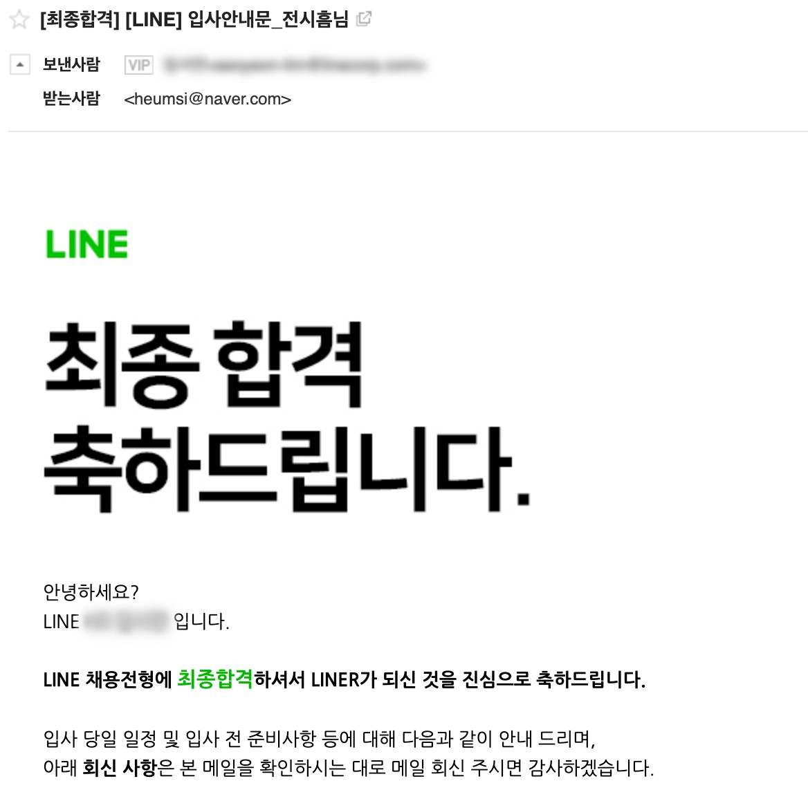

## 들어가며

나의 첫 회사에 대한 회고에 이어, 나의 첫 이직에 대한 내용도 기록해 보려 한다.

먼저 간단히 나에 대한 소개를 하자면, 나는 쏘카(SOCAR)라는 회사의 데이터 엔지니어링 팀에서 2년 2개월 정도 소프트웨어 엔지니어로 일을 했다.
명함에 적힌 직무는 데이터 엔지니어이긴 했지만, 내 생각에는 좀 더 넓은 범위의 일을 한거 같아 그냥 소프트웨어 엔지니어라고 표현하는 게 맞을 거 같다.

어떤 생각으로 다른 회사에 지원하게 되었는지, 또 지원 과정은 어떠하였고, 들었던 생각과 감정은 어땠는지.
그래서 최종적으로 어떤 회사의 어떤 팀으로 가게 되었는지에 대해 정리해 본다.

## 이직을 시도하게 된 이유

먼저 어떤 생각으로 이직을 시도하게 되었는지에 대해 적어본다.

### 나에 대한 시장의 평가는 어떨까

처음부터 "무조건 이직을 해야겠다!"라는 생각은 없었다. 다만 나는 나에 대한 시장의 평가가 궁금했다.
과연 나는 지난 2년 동안 엔지니어로써 잘 살아온 것인지, 내가 회사에서 했던 일들은 시장의 트렌드와 맞는지,
나는 보통 업계의 경력 2년에 준하는 실력과 커리어를 가지고 있는 건지 궁금했다.
내 근처의 친한 동료들 말고, 외부에 내가 보지 못한 같은 업계의 다른 사람들에게 냉정한 평가를 받고 싶었다.

쏘카에 입사한 이후, 한 번도 다른 회사의 지원해 보지 않았다.
이직 여부를 떠나 한 번쯤은 다른 회사 채용에 지원하고, 이런 냉정한 평가만 잘 받아 가도 좋겠다 싶었다.

### 다른 회사 사람들은 무엇을 하며 어떻게 일할까

입사 후 1년이 조금 넘고, 업무가 조금 익숙해지니 다른 회사의 데이터 팀은 무슨 일을 하는지 궁금했다.
특히 데이터 엔지니어링 관련 업무는 회사 상황에 따라 많이 다를 거 같다는 생각이 들었는데, 가끔 몇몇 회사의 기술 블로그 말고는 실제로 평소에 무슨 일을 하는지 전혀 알 수 없었다.
우리 팀과 비슷한 환경에 있으며 비슷한 목표를 가지고 있는 팀들은 여러 문제를 어떻게 정의하고 어떻게 해결해나가는지 궁금증은 계속해서 가지게 되었다.

입사 후 2년이 다 되어갈 때쯤에는 다른 회사의 데이터 팀은 어떻게 효율적으로 일하는지에 대해 궁금했다.
우리 팀은 매 스프린트마다 일하는 방식에 대해 이런저런 일들을 하며 개선해나가고자 했으나, 나는 늘 Best Practice가 뭔지 궁금했고 이는 쉽게 해소가 되지 않았다.
가끔은 이에 대해 풍부한 경험이 있는 시니어 분이 팀에 합류하여 최적의 솔루션을 내줬으면 좋겠다 생각하기도 했다.

여하튼 면접에 들어가게 되면, 떨어지더라도 해당 팀에서 하는 일(What)과 어떻게 하는지(How)에 대해서만 잘 알아가도 좋겠다 생각했다.

### 인생에 긴장감을 불어넣고, 더 발전하고 싶다.

쏘카에서의 2년은 짧다면 짧은 시간이지만, 그래도 나름의 프로젝트 사이클과 문화를 어느 정도 느껴볼 수 있었던 시간이었다.
내가 초기에 구성했던 것들은 어느새 새로운 팀원들이 사용하고 발전시키고 있었고, 이에 대한 히스토리를 내가 답하는 상황도 자주 생기게 되었다.

그래서 그런 걸까? 어느새부터인가 긴장감은 확실히 조금 줄어들고, 나는 꽤 나태해진 거 같다.
확실히 이전보다 뭔가를 바꿔보려는 시도도 많이 줄었으며, 운영이나 유지 보수만 하는 정도에만 에너지를 두고 있었다.
나도 모르게, 내 뒤에 들어오신 분들이 더 발전시켜 주시겠지라는 마음이 들었었나 보다.

그나마 다행인 건 이런 나태함을 내가 인지는 하고 있었고, 더 발전해 보고자 하는 마음은 있었다는 것이다.
부끄럽지만, 나 자신이 아닌 내가 처한 환경을 좀 극적으로 바꿔봄으로써 타개해 보고자 했다.
적어도 면접에 들어가면 좀 더 극적인 환경 속에서 내가 긴장감을 가지고 살아갈 수 있을 거 같았다.

## 지원 과정과 결과

3월 초부터 기업 홈페이지나, 원티드와 같은 채용 플랫폼을 통해 입사 지원을 시작하였다.
거의 한 달여간 정도 계속해서 지원했는데, 이에 대한 내용을 적어본다.

### 지원한 회사와 직무

지원한 회사는 20군데가 조금 넘는다.
IT업계 종사자라면 들어봤을만한 회사에 대부분 지원하였다.
마침 또 채용 시즌인지라, 여기저기 채용 공고도 많이 보이기도 했다.
일단 어디 갈지는 합격하고 고민하자라는 마음으로 내게 매력적으로 보이는 회사는 거의 다 지원했다.

직무는 주로 데이터 (플랫폼) 엔지니어 또는 데브옵스 엔지니어로 지원하였다.

데이터 (플랫폼) 엔지니어의 경우, 스트리밍 데이터나 메시지 기반의 유연하고 모던한 데이터 인프라 설계는 아직 경험이 잘 없는데, 이게 잘 되어 있는 회사에 가서 배우고 싶었고, 또 같이 기여하고 싶었다.
또 Kubernetes 위에서 Airflow를 배포하고 운영해 본 내 나름의 경험을 잘 살려 면접에서 이야기해 볼 수 있는 게 많을 거 같았다.
한편으론 일반적으로 데이터 엔지니어 경력 채용 면접에 들어가면 어떤 것을 물어보는지, 어떤 역량을 기대하는지도 궁금하기도 했다.

데브옵스 엔지니어의 경우, 회사 데이터 인프라를 다루며 느낀 내 역량 부족을 보통 일반적으로 잘 발전되어 있는 데브옵스 팀에 가서 배우고 싶었다.
사실 내가 해당 팀에 무엇을 기여할 수 있을지는 모르겠으나, 내가 회사에서 다뤄본 Google Cloud Platform이나 Kubernetes 경험이 도움이 될까 궁금하기는 했다.
내가 작업했던 CI/CD나 클러스터 운영 경험들이 데브옵스 직무와 겹치는 부분이 꽤 있다고 느꼈는데, 데브옵스 팀에서도 그렇게 느끼는지도 궁금했다.

서비스 백엔드 엔지니어도 일부 지원을 했었다. 
쏘카에서 경험한 것 중 파이썬 애플리케이션 개발 경험 비중 역시 컸고, 여기서 느꼈던 부족함을 더 키워보려고 싶은 생각이 있었다.
또 데이터 기반의 Back of Backend 서비스가 아닌, 실제로 많은 트래픽을 받고 있는 라이브 서비스를 개발하는 팀에 들어가서 일해보고 싶었다.

사실 어떤 회사, 어떤 직무든 내 경험이 얕기 때문에 나는 많이 부족하겠다 싶었다.
그럼에도, 내가 관심 있는 직무에 대해서 나는 어느 정도 역량과 경험을 가진 것인지, 부족한 역량은 어떤 게 있고 어떻게 키우면 좋겠는지를 면접에서 물어보고 싶었다.

### 면접에서 느낀점

다행히 운이 좋아서인지 대부분의 서류는 통과했고, 면접에 들어갈 수 있었다.

면접에서 느낀 점 첫 번째는 회사마다 면접 질문과 느낌이 많이 다르다는 것이다.

어떤 회사는 이력 내용 확인을 중심으로 시간을 모두 썼고, 어떤 회사는 이력 내용보다는 직무 기본기 중심을 보기도 했으며,
어떤 회사는 라이브 코딩 테스트나 시스템 디자인을 중심으로 두기도 하였다.
여러 방식의 면접을 보며 조금 더 내 취향의 면접 방식을 느낄 수 있었고, 나도 나중에 이렇게 저렇게 해봐야겠다는 생각이 들었다.

또 화상 면접을 통해 각 회사의 분위기나 아우라도 느낄 수 있었는데, 예를 들어 편하고 웃으면서 자유로운 분위기가 느껴지는 회사가 있는 한편,
잘 웃지 않고 체계적이며 뭔가 프로페셔널한 느낌이 나는 회사도 있었다.
이런 분위기는 채용 전반에 걸쳐 드러나기도 하지만, 역시 면접 때 가장 잘 느껴지는 것 같았다.

면접에서 느낀 두 번째는 면접관 분들이 참 친절하시다는 것이다.

면접 시간 내 마지막 즈음은 항상 나의 질문 시간으로 채워지게 되는데, 나는 주로 다음과 같은 것들을 물어보았다.

- 팀에서 현재 사용 중인 기술 스택은 어떤 것들이 있나요?
- 팀에서 외부 혹은 내부와 어떻게 일하나요? 프로세스가 궁금합니다.
- 조직은 어떻게 구성이 되어있고, 각 팀의 R&R과 추구하고자 하는 게 무엇인가요?
- 제가 합류하게 되면 제게 기대하는 Role은 어떤 것인가요?
- 합/불합과 별게로, 제가 이 팀에 합류하고자 할 때 더 키워야 하는 역량은 무엇일까요?

여기서 특히 마지막 질문은 사실 면접관 입장에서 굳이 말 안 해줘도 되는 질문이라고 생각한다.
그럼에도, 많은 분들이 정말 친절하게 내게 조언해 주셨다.
리눅스나 네트워크 공부를 좀 더 했으면 좋겠다는 말씀부터 지금 내 이력서와 면접을 보고 면접자로서 느끼는 부분까지.
사실 면접에서 떨어지더라도 뭐라도 챙겨가야겠다는 내 욕심이 가득 담긴 질문인데, 다들 정말 진지하게 잘 말씀해 주셨다.

그리고 지금도 충분히 잘해나가고 있다는 말을 들으며 정말 많이 위안이 되었고, 이 업계에 이런 분들과 함께 있다는 게 행복했다.
특히 "성장하는 사람은 계속해서 어떻게 하면 잘 성장할 수 있는지 고민하는 사람이다"라는 조언이 기억에 많이 남는다.

### 결과와 그 이후

결과적으로 최종 합격을 받은 회사는 7군데였다.

이 안에는 데이터 엔지니어, 데브옵스 엔지니어, 서비스 백엔드 엔지니어 모두 포함되어 있었기 때문에 회사뿐 아니라 직무에 대한 고민이 시작되었다.
앞서 말했지만, "일단 붙고 고민해 보자"라는 마인드였기 때문에 뒤늦게 나 자신을 되돌아보며 내가 무엇을 원하는지 시간이 좀 필요했다.

한편, 합격한 회사 모든 곳에 티타임을 요청하여 해당 팀의 분들과 이야기해 볼 수 있었다.
면접 때 미처 물어보지 못한 것들을 물어보기도 하고, 팀에 합류하면 향후 1년간은 무엇을 하는지 등 내가 머릿속에 잘 상상할 수 있도록 구체적인 질문을 주로 했던 거 같다.
그리고 내 상황을 솔직하게 말씀드리며, 내 입장에서 어떤 선택을 하실 지도 여쭈어보고 조언을 얻기도 하였다.
모든 분들이 진정성 있게 같이 공감하고 고민해 주셨으며, 내가 좋은 선택을 할 수 있도록 도와주시는 것을 느낄 수 있었다.

또한, 가능하다면 직접 회사에 방문하여 사무실의 공기도 느껴보곤 하였다.
내 나름대로 후회 없는 선택을 하도록 노력했다고 생각한다.

## 최종 선택과 이유

나는 "라인 플러스"의 데이터 플랫폼 팀에 합류하기로 결정했다.

*운이 좋게도 최종 합격 메일을 받았다.*

이렇게 결정하게 된 이유에 대해서 나름 정리하며 적어본다.

### 보다 큰 조직에서 일한다는 것에 대한 호기심

언젠가 한 번쯤은 큰 기업에서 일해보고 싶었다.
사실 내 성향은 스타트업과 더 맞지 않을까란 생각이 들긴 하지만, 그래도 일단은 큰 기업도 경험해 보고 난 뒤 나에 대해 제대로 파악하고 싶다.

라인 플러스는 쏘카보다 규모적으로 훨씬 큰 기업이다.
채용 공고만 보아도 팀이 매우 세분화되어 있는 것을 알 수 있으며, 티타임을 통해 내부 조직이나 기술적 규모의 범위가 꽤 크다는 것을 들을 수 있었다.
스타트업과 확연히 다른 경험을 해볼 수 있을 거 같아 매력적으로 다가왔다.

쏘카를 비롯하여 많은 스타트업들이 계속해서 성장하고 이에 따라 이런저런 이슈를 겪을 텐데, 라인 플러스는 이런 이슈를 "이미" 어느 정도 잘 풀어냈을 거란 기대가 있다.
잘 성장한 조직은 어떤 형태를 갖추고, 어떻게 일을 하며, 어떻게 문제들을 해결해나가는지 궁금하다.
잘 성장하려고 하는 조직의 '미래'를 라인 플러스에서 경험해 보고 싶다.

### 기술에 딥 다이빙 할 수 있는 환경

쏘카의 데이터 플랫폼팀에서 일하는 동안 나는 기술적인 것들을 얕고 넓게 알았다고 생각한다.
이 때문에 처음에는 큰 그림을 볼 수 있어서 좋았지만, 운영을 해갈 수록 아쉬운 부분이 있었다.
장애가 날 때, 왜 장애가 나는지 모를 때가 많았다.
알게 되어도 일반적인 Best Practice 해결 방법을 모를 때가 많았으며, 내 생각에는 내가 기술적인 깊이가 없기 때문이라는 생각이 들었다.
대부분은 디테일의 차이인데 이 디테일을 섬세하게 챙기며 일하기는 어려웠고, 잘 알고 있는 시니어는 없기도 했다.

내가 라인 플러스에 지원한 직무는 ["데이터 플랫폼 쿠버네티스 엔지니어"](https://careers.linecorp.com/ko/jobs/1093)인데,
단순히 "데이터 엔지니어링 팀"이 아니고 "데이터 플랫폼 팀"이라는 좀 더 세분화되고 고도화된 팀이라는 점, 그리고 "쿠버네티스 엔지니어"라는 점이
매우 매력 있었다.
이전보다 R&R이 더 좁고 깊은 느낌이었고, 실제로 티타임을 통해 데이터 파이프라인 구축보다는 쿠버네티스 클러스터 전체를 가지고, 이 위에서 멀티 테넌시 기반의
데이터 플랫폼 환경을 개발하는 일이라는 것을 들을 수 있었다. 데이터 플랫폼으로써 Single Responsibilty에 온전히 집중할 수 있을 거 같았다,.

팀에 10년 차 이상의 시니어 분들도 계시다고 하니, 내가 정확히 무엇을 모르는지, 무엇을 어떻게 더 공부하면 좋을지 등 기술적인 것에 더 딥 다이빙할 수 있을 거라 기대한다.

### 데이터라는 도메인

채용 공고를 보고 입사 지원을 할 초기에만 해도, 데브옵스나 서비스 백엔드 엔지니어 직무에도 관심이 있었다.
그러나 막상 데이터 포지션과 함께 제안을 받아보니, 데이터 포지션 쪽으로 마음이 기울었다.

분명히 데브옵스나 서비스 백엔드 엔지니어링에 대해 내가 부족하다는 것들을 느끼고 있었고, 이에 대한 경험과 지식을 품고 있으면 좋을 거란 생각이 들긴 했다.
그럼에도, 이러한 경험과 지식을 가지고 결국 나는 어떤 팀에서 어떤 일을 하고 싶은가라고 했을 때, 그 끝은 데이터 엔지니어링과 관련한 팀이 될 거 같았다.

아무래도 나는 뭘 하든 여전히 데이터 관련 산업에 남고 싶나 보다.
이유는 사실 딱히 잘 모르겠다. 그냥 데이터라는 도메인이 끌린다.

## 정리 및 회고

3월 초부터 지원을 시작하여, 최종적으로 4월 중순에 오퍼를 확정 지었다.
준비 기간은 따로 없었고, 이직 과정 자체는 한 달 조금 넘게 걸린 거 같다.

늘 궁금해했던 3년 차 엔지니어로서의 평가를 냉정하게 받아볼 수 있어 지난 한 달이 아주 만족스럽다.
라인 플러스에 합류하게 된 것도 물론 좋지만, 많은 면접을 통해 업계의 여럿 분들을 만나고, 객관적인 평가를 들어보고, 더 나아갈 수 있는 방법에 대해 이야기할 수 있던 것이 특히 더 좋았다.
이직 여부를 떠나서, 이렇게 종종 면접을 준비하며 스스로를 돌아보는 기회를 가져도 좋을 거 같다.

아, 한 가지 더 느낀 점이 있다면, 내가 회사를 결정할 때 무엇을 중요하게 생각하는가에 대해 이전보다 더 깊게 생각하게 되었다는 것이다.
[신입으로 쏘카에 지원한 뒤 작성한 과거의 회고 글](https://dailyheumsi.tistory.com/207?category=864097)을 보면, 나는 회사를 결정할 때 다음의 것들을 중요시하게 생각했었다.

- 함께 일하고 싶은 동료들과 문화
- 새로운 가치를 창출하는 회사
- 연봉
- 환경, 위치

그러나 이제 신입이 아닌 경력으로 지원하고 합격한 회사들은 위의 것들은 사실 '당연히' 충족되는 부분이었고, 이러한 것들 안에서 우선순위를 매기긴 힘들었다.
그래서 이전보다 더 깊은 고민을 해볼 수 있었고, 정말 내가 중요하게 생각하는 것은 무엇인지에 대해 이전보다 좀 더 알게 되었다고 생각한다.
물론 나를 정말 온전히 잘 알았는지에 대해서는 여전히 만족스럽지는 않다.
그럼에도 확실히 이전보다 알게 되었고, 더 성장했다고 느낀다.

## 앞으로

면접을 보다 보면, 결국 나는 어떤 엔지니어가 되고 싶은지에 대해 필연적으로 생각해 보게 되는 거 같다.
신입 때에는 사실 별생각이 없었는데, 이직 과정에서 내 커리어를 찾아나가는 경험을 겪어보니, 이제는 "어떤 엔지니어가 되고 싶다"에 대해 진지하게 생각이 든다.

나는 한 5년 뒤에는 조직의 비즈니스에 유연하며 De Facto Standard 기술과 방법들을 잘 적용할 수 있는 데이터 엔지니어링 팀을 만들고 싶다.
개발 팀이나, 데이터를 활용하는 팀과 멀리 떨어져 있지 않으며, 기술에만 매몰되지 않는, 그런 팀을 만들고 싶다.

이를 위해 지금은 일단 잘 만들어진 팀과 조직에 가서 많이 배우고, 기술적으로는 좀 더 다이빙할 때라고 생각한다.
라인 플러스 데이터 플랫폼 팀에 합류하여 더 많은 것들을 느끼고, 내 목표를 잊지 않고 지속해서 성장하도록 노력해야겠다.
