무료 트라이얼 기간(한 달)동안 Plausible Analytics Cloud를 블로그에 연동하여 사용해봤다.
이제 내일 쯔음에 트라이얼 기간이 끝나는데, 그 전에 사용 방법과 간단한 후기를 기록해보려 한다.

또 Plausible Analytics은 Self-Hosting 방식으로도 사용할 수 있는데, 
Self-Hosting으로 배포해보고, 뭐가 다른지도 한번 살펴봐야겠다.

## Plausible Analytics

Plausible Analytics에 대한 설명부터 간단히 하자.

[Plausible Analytics](https://plausible.io/)은 Web Analytics이다.
쉽게 말해, 웹 사이트 내 사용자와 관련된 유용한 통계 정보들을 웹 UI 대시보드로 제공해주는 도구라 보면 되겠다.

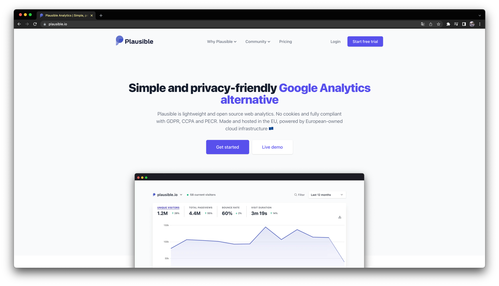
*Plausible Analytics 공식 홈페이지 화면*

비슷하면서 아주 유명한 도구로 [GA(Google Analytics)](https://analytics.google.com/analytics/web/)가 있는데,
뭐가 많고 복잡한 GA보다 Plausible Analytics이 더 간단하고 직관적이며 가볍다.
당장 위 대시보드만 봐도, 블로그 같은 곳에 되게 가볍게 쓰기 좋다고 느낄 수 있을 것이다.

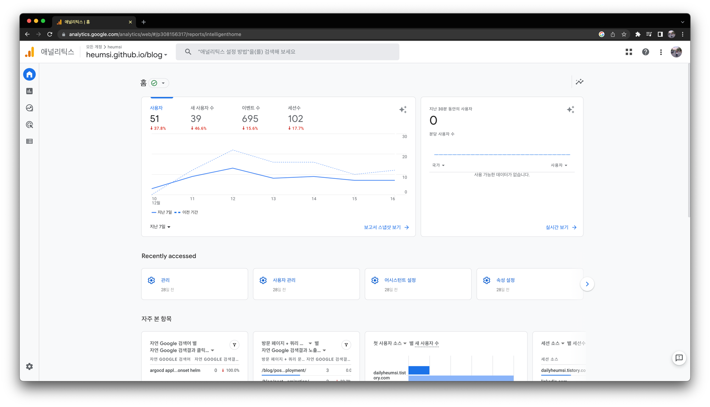
*기능은 많지만 다소 복잡한 GA*

나는 원래 블로그에 Web Analytics으로 GA를 쓰고 있었는데, GA에서 대시보드 구성 중에 차트의 부족함과 설정에 대한 피로감을 느껴,
GA 대안 도구를 찾고 있었다. 대안 도구로는 다음의 것들이 있었다.

- [Plausible Analytics](https://plausible.io/)
- [Ackee](https://ackee.electerious.com/)
- [Hotjar](https://www.hotjar.com/)
- [Posthog](https://posthog.com/)
- [Umami](https://umami.is/)

여기서 Plausible Analytics가 Github Star 수가 제일 높기도 하고, 문서도 깔끔하게 되어있어서 이를 선택하게 되었다.

## SaaS (Cloud)

공식 홈페이지에 들어가면 Plausible Analytics을 쉽고 빠르게 사용할 수 있게 SaaS 형태로도 제공하는데,
일단 30일은 트라이얼 기간으로 준다.

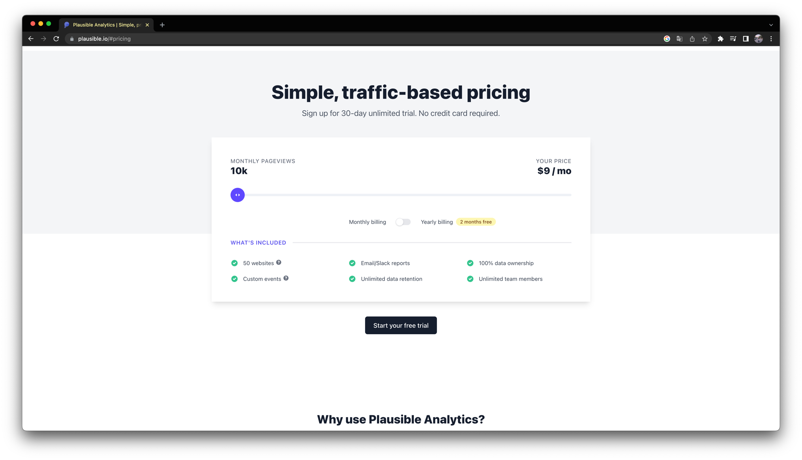

결제 정보를 입력하지 않고, 계정만 만들면 사용할 수 있다.

## Dashboard & Panels

계정을 만들고 블로그 연동과 관련된 작업을 몇가지 해두면, 다음처럼 대시보드 화면을 볼 수 있다.

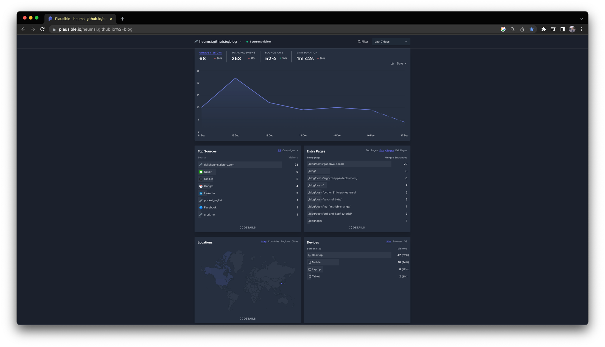

대시보드에는 총 5가지 패널이 나오는데, 각 패널들은 다음과 같은 차트와 데이터를 보여준다.

- 전반적인 통계에 대한 대표 값과 시계열 그래프
  - 유니크 방문자 수 (Unique Visitors)
  - 총 페이지 뷰 (Total Pageviews)
  - 이탈율 (Bounce Rate)
  - 방문 지속 시간 (Visit Duration)
- Top N 유입 소스에 대한 통계
  - 유입 소스 (Top N Sources)
  - 소스 내 유입 경로 (Top Referrers)
- Top N 페이지별 통계
  - 페이지의 방문 수 (Top Pages)
  - 페이지의 유니크 방문 수 (Entry Pages)
  - 페이지의 이탈 수 (Exit Pages)
- 사용자 인구, 통계 정보
  - 지도
  - 나라
  - 지역
  - 도시

재밌는건, 특정 패널 내 값을 선택하면, 해당 값으로 대시보드 내 데이터가 필터링 되어, 대시보드가 그 값에 맞게 다시 갱신된다는 것이다.

예를 들어, Top Sources에서 `dailyheumsi.tistory.com` 소스를 클릭하면, 
다음처럼 대시보드 전체가 `dailyheumsi.tistory.com` 소스 기준의 데이터로 갱신된다.

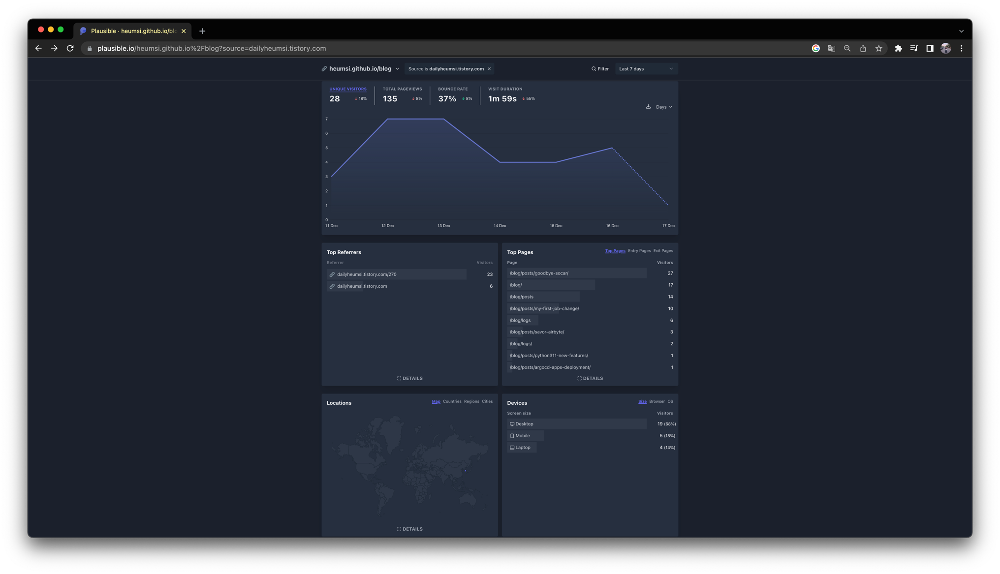

또 이 상태에서 Top Pages에서 `/blog/posts/goodbye-socar/` 페이지를 클릭하면,
다음처럼 대시보드 전체가 `dailyheumsi.tistory.com` 소스 기준이면서 `/blog/posts/goodbye-socar/` 페이지 기준의 데이터로 갱신된다.

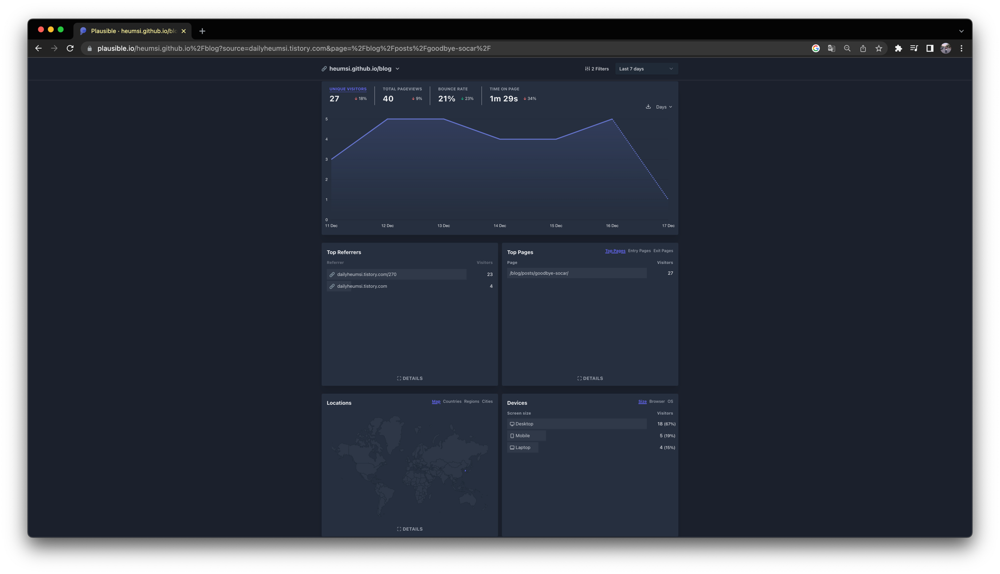

이런식으로 보고자 하는 범위에 맞게 데이터와 대시보드를 드릴 다운 해나갈 수 있다.

대시보드 우측 상단에 보면 Filter라는 버튼이 보이는데, 이렇게 드릴 다운해나간 항목들이 이 필터 내에 담겨있게 된다.
직접 다음처럼 Filter 버튼을 눌러 설정할 수도 있다.

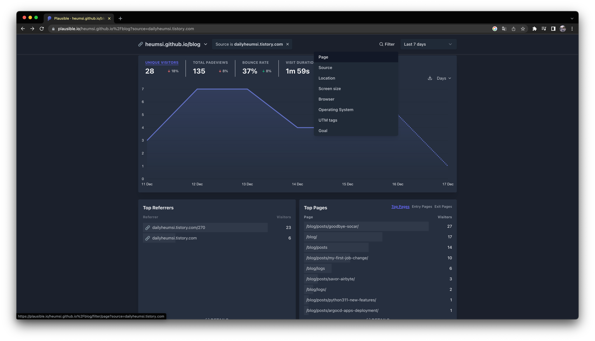

## Time Range

Filter 버튼 옆 컴포넌트을 클릭하면 다음처럼 시간 구간(Time Range)을 설정할 수 있다.

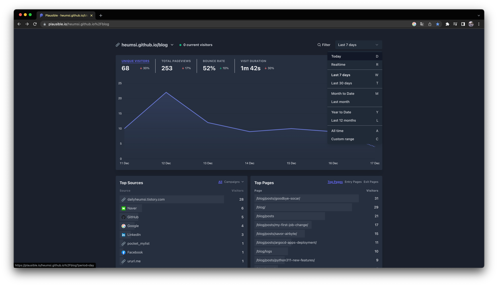

시간 구간을 바꾸면 다음처럼 전체 데이터와 대시보드가 갱신된다.

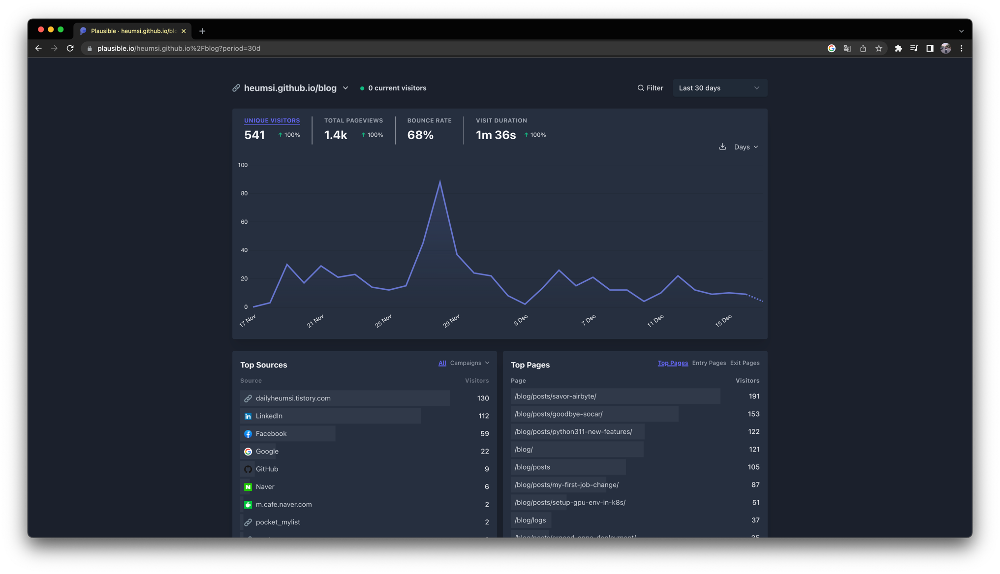

## Google Search Console

블로그에 Google Search Console을 붙여놨다면, 다음처럼 Plausible Analytics Site Settings 페이지에서 Google Search Console이랑도 연동이 가능하다.

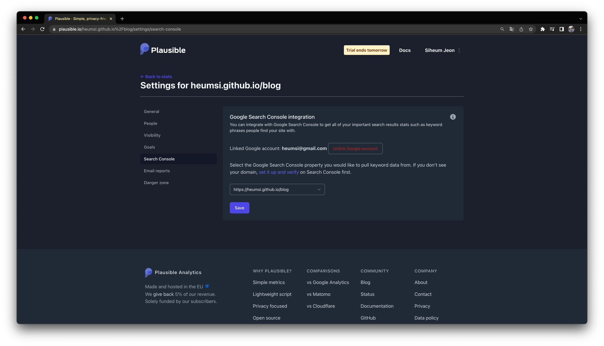

이렇게 연동해두면, Top Sources에서 `Google` 소스를 클릭했을 때 다음처럼 Top Referrers가 아닌 Search Terms이 나오게 된다.

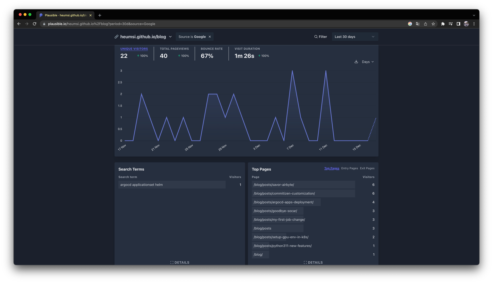

## Email Reports

다음처럼 Plausible Analytics Site Settings 페이지에서 이메일로 위클리 리포트를 받아보는 설정을 할 수도 있다.

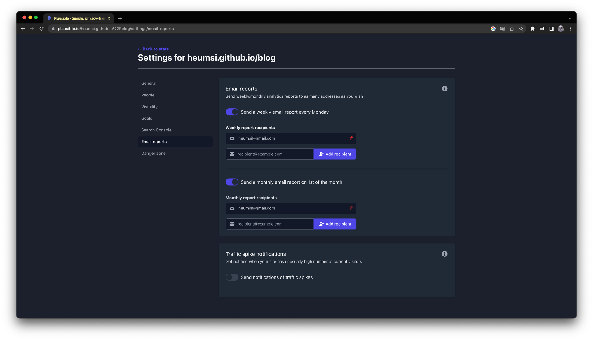

이렇게 설정해두면 주 단위로 다음과 같은 리포트를 이메일에서 볼 수 있다.

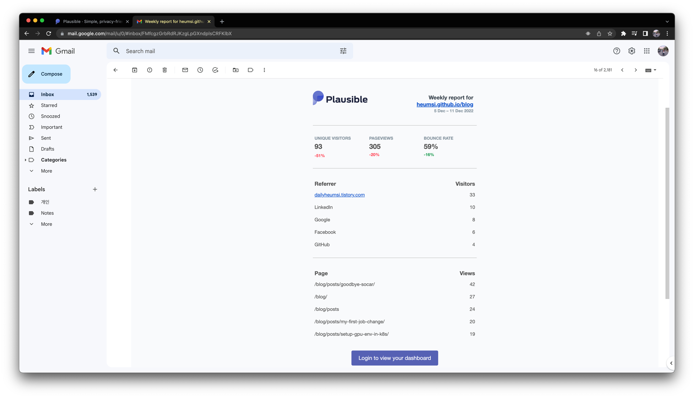

## Self Hosting

무료 트라이얼 기간이 곧 끝나서, 이제 SaaS가 아닌 Self Hosting으로 Plausible을 사용해보려 한다.
설치 및 배포 방법은 [공식 홈페이지](https://plausible.io/docs/self-hosting)에 아주 친절히 다 나와있다.

먼저 VM이 하나 필요한데, 나는 GCP에 있는 프리 티어 GCE(Google Compute Engine)를 사용하기로 했다.
프리 티어 GCE에 대한 내용은 [GCP 관련 문서](https://cloud.google.com/free/docs/free-cloud-features#free-tier-usage-limits)나, 아래 스크린 샷 내용을 참고하면 되는데,
요약하면, 아무튼 가장 싼 VM 인스턴스 하나를 계속 써도 돈이 안나온다는 내용이다.

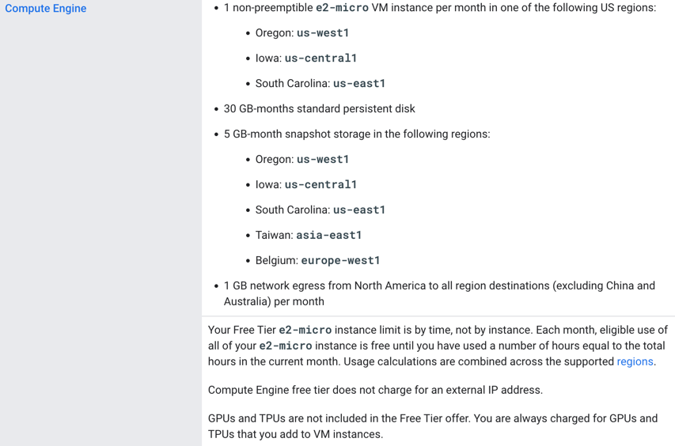
*GCP 문서 화면 일부*

여튼 GCE에 ssh로 접속하여 Docker, Docker Compose를 설치해준 뒤, 공식 문서에 나오는대로 Plausible Analytics을 배포하면 된다.
이 과정 중에 VM IP에 붙일 도메인도 필요하고, VM이 https도 지원하게 해야하는데, 도메인은 [Duck DNS](https://www.duckdns.org/)를 통해 서브 도메인을 무료로 받았고,
https에 필요한 인증서 및 세팅은 [Certbot](https://certbot.eff.org/)을 사용해서 빠르고 쉽게 해결할 수 있었다.

배포하고 브라우저로 접속하면 처음 화면으로 다음 화면이 등장한다.

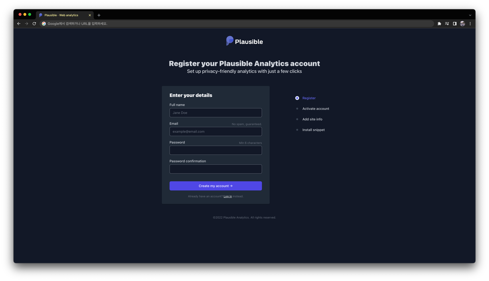

SaaS 버전에서와 마찬가지로 똑같이 계정 만들고, 사이트 등록해주고, 스크립트 코드 심어주면 된다.

그러면 다음처럼 SaaS 버전에서 쓰는 것과 동일한 화면이 등장하게 된다.

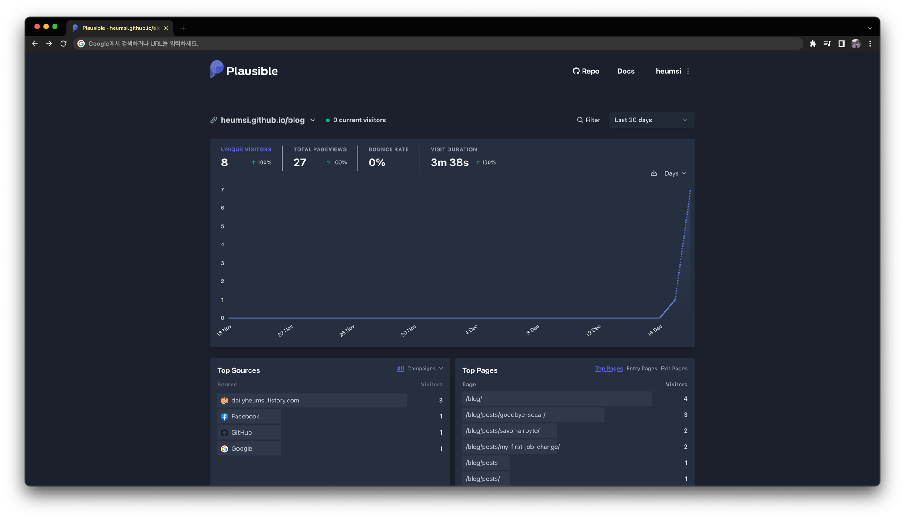

무료 VM이라 성능이 과연 얼마나 받춰줄 수 있을지 모르겠지만, 일단 돌아는 가니까... 
이걸로 매달 9달러는 굳혔다!

## 후기

GA랑 비교하면, 훨씬 간결하고 깔끔하다. 
"알잘딱깔센"이 딱 들어맞는달까?

고오급 기능은 없지만(사실 어울리지도 않고), 나처럼 가볍게 블로그 통계 대시보드를 보는데에는 딱 핏한거 같다.
블로그에 GA도 물론 연동해놨지만, 왠만하면 Plausible Analytics를 주로 볼거 같다.
