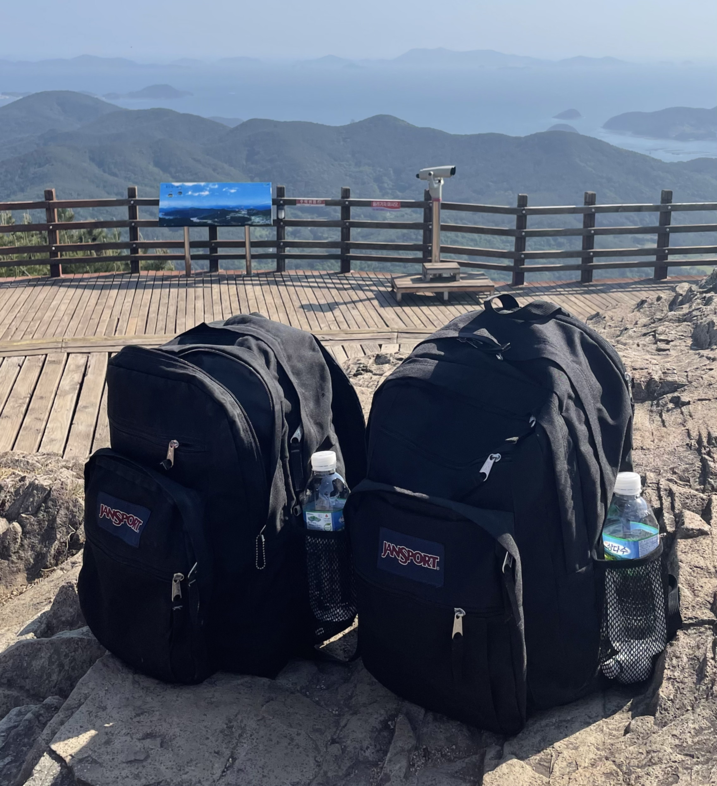

귀찮지만, 연말에 회고는 해야 한다.
내용이 구릴거 같아도 아무튼 해야 한다.

KPT나 3L 같은 회고 방식은 안 쓰겠다.
그저 생각나는 것들 위주로, 의식의 흐름대로 그냥 "적기"만 할 것이다.
이번 회고는 최소한으로 적어두고, 즐거웠구나, 그랬구나 정도로 만족하려 한다.

올해 1월부터, 지금 글을 작성하는 시점인 12월까지 하나씩 떠올려본다. 

## Airflow 튜토리얼 문서를 작성했다.

1월부터 3월까지, [Airflow](https://airflow.apache.org/) 공식 문서를 보고 [튜토리얼 가이드 문서](https://heumsi.github.io/apache-airflow-tutorials-for-beginner/)를 작성했다.
회사에서 주로 다뤘던 Airflow에 대한 기초 지식을 어딘가에 정리하고 싶었다.

사실 Airflow에 대한 이미 훌륭한 가이드나 강의가 많긴 했지만, 역사 교과서를 노트에 필사하며 외우듯이 직접 작성하고 싶었다.
Airflow 공식 문서의 내용은 꽤 방대한데, 이 중에서 우리 팀에 신입이 들어온다면 이 정도는 알면 좋겠다 싶은 내용들 위주로 작성했다.

추후에 작성한 다른 문서들도 그렇지만, 누군가에게 보여주기 위한 문서라기보다는, 그냥 내가 공부한 걸 정리한 노트가 되었다.
난 이런 식으로 학습하는 걸 좋아하나 보다.

아직 미완성된 부분은 있지만, 그냥 퍼블리싱 했다.
미완성된 부분은, 내가 나중에 Airflow 더 다루게 되는 날이 오면, 그때마저 적어 넣어야겠다고 생각했다.
그때가 되면, 레퍼런스 모음 문서도 만들어볼 생각은 있다.

## 쏘카에서 일하며 느낀 몇가지

4월까지 쏘카에서 무탈하게 일했다.
뭘 했는지는 지금은 기억이 잘 나지 않는데, 떠오르는 몇 가지의 단편적인 것들만 적어보면 이렇다.

- 비즈니스 분석가인 셀라나 키노를 보니, 꼭 에어플로우 같은 워크플로우 툴이 아니더라도, 구글 스프레드시트로도 데이터 오퍼레이션 파이프라인을 만들 수 있음을 알았다.
  - 정교함이나 스케일적으로는 한계가 있겠지만, 비즈니스 초기나 스프레드시트가 편한 비즈니스 담당자들에게는 에어플로우 같은 것 보다 구글 스프레드시트가 더 훌륭한 도구일 수 있겠다 싶었다.
- 업무의 가시화는 너무나도 중요하다. 과연 우리는 2주 전보다 더 나아졌는가? 어떻게 알 수 있을까?
  - 정성적인 회고를 넘어서, 그래서 나아졌는지에 대한 정량적인 결과를 알고 싶다.
  - 데이터 관련 팀인데, 우리가 일하는 방식은 데이터를 기반으로 하여 효율적으로 일하고 있는 걸까?
  - 지표를 기반으로 현재 우리가 일하는 퍼포먼스를 측정하고 개선하는 것에도 노력을 기울이면 좋겠다.
- 열심히 일하는 것도 중요하지만, 팀원들이 효율적으로 소통할 수 있는 프로토콜이 중요하다.
  - 특히 조직이 커 갈수록 이 차이가 급격하게 벌어지는거 같다.
  - 그런 점에서 템플릿, 컨벤션, 문서화, 라벨링은 중요하다.

특히 위에서 느낀 몇 가지는 계속해서 내 마음속에 이슈로 남아, 누군가와 이야기할 때 자주 꺼내는 토픽이 되었다.

## 이직 과정 중 여러 사람들을 만났다.

쏘카에서 만 2년 정도를 채우고, 회사를 떠나게 되었다.
3월 중순부터 타 회사에 입사 지원을 넣었으며, 4월 퇴사 및 이직을 확정하게 되었다.

이 과정 중에 내 인생에서 처음으로 다음의 경험들을 해보게 되었다.

- 팀장님에게 "저 다음 달에 회사를 떠날 거 같아요"라고 말한 일.
- 팀원들과 소주를 주고받으며, 합격한 회사와 과정, 그리고 고민을 털어놓은 일
- 여태껏 퇴사한 분들처럼, 나도 사내 여럿 분들과 점심 그리고 티타임 하며 서로의 커리어 계획을 이야기한 일
- 처음으로 꽤 많은 회사의 면접에 들어가고, 면접으로 탈탈 털리기도, 재밌기도 했던 일
- 합격한 회사들에 자신 있게 희망 연봉 메일을 적어보낸 일
- 여러 면접과 티타임을 하며 세상에 참 좋은 엔지니어 분들이 많고, 이 업계로 잘 왔다고 느낀 일

"착하고 겸손하게 살아야겠다"와 "다음 이직까지 부끄럽지 않게 열심히 내공을 다져야겠다"라는 생각이 들었다.

*잘 가라며 나에게 법규를 날려주는 쏘카 팀원들. 난 이 사진이 왜 이렇게 좋은지.*

> 퇴사와 이직에 관한 글은 이전에 블로그 아래에 적어두었다.
> 
> - [나의 첫 회사, 쏘카를 떠나며 쓰는 회고](https://heumsi.github.io/blog/posts/goodbye-socar/)
> - [나의 첫 번째 이직 회고](https://heumsi.github.io/blog/posts/my-first-job-change/)
> 
> 비교적 생생한 그때 느낌이 글에 녹아있다. 역시 회고는 적어두면 이득이다.

## 한 달간 푹 쉬었다.

쏘카에서 퇴사하고 다음 회사 입사일까지 5월 한 달을 여유있게 쉬었다.

한 달 동안 다음의 것들을 했다.

- Python으로 REST API 서버 만들었다.
- 블로그를 옮겼다.
- 운전 면허를 땄다.
- 일주일간 내일로 여행을 다녀왔다.

### Python으로 REST API 서버 만들었다.

[Python으로 REST API 서버 만들기](https://github.com/heumsi/python-rest-api-server-101)는 게시판 API 서버 하나를 만들더라도, 차근차근 잘 만들어보자는 생각으로 시작한 거였다.
싱글 모듈로 시작해서, 레이어드 아키텍처, 모듈 분리와 프로젝트 구조, Hateoas 그리고 API 버저닝을 고려한 RESTful API 서버를 만들어나가는 과정을 담고 싶었다.
누구나 이 과정을 거치면 기본적인 CRUD 설계와 응용은 잘 할 수 있을 거란 생각이 들었다.

코드는 다 완성했는데, 문서는 다 작성을 못했다.
문서 초기 부분을 작성하다가, 어느 순간 힘이 빠져서, 그냥 퍼블리싱 안 한 채로 두게 되었다.

결국 누군가에게 설명하고자 하는 본래 목적을 달성하지는 못했지만, 나름대로 차근차근 만들어나가며 패턴을 잡은 걸로 만족한다.
이것도 나중에 생각이 나면 미완성된 문서를 더 작성하지 않을까 싶다.

### 블로그를 옮겼다.

취업 준비 시절 때부터 쓰던 [티스토리 블로그](https://dailyheumsi.tistory.com/)를 마무리짓고, [Github로 블로그를 옮겼다.](https://heumsi.github.io/blog/)
언젠가 해야지 해야지 했던 건데, 푹 쉬는 시즌에 아주 즐겁게 할 수 있었다.
나의 홈페이지를 꾸미는 건 어릴 때에도 그렇고 지금도 역시 즐겁다.

블로그를 옮긴 이유는, 티스토리에 더 이상 묶여있고 싶지 않아서였다.
디자인도, 글을 쓰는 방식도, 데이터도 모두 특정 플랫폼에서 벗어나고 싶었다.
옮겨온 지금. 아주 만족한다.

쏘카에서 기술 블로그를 관리할 때 [Jekyll](https://jekyllrb.com/)을 썼어서, 내 블로그도 Jekyll을 쓰는 것이 나쁘지는 않겠다 싶었는데,
결국에는 Jekyll을 쓰지 않고 [Gatsby](https://www.gatsbyjs.com/)를 썼다.
이유는, 이럴 때 아니면 언제 Gatsby 쓸까 싶어서였다.
Gatsby라는 비교적 쉬운 난이도로 GraphQL과 React를 조금이라도 맛볼 수 있으니, 시간이 조금 걸리더라도 익히는 재미나 보람은 충분하다고 생각했다.

"일단 플랫폼 따지지 말고, 공부한 내용 정리해두자!"라는 생각으로 시작했던 티스토리 블로그.
내 취업 준비 시절의 고민과 생각들, 첫 회사에서의 경험과 느낀점이 그대로 다 남겨져 있어서 아주 아련하다.
어릴적 일기장 마냥. 과거의 기억을 그대로 간직한채 보관해두려 한다.

### 운전 면허를 땄다.

쏘카 다니며 가장 한이 되었던 운전 면허 따기.
나는 무려 "운전 면허"가 없어서, 직원 최대 복지 중 하나인 쏘카 75% 할인을 받지 못했다.

퇴사하자마자 바로 운전 면허 학원을 등록했다.
목표는 2종 보통이었다.
한 일주일이면 딸 줄 알았는데, 생각보다 시간이 걸려서 당황스러웠다.
이 때문에 바로 어디 여행 가지도 못했다.

기능은 무난히 합격, 도로 주행은 도로 나가기 전에는 굉장히 쫄렸는데,
막상 해보니 40~50킬로가 별로 빠르게 느껴지지 않았고, 생각보다 아주 스무스하게 합격했다.

자 이제 쏘카만 있으면 되는데...
면허 딴지 1년이 지나기를 기다리고 있다.

### 일주일간 내일로 여행을 다녀왔다.

대학 동기인 경호형과 일주일간 내일로 여행을 갔다 왔다.
내일로는 20살 때 간 이후로 처음이니, 거의 9년 만에 가보는 셈이다.
그때는 대학생들 사이에서 내일로 가 한창 유행이었는데, 이번에는 놀라울 만큼이나 아주 조용한 내일로 여행이었다.

*통영에서. 가방이 같았던 우리*

여수, 순천, 통영, 부산, 경주.
아주 꽉꽉 알차게 갔다 왔다.

역시 시간이 지나면 남는 건 여행인가 보다.
다음에도 갭 먼스가 생기면, 무조건 여행을 가야겠다.

## 라인 플러스에 입사했다.

6월 7일 화요일. 라인 플러스에 입사했다.
취업 준비 시절 오고 싶었던 회사 중 하나였는데, 이렇게 경력으로 오게 되다니.
감회가 새로웠다.

입사 후 몇 주 동안은 팀 리드이신 찬형님과 거의 매일 티타임을 했다.
라인 플러스 문화는 어떤지, 조직 내 우리 팀의 위치나 역할은 무엇이고, 팀장님이 바라는 미래가 무엇인지 등을 알 수 있었다.

쿠버네티스로 구글링하다 보면 [커피고래의 블로그](https://coffeewhale.com/)를 자주 보게 되는데, 이 블로그의 주인장이신 홍근 님도 같은 팀으로 만나게 되었다.
평소 보던 글 내용만큼이나 유쾌하고 재밌으셨다.
나랑 같은 MBTI 타입이신가 했는데, 나중에 알고 보니 아예 정반대셨다.
사회화된 MBTI 버전도 따로 있어야 되지 않나 싶은 생각이 들었다.

*입사 선물 중 하나였던 플래너*

라인 플러스에 입사하고 약 7개월이 지난 지금, 무얼 경험했는지 떠오르는 대로 한번 적어본다. 

### 온-프레미스 기반 플랫폼과 조직을 경험했다.

라인 플러스는 쏘카 때와는 다르게 완전히 온-프레미스 인프라 환경이었다.
이 때문에 인프라 조직이 매우 컸고, 인프라를 사용하는 내 입장에서도 클라우드와는 전혀 다른 사용감과 조직 체계를 경험해 볼 수 있었다.

일단 우리 팀이 다루는 쿠버네티스 클러스터에 노드를 직접 추가하고 삭제해야 했으며, 더 이상 매니지드 쿠버네티스에서 누릴법한 기능들은 없었다.
(온-프레미스를 경험해 보니, 클라우드가 얼마나 편한지 알겠다.)

쿠버네티스 클러스터를 빌드 하는 것부터 [kubespray](https://github.com/kubernetes-sigs/kubespray)로 해야 했는데, 이는 완전히 처음 써보는 도구였다.
또한 ansible 같은 도구도 처음 써보며, 실제로 클러스터 하나를 빌딩 하는데 어떤 일들이 일어나는지 이전보다는 더 자세하게 알 수 있었다.
(클러스터 빌딩 과정이 궁금해서, [Kubernetes the hard way](https://github.com/kelseyhightower/kubernetes-the-hard-way)를 따라 해봤는데, 생각보다 뭐가 많으면서도, 또 생각보다 별거 없네라는 생각이 들었다.)

아무튼 클러스터 빌딩부터 시작해서, CSI, CNI, Scheduler, Admission Controller 등 이전 쿠버네티스 경험과 비교하면 꽤 Low 한 것들도 봐야 했다.
나에게 "클러스터를 사용하고 운영한다"라는 개념은 이전과 달라지게 되었다.

사실 클라우드가 훨씬 편하다는 생각이 들긴 했지만, 그래도 라인 플러스 정도 되는 조직 규모에서 이 정도의 온-프레미스 환경을 구축하고 운영하는 것도 내 경험적으로 나쁘진 않겠다는 생각이 들었다.
클라우드, 온-프레미스 둘 다 경험을 가지고 좀 더 유연하고 넒은 시야를 가질 수 있을 거 같았다.

이제 7개월이 지나니 온-프레미스 자체는 어느 정도 익숙해졌다.
이제 GKE나 EKS를 사용하게 되면 단순히 사용자 입장이 아니라, 클라우드 서비스 개발자, 운영자 입장으로의 시야에서 생각해 볼 수 있을 것만 같다.

### 이전과 전혀 다른 사람들을 만났다.

사람들이나 회사 분위기도 쏘카 때와는 많이 달랐다.

쏘카 때는 확실히 스타트업 느낌의 통통 튀는 분위기가 있었다.
팀원들과 이야기하다 보면 "이거 시도해보자. 저거 시도해보자."라는 말이 많았고, 슬랙에서 이야기도 아주 활발했다.
빠르게 시도하고, 빠르게 결과를 냈다.

외부의 변화도 잦았다.
예를 들어, 비즈니스 오퍼레이션 변화로 인해 몇 달 전에 만든 파이프라인을 새로 디자인해야 하는 경우도 있었다.

업무 말고 사적인 활동이나 이야기도 많이 나누었고,
엔지니어링 그 자체보다는 사업이나 본인 인생에 대한 야망을 가진 분들이 많았다.
내가 속한 부서가 엔지니어들만 모여있던 부서가 아니어서 그랬던 거 같기도 하고,
직원 평균 연령이 낮았던 것도 한몫한 거 같다.

한편, 라인 플러스는 조용하게 진득하신 분들이 많은 거 같다.
이미 세부적으로 분업화가 잘되어 있고, 그 분업화된 조직 안에서도 기술적으로 해결해야 할 문제가 꽤 많았다.
전체 덩치가 크고, 많이 얽혀있다 보니, 쉽게 시도하기보다는 변화에 따른 사이드 이펙트를 심도 있게 고려해야 했다.
뭔가를 시도해 보려면, 같은 팀원이라도 제대로 할 설득할 준비를 해야 했다.
그리고 좀 더 큰 변화는 내 레벨에서 보이지 않는 영역까지 여파를 미칠 수 있기 때문에, 쉽게 제안해 보기는 어려웠다.

연령대, 연차도 꽤 다양했다.
대부분의 팀원들은 경력직이었고, 각자 잘하는 업무나 스킬을 최소 하나씩은 가지고 있었다.
확실히 내가 입사할 때 기대하던 "시니어 분들이 많은 환경" 이었다.

사내 세미나, 클래스를 통해 궁금했던 기술들을 쉽게 교육받을 수 있었다.
나는 올해 사내 MongoDB, MySQL 기초 강의를 들었는데, 웬만한 유료 강의보다 훨씬 좋은 퀄리티였다.
(사내에서 강의해 주셨던 분이 패스트 캠퍼스에서 유료 강의를 하고 계시기도 했다.)
이런 클래스를 직접 들을 수 있는 건 사내 최고 복지라는 생각이 들었다.

연차가 높은 분들이 많이 계시지만, 갑질이나 꼰대 문화는 전혀 없었다.
오히려 수평적 커뮤니케이션을 가지고 있으며, 실력 있는 겸손한 엔지니어들의 모습을 볼 수 있었다.
나에게 좋은 귀감이 되어주셨다.

*팀에서 첫 아웃팅 때, 규형 님, 홍근 님과 치열하게 했던 보드게임, 쿼리도*

지금 생각해 보면, 쏘카에서는 나와 너무 잘 맞고 비슷한 사람들이랑만 있었던 거 같다.
비슷한 나이, 비슷한 연차, 비슷한 성향 등등.
편하고 즐거운 환경이긴 하지만, 힘을 덜 들여도 되는 세이프 존이었을 수도 있겠다는 생각이 든다.

라인 플러스에 와서는 나와 꽤 다른 사람들, 업무 분위기를 만나보게 되었다.
다양한 나이대, 다양한 연차, 완전 반대 성향 등등.
이전보다 쉽지는 않지만, 안전했던 조직을 나와 "일반적인 조직"에서 생존하는 법을 배우고 있는 중이라 생각한다.

### 운영 및 트러블 슈팅 경험을 했다.

입사 후 팀에서 가장 비중 있게 했던 업무는 쿠버네티스 운영이었다.
우리 팀이 빌딩 한 쿠버네티스 클러스터를 여러 데이터 관련 조직에서 사용하고 있는데,
이런 조직으로부터 뭐가 안된다, 이런 걸 하고 싶은데 어떻게 하면 되냐 등등의 요청을 받곤 했다.
그러면 나는 요청을 팀 내 요구사항 티켓으로 만든 뒤, 어떻게 하면 좋을지 팀 내에서 논의를 이끌기도 하고, 여러 대안을 찾아 공유했다.

뭐가 안된다는 요청이 오는 경우, 나도 뭐가 뭔지 잘 모르는 경우가 대부분인데, 그럼 진짜 맨땅에 헤딩하듯이 일을 시작하게 된다.
쿠버네티스 공식 문서를 뒤져보기도 하고, 슬랙에서 영어로 이것저것 물어보기도 하고, 필요한 대시보드를 그라파나에서 찾다가 없으면 만들어두기도 하고...
하지만 거의 대부분은 팀원들에게 도움을 받는 경우가 많았다.
그들 옆에서 어떻게 문제에 접근하는 것부터 시작하는지 지켜보는 건 정말 좋은 경험이라 생각한다.

없던 무언가에 대해 새로 기능을 제공해 줘야 하는 경우, 운영 정책에 대해서 생각해 보게 되었다.
예를 들면 이런 것들이었다.

- 클러스터에 GPU 리소스를 들여오는 경우, 모든 테넌트가 GPU를 가능한 대로 사용하기 원할 텐데, 리소스는 어떻게 분배해야 할까?
  - GPU 노드 풀은 어떻게 구성하고, 사용자들이 어떻게 사용할 수 있게끔 가이딩해야 할까?
- 클러스터에 용량이 큰 컨테이너 이미지를 빠르게 배포하고 싶다고 한다. 어떻게 해야 할까?
  - 이미지 용량 최적화부터 해달라고 해야 할까? 클러스터 노드랑 가까운 곳에 Harbor를 띄워야 할까? 클러스터 차원의 Pre-Pulling을 지원해 줘야 할까?
  - 현실적으로 Pre-Pulling을 지원해 줘야 할거 같은데, 그러면 모든 노드에 대해서 지원해 줘야 할까? 그러면 로컬 스토리지 용량에 부담은 없을까?
  - 모든 테넌트가 다 Pre-Pulling을 쓰고 싶어 할 거 같은데, 어떻게 가이딩 해줘야 할까?

클러스터를 한 사람 혹은 한 팀만 사용하는 게 아니라 팀 단위로 사용하다 보니, 운영 정책을 마냥 심플하게만 세우는 게 쉽지 않았다.
클러스터라는 작은 마을에 사는 여러 사람들의 이해와 우리 팀의 운영 리소스를 생각해야 하니, 마치 정말 작은 마을을 운영하는 것과 비슷하다 느껴졌다.
아직은 동사무소 규모지만 더 잘 운영해서 시청 급으로도 키우고, 누구나 살고 싶어 하는 동네를 만드는 재미랄까.
그래서인지 사용자로부터 요청이 오면 내가 도와줄 수 있는 한 적극적으로 도와주고 싶었다.

그리고 갑자기 잘 돌던 시스템이 어느 순간 장애를 일으키는 경우도 있었다.
이런 장애가 클러스터 사용자에게 부정적인 영향을 미치는 경우, 이 장애는 "아웃티지"로 분류되고, 팀원들은 하던 일을 멈추고 이 장애를 해결하기 위해 뛰어들곤 했다.
원인도 잘 알고 있고, 해결할 방법도 알면 좋겠지만, 대부분의 경우 이렇게 쉽게 풀리지 않았다.
새벽 6시까지 잠 못 자고 뭐가 문제일까, 팀원 다 같이 끝낼 때까지 끝낼 수 없던 적도 있었다.

정리해 보면, 엔지니어들을 위한 "플랫폼" 운영, 그 와중에 여기저기 터지는 장애 처리, 추후 안정성을 위한 대안에 대한 고민을 주로 경험했다.
개발을 중심으로 일했던 나에게 소방관 마냥 이렇게 매번 장애를 대응하고 예측 불가능한 상황에 놓이는 건 사실 그렇게 재밌는 업무는 아니었다(누군들 좋아하겠냐마는...).
하지만 결국 조직 내 누군가는 해야 하는 업무기도 하고, 내 커리어에서 이런 운영 과정 역시 필요한 경험이라고 생각은 들었다.
또 막상 기술적인 장애를 겪으니, 1인분 하기 위해 기술적인 내용을 이전보다 더 다이브 해볼 수밖에 없기도 했는데, 막상 이러면서 실력이 느는 게 아닌가 싶기도 했다.

그리고 "플랫폼"이라는 게 유저 맞춤을 위한 을의 입장이 되느냐, 유저들을 락인 시킬 수밖에 없는 갑의 입장이 되느냐.
희망하는 건 당연히 후자겠지만, 그렇게 되는 건 꽤 어려운 일임을 조금이나마 느낄 수 있었다.

## Terraform 핸즈-온 문서를 작성했다.

Terraform은 이전부터 너무 배우고 싶었는데, 딱히 현업에서 써볼 수 있는 기회가 없어서 뒤로 미뤄왔다.
그러다 어떤 일련의 삘이와서, 8월부터 간단한 목표를 세워 Terraform을 공부하며 [핸즈-온 문서](https://heumsi.github.io/hands-on-terraform-with-gcp/)를 만들었다.

기존의 튜토리얼 문서들을 보면 대부분 AWS 기반이 많았고, 실제 현업에서 운영까지 고려하여 어떻게 사용하는지에 대한 내용은 없는 경우가 많았다.
나는 AWS보단 내게 익숙했던 GCP 기반으로 만들어봐야겠단 생각과, 나중에 사이드 프로젝트를 할 때를 위해서라도, 지금 잘 작성해놔야겠다는 생각이 들었다.

*핸즈-온 문서 첫 페이지*

이전까지는 이런 튜토리얼 문서를 [Vuepress](https://vuepress.vuejs.org/)로 만들었었는데, 이번에는 [MkDocs](https://www.mkdocs.org/)로 만들어보았다.
이럴 때라도 좀 다양하게 Documentation 도구를 사용해 봐야지 하는 생각이 들어서였다. 
(다음에는 [Docusaurus](https://docusaurus.io/)를 써봐야겠다.)

여하튼 목표했던 만큼의 내용은 공부하고 잘 정리해둘 수 있었다.
다음에 사이드 프로젝트를 하게 되면 꼭 Terraform을 써봐야겠다.

## 시스템 디자인 스터디를 진행했다.

8월 말 쯔음인가 [DND](https://dnd.ac/) 7기 발표 모임에서, 열심히 그리고 좋은 퀄리티의 사이드 프로젝트를 만드는 분들의 발표를 보게 되었다.
이 발표 모임에 다녀온 후 삘 받아서 며칠 뒤에 ["가상 면접 사례로 배우는 대규모 시스템 설계 기초"](http://www.yes24.com/Product/Goods/102819435) 책을 읽고 주마다 정리, 발표하는 [스터디](https://buttered-vision-613.notion.site/206506405d444a51ba93a303ea663db4?v=b02097e914864269950a5cc3bc86c03d)를 만들었다.

*스터디 내용을 공유하는데 노션을 활용했다.*

나를 제외한 다섯 분과 함께 했으며, 9월 중순부터 시작해서 8주 동안 나름대로 재밌게 잘한 거 같다.
서현에 있는 회사까지 출근할 때 대략 1시간 반 정도 걸렸는데, 지하철에서 이 책을 읽으면 시간이 뚝딱 지나갔다.
책 내용도 너무 재밌고 나에게 필요한 내용들이었어서, 스터디를 매우 즐겁게 할 수 있었다.

11월, 위 스터디가 끝나고 몇 주 뒤 [이 책 내용을 구현하는 스터디](https://buttered-vision-613.notion.site/d61dea25f7c543c09d863b243313458a?v=010df4ec036649b08c2faca4561c23fe)를 하나 또 만들었다.
이번에는 책 내용을 정리하는게 아니라, 요구 사항을 정리하고 각자 나름대로 이를 [코드로 구현한다.](https://github.com/heumsi/implementing-system-design-interview)
그리고 격주 단위로 모여 각자 어떻게 구현했는지 발표한다. 

이번에는 나를 제외한 두 분과 함께하고 있는데, 저번 스터디보다 더 재밌다.
별다른 이슈가 없다면 내년 중순까지 계속할거 같다.

## 이렇게 적고 보니

이렇게 적고 보니... 작년 이맘때쯤 뭔가 계획이 있었던 거 같은데, 계획과 다르게 그때그때의 삘 대로 산거 같다.
모르겠다. 회사에서는 팀과 내 일을 계획 있게 두려고 하는데, 회사 밖에서는 그렇게 살고 싶지 않았나 보다.

이제는 복잡한 계획 같은 건 별로 생각하고 싶지 않다.
이미 미래에 하고 싶은 것들은 머릿속에 충분히 가득 차 있고,
잊지 않게 TODO들만 남겨놓고 있다.
마치 관심 있는 책은 당장 읽지 않더라도 일단 사두는 것처럼.

*사놓고 안 읽은 책들. 어느 순간 또 보게 되겠지.*

인생 즐겜 유저 하고 싶다.
유명한 엔지니어들처럼 멋진 업적 같은 건 못 세우겠지만, 그냥 나 재밌는 거 그때그때 하며 하고 살고 싶다.
뭐 공부해 보고 싶은 거 있으면 공부해 보는 거고, 하다가 안 하고 싶으면 또 안 하는 거고.
그러고 나중에 또 하고 싶으면 하겠지.
나중에 또 할 수 있게 재미만 잃지 않으면 된다는 생각이 든다.

뭔가 큰 결심. 큰 노력 이런 거 말고.
주어진 거 잘하기 위해 노력하고, 하고 싶은 것들도 틈틈이 하고,
시작과 끝을 잘 끝내고.
그렇게 하고 느낀 거 잘 정라 해두고.

이 정도만 하고 살아가자. 내년도.
