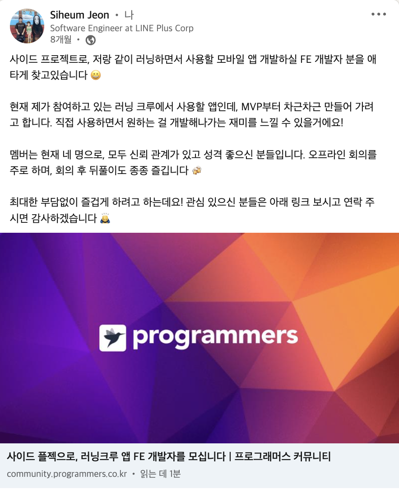
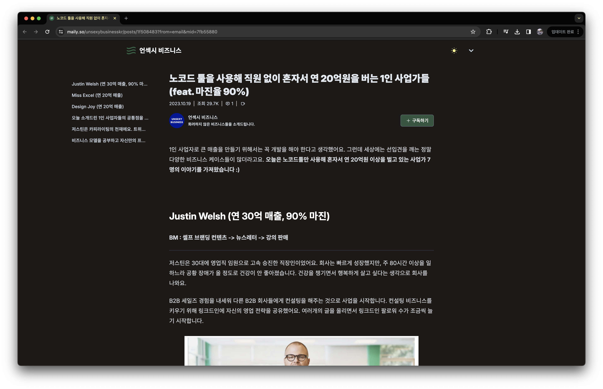

2023년에는 블로그 글을 한 편도 안 썼다.
유독 글을 올리고 싶단 생각이 별로 안 들었듯.

그래도 회고는 써야지.
2023년 12월에 글쓰기 시작해서, 결국 게으름 끝에 2024년 1월이 되어서야 퍼블리싱 한다.
와, 시간 짱 빨라!

다 적고 보니, 더 잘하기 위해 쓰는 회고라기보다는, 그냥 내 한 해를 정리하는 일기 정도라 보면 될거 같다.

## 회사에서

### Hollys

올해 초에 등장한 Python Web App Framework [Reflex(초기에는 Pynecone이라는 이름이었음)](https://github.com/reflex-dev/reflex)를 써보고 싶었다.
찍먹 해볼 겸, 회사 팀 내 있으면 좋을 웹 앱을 하나 개발했다.

*https://github.com/heumsi/hollys*

개발한 앱 이름은 [Hollys](https://github.com/heumsi/hollys).
설날 때쯤 동네 Hollys 카페에 눌러 앉아 일주일 정도 걸려 만든 거 같다.

Kubernetes 클러스터에 배포하면, 웹 UI에서 레이블, 테인트로 필터링하여 클러스터 내 노드 목록을 쉽게 볼 수 있다. 그리고 이렇게 쿼리한 노드 목록을 다른 팀원들이 볼 수 있게 저장할 수 있다.

우리 팀은 온-프렘 Kubernetes를 운영하면서 레이블과 테인트를 붙여서 노드 풀을 관리하고 있는데(EKS나 GKE 같이 노드 풀 리소스가 존재하지 않는다), 이런 노드 풀을 좀 더 가시화하고 싶었다.

결과적으로, 이 앱으로 기존에 노드풀 목록을 정리한 컨플루언스 문서를 대체할 수 있었다.
이제 노드 풀에 노드 추가할 때마다 컨플루언스 문서를 일일이 수정하지 않아도 된다.

한편, 파이썬으로 프론트엔드도 쉽게 개발할 수 있는 때가 온 걸 느낄 수 있었다. 물론 프로덕션 서비스로 괜찮은지는 아직 모르겠다. 다만 팀 내 FE 개발자가 없을 때 팀 내 도구 개발하기에는 충분히 쓸만한 거 같다.

### 유닛 이동

유닛을 옮겼다. 유닛은 팀 내 작은 조직이다. 조직도에 명시된 팀 내에서 자체적으로 분할된 비공식 조직이라 보면 된다. 우리 팀은 12명이고, 현재 우리 유닛은 나, 홍근님, 정수님 이렇게 3명이다. 

이전 유닛에서는 Kubernetes Reliability Engineering 업무를 주로 했다. 멀티-테넌트 클러스터를 어떻게 운영할 것인지, 여러 테넌트들의 요청을 어떻게 처리할 것인지, 여러 의존성은 어떻게 해결할지, 클러스터 단위 범위에서 모니터링은 무엇을 하고 어떻게 할 것인지 등등... 주로 멀티-테넌트 차원의 Add-on 컴포넌트 세팅, 클러스터 안정성과 관련된 일들이 많았다.

이번에 옮긴 유닛은 이전보다는 좀 더 High Level Layer에 있는 유닛으로, Kubernetes 운영 그 자체보다 Kubernetes 위에 올라가는 앱 세팅과 운영에 좀 더 중심을 둔다. 특히 데이터 플랫폼으로써 역할을 할만한 앱들에 관심을 두는데, Spark on Kubernetes라든가, Workflows(Apache Airflow, Argo Workflows 등) on Kubernetes가 이런 앱이 되겠다.

옮긴 유닛은 이전 유닛보다 내 스타일에 더 잘 맞았다.
영향을 줄 수 있는 범위(의존성)가 이전보다 작아서 좀 더 자유롭게 뭔가를 시도해보고, 결과를 확인하고, 피드백을 요청할 수 있었다.

가장 좋았던 것은, 비교적 최근에 릴리스된 기술에 대해 딥-다이브 할 시간을 주고, 이에 대해 꼼꼼히 조사하여 대안을 낼 수 있는 기회를 준다는 것이다. 예를 들어, 바로 아래에서 소개할 Kubernetes Resource Scheduler의 경우, 나는 관련 주제를 맘껏 조사하고, PoC 하고, 대안을 낸 뒤 제안하면 된다. 물론 이게 실제로 적용까지 되느냐 하는 건 좀 다른 문제이긴 한데, 아무튼 리뷰 단계에서, 시니어 분들의 이런저런 크리틱을 들을 수 있다. 내가 많이 까이는 게 문제긴 하지만. 그래도 내가 못 보던 관점을 배울 수 있었다.

한편 아쉬웠던 점은, 확실한 성과를 내기가 어려웠다는 것이다.
사실 성과라는 것 자체가 명확하지 않았기 때문이기도 한데, 우리는 기존의 요구사항을 파악해 뭔가를 만드는 팀이 아니라,
없던 것을 먼저 만들어 선보이는 팀이었기 때문이다.
따라서 내가 우리가 한 일의 결과가 조직에 유의미한 영향을 줄지 누구도 아주 명확하게 확신할 수 없었다.
우리 팀 식 표현으로 "이 산이 아닌가 봐" 하며 언제는 이걸 다뤘다, 또 언제는 다른 걸 다뤘다 하며 컨텍스트 스위칭이 많았다.
그게 빛을 발하려면, 결국 누군가가 써줘야 했고, 그게 언제가 될지는 잘 몰랐다.
이래저래 구축한 건 많으나, 운영까지 끌고 가는 경험은 부족했다는 생각이 든다.

### Resource Scheduler

새 유닛에서 내가 진행했던 작업 중 하나는, Kubernetes Resource Scheduler 도입이었다.

이는 Spark on Kubernetes의 전초 단계였는데, Spark on Yarn을 쓰던 기존의 테넌트들이 Spark on Kubernetes로 넘어올 수 있게 준비해야 했다. 이들이 기존의 Yarn에서 사용하던 Fair, Capacity 스케줄링 전략은 Kubernetes의 Default Scheduler에서 지원하지 않았다. 따라서 이 스케줄링 전략을 지원하는 별도의 Resource Scheduler를 고려해야했다.

몇 주 동안 Resource Scheduler에만 집중했다.
이 과정에서 [Volcano](https://volcano.sh/en/), [Apache Yunikorn](https://yunikorn.apache.org/), [Koordinator](https://koordinator.sh/), [Kueue](https://github.com/kubernetes-sigs/kueue)와 같은 도구들을 모두 살펴보고 PoC를 진행했다.

아직 대중적으로 널리 퍼지지 않은 도구들이라 그런지 알려지지 않은 문제들이 꽤 있었다.
예상대로 동작 안될 때는 GitHub Issue를 먼저 찾아봤고, GitHub Repository에 Issue 탭 자체가 없는 경우도 있었는데, 이럴 때는 직접 Apache JIRA에 가서 관련 티켓들을 찾아봐야 했다.
JIRA 티켓들을 보다 보면, 해당 기능이 어떤 히스토리를 가지고 나왔는지, 어떤 대화들이 있었는지를 알 수 있었다.
이런 컨텍스트를 익힌 후에 해당 오픈 소스의 코드를 몇 번씩 읽다 보면 어떻게 동작하는지, 뭐가 문제인지 조금씩 감이 왔다.

대부분의 경우 내가 원하는 작업을 정리한 문서가 어디에도 없었기에, 내가 직접 하나씩 해보고 알게 된 내용을 문서로 정리해두는 맛이 있었다. 예를 들어, 정말 Fair하게 스케줄링이 되는지, 그렇지 않은 경우, 코드로 확인해 보니 왜 그런 것인지 등등.
이것들만 가지고도 블로그에 쓸만한 글이 꽤 있는데, 추후에 써야겠단 생각이 강하게 들면 써야겠다. (사실 쓰다가 만 글이 몇 개 있다. 이놈의 귀차니즘...)

아무튼 여러 제약 사항과 운영 정책을 고려하여, 최종적으로 우리 팀은 Apache Yunikorn을 사용하기로 결정했다.
Configuration 구성부터 배포까지 내가 담당하게 되었는데, Resource Scheduler가 Spark on Kubernetes에 꽤나 핵심적인 컴포넌트이기도 하고, 앞으로 더 발전해나갈 프로젝트라 앞으로의 운영 경험이 기대가 된다.

### Spark on Kubernetes

Resource Scheduler 이후 나는 Spark on Kubernetes까지 맡게 되었다.
정확히 말하면, 이전에 다른 팀원이 Spark 특정 버전으로 어느 정도 코드와 문서를 만들어둔 게 있었고, 내가 이를 이어받아 고도화 시키는 셈.

구체적으로 다음과 같은 일들을 하였다.

- 특정 Spark 빌드 버전 뿐 아니고, 여러 버전을 지원할 수 있도록 코드를 구성
- 코드 수정 시 자동 테스트 및 배포 될 수 있도록 CI/CD 구성
- 쉽게 다운받을 수 있도록 installer shell script 구현

사실 Spark 자체를 Kubernetes에서 쓰는 건 별로 어렵지 않았다.
다만, 사내 데이터 저장소에 접근할 수 있도록 설정하는 일들과, 이렇게 설정된 Spark 파일들을 잘 패키징 하여 여러 테넌트가 쉽게 사용할 수 있도록 하는 일들은 조금 신경 쓸 일들이 있다.

예를 들어, 누군가는 Spark 3.2.x를 쓰고 싶어 하고, 다른 누군가는 3.4.x를 쓰고 싶어 한다.
또 누군가는 Python 3.8 버전을, 다른 누군가는 Python 3.9 버전을 사용할 수밖에 없는 환경에 있다.
이렇듯 Multi-tenant 환경에서는 여러 요구사항을 수용할 수 있게 Spark 빌드 파일들을 제공해 줘야 하고, 나 역시 이런 요구사항에 유연하도록 프로젝트를 구성해야 했다.

또한 Spark는 앞으로 여러 프로젝트에서 의존성의 코어가 될 중요한 컴포넌트이다.
따라서, 빌드 파일에 변경사항이 생겼을 때 매우 안전하게 배포되어야 한다.
이를 위해, 코드 수정 시 자동 테스트 및 배포가 가능하도록 CI/CD를 구성해야 한다.

*정말 자주 봤던 Spark on Kubernetes 공식 문서*

이 과정 중에 이런 고민들을 주로 했었다.

- Spark on Kubernetes Repository 구성을 어떻게 할 것인가?
- Spark 버전, 그리고 의존성 버전(Java, Python) 별로 어떻게 파일을 구성할 것인가?
- Spark 빌드 파일의 버저닝은 어떻게 할 것인가?
- CI/CD는 어떻게 구성할 것인가?
- 사용자(개발자) 문서는 어떻게 작성해야 할까?

고민에 대한 나름의 해결책들을 여기에 다 적기는 어려울 거 같고... 되도록 Keep It Simple을 생각하며, 최대한 간단하게, 그리고 추후에 변경사항에 직관적으로 수정할 수 있게끔 구성하려고 노력했다.

개발자 문서는 [Docs for Developers 기술 문서 작성 완벽 가이드](https://product.kyobobook.co.kr/detail/S000201419245)를 팀원들과 스터디하며 몇 가지 원칙들을 세워나가며 작성할 수 있었다.

그래서 결과가 최고로 마음에 드느냐 하면, 당연히 아닌데, 그래도 그런대로 최선을 다한 결과라고 생각하며 만족한다.
프로젝트를 운영하고 키워나감에 따라 계속해서 여러 고민의 결과가 녹아드는, 변화하는 결과물이 되었으면 좋겠다.

## 회사 밖에서

### 오런고 프로젝트

올해 초부터, 내가 사용할 만한 앱을 만들어보고 싶다는 생각이 들었다.
회사에서는 비즈니스 레이어와 너무 멀어져 있는 느낌도 들었고, 나는 개발자로서의 역량도 계속해서 갖추고 싶었다.
그리고 무엇보다 바닥부터 직접 조직과 서비스를 만들어나가는 경험을 해보고 싶었다.

이런 생각을 대학 동기인 상협이와 나누다가 상협이와 상협이 고등학교 친구인 용균 씨를 만나게 되었다.
용균 씨는 러닝 크루를 운영하는 크루 리더이었고, 상협이는 크루 멤버였는데, 러닝 크루를 운영하며 느낀 불편한 것들을 앱으로써 해소해 보자는 이야기를 나눴다.
나도 평소 러닝을 하고 있었으므로, 러닝 크루에 참여하여 앱을 같이 만들어나가면, 운동과 서비스 개발 모두에 동기부여가 될 거 같았다.
그래서 우리는 러닝 크루를 위한 앱 "오런고"를 만들기로 했다.
오런고는 오늘 러닝 고고를 줄인 말이다!

첫 만남은 5월 8일 월요일. 19시 30분. 공덕역에서 나, 상협이, 용균 씨, 그리고 용균 씨가 구한 디자이너 혜빈 님이 만나게 되었다. 첫 회의 끝나자마자 우리는 바로 공덕역 근처 삼치 회 맛집 남해바다에 가서 소주를 마셨던 기억이 난다.
모두 선어회와 소주를 잘 드시는 걸 보니, 일하는 궁합이 잘 맞을 거 같은 느낌적인 느낌.

FE 개발자 구인 공고도 올렸고, 곧이어 우태 님이 합류하게 되었다.
그렇게 우린 FE 1명, BE 2명, 디자이너 1명, PM 1명으로 구성된, 평균 나이 30.5세의 팀이 되었다.

*여러 채널에 구인 공고를 올렸는데, 링크드인이 제일 효과적이었다.*

매주 1회, 가능하면 오프라인 미팅을 진행했다. 
공덕에 무료로 빌릴 수 있는 회의실이 있어서 공덕에서 보았다.
20시부터 진행해서 22시까지. 끝나면 근처의 족발 집이나 전집 골목, 지겨우면 건너편에 고깃집에서 회식을 하곤 했다.
비슷한 나이, 비슷한 고민들을 해서 그래서 그런지 미팅도 회식도 늘 재밌었다.

생각나는 대로 그리고 필요한 대로 우리는 뭐든 진행했다.
JIRA와 Confluence를 만들고, Slack을 만들고, GitHub Org를 만들고... 하나하나 필요한 걸 만들어나갔다.
특히 내가 이런저런 협업 규칙과 자동화에 관심이 있었는데, 예를 들어 JIRA 프로젝트 세팅, 티켓 이슈 타입, 템플릿, 자동화, Confluence 페이지 관리 등등이 주로 그런 것들이었다.
"Keep It Simple"과 "불편한 건 합의하여 바꿔나가자"라는 원칙으로, 하나씩 우리 팀이 일하는 방식을 만드는 경험은 평소 내가 해보고 싶던 것들이었다.

*이슈 트래커로 어떤걸 쓸까 고민하다가 무난한 JIRA로 결정했다.*

나와 상협이는 BE를 담당하며, Kotlin과 Spring Boot3로 API 서버를 개발했다.
Spring Boot는 취준생 때 이후로 처음 써봤는데, 상협이가 현업에서 쓰고 있어서 도움받으며 개발하니 금방 적응할 수 있었다.
특히 ChatGPT와 GitHub Copilot을 사용하니 사실상 코드보다 주석 작성에 더 많은 시간을 쓰게 되었다.
Kotlin이나 Spring Boot 이 둘을 깊게 이해하는게 목표는 아니라서, 필요할 때 필요한 만큼만 공부했다.

*세 개의 Repository를 유지하며 계속해서 개발하고 있다.*

시작한 지 2개월 정도 뒤에 우리는 당장 사용할 수 있을만한 앱을 만들었다.
용균 씨의 러닝 크루 멤버들이 이 앱을 사용하며 피드백을 주고, 우리는 이를 반영하며 앱을 개선해나갔다.
아주 작지만, 트래픽이 발생하는 서비스를 만든다는 건 꽤 재미가 있었다.

우태 님이 개인 사정으로 팀을 떠나시고, 슬아 님이 새로 합류하시게 되었다.
슬아 님이 합류하시기까지 여럿 분들과 인터뷰를 진행했는데, 인터뷰란 게 참 어렵구나 싶었다.
우리 팀은 어떤 기준으로 사람을 선택해야 할까? 이 질문이 핵심이었는데, 멤버들과 이런저런 이야기를 나누며, 우리는 함께하고 싶은 사람에 대해 다음과 같은 우선순위를 정할 수 있었다.

- 안정성: 안정적으로 계속해서 참여할 수 있을까? 너무 바쁜 사람은 아닐까? 지속하기 어려운 환경은 아닐까?
- 역량: FE 개발 경험이 있나? 혼자서 해나갈 수 있을까?
- 커뮤니케이션 핏: 인터뷰하며 커뮤니케이션이 인상적이었나? 우리와 커뮤니케이션 스타일이 비슷한가?

우선순위를 정하고 결정해도, 사실 어느 정도 운칠기삼이라는 생각은 있었다.
고작 몇 분 인터뷰한다고 우리가 상상하는 그런 분이라고 확신할 수는 없으니까.
기업 HR에서는 이 문제를 얼마나 깊게 고민하고 사람을 뽑을까란 생각이 들었다.

다행히도 슬아 님은 우리가 생각하는 그런 분이었다.
슬아 님 덕분에 내가 생각했던 것보다 서비스가 훨씬 빠르게 개발되었고, 현재는 웹 앱에서 네이티브 앱으로의 전환을 진행하고 있다.

*앱 화면 찍기 귀찮아서, 작업중인 피그마 이미지로 대체.* 

마지막으로, 오런고를 하며 느낀 점 몇 가지를 적어본다.

- 내가 만들고 싶은 서비스와 일하는 조직을 처음부터 만들어 나가는 일이 제일 재밌다.
- 역시 개발은 재밌다 (회사에서는 개발을 잘 안 하다보니, 오랜만에 맛보는 개발의 맛은.. 더 그렇다)
- 나는 획실히 혼자보다 같이 일해야 더 재밌어하는 성향이다.

내가 직접 사용하는 서비스다 보니, 만들고 싶은 기능에 대한 아이디어가 계속해서 떠오른다.
빨리 서비스를 더 키워서 더 많은 사람들이 쓰고 싶게끔 만들고 싶다.
내년에는 결제 모듈도 붙여서, 공덕역 남해바다에서 삼치회 맘껏 먹게 되었으면 좋겠다.

### 데이터 엔지니어 밋업

"수군수군 데이터 엔지니어 밋업"을 총 세 번 진행했다.
1월을 첫 시작으로, 두 번째는 5월, 그리고 세 번째는 11월에 진행했다.

"수군수군 데이터 엔지니어 밋업"은 이름 그대로 데이터 엔지니어들을 중심으로 모이는 밋업이다.
약 한 시간 동안 2~3개의 현업 데이터 엔지니어들의 발표 세션을 듣고, 이후 한 시간 정도 네트워킹 세션을 진행한다.
거창한 건 아니고, 핑거 푸드와 맥주를 먹으며 같은 업계 분들과 요즘 무슨 일을 하는지, 이슈가 뭔지, 회사 데이터 팀은 어떤지 등을 이야기한다.

*가장 최근에 진행했던 3회 밋업 사진을 가져왔다.*

몇 회 하다 보니 꾸준 참석러도 생기고, 이전에 인사했던 분과 다음 밋업 때 다시 만나서 이야기하기도 한다.
재밌는 건, 채용 면접 때 면접관으로 들어오셨던 분들을 이런 자리에서 또 보기도 하는데, 오프더레코드 이야기를 꽤 들을 수 있다. 
그때 어떤 상황이었던 것이냐, 어떤 생각이셨느냐 등등...
여하튼 컨퍼런스처럼 발표 세션 중심의 딱딱한 분위기가 아닌, 좀 더 캐주얼하고 부드러운 분위기의 밋업이다.

밋업 준비는 나, 그랩, 그리고 웅석님, 이렇게 세 명이서 해왔다.
그랩이 작년에 석촌 호수 근방의 아주 럭셔리한 오피스텔로 이사를 하면서 집들이를 하게 되었는데, 이 날 우리 셋이 어쩌다 만나게 되었다.
이전까지는 나는 웅석님을 페이스북 상에서만 알고 있었는데, 이날 처음 만나 우리 셋 다 죽이 잘 맞는다는 걸 느끼게 되었다.

세 명 다 데이터 엔지니어 경험이 있었고, 외향적인 성격이었다. 
우리 같은 사람들을 더 만나보고 모으면 뭔가 재밌을 거 같단 생각이 들었고, 그렇게 와인을 먹다가 밋업을 해보자는 말이 나왔다.
그날 바로 캘린더에 밋업 기획 미팅을 추가해두었다.

나는 이전부터 밋업 운영 경험을 해보고 싶었다.
내가 어느 조직에 속하나 언젠가는 해볼 것들이라는 생각이 들었다.
재밌을 거 같기도 하고, 또 언제부턴가 젊을 때 할 수 있는 것들은 뭐든 해봐야겠단 생각이 강하게 들었다.
이 세명이 모여서 주도할 수 있는 에너지 같은 게 항상 있으리라는 것은 없으니까.
있을 때 하자. 라는 생각.

첫 번째 밋업 전까지 우린 3~4번의 미팅을 가졌다.
아무래도 웅석님이 AWS 사용자 모임 밋업 경험이 있으셔서 그런지 전반적으로 수월하게 진행할 수 있었다.
또 모두 P 성향이라 그런지, "뭐, 잘 되겠지!"라는 낙관적인 마인드로 밋업을 준비하다보니, 의사결정에 막히는 부분은 전혀 없었다.

공간 대여는 두 분의 인맥을 통해 생각보다 쉽게 구할 수 있었다.
오히려 본인들의 회사 공간에서 해달라는 요청이 몇몇 있었다.
대신 발표 세션에 회사 홍보 슬롯을 넣어달라는 몇 가지 조건과 함께.
당연하고 합리적인 조건이라고 생각했고, 이런 몇 가지 옵션들이 생기자 다음에는 우리가 먼저 제안을 할 수도 있겠다는 생각이 들었다.

발표 장소, 발표 세션 주제, 타임라인을 확정하고 포스터를 만들었다.
사람들이 SNS을 열만한 시간인 출근 시간, 점심 시간, 퇴근 시간에 맞춰 우리 세명의 SNS에 각각 홍보 글을 올렸다.

*딱 사람들이 보기 좋은 시간대가 있다. 그 때 맞춰 올려야 한다.*

반응은 생각보다 기대 이상이었다.
우리는 4~50분 정도만 모실 거라고 생각했는데, 약 3배가 넘는 분들이 참여 의사를 비춰주셨다.

이렇게 첫 밋업은 당근 오피스에서 약 40분 정도의 분들과 함께하게 되었다.
나는 이전에 블로그에 올렸던 Airbyte를 내용을 담은 발표를 했다.
밋업은 딱 우리가 생각하던 그림과 맞게 진행되었다.

*당근 오피스에서 진행했던 1회 밋업*

이후 밋업들도 비슷하게 진행되었다.
언제 하자! 라고 정하기보다는, 어느 정도 때가 되면(?), 톡방에 "이제 슬슬 다음 밋업 준비할까요?" 문구가 올라오곤 했다.
처음 한 번을 경험 해보니 이후 밋업을 준비하고 운영하는 거 자체는 어렵지 않았다.

한 해 동안, 세 번의 밋업을 통해 밋업의 목표였던 "그냥 피자랑 맥주 마시며 동종 업계 사람이랑 얘기하며 즐거움을 느끼는 것"은 이룬 거 같다. 
그저 "재미"만 느낄 수 있었다면 일단은 충분하다고 생각한다.
다음 밋업에서는 동종 업계 사람들이랑 어떻게 하면 "더 재밌게" 놀 수 있을지 고민해 봐야겠다.

### 언섹시 리서치 클럽

이번 회사에 오면서 이전보다 기술적으로 더 깊이 다뤄볼 수 있는 고민과 일들을 많이 할 수 있게 된 거 같다.
재밌기는 하지만, 한편으로는 그래서 이게 내 인생에 그렇게 큰 의미가 있는가?라는 생각도 들곤 했다.
예를 들어, Kubernetes를 잘하면, 그게 내가 하고자 하는 것에 가치가 있나? 돈이라도 잘 벌어다 주나?
내가 생각하는 사회에 어떤 멋진 영향력을 주나? 와 같은 생각들이다.

아이러니하게도, 기술적으로 한 단계씩 접할수록, 나는 기술이 그렇게 중요할까?라는 생각이 조금씩 든다.
물론 중요하다. 넷플릭스나, 페이스북같이 자체 기술을 만들어서 업계 디 팩토를 만드는 기업들한테는.
그러나 대부분의 비즈니스의 경우는 이런 회사들이 아니고, 한편 기술 중심의 서비스가 그렇게 ROI가 잘 나오는 비즈니스인가 하면, 아닌 거 같다는 생각이 든다.
대부분의 IT 스타트업들은 탄탄한 비즈니스 모델 없이 기술적으로만 성장한 케이스도 많고, 그래서 그게 그렇게 성공했느냐 하면, 꽤나 극소수라는 점을 보면 말이다.

어느샌가 내 주된 관심사에 "비즈니스"가 생겼다.
"비즈니스"가 가장 중요하고, 그 목표를 이루기 위한 도구로 나는 남들보다 "기술적으로 좀 더 잘 할 수 있을 것" 뿐이라고 생각한다.
나는 기술을 하는 사람이지만, 기술은 부차적이고, 첫번째 본질은 "비즈니스"라는 생각이 점점 짙어진다.

이런 생각이 있던 중에, 우연찮게 "언섹시 비즈니스"라는 뉴스레터를 우연히 받아보게 되었고, 이 뉴스레터에서 운영하는 모임인 "언섹시 리서치 클럽 3기"에 참여하게 되었다.

*언섹시 비즈니스 뉴스레터. 구독하면 메일로 온다.*

"언섹시 비즈니스"란 말 그대로, 섹시하지 않은 비즈니스, 즉 IT 기술이나 최근에 유행하는 트랜드, 대규모 트래픽을 지향하는 비즈니스가 아니라, 고리타분해 보이거나 규모가 작지만 비즈니스가 탄탄하고 돈을 버는 비즈니스를 말한다.
예를 들면 다음과 같은 비즈니스들이 있다.

- [영양제 정보를 정리해서 연간 15억을 버는 웹사이트가 있다.](https://maily.so/unsexybusinesskr/posts/e9402256)
- [혼자서 공황 장애로 힘들어하는 사람들을 위한 앱을 만들어 수십억원을 버는 비개발자](https://maily.so/unsexybusinesskr/posts/d93cdb86)
- [노션 하나로 수억원을 벌어 들이는 1인 기업가들이 이렇게 많습니다.](https://maily.so/unsexybusinesskr/posts/ea0fbcd8)

대부분 1인이 혼자 운영하며, 틈새시장을 노리고, 인력은 정말 필요한 경우에만 계약직이나, 아르바이트 추가로 고용하는 형태다. 
기술이 메인은 당연히 아니고, 대부분 어떤 컨텐츠를 만들어서 그걸로 수익을 내는 형태다.

아무튼 나는 이 리서치 클럽에 참여하여, 4주간 매일 운영진이 올려주는 아티클을 보며 이런저런 언섹시 비즈니스 케이스들을 접하고, 클럽 내 다른 사람들의 생각을 볼 수 있었다. 또 한 번의 오프라인 아이디어톤에도 참여했는데, 여러 1인 창업가분들과 구체적으로 아이디어로 어떻게 돈을 버는 것을 시작할 수 있는지에 대한 과정을 지켜볼 수 있었다.

꽤 놀라웠던 건 "언섹시 리서치 클럽"에 사람이 꽤 많았던 것이다. 4주에 20만 원짜리 커뮤니티를 이렇게나 많이 참여할 줄 몰랐다. 아티클 큐레이팅으로 사람을 모으고, 클럽을 만들어 사람들로부터 돈을 버니, 내가 참여하고 있는 이 클럽 자체가 언섹시 비즈니스로 보였으며, 운영진들이 꽤나 대단하다고 생각했다.

한편, 언섹시라는게 쉬워 보이지만 쉽지 않다는 것도 느꼈다. 아이디어톤에 참가헀을 때, 생각보다 아이디어가 잘 나오지 않았으며, 내 아이디어는 온통 플랫폼과 관련된 기술적인 것들이었다. 그러나 돈을 벌러면 플랫폼으로 시작할 게 아니라, 컨텐츠로 시작해야 한다는 생각이 강하게 들었고, 실제로 운영진들도 그렇게 이야기했다. 나는 누군가가 사줄만한 컨텐츠를 가지고 있나? 싶은데, 잘 모르겠다. 기술을 잘 하는 사람보다, 비즈니스 시야와 감각을 가진 사람들이 부럽기도 했다.

당장은 내가 언섹시한 비즈니스를 만들기는 어려울 거 같지만, 그래도 이런 경험을 통해 이쪽으로 눈이 조금 더 뜨일 수 있음에 만족한다. 기술 말고 비즈니스. 과연 나는 무엇을 팔 수 있을지, 어떻게 해야 나 스스로 돈을 벌 수 있을지 계속해서 고민해 봐야겠다.

## 내 생활들

### 책

올해는 진짜 책을 안읽었다.
읽은 책은 그 때의 내 관심사를 보여준다 생각한다.
그냥 목록만 적어본다.

- [팀 토폴로지](https://product.kyobobook.co.kr/detail/S000001804983)
- [DevOps와 SE를 위한 리눅스 커널 이야기](https://product.kyobobook.co.kr/detail/S000001033135)
- [실습과 그림으로 배우는 리눅스 구조](https://product.kyobobook.co.kr/detail/S000001810124)
- [Docs for Developers](https://product.kyobobook.co.kr/detail/S000201419245)
- [Core Kubernetes](https://product.kyobobook.co.kr/detail/S000203332747)
- [모던 리눅스 교과서](https://product.kyobobook.co.kr/detail/S000210138053)

Kubernetes를 하다보니, 리눅스 이해가 좀 더 필요해서 리눅스 관련 책들을 특히 더 읽었던 거 같다.

### 애니

집콕 + 넷플릭스 덕에 이런저런 애니를 꽤나 본거 같다.
왓챠피디아에 적어둔 걸 보면서 정리해 보면 ...

- 스파이 패밀리 2기 : ⭐️⭐️⭐️
- 주술회전 2기: 회옥, 옥절, 시부야 사변편: ⭐️⭐️⭐️⭐️
- 주술회전: 극장판: ⭐️⭐️
- 귀멸의 칼날: 도공 마을편: ⭐️⭐️⭐️
- 진격의 거인: 파이널 시즌 3: ⭐️⭐️⭐️⭐️
- 도박묵시룩 카이지: 1기, 2기: ⭐️⭐️⭐️
- 카우보이 비밥: ⭐️⭐️⭐️⭐️⭐️

내 최애의 애니, 진격의 거인은 드디어 끝이 났고! 귀멸의 칼날은 뭔가 점점 재미 없어지고 있다.
스파이 패밀리는 생각 없이 보기 좋았고, 카이지는 지환이랑 같이 코인 놀이했던 시절 생각하며 낄낄거리며 봤다.

위 중 내가 고른 최고의 작품은 카우보이 비밥.
[주피터 재즈편 OST](https://www.youtube.com/watch?v=WKnVaDwUg5s)를 처음 들었을 때, 색소폰 소리가 이렇게 울림이 깊구나 싶었다.
많은 사람들이 명작이라 말하는 이유가 있다.
마지막 남은 2편은 아껴놓고 아직 안보고 있는데, 언젠가 금요일 새벽에 자기 직전에 봐야지.

*심플하지만 어떤 엔딩보다 간지가 나는 엔딩.*

### 러닝 & 수영

오런고 프로젝트를 시작하면서, 러닝 크루에 참여해 매주 5km씩 뛰게 되었다.
안 뛰면 km당 1000원 벌금. 생각보다 이거 때문에 뛰게 된다.

처음엔 숨 허덕거리며 뛰어봐야 3km였는데, 매주 뛰다 보니 어느새 5km까지 안 쉬고 뛸 수 있게 되었다.
점점 거리와 페이스 줄여나가는 것, 그리고 내가 만든 앱을 다른 사람들과 함께 사용하며 다음 기능을 생각해 볼 수 있다는 것이 또 새로운 재미를 줬다.

9월부터는 수영을 시작했다.
러닝으로는 뭔가 운동량이 부족하다고 느꼈고, 무엇보다 재택 하는데 아침 시간을 잘 활용해 보고 싶었다.
그래서 아침 7시 수영 강습반을 등록했다.

다행히 매일 아침 6시 반에 꾸준히 잘 일어날 수 있었고, 하다 보니 어느새 접영까지 배우고 있다.
집 앞 5분 거리에 수영장이 있고 재택근무를 할 수 있는 게 새삼 행운이라고 생각이 들었다.

*처음으로 5km 달린 날과, 애플 워치도 사고 수영한 날*

아침 수영. 좋다.
수영으로 힘 다 빼고 집 오는 길에 아아 하나사들고, 집 와서 스터디 책 좀 읽다가 근무 시작하면,
이렇게 갓생을 사는구나 싶을 수가 없다.

2024년에도 계속해서 아침 수영과 저녁 러닝을 할 예정이다.

### 여행

#### 여기저기 리조트

내가 생각하는 회사 최고의 복지는 유명 리조트를 저렴하게 갈 수 있다는 건데, 부모님 모시고 여수, 태안, 그리고 속초에 있는 리조트에 다녀왔다.

봄. 아빠와 번갈아가며 운전해서 장장 6시간에 걸려 도착한 여수 벨메르 리조트.
호텔 조식은 처음인 엄마, 아빠.
비싸다고 사지 말라고 하더니, 결국 잘 드시고 매우 만족해하셨다.
다음에 또 조식 있는 호텔로 가고 싶으시다고...
이런 말 들을 때 회사 다니는 맛 난다.

*여수 벨메르에서 아침 조식. 부모님이 그렇게 좋아하셨다.*

여름. 두 번째 간 곳은 태안의 아일랜드 리솜.
어머니가 옛날부터 꼭 한번 가보고 싶었다는 그곳인데, 이렇게 회사 복지로 가게 되었다.

*날씨가 조금 우중충했지만, 그것 나름대로 운치가 있었다.*

사실 나도 갔다가 다음에 또 오고 싶어서, 회원권 가격을 알아봤는데...
음 리조트 회원권이 이렇게 비싸구나.. 처음 알았다.
동시에 돈 많이 벌어야겠다는 또 하나의 동기가 생겼다.

마지막으로, 겨울에 갔던 속초, 소노펠리체 리조트.

*거실에서 보이던 울산 바위.*

다행히 일정 내내 날씨가 좋아서, 멋진 울산 바위, 그리고 금강산도 멀찍이서 볼 수 있었다.

지금 보니, 북을 제외한 동, 서, 남 다 갔구나.
이제 부모님이 나이가 있으시니, 어디 돌아다니는 여행보다 이런 리조트 여행이 더 좋은 거 같다.

시간이 흐른다.
부모님과 같이 여행 갈 수 있을 때, 최대한 많이 가야지.

#### 목포

여름, 맛있는 게 참 많다던 목포에 갔다 왔다.
나 혼자 산다에 나왔던 식당들도 가보고, 쏘카 차량을 빌려 여기저기 섬에도 다녀왔다.
특히 아무 기대 없이 천사 대교를 넘어가던 그 장면은 너무 아름다웠다.

*남쪽은 날씨마저도 참 한적하고 조용한 거 같다.*

사실 내가 직접 쏘카 차량을 빌리는 건 처음이었는데, 빌리기 전날 밤, 주차하다가 사고 날까 봐 유튜브에서 주차 잘하는 법을 내내 봤다. 그리고 생각보다 영상을 본 효과가 있었다!

쏘카에서 근무할 때는 사실 쏘카 못 타서(운전면허가 없었음) 잘 몰랐는데, 사용해 보니, 쏘카 최고다.

#### 제주도

친한 대학 동기 2인방 상협이, 경호 형과 제주도 갔다왔다.
이렇게 여행가면 늘 느끼는데, 친구들과 이렇게 뭐든 할 수 있는게 너무 좋다. (이제 다들 돈 버니까!)

*셋이 찍은 사진이 진짜 없네.*

셋 다 IT 서비스 회사에 다녀서 그런지 휴가도 쉽게 쓸 수 있었고, 차 안에서 컴공 개그도 주고받기가 가능했다.
그리고 확실히 쉴 땐 쉬어줘야 일도 잘할 수 있는 거 같다.

#### 후쿠오카

내 인생 첫 일본 여행을 갔다.
일본 항공권 지금 싸다는 소문을 듣고, 그 주 주말에 후쿠오카로 출발하는 항공권을 바로 예약했다.

*후쿠오카 타워에서 찍었던 도심 사진.*

유명하다던 이찌란 라멘도 먹고, 후쿠오카 타워도 가고, 시외 가라쓰 해변에 있는 숙소의 야외 노천탕도 가보고...
일본 관광 산업이 이렇게 발전되어 있는지 이번에 처음 알았다.

일본 여행 또 갈 거다. 
다음엔 도쿄 아니면 오사카다!

## 정리

몇 마디로 회고를 정리를 하려고 해봤는데... 모르겠다.

조금 답답했던 재택근무도 이제는 편안해지고, 일하는 데 크게 걸리는 게 없는걸 보니 회사에는 어느 정도 적응한 거 같다.
기술적인 성장은 이전보다 많이 느려지고 솔직히 체감도 잘 안되지만, 일하면 할수록 백 투 더 기본기로 향하게 된다.
내가 기본기가 부족하다는 생각이 들어서 그럴까.

기술 외적으로도 중요한 게 많이 있으며, 특히 비즈니스에 대한 이해와 기여를 내가 더 중요시하게 여긴다는 생각을 하게 되었고,
그래서 나는 어떤 엔지니어가 되고 싶은지에 대한 생각을 더 하게 된다.
물론 명확한 답은 못 내렸다.

확실한 건 신입 때보다 내가 커리어를 바라보는 관점이 많이 달라졌으며,
막상 어느 회사 면접에 들어가면 내가 회사에 물어볼 질문부터 달라져있을 거 같다.

지속적으로 일하고 건강하기 위해 운동은 계속해서 해야겠다.
이전보다 술 약속은 줄이고, 차라리 집에서 애니 보는 시간을 늘려야겠다.
(사실 나이 먹어가니 자연스레 술 약속이 줄어드는 거 같기도 하다.)

올해 책을 진짜 안 읽었는데, 2024년에는 사내 스터디 통해서 강제로라도 많이 읽어야겠다.

여전히 장기적인 계획, 목표는 마찬가지로 잘 모르겠다.
2023년, 내가 열심히 살았느냐 하면, 그렇다고 말 못 하겠다.
일단 열심히부터 살아야겠다.
그게 만족이 되면, 그다음에 또 생각해 봐야지.

2024년, 나 자신 화이팅.
