올해도 게으른 나머지, 12월 30일이 되어서야 회고 글을 작성을 시작한다.
여전히 귀찮지만 그래도 나중에 회고 글을 다시 읽어보며 그땐 이렇게 살았구나, 나는 어떻게 변해왔구나 살펴보는 것은 재밌기 때문에.

그랩과 함께 여수에 왔다.
잔잔한 바다와 서울보다 따뜻한 날씨 속에서 글을 작성한다.

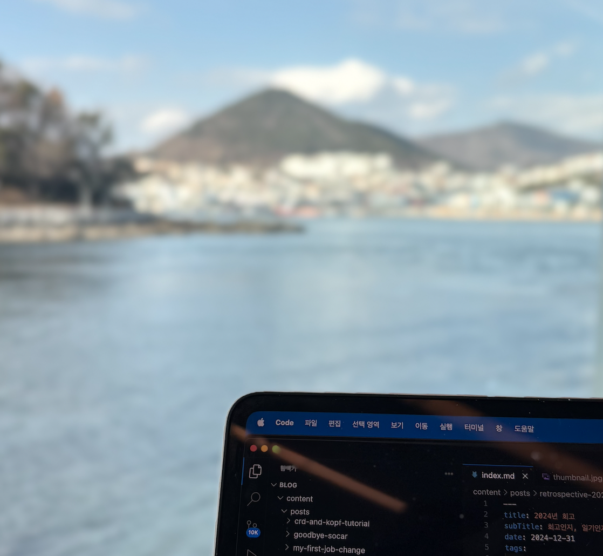
*여수, 카페에서*

## 커리어

### LINE을 퇴사하며

7월 16일. LINE에서의 마지막 출근을 했다. 입사한 지는 2년 1개월, 보통 말하는 "그래도 3년"을 못 채우긴 했지만, 후회는 없다. LINE 정도 되는 큰 IT 회사에서 데이터 플랫폼 팀은 어떤 책임을 가지고, 어떤 이슈들을 해결해나가는지 알 수 있었다. 다른 대기업과 합병이 되면 어떤 사내외 이슈가 있는지도 옆에서 슬쩍 볼 수 있었다. 그 밖에도, 입사 전 내가 궁금해하던 것들을 나름대로 해소해 볼 수 있는 기간이었다.

커리어를 쌓을수록, 나에 대해 점점 더 자세히 알아간다는 생각이 든다.
회사에서 내가 뭘 했는지는 이전 회고들에도 충분히 있는 거 같아서, 여기서는 LINE에서 알게 된 "나에 대한 것"을 적어보려고 한다.

#### 큰 회사보다 작은 회사를.

> 하디, 큰 회사 가도 어차피 같이 실무 하는 사람 수는 비슷해서, 일하는 거 크게 다를 거 없어요.

내 첫 직장이었던 쏘카에서 디케이가, 내 퇴사 면담에서 내가 이직하고자 하는 이유를 듣고 해준 말이다.

지금 보니, 그런 거 같다.
[이전 이직 회고](https://heumsi.github.io/blog/posts/my-first-job-change/#%EB%B3%B4%EB%8B%A4-%ED%81%B0-%EC%A1%B0%EC%A7%81%EC%97%90%EC%84%9C-%EC%9D%BC%ED%95%9C%EB%8B%A4%EB%8A%94-%EA%B2%83%EC%97%90-%EB%8C%80%ED%95%9C-%ED%98%B8%EA%B8%B0%EC%8B%AC)를 보면, 나는 LINE에 입사할 때 "보다 큰 조직에서 일한다는 것에 대한 호기심" 이 있었다.
그리고 이제 이 호기심은 꽤 해소되었다.

사실 LINE에서 일하면서, 일하는 방식이 쏘카를 다닐 때보다 훨씬 더 진보되어 있지는 않았다.
물론 전사 차원에서의 체계적인 작업들은 훨씬 더 디테일하게 만들어져있었다.
예를 들어, HR에서 진행하는 주기적인 교육이라던가, 신입 프로세스, 평가 체계와 같은 것들 말이다.
정책이나 가이드들도 세밀하게 되어있고, 담당 전문 인력이 있어서 그들에게 쉽게 물어볼 수도 있었다.

그러나 실제 긴밀하게 협업하고 일을 하는 사람의 수는 3~4명, 많으면 8명 정도까지였다.
흔히 말하는 "피자 2판의 법칙"이 적용되고 있었다.

반대로, 실무 조직이 아닌 전체 조직이 크기 때문에 다른 것들이 있었다고 생각한다.
정확히 어떻게 표현해야 할지 모르겠지만, 내가 종종 들었던 질문들은 다음의 것들이다.

- 우리 팀에서 중요하게 생각하는 것을 회사에서도 정말 중요하게 생각할까?
- 여러 팀에서 오는 요청 중, 우리는 어떤 우선순위를 가지고 처리해야 할까? 그 근거는 무엇일까?
- 팀 별로 어디까지 공통 컴포넌트를 가지고, 어디까지 다르게 가져가야 할까?

내가 속한 팀이 여러 테넌트를 둔 플랫폼 팀이다 보니, 많은 사람들과 커뮤니케이션이 필요했고, 그러다 보니 효율적인 것들이 중요하다고 생각했다.
그런데 어려웠다.
나는 전체적인 그림을 보며, 모두가 큰 그림 안에서 얼라인(Aligned)이 되어야 효율성이 개선된다고 생각하는데, 애초에 전체라는 단위가 너무 크고, 사일로와 블랙박스가 많았다.

우리가 만드는 이 기능이, 이 행동이 정말 조직 차원에서 효율적일지 알 수 없었다.
우리와 비슷한 기능을 만드는 다른 팀의 문서를 살펴보며, 사내의 다른 팀에 대해 경쟁의식을 갖는 게 맞는 것일까 하는 생각이 들었다.
사내 밥그릇 싸움이란 게 이런 걸까 싶기도 하고 말이다.
하지만 그렇다고 어떤 대안이 떠오르지도 않았다.

이런 의문이 든 생각은 애초에 "수많은 사람들과 조직이 있어서" 그렇다고 생각한다.
즉 규모가 크다 보니 자연스레 복잡하고 해결하기 어려워지는 게 아닐까 싶다.
그리고 내가 느끼는 불편함은, 나는 이런 질문이 해결되지 않으면 일에 100% 집중이 되는 성격이 아니어서 그런 거라 생각한다.

나는 조직의 복잡성이 비교적 작은 회사에 어울리겠다는 생각이 들었다.
이런 의문이 자체가 들지 않을, 조직 규모가 커지는 걸 지향하지 않는, 모두가 쉽게 얼라인될 수 있는, 작은 회사에 말이다.

#### 플랫폼이 아닌 애플리케이션을.

[이전 이직 회고](https://heumsi.github.io/blog/posts/my-first-job-change/#%EB%B3%B4%EB%8B%A4-%ED%81%B0-%EC%A1%B0%EC%A7%81%EC%97%90%EC%84%9C-%EC%9D%BC%ED%95%9C%EB%8B%A4%EB%8A%94-%EA%B2%83%EC%97%90-%EB%8C%80%ED%95%9C-%ED%98%B8%EA%B8%B0%EC%8B%AC)에서 LINE에 와서 배우고 싶은 것으로 "기술에 딥 다이빙 할 수 있는 환경"을 말했었다.
그리고, 내가 얕게 알고 쓰던 쿠버네티스에 대해 앞으로는 좀 더 깊이 알고 쓰고 싶다고 했었다.

LINE에서 쿠버네티스를 참 많이 본거 같다.
클러스터 네트워크 장애 경험해 보며 CNI가 어떻게 동작하는지, 클러스터 내 네트워크는 어떤 순서로 동작하는지 살펴볼 수 있었다.
내 실수로 운영 중인 다수의 PV를 날려먹으면서, PVC와 PV 상태에 따라 CSI 오퍼레이터가 어떻게 리소스를 회수해가는지 직접 볼 수 있었다.
Spark 스케줄러를 찾아보고 여러 오픈 소스를 PoC 해보며 쿠버네티스에서 "스케줄링"이라는 것에 어떤 이슈들이 있는지, 대안으로 어떤 것들이 있는지 배울 수 있었다.

"무엇을 안다"라고 말할 때에는 이전보다 훨씬 더 깊게 이해하고 말해야 했다.
그럼에도 팀에서 기술 리뷰를 받을 때, 내가 생각한 것보다 기술적으로 좀 더 깊은 질문들이 나오곤 했다.
또한 우리 팀의 서비스는 사내 엔지니어를 대상으로 하는 플랫폼이었기 때문에, 엔지니어들로부터 날카로운 질문들을 받았고, 이러한 것들 또한 지속적으로 무언가를 공부해야겠다는 데에 동기가 되었다.
여하튼 이전에 내가 원했던 대로, 기술에 딥 다이빙하며 이런저런 학습과 결과물을 낼 수 있었다.

하지만 뭔가 부족한 느낌이 들었다.
GPU 사용 가능한 클러스터 환경을 만들어도,
클러스터 내에서 사이즈가 큰 컨테이너 이미지의 프리-풀링이 가능하게 해도,
이것이 구체적으로 어떤 유의미한 효용을 주는지 느끼지 못했다.
옆 팀에서 몇 개월이 걸려 만든 플랫폼이 제대로 사용되지 않고 Deprecated 되는걸 보면서 이런 생각은 더 짙어졌다.

플랫폼 개발과 운영은 어렵다고 생각한다.
플랫폼은 코드로 치면 마치 "재사용 가능한 공통 모듈로 분리"와 같은 리팩토링과 비슷하다고 생각하는데,
엔지니어링에서 흔히 말하는 "추상화"의 작업이 이루어진다.
작고 세부적으로 설계해야 할까? 좀 더 크고 범용적으로 설계해야 할까?
이건 앞으로 여기저기서 재사용 될 컴포넌트인가?
코드를 어떻게 분리해야 확장 가능할까?
이런 것들은 일종의 "예측"이 필요하다.
예측이란 것은 본래 어렵다.

플랫폼은 가치를 어느 정도 예측해서 비교적 큰, 재사용 가능한 형태로 만들어져야 한다.
그런데 나는 측정할 수 없는, 예측하기 어려운 가치를 만드는 데에 큰 공수를 들이는 것에서 불편함을 느꼈던 거 같다.
그런 점에서, 내 성향은 플랫폼 엔지니어와 맞지 않는다고 생각한다.

이제 쏘카에서 배웠던 데이터 엔지니어링도, LINE에서 배운 쿠버네티스도, 기술은 나에게 그저 수단이다.
나는 기술자들을 위한 기술보다는, 일반 사람들의 삶을 윤택하게 만들어주는 그런 프로덕트를 만들고 싶다는 생각이 든다.

#### 문서화된 프로세스보다는, 합의된 가치를.

나는 평소 팀의 생산성에 대해 관심이 있곤 했는데, 생산성을 올리는 방법으로 보통 "프로세스"나 "컨벤션"을 말하곤 했다.
"팀의 일거리 가시성을 위해 JIRA 티켓을 먼저 만들고 일하자", "일관성을 위해 티켓 제목은 항상 현재형 동사로 작성하자", "우리가 반복해서 하는 운영 작업 프로세스는 문서화를 해서, 신입 멤버가 쉽게 익히게 하자" 이런 말을 하곤 했다.

우리가 필요하다고 느끼는 것들을 누구든 "제안"하고 "합의"한 뒤, 문서로 "기록"해서 지켜나가면 된다고 생각했다.
이상적으로는, 잘 만들어진 프로세스와 컨벤션 문서가 하나 있고, 이걸 만들어간 의사 결정 문서가 있는 형태를 생각했었다.
이것이 우리의 팀 문화를 만들어주고, 새로운 멤버에게도 우리 팀의 문화를 쉽게 교육하고 생산성을 올릴 수 있는 효율적인 방법이라고 생각했다.

그런 점에서 나는 제안을 많이 하는 편이었다.
좋아 보이는 게 있으면 그걸 팀에 도입하고 싶은 한편, 기존의 방식에 묘한 불편함을 느껴 이러한 것들을 개선하고 싶어 했다.

그러나 이럴 때마다 이런 내 생각과 다른 생각을 가진 팀원이 있었는데, 그는 이런 생각이었다.

- 이런 것들은 생산성을 올리는 게 아니라 반대로 낮추는 것이다.
- 이미 잘 하고 있는 사람들은 그런 문서나 프로세스 없이도 잘하고 있으며, 잘 못 따라오는 사람들이 노력해야 한다.
- 별도의 문서로 작성하기보다는 올바른 선택 기준을 세워서, 상황에 따라 이 기준에 맞게 능동적으로 생각해야 한다.
- 프로세스와 컨벤션이 그렇게 중요한가? 프로세스와 컨벤션은 종종 바뀌며, 그때마다 문서를 업데이트해야 하는 것은 생산성을 저하시킨다.

처음에는 솔직히 이해가 가지 않았다.
그가 조금 이기적이라고 생각했으며(왜냐하면 그는 이미 잘 하고 있는 사람이었다),
우리가 다 같이 노력하면, 오버헤드가 조금 있을 수 있겠으나, 모두가 일을 더 잘할 수 있을 거라 생각했다.

그런데 어느 순간부터인지 나는 그의 생각과 가까워지게 되었다.

내가 팀에 적응했을 때부터 였을까? 누군가가 일에 대한 "프로세스"와 "문서화"를 말할 때, 그 일은 우리 팀이 암묵적으로 다들 잘 알고 실행하고 있고, 만약 누군가가 잘 모르겠으면 이전 작업 문서를 보면 되는데, 이걸 왜 굳이 정리된 문서로 또 작성하지? 라는 생각이 들었다.
그러면 팀 내 신입은 그 일을 어떻게 알고 해야 하는가? 라고 묻는다면... 솔직히 알아서 잘했으면 좋겠다.
본인이 직접 문서를 찾아보고, 모르겠는 부분은 물어봤으면 좋겠다.

한편, 내가 초기에 제안한 프로세스나 컨벤션은 문서로 잘 만들어졌지만, 이후 팀원들이 그렇게 지키지 않는 경우가 많았다.
왜 그럴까 생각해 보면, 그게 팀에서 그렇게 중요하지 않았기 때문이라고 생각한다.
그리고 그렇게 지키지 않았어도, 결과적으로 일은 잘 진행되었다.

컨벤션, 프로세스가 중요하지 않다는 건 아니다.
다만, 우리가 무엇이 "중요하다고 생각하는 가치"가 더 중요하다.
예를 들어, 플랫폼 팀에 있어서 가장 중요한 건 호환성과 안정성이다.
어떤 기능을 배포할 때, 이게 하위 호환은 될지, 안정성에 문제는 없을지 능동적으로 충분히 생각해야 하는 것이다.
이를 프로세스 문서와 체크리스트로 일일이 만들 수도 있겠지만, 이는 소극적인 형태라는 생각이 든다.
내가 하는 일이 호환성과 안정성에 어떻게 여파를 줄지 적극적으로 생각해 보고, 기존 동료들이 어떻게 일을 했는지 참고하면 된다.

우리 팀에서 중요하다고 생각하는 가치가 공유가 되어있으면, 이제는 굳이 프로세스나 컨벤션을 세우지 않아도 된다고 생각한다.
반면 공유가 되어 있지 않다면, 프로세스나 컨벤션이 아닌 매니페스토 형태로 합의를 봐도 좋을 거 같다.
우리가 중요하다고 느끼는 것들은 자연스레 신경이 쓰이게 되고, 합의하며 리스크를 줄여나가게 되는 게 자연스러운 과정이지 않을까 싶다.

#### 정리

첫 회사를 다닐 때는, 비교할 기준과 대상이 없었기 때문에 나에 대해 잘 몰랐던 거 같다. 그런데 두 번째 회사를 다니면서, 첫 회사와 비교하게 되고, 그 과정에서 내가 어떤 걸 더 선호하는지 이전보다 더 잘 알게 되었다. 무엇을 더 "선호한다" 는 것은 내가 어디에서 불편함을 느끼는지 관찰해 보면 알 수 있었다. LINE에서의 시간은 이렇게 나를 알아가게 했다는 점에서 매우 가치 있는 시간이었다고 느끼고 있다.

### Closer Labs에 합류하며

LINE 마지막 출근 이후 약 3주가 지난 8월 5일, 클로저 랩스(Closer Labs)에 입사했다.
이제 이에 대한 이야기를 해볼까 한다.

#### 합류한 이유

LINE을 다니면서, 위에서 느낀 불편함이 해소되지 않는다면 언젠가는 이직을 하겠다는 생각이 들었다.
종종 관심이 가는 혹은 나에게 관심을 주는 회사가 있으면 입사 지원도 넣어보고 면접이나 커피 챗을 하기도 했다.

그러던 중, 5월에 전 직장 동료였던 험프리와 케이피에게 연락이 왔다.
케이피는 쏘카를 퇴사하고 거기서 배운 레슨 런으로 새로운 사업을 시작했다는 것이었고, 험프리는 아직 쏘카에 다니지만, 케이피가 하는 사업의 엔지니어링 부분을 리드하고 있다는 것이었다.
그리고 내게 엔지니어링 일감 일부를 외주 형태로 맡기고 싶다고 했다.
이게 클로저 랩스와의 첫 시작이었다.

두 달 정도 외주 형태로 일했다. 그 사이 케이피와 술도 몇 번 먹으며, 사업에 대한 이야기를 들을 수 있었다. 그리고 외주 일이 끝난 뒤, 클로저 랩스로부터 정식 오퍼가 왔다. 나는 이를 수락하면서 입사를 결정하게 되었다.

내 의사 결정에 영향을 미친 가장 큰 두 가지는 다음이었다.

1. 초기 스타트업으로 언젠가 가보고 싶었는데, 그 적기가 지금인거 같다.
2. 파운더들이 내가 아는 똑똑하고 믿을만한 사람이다.

올해, 내가 가장 크게 느낀 "기회비용의 기준"은 "나중에 할 수 없는 것" 이었다.
그런 점에서 극초기 스타트업에 합류하는 일은 나중에 하면 꽤나 값비싼 비용이고, 지금이 제일 쌀 때가 아닐까 싶었다.
젊을 때에만 나올 수 있는 에너지도 분명 있고, 만약 내가 나중에 가정이 생긴다면 그때의 무게감보다 지금이 훨씬 가벼울 테니깐.
반면, 극초기 스타트업이 아닌 곳은 나중에 저렴한 비용으로 경험해 볼 수 있겠다는 생각이 들었다.

한편, 어떤 사람과 일하느냐 역시 매우 의사결정에 매우 중요했는데(초기 스타트업에서는 더더욱),
다른 스타트업 면접이나 커피 챗을 했을 때 이걸 확실히 알 수가 없었다.
그런데 클로저 랩스에는 나와 함께 일해봤던 동료들이 있었기에, 그들이 똑똑하고 나와 핏이 잘 맞는 사람임을 알고 있었다.
실제로 합류 전 외주 일을 해보니, 내가 LINE에서 느꼈던 아쉬움을 채워줄 수 있겠단 생각이 들었다.

업계에서 일한 지 만 5년이 되어간다.
예전에는 시니어가 없는 조직에서 일하는 것이 두려웠었다.
그러나 이제는 시니어가 없는 조직에서 다 같이 시니어가 되고 싶은 사람들이 모여 일하고 싶다.
이제 그만한 자신감을 가져도 된다는 느낌이 든다.
내 시기가 중요한 시기 임을 알고 있다.
이 시기에 지금까지 한 번도 가보지 않은 초기 스타트업에 시간을 투자해 보고 싶다.

#### 한 것들

유저가 사용하는 제품을 만들었다.
현재 데스크룸(클로저 랩스의 서비스 이름)에는 2가지 제품과 핵심 기능은 다음과 같다.

- CX Assistant
  - CS 상담원들이 사용하는 크롬 익스텐션이다. 문의에 따라 답변 추천을 해준다.
- CX Analytics
  - CX 관리자가 사용하는 웹 대시보드다. 문의 개수, 처리 속도 등 지표들을 볼 수 있다.

나는 여기서 CX Analytics 개발을 주로 담당했다.
기획은 주로 케이피가 해주었고, 디테일과 제품 개발, 릴리즈 그리고 고객 소통 & 피드백 반영은 내가 담당했다.

좀 더 구체적으로는 다음의 일들을 했다.

- BigQuery를 데이터 웨어하우스로 도입했다.
- 배치 파이프라인 스케줄러로 Prefect를 도입하고 ELT 파이프라인을 구현했다.
- 프론트엔드로 Retool을 사용하여 각종 대시보드 및 웹 앱을 구현했다.

CX Analytics는 데스크룸의 핵심 서비스라서, 랜딩 페이지에 어떻게 보여야 할지, 어떤 핵심 기능과 메시지를 전달해야 할지도 고민했다.
이제는 데스크룸에 있어서 CX Analytics는 나에게 자식 같은 서비스라 보면 된다.

그 외에도, 사내 백엔드와 인프라는 내가 오너 역할을 담당하고 있다.
물론 이전에 험프리가 잘 만들어 두어서, 지금 단계에 크게 손볼 건 없지만!

앞으로도 계속해서 이렇게 클로저 랩스에 필요한 데이터 프로덕트를 만들어갈 계획이다.

#### 지금까지의 레슨런

첫 번째, 세일즈-드라이븐 개발은 초기 제품을 만드는 팀에게 (적어도 우리에겐) 옳다.
세일즈-드라이븐 개발은, 완성된 제품이 아닌, UI만 있는 제품을 고객에게 먼저 보여준 후, 이게 팔리면 그때부터 개발하는 방식이다.
즉 실제로 돈을 내는 유저가 있기 전까지는, 유저가 상상할 수 있을 최소한의 수준으로만 개발한다.
보통 이건 UI와 데모 데이터면 충분했다.
이 세일즈 드라이븐으로 우리는 개발과 기획 리소스를 매우 경제적으로 사용했다고 생각한다.
빠르게 실패하고, 더 많이 시도하자가 우리의 철학이었으며, 우리끼리의 생각이 아닌 고객의 생각과 니즈가 무엇인지 정확히 찾으려 했다.
10개 시도해서 1개가 대박 나면 성공이라 생각한다. 10개를 빨리 만들 수 있으면 된다.

두 번째, B2C와 다르게 B2B SaaS는 "있어빌리티"가 꽤 중요한 거 같다.
"이거 뭔지 잘 모르겠지만, 일단 업계에서 다 이걸 쓴다고? 이거 쓰면 일단 팬시하고 멋져보일 거 같은데?"
이런 생각이 들게끔 해야, 고객의 실제 구매로 이어지지 않나 싶다.
물론 제품의 핵심 기능도 중요하지만, 단순히 기능이 좋은 수준으로는 확장성 있게 팔리지 않다는 것이다.
그래서 유저 니즈를 관통하는 제품 기능과 더불어 기깔난 랜딩 페이지도 중요하다.
우리 제품이 업계 디-팩토라는, 요즘 트렌드라는 이미지를 주는 것을 목표로 세우게 되었다.

마지막으로, 사실 요즘 고민이 별로 없다.
해야 할 것들이 쌓여있고, 기술적으로 어려운 것도 없어서, 고민 없이 그냥 하면 된다.
계속해서 시도해 보고, 우리의 가설이 잘 동작하는지, 동작하지 않았다면 왜 그랬는지 회고하면 된다.
이러다 보니, 요즘은 밋업이나 다른 사람 이야기, 기술 트랜드를 잘 안보게 되는거 같다.
그저 일하고, 밥 먹고, 탁구 치고, 회의한다.
퇴근하면 동료들과 운동하거나 PC방에 게임하러 가거나, 아니면 술 먹으면서 우리의 다음 방향성에 대해 이야기한다.
감정, 일상의 변화 없이 살고 있지만, 재밌게 지내고 있다.

## 내 일상

### 책

올해는 작년보다 더 안 읽었다!

- [Real MySQL 8.0 1권](https://www.aladin.co.kr/shop/wproduct.aspx?ItemId=278488709)
  - "그래도 이력서에 백엔드 엔지니어 적어놨는데, 이 유명한 책은 한번 봐야하지 않겠냐" 싶어서, 상협이랑 같이 스터디한 책
- [데이터 시각화 디자인](https://www.aladin.co.kr/shop/wproduct.aspx?ItemId=305119016)
  - 사이드 프로젝트였던 푸드케어 대시보드를 만들며, 프로젝트 멤버들과 함께 스터디한 책
- [그렇게 쓰면 아무도 안 읽습니다](https://www.aladin.co.kr/shop/wproduct.aspx?ItemId=321323169)
  - 클로저 랩스로 이직 후, 랜딩 페이지를 만들다가 UX 디자이너 분에게 추천 받아 읽었던 책

작년까지는 뭔가 부족하고 알고 싶은 것들이 있을 때 책을 보곤 했었는데, 이젠 궁금한 것이 별로 없어서 일까.
읽어보고 싶은 책이 없었다.
한편, 조금씨 궁금할 때는 책보다 ChatGPT로 알아가는 것들이 많았던 거 같다.

### 애니

올해 넷플릭스에서 본 애니는 다음과 같았다.

- 도로헤도로: ⭐️⭐️⭐️⭐️
- 트라이건 스탬피드: ⭐️⭐️⭐️
- 나 혼자만 레벨업: ⭐️⭐️⭐️
- 귀멸의 칼날, 합동 강화 훈련편: ⭐️⭐️⭐️⭐️
- 괴수 8호: ⭐️⭐️⭐️⭐️
- 아케인 시즌 2: ⭐️⭐️⭐️

도로헤도로, 압도적으로 좋았다. 나 다크 판타지 장르 좋아하는 구나.

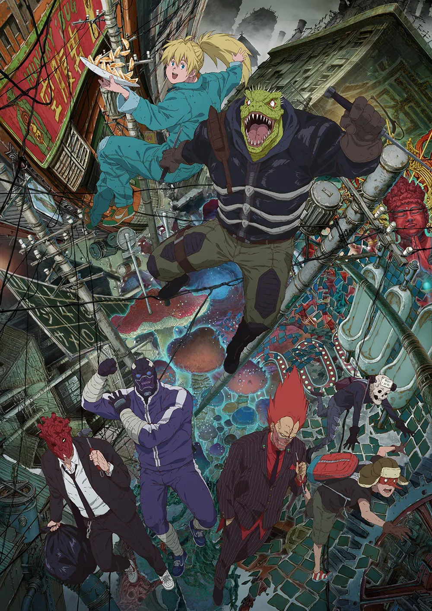
*출처: 나무위키 - 도로헤도로*

### 운동

#### 수영

6월까지는 수영 꾸준히 잘 다녔다.
접영이 잘 안되어서 토요일에 개인 강습도 받았다.
강습 받으니까 안되던 접영이 이제 잘 되더라...

오전 단체 강습을 놓쳤을 때는 자유 수영을 가곤 했다.
샥즈 끼고 혼자 수영하는 재미가 있었다.

그런데, 7월에 여행을 다녀오고 나서는 수영을 잘 안 가게 되었다.
이유는 잘 모르겠지만, 이전만큼 수영이 재밌지가 않았다.
아침에 늦게 일어나게 되었고, 수영이랑은 자연스레 멀어졌다.

#### 러닝

러닝은 작년과 비슷한 수준으로 하고 있다.

5월에는 직장 동료인 영건님과 10K 마라톤에 처음 나갔다.
마라톤은 처음 나가보는데, 다 같이 뛰기만 해도 이렇게 행사가 되는구나 싶었다.
10K, 처음에는 조금 쫄았는데 생각보다 할만했다.
이후에 러닝에도 자신감이 좀 생긴 거 같다.

대학교 동아리 친구 영선이를 주축으로 몇 번의 광화문 러닝을 가졌다.
도심에서의 단체 러닝, 재밌다.
러닝 크루 들어갈 생각은 잘 안 들었고, 다만 이렇게 종종 뛰고 싶었다.
반면, 이제 혼자 뛰는 건 잘 안 하게 되었다. 큰일이다.

#### 웨이트

9월 말부터는 직장 동료들과 웨이트를 시작했다.
출근 전이나 퇴근 후에 회사에서 5분 거리에 있는 헬스장을 갔다.
나는 웨이트가 내 인생에서 처음엔데, 몇 년동안 운동한 동료의 도움으로 쉽게 배워볼 수 있었다.

웨이트는 이전에 내가 해본 크로스핏이나 수영보다 훨씬 정적이고 쉽다고 느껴졌다.
숨찰 일도 없고, 어떤 압박도 크게 없고... 다만 재미가 있는지는 모르겠다.
헬스장에 사람이 참 많다. 
그들을 보며, 일단은 해야 할 거 같으니 하고 있다.

연말에는 웨이트 잠시 쉬고 있는데, 새해부터는 꾸준히 다시 가봐야겠다.

#### 스노우 보드

1월, 지산 슬로프에서 내 인생 첫 스노우 보드를 처음 타봤다.
너무너무 재밌었다.
이후에도 2~3번 더 가며, 비기너 턴까지 해볼 수 있었다.

내년에는 카빙도 배우고, 일본에 있는 슬로프로 가서 타보는게 목표다!

*처음부터 하나씩 알려주던 쏘카 동료, 디니. 그녀는 렌탈샵에서 이 옷이 좋다 했다.*

## 여행

### 가족들과

올해도 LINE 사내 복지로, 부모님 모시고 다양한 리조트 정말 기깔나게 다녔다.

첫 번째로, 3월 초에 갔던 제주, 성산 휘닉스 파크.
섭지코지가 바로 앞이라 편하게 바람 쐬기에 아주 좋았다.
안도 다다오의 건축물인 "지니어스로 사이"도 근처에 있었는데, 평일 마감 타임에 봐서 사람이 별로 없어서 여유로웠다.
고등어, 은갈치 회 정식을 처음 드시며 아주 맛있다고 하시던 부모님의 모습이 기억에 난다.

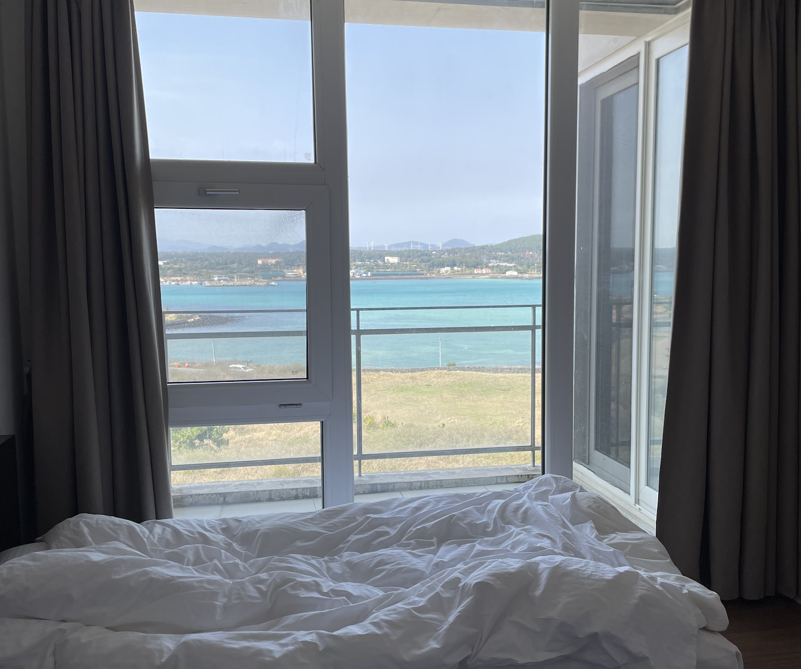
*보기만 해도 마음 편안해지는 뷰*

4월쯤에 증평 벨포레 갔었는데 사진이 없네..? 두둥...

6월에 간 삼척 쏠비치.
아빠와 바다에 같이 들어간건, 정말 몇십년 만인거 같다.
아빠가 아직 건강하신게 참 감사하다.

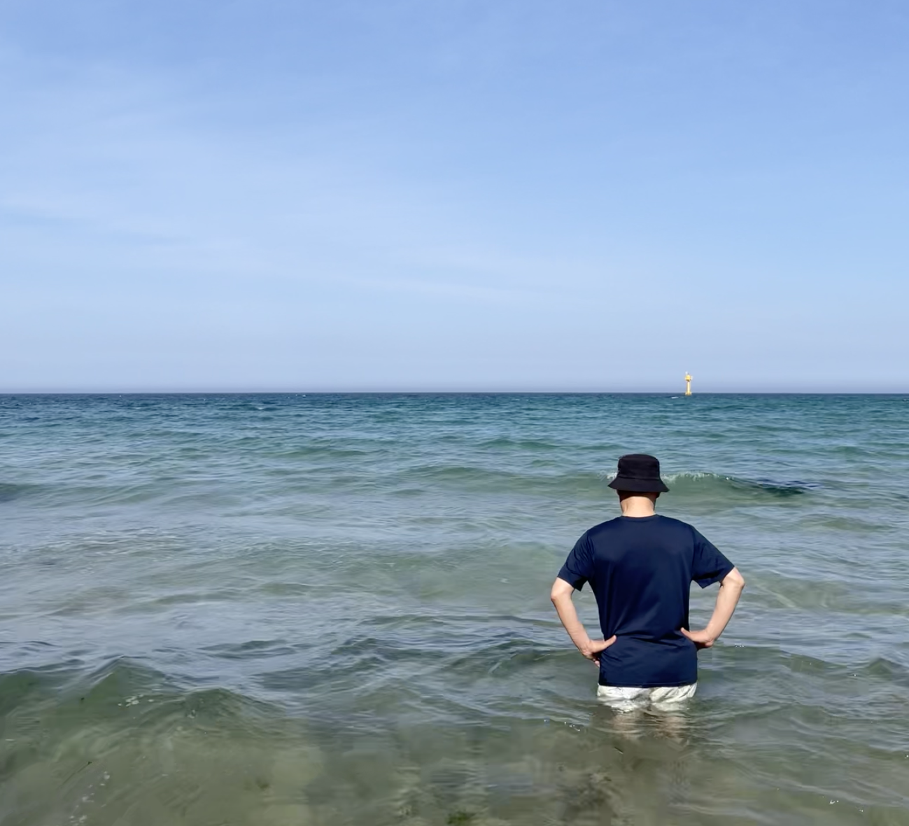

### 친구들과

#### 나고야

5월, 화창한 점심, "현규님 우리 내일 일본 갈래요?".
회사 근처 식당에서 순대국을 먹고 돌아온 우리는 바로 나고야 행 비행기와 숙소를 예약한 후, 다음날 연차를 냈다.
회사 동료와의 P스러운 여행은 이렇게 시작됐다.

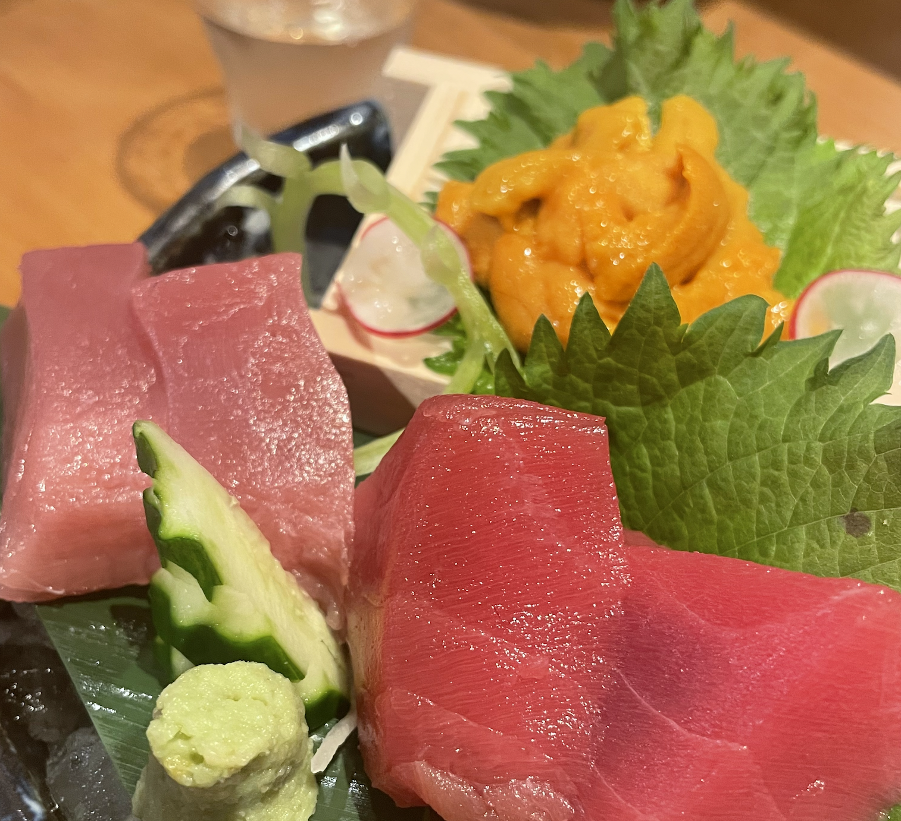
*감동 쓰나미의 생 참치 맛*

기억에 남는 3가지만 뽑는다면.

1. 생 참치와 사케
2. 술 먹고 먹은 이찌란
3. 위스키 바

난 이제, 좋은 회가 있으면 소주가 아니라 사케랑 먹고 싶다.
사케는.. 참 좋은 술이다.

그리고 식사로 먹는 이찌란은 조금 느끼한데, 술 먹고 해장용으로 먹은 이찌란 왜이렇게 맛있던지...

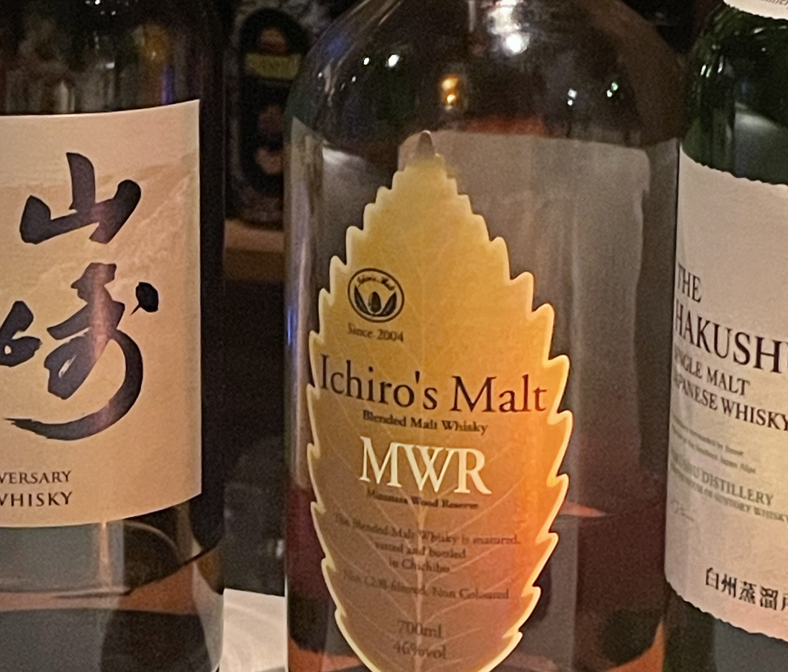
*이번에 간 김에 위스키는 모두 일본 위스키로*

나고야는 술값이 아주 싼 게 인상적이었는데(대부분의 위스키 한 잔이 한화 1만 원도 안 했다.), 그래서 우리는 매일 새벽마다 위스키 바에 갔다. 위스키 바에서 칸코쿠냐고, 말 걸어주고 이것저것 알려주던 손님들이 기억에 남는다.

나고야, 별 기대 없이 갔는데 음식과 술, 그리고 무계획으로 다니기 참 재밌었던 곳이다.

#### 오키나와

7월, 회사에 퇴사 의사를 전달한 후, 바로 한국을 떠야겠다는 생각이 들었다. 나와 P 여행의 결을 같이하는 경호 형과 이틀 뒤에 바로 오키나와로 출발했다.

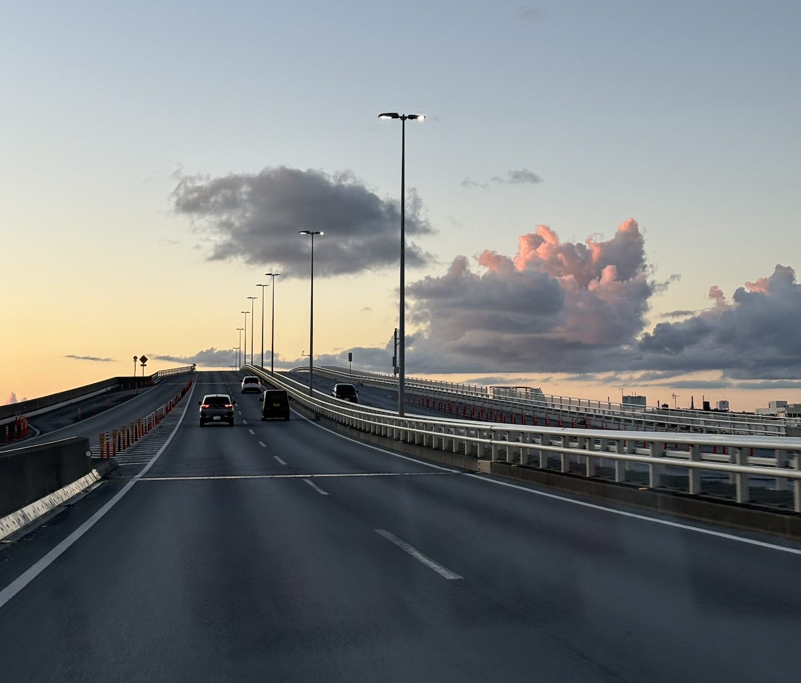
*차에서 음악을 틀고 이 도로를 달리던 때가 유독 기억난다.*

듣던 대로 오키나와는 기존 일본이랑은 느낌이 조금 달랐다. 뭔가 제주도스러우면서도, 또 동남아의 느낌이 조금 있는...? 첫날 보았던 수평선과 석양, 그리고 운전하며 뻥 뚫려있던 고가 도로가 기억에 남는다.

오키나와에 오면 모두가 가는 추라우미 수족관도 가보고, 스노클링도 하고, 마지막 날에는 아메리칸 빌리지도 가봤다.
아메리칸 빌리지는 사실 그냥 제주도 중문 느낌이 강하게 났고, 추라우미 수족관이 그나마 제일 기억에 남는다.

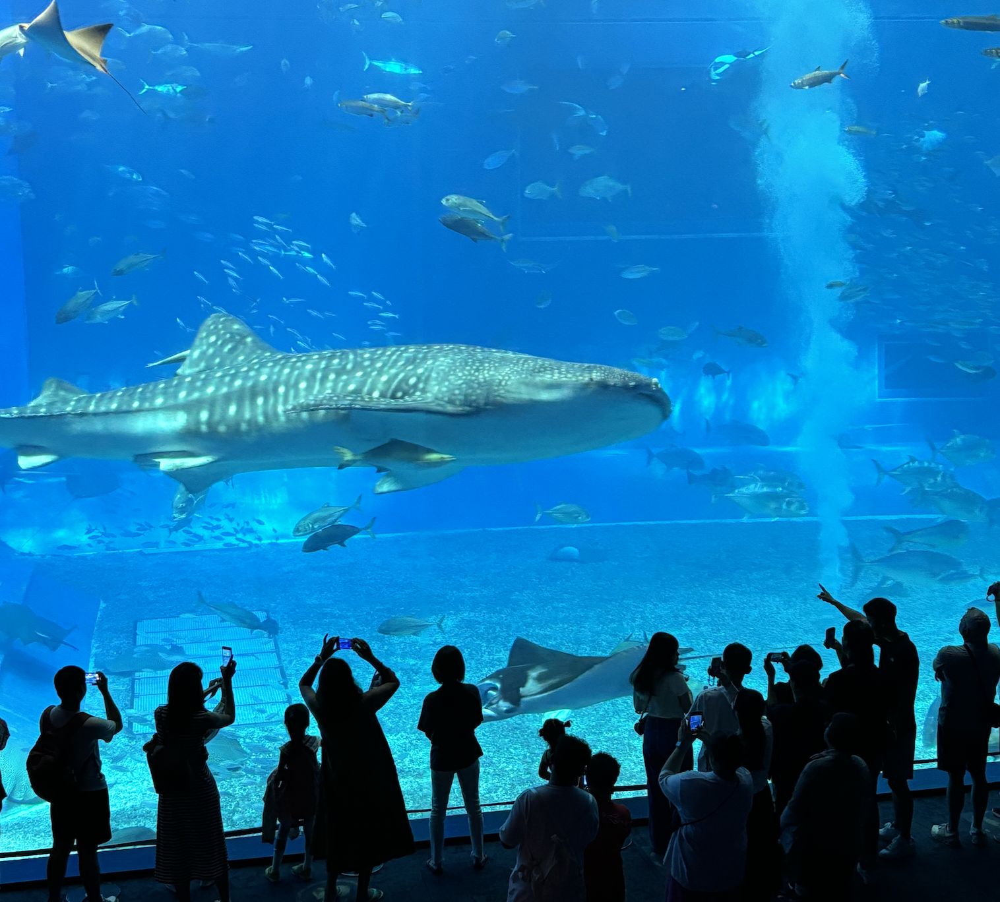
*추미우라 수족관, 실제로 앞에서 보면 꽤나 웅장하다*

오키나와에 생각보다 먹을 음식이 없어서, 3일 내내 스테이크만 먹었던 것도 기억이 난다.
스테이크는 3일 내내 먹어도 생각보다 안질리더라.

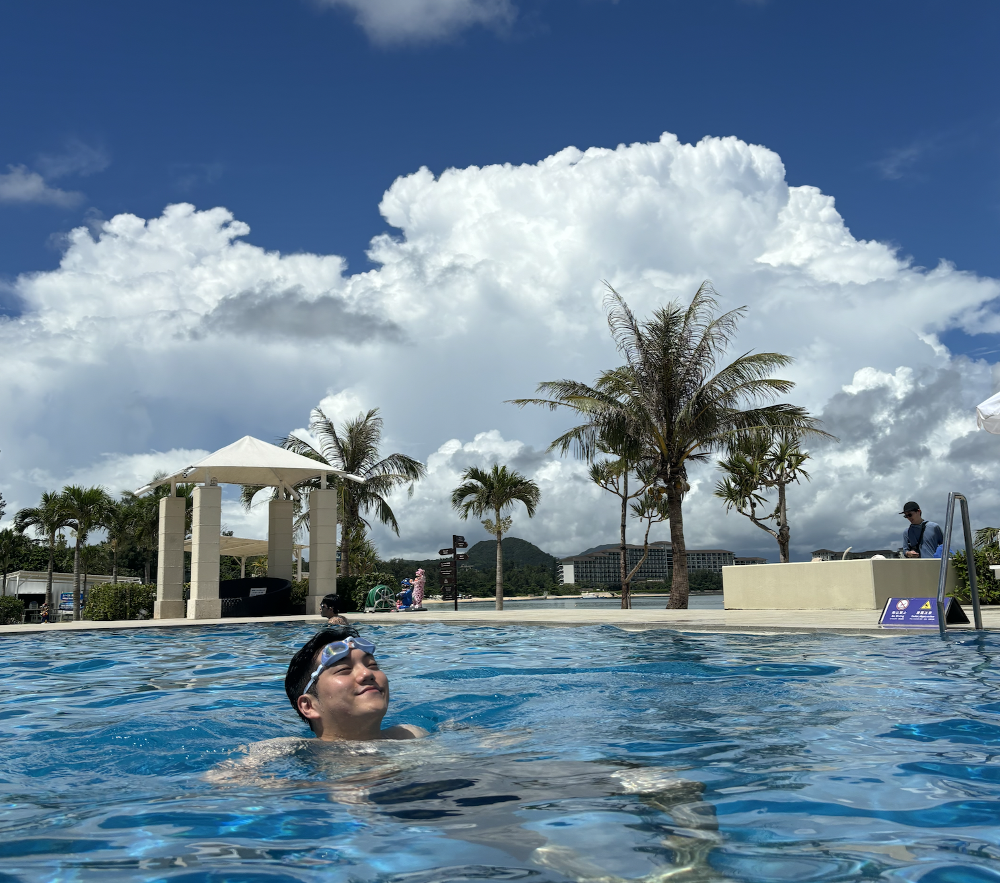
*마지막 날, 그래도 리조트 수영장은 한번 가봐야지하며 물 속에서 유유자적 즐겼던..!*

한국은 장마이던 떄에, 오키나와는 3일 내내 날씨가 좋았다.
기가막힌 타이밍에 잘 다녀온거 같다.

### 나 혼자

#### 바르셀로나

LINE에서 마지막 출근과 송별회를 마친 다음 날 오전, 나는 바로 바르셀로나로 떠났다.
내 인생 처음 가보는 유럽, 그리고 혼자 여행이었다.

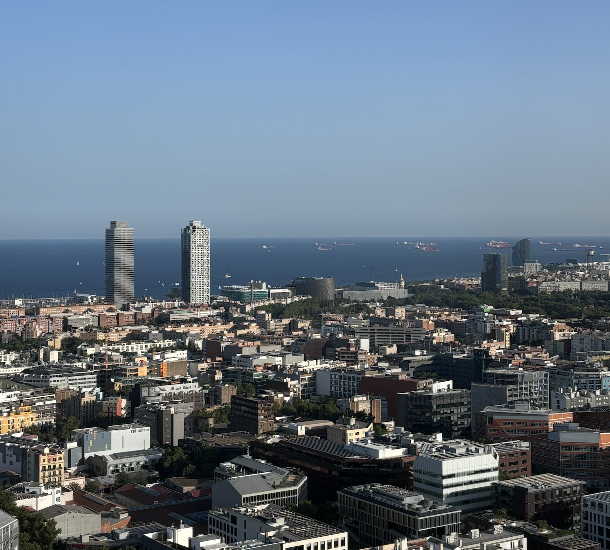
*전망대에서 찍은 바르셀로나. 참 잘 정리된 관광 도시라는 생각이 든다.*

한인 민박에서 며칠 있으며 여러 사람들을 만났다. 유랑에서 밥 동행을 구해서 같이 먹기도 하고, 숙소에서 음식 셰어하다가 저녁에 다 같이 술 먹으러 나가기도 했다. 아침에 일찍 일어나 동행이랑 같이 사그라다 파밀리아 성당까지 러닝하고 올 때는 바르셀로나에 살면 이런 느낌일까 싶었다. 바르셀로나는 유명세만큼이나 정말 매력적인 도시였다.

#### 그라나다

바르셀로나 다음으로 간 곳은 그라나다였다.

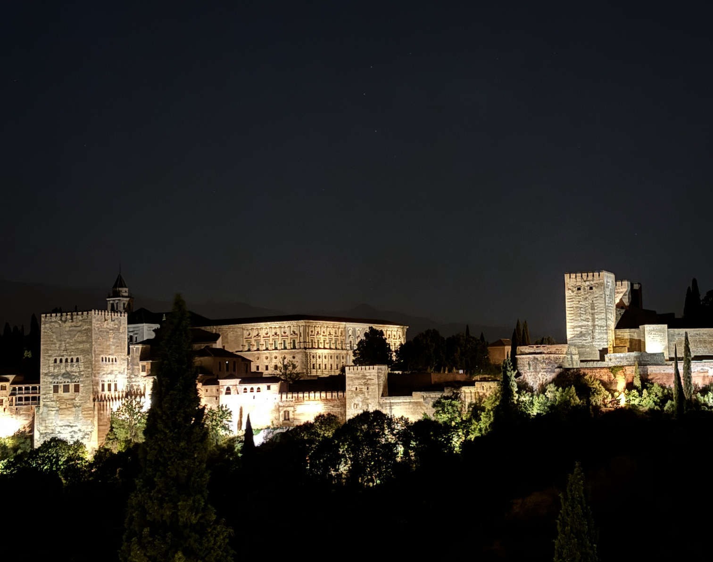

도착한 첫날 저녁, 알함브라 궁전이 보이는 카페에서, 좋은 동행들과 띤또 데 베라노를 먹으며 낭만을 즐기던 장면이 기억에 남는다.

#### 네르하 & 프리힐리아나 & 론다

그라나다에서 세비야까지는 랜딩 투어 버스로 가며, 중간에 네르하, 프리힐라아나, 그리고 론다에 들려 구경할 수 있었다.
비행기가 아니라 버스로 풍경을 보며 가는 재미가 있었다.
어디를 가든 바다와 산이 "적절히" 있었고, 무엇보다 와인을 마시며 여유를 만끽하는 느낌이 내가 여행 온 것을 실감 나게 해주었다.

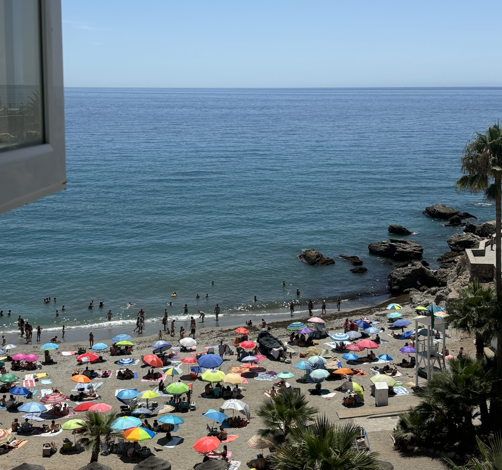
*네르하 식당에서 밥먹으며 바라본 뷰, 지중해 바다는 참 뛰어들고싶은 느낌을 준다.*

#### 세비야

세비야도 기억에 남는 곳 중에 하나였다.
바르셀로나보다 더 더웠기 때문에, 주로 오전과 저녁에 활동하고, 점심에는 숙소에서 쉬곤 했다.
그리고 해 질 녘에 조금 선선해질 때 나와서 보는 세비야는 아름다웠다.

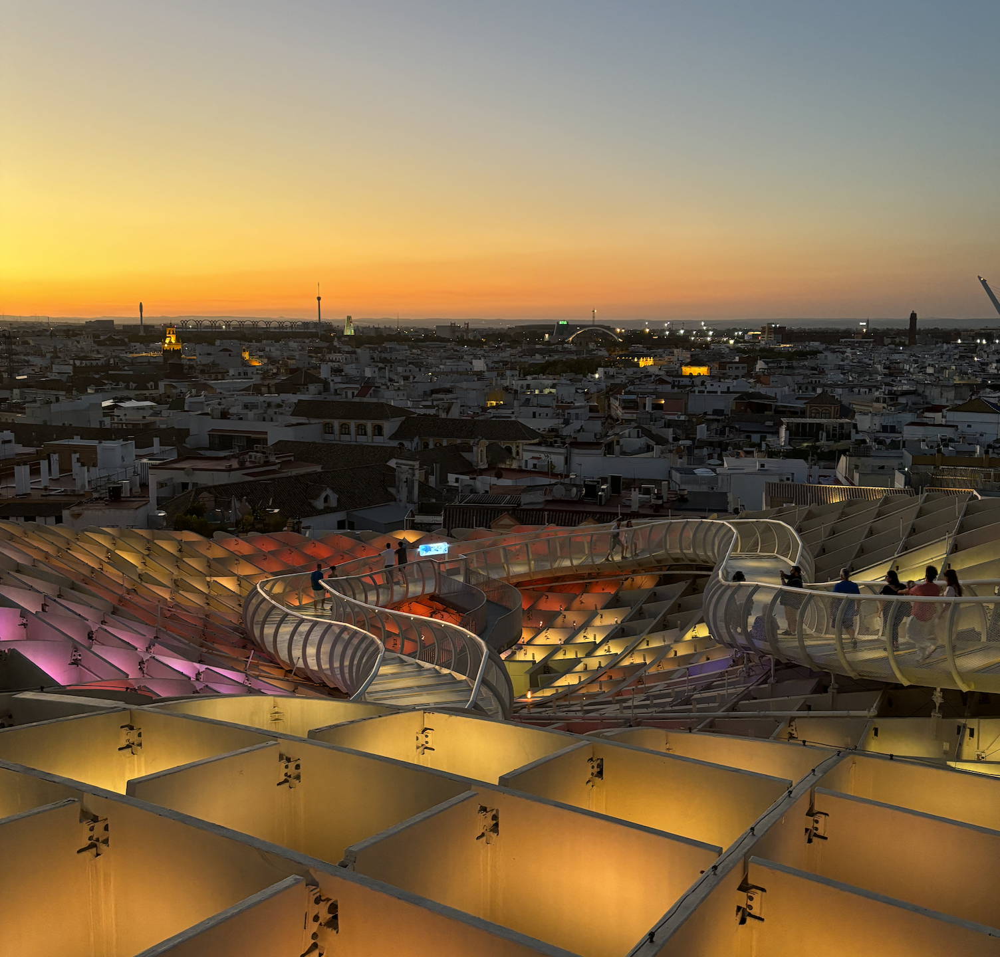
*세비야 메트로폴 파라솔에서 찍은 도심 풍경*

특히나, 한인 민박에는 나밖에 없었는데, 사장님이 조카 챙겨주듯 잘 챙겨주셨다.
퇴실하는 날 아침, 무심하게 밥 먹고 가라는 사장님의 말에 따뜻함이 아직도 마음에 남아있다.

#### 리스본

다음 도시는 리스본이었는데, 리스본은 한인 민박이 없었다.
평이 좋은 호스텔에 가게 되었는데, 여기서 외국인 친구들과 낮엔 근교 투어를, 밤엔 클럽 투어를 하게 되었다.

*근교 투어 중 갔던 신트라 궁전. 밖에 구름밖에 안 보이던 게 신비로웠다.*

근교 투어하면서 하루 종일 외국인 친구들과 있었다.
내가 영어를 정말 못한다는 거라는 것을 느꼈다.
아, 그리고 유럽권에서는 어떤 나라에 산다는 것보다, 어떤 도시에 산다는 게 의미를 더 가진다는 것을 느꼈다.
런던에서 일하다가, 파리에 있는 회사로 이직한다던가... 특색 있는 여러 도시에서 살 수 있는 게 부럽기도 했다.

#### 포르투

리스본 다음으로 간 곳은 포르투였다.
이번 여정의 마지막 도시였다.

포르투는 할 건 별로 없지만, 포트와인과 노을이 보이는 모루 공원이 다하는 곳이었다.
다른 관광지만큼 사람이 엄청 많은 곳도 아니라, 한적하게 마음 놓고 있기 좋았다.

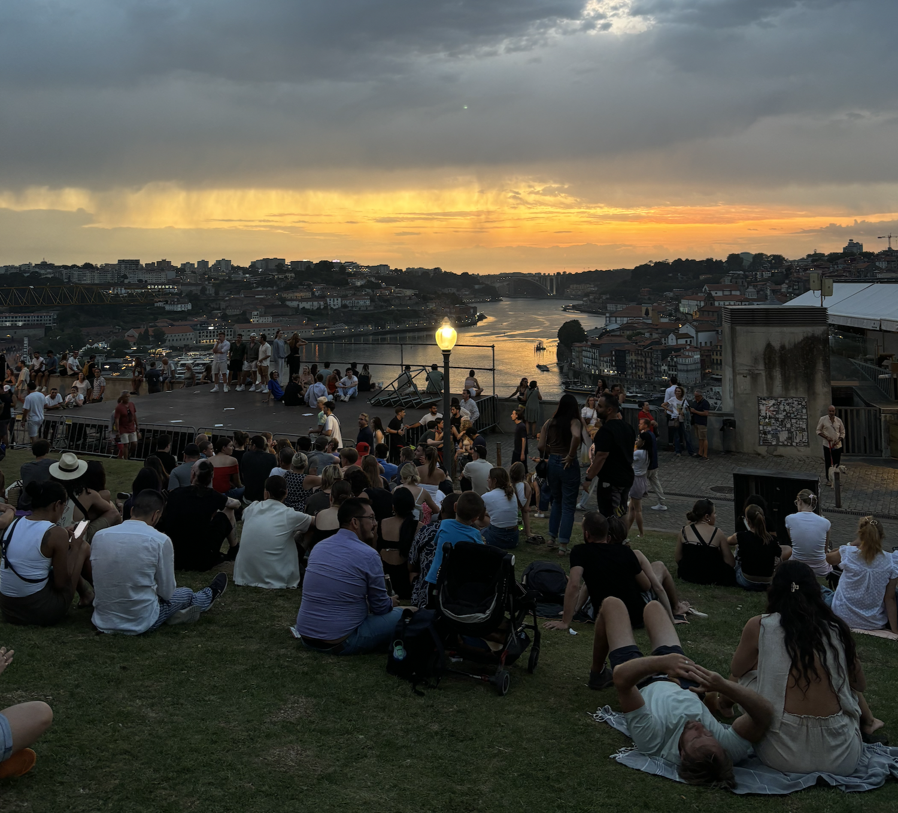
*매일 가던 모루 공원. 앞에 공연하는 밴드는 매일 RHCP 노래를 연주했다*

포르투에서 포트와인을 먹고 있으면, 하루 종일 그냥 기분이 좋았다.
여행을 잘 마무리할 수 있는 도시였다.

약 3주 정도 여행하면서, 다시 새 출발 할 힘을 얻을 수 있었다.
다음에는 도시보다는 자연이 좀 더 많은 곳을 가보고 싶다.

## 몇 가지 생각들

요즘 주로 드는 단편적인 생각 몇 개만 적어보면 이렇다.

- 새로운 무언가를 하는 건 참 귀찮다. 그러나 막상 하면 재밌다.
  - 가만히 있으면, 아무것도 생기지가 않더라. 의식적으로 찾아야 하는 거 같다. 
  - 나에겐 올해 스노우 보드가 그랬다.
- 소득이 올라가니, 소비도 덩달아 많아진다. 요즘 술 한번 먹으면 10만 원씩 나온다.
  - 어릴 때보다 여유가 생기니 좋다. 먹는 것도, 누군갈 만나는 것도 편해졌다.
  - 그런데 너무 자연스럽게 소비가 올라가니, 소비의 상한이 어디까지 갈지 궁금하긴 하다.
  - 어릴 때 어떻게 2~3만 원으로 술 먹었지?
  - 일상 필수적이지 않지만, 사회생활하며 돈 많이 쓰게 되는 거 같다.
- 연애하기 어렵다. 그리고 점점 더 어려워지는 거 같다.
  - 이제 친한 친구들도 많이 결혼한다.
  - 혼자 사는 것도 나쁘진 않지만, 뭐든 때가 있는 거 같아 조금의 두려움이 있다.
  - 끌리는 사람을 찾는 게 이전만큼 쉽지가 않다.
- 내 인생에서 정말 중요한 때인 거 같다.
  - 2025년 3월이 되면 일한 지 만 5년이 된다. 시장에서 수요가 많은 연차다. 기회비용이 높은 때라 생각한다.
  - 서른이 넘으니, 친구들도 동료들도 모두 각자 선택한 길로 걸어간다. 나 역시 그렇다.
  - 각자 방향은 잡았으니, 그 결과는 4~5년 뒤에 드러나지 않을까 싶다. 그때까지 내 길을 묵묵히 가야겠다.

## 정리

올해는 내 커리어의 한 챕터를 끝낸 한 해였다. 이전까지는 "배움"이라는 키워드가 날 이끌었다면, 이제는 "실행과 성과"이라는 키워드가 날 이끈다.

좋은 건진 모르겠지만, 이제 커리어에 있어서 고민이 별로 없다. 그냥 하면 되는 것들만 보인다. 무언가 어렵거나, 혹은 처음 해보는 것들이 생겨도 두려움보다 자신감이 생긴다. 그리고 앞으로가 더 재미있을 거 같다는 느낌이 든다.

앞으로의 한 해도, 내 동료들과 멋진 성과를 내고 성취를 느낄 수 있는 시간이 되었으면 좋겠다.
