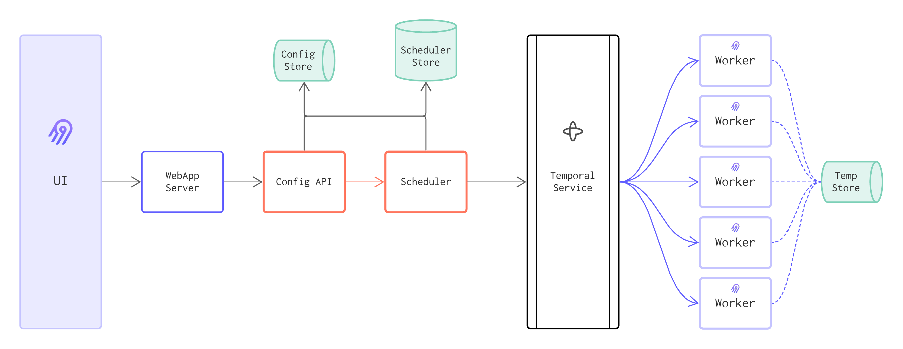
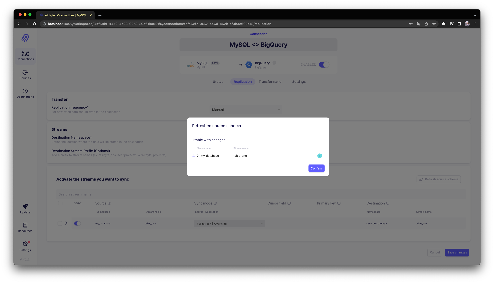

찍먹음 시리즈는 "찍어 먹어보고 음미하기 시리즈"의 약자로, 개인적으로 평소 궁금했던 소프트웨어를 빠르게 시도해본 뒤 기본 사용법과 후기를 기록하는 글 모음입니다. 

쓰고보니 별로 깊이 없는 내용일 가능성이 높으며, 의식의 흐름에 따라 쓰는 경우가 더러 있으므로 이점 양해해서 읽어주시면 되겠습니다 :)

---

## 들어가며

[Airbyte](https://airbyte.com)는 특정 데이터 스토리지에서 다른 데이터 스토리지로 데이터를 복제하는 오픈소스 도구이다. 
보통 통합 데이터 스토리지를 구축하기 위해, 프로덕트에서 사용하는 스토리지 내 데이터를 데이터 웨어하우스나 데이터 레이크로 옮겨야할 때 이런 일을 해야한다.
이런 목적으로 데이터를 복제하는 것을 "통합 스토리지에 데이터를 로드한다"라고 말하며, Airbyte는 이 데이터 로드에 초점을 두고 있는 도구인 것이다.

아래 그림에 나오듯, Airbyte는 데이터 피라미드에서 "Data storage / Management" 영역에 위치한다.


*출처: https://airbyte.com/blog/structure-a-data-team-to-climb-the-pyramid-of-data-science*

통합 데이터 스토리지에 데이터를 옮기는 방법은 보통 [ETL과 ELT 두 가지 방법](https://www.guru99.com/etl-vs-elt.html)이 있는데, Airbyte는 [ELT 방법을 따른다.](https://airbyte.com/blog/why-the-future-of-etl-is-not-elt-but-el)
자세한 내용은 아래에서 천천히 확인해보자.

이번 글에서는 이 Airbyte의 설치 방법, 주요 기능과 사용 방법, 간단한 동작 원리 등을 살펴보겠다.

> 공식 홈페이지에서 Airbyte Demo를 제공하는데, [이 페이지](https://demo.airbyte.io/workspaces/b734c3d7-ece6-47e0-8f07-c4be707fbcfa/)에서 확인할 수 있다.

## 시작해보기

제일 먼저 궁금한 것은, 어떤 핵심 기능을 제공해주고, 어떻게 사용할 수 있는지에 대한 것이다.
빠르게 설치하고 사용해보며 위 궁금함을 해결해보자.

Airbyte는 크게 다음 두 방식으로 사용할 수 있다.

- Cloud (SaaS)
- Open Source (Self-host)

Cloud를 쓰면 현재는 14일간 Free Trial 기간을 준다. 
Cloud도 좋지만 여기서는 직접 배포하는 맛을 느끼기 위해 Open Source 방식으로 사용해보겠다.

> SaaS 사용에 대한 가격 정보는 [이 페이지](https://airbyte.com/pricing)에서 확인할 수 있다.

### 설치하고 배포하기

Local, Kubernetes, AWS 등등 어디에 설치할 것이냐에 따라 설치 방법도 조금 다를 순 있는데, 여기서는 단순하게 하기 위해 Local에 설치한다.

```bash
$ git clone https://github.com/airbytehq/airbyte.git
$ cd airbyte
```

그리고 다음처럼 `docker-compose` 명령어로 배포한다.

```bash
$ docker-compose up
```

다음처럼 컨테이너들이 배포된 것을 확인할 수 있다.

```bash
$ docker-compose ps

              Name                            Command               State                                        Ports
-----------------------------------------------------------------------------------------------------------------------------------------------------------
airbyte-bootloader                 /bin/bash -c ${APPLICATION ...   Exit 0
airbyte-connector-builder-server   uvicorn connector_builder. ...   Up       0.0.0.0:8003->80/tcp
airbyte-cron                       /bin/bash -c ${APPLICATION ...   Up
airbyte-db                         docker-entrypoint.sh postgres    Up       5432/tcp
airbyte-proxy                      ./run.sh ./run.sh                Up       80/tcp, 0.0.0.0:8000->8000/tcp, 0.0.0.0:8001->8001/tcp
airbyte-server                     /bin/bash -c ${APPLICATION ...   Up       8000/tcp, 0.0.0.0:52152->8001/tcp
airbyte-temporal                   ./update-and-start-temporal.sh   Up       6933/tcp, 6934/tcp, 6935/tcp, 6939/tcp, 7233/tcp, 7234/tcp, 7235/tcp, 7239/tcp
airbyte-webapp                     /docker-entrypoint.sh ngin ...   Up       0.0.0.0:52151->80/tcp
airbyte-worker                     /bin/bash -c ${APPLICATION ...   Up       0.0.0.0:52153->9000/tcp
init                               /bin/sh -c ./scripts/creat ...   Exit 0
```

> Local을 비롯해 여러 환경에 설치하는 방법은 [이 페이지](https://docs.airbyte.com/category/deploy-airbyte-open-source)에서 확인할 수 있다.

웹 브라우저에서 `http://localhost:8000` 로 접속하면 다음처럼 인증과 관련된 페이지가 등장한다.
[기본 값](https://docs.airbyte.com/deploying-airbyte/local-deployment#setup--launch-airbyte)으로 username 값은 `airbyte  `, password 값은 `password` 이다.


인증이 잘 되었으면 다음처럼 Airbyte 웹 UI가 등장하게 된다.


> 여기서 사용하는 Airbyte 버전은 `0.40.21` 이다.

이제 Airbyte의 메인 기능인 데이터 로드(Extract and Load)를 위한 파이프라인을 만들어보자.

### Source 추가하기

#### 테스트용 MySQL 만들어두기

먼저 파이프라인의 소스(Source)가 되는 스토리지를 추가해야한다.
보통 프로덕트에서 사용하는 Database가 될텐데, 여기서는 테스트를 위해 간단히 다음처럼 MySQL 컨테이너를 로컬에 하나 띄워두었다.

> MySQL 컨테이너는 다음처럼 띄워두었다.
> ```bash
> $ docker run --name mysql-as-source -e MYSQL_ROOT_PASSWORD=root -d -p 3306:3306 mysql:8
> ```
> 
> ```bash
> $ docker exec -it mysql-as-source mysql -u root -p
> ...

소스 데이터로는 다음을 준비해두었다.

```sql
CREATE DATABASE my_database;
```

```sql
CREATE TABLE table_one(
  id integer PRIMARY KEY,
  name VARCHAR(200),
  updated_at timestamp DEFAULT NOW() NOT NULL
);
```

```sql
INSERT INTO table_one(id, name) VALUES(1, 'Eg1 IncApp');
INSERT INTO table_one(id, name) VALUES(2, 'Eg2 IncApp');
```

```sql
SELECT * FROM table_one;

+----+------------+---------------------+
| id | name       | updated_at          |
+----+------------+---------------------+
|  1 | Eg1 IncApp | 2022-11-21 13:26:46 |
|  2 | Eg2 IncApp | 2022-11-21 13:26:47 |
+----+------------+---------------------+
```

#### MySQL을 Source로 추가하기

이제 Airbyte 웹 UI에서 다음처럼 "Sources" 탭을 눌러 Source를 추가해보자.


"Connect your first source" 버튼을 클릭한다.

그리고 다음처럼 `Source type` 을 `MySQL` 로 선택한 뒤, 필요한 정보를 모두 채워준다.


완료하면 다음처럼 MySQL이 Source로 추가된 화면이 나온다.


### Destination 추가하기

#### BigQuery와 Cloud Storage 준비해두기

다음으로는 파이프라인의 목적지(Destination)가 되는 스토리지를 추가해야 한다.
보통은 [GCP BigQuery](https://cloud.google.com/bigquery)나 [AWS Redshift](https://aws.amazon.com/redshift) 같은 데이터 웨어하우스가 될 것이다.
여기서는 GCP BigQuery를 사용해보겠다.

먼저 GCP에서 다음처럼 Airbyte에서 사용할 서비스 계정(Service Account)을 만들고, 권한(Role)으로 다음을 부여한다.

- `BigQuery Data Editor`
- `BigQuery User`
- `Storage Object Admin`


Airbyte에서 이 서비스 계정을 사용할 수 있도록, 서비스 계정의 JSON Key도 하나 만든다.


BigQuery에 데이터를 로드하는 동안 임시로 데이터를 저장할 Cloud Storage 버킷(Bucket)도 다음처럼 만들어주자.


서비스 계정으로 Cloud Storage에 접근할 수 있는 Access Key와 Secret을 얻기 위해, 다음처럼 Settings 내 "INTEROPERABILITY" 탭에서 
"CREATE A KEY FOR A SERVICE ACCOUNT" 버튼을 클릭한다.


그리고 위에서 만들었던 서비스 계정을 선택한 뒤 "CREATE KEY" 버튼을 클릭하여 키를 생성한다.
그러면 Access Key와 Secret와 나오게 되는데, 이를 별도로 저장해두자.

#### BigQuery를 Destination으로 추가하기

이제 Airbyte 웹 UI에서 다음처럼 "Destinations" 탭을 눌러 Destination을 추가해보자.


"Connect your first destination" 버튼을 클릭한다.
그리고 다음처럼 `Source type` 을 `BigQuery` 로 선택한 뒤, 필요한 정보를 모두 채워준다.


완료하면 다음처럼 BigQuery가 목적지로 추가된 화면이 나온다.


### Connection 추가하기

이제 Source와 Destination 잇는 실질적인 파이프라인인 Connection을 추가해보자.
웹 UI에서 다음처럼 "Connections" 탭을 누른다.


"Create your first connection" 버튼을 클릭한다.

"Select an existing source" 항목의 Source로 이전에 만들었던 `MySQL` 을 선택하고, "Use existing source" 버튼을 클릭한다.


"Select an existing destination" 항목의 Destination으로 이전에 만들었던 `BigQuery` 를 선택하고 "Use existing destination" 버튼을 클릭한다.


그리고 다음처럼 적절하게 나머지 Connection 정보를 각 필드에 입력해준다.
각 필드에 대한 내용은 UI에 잘 나와있어서 굳이 별다른 설명이 필요 없을거 같다.
여기서 주요한 선택사항은 "Sync mode"와 "Normalization & Transformation" 항목인데, 이에 대한 자세한 내용은 더 있다가 알아보자.


여기까지 완료하고 "New connection" 버튼을 클릭해주면 Connection이 하나 생기게 된다.

기본적으로 Enabled 되어 있으니, 이제 "Sync now" 버튼을 눌러 MySQL에서 BigQuery로의 데이터 로드(Sync) 작업을 실행해보자.
그러면 "Sync History" 내에 "Sync Running" 이 표시되고 진행중인 작업의 로그가 등장한다.
로드 작업이 완료되면 다음처럼 "Sync Succeeded" 가 표시된다.


BigQuery에서 데이터가 잘 로드되었는지 확인해보자.
다음처럼 MySQL에 있던 Database, Table, Row가 BigQuery의 Dataset, Table, Row로 잘 로드되어 있는 것을 확인할 수 있다.


로드된 테이블 `table_one` 에는 `_airbyte_ab_id`, `_airbyte_emitted_at` 등 생소한 컬럼들이 보인다.
또 `_airbyte_raw_table_one` 이라는 이름의 생소한 테이블도 보인다.
이는 Airbyte가 로드 과정 중에 만들어내고 사용하는 컬럼, 테이블인데 이에 대해서는 뒤에서 더 설명하겠다.

### 정리

Airbyte의 핵심 기능인, 데이터를 로드하는 파이프라인을 만드는 방법은 매우 간단하다.
다음 3가지만 하면 된다.

1. 데이터를 어디에서 추출할지(Extract)에 대해 Source를 추가하고
2. 데이터를 어디로 로드(Load)할지에 대해 Destination을 추가한 뒤
3. Source와 Destination을 이어주는 파이프라인인 Connection을 추가한다.

Airbyte에서 지원하는 Source, Destination 유형(Connector)은 [이 페이지](https://airbytehq.github.io/integrations/)에서 확인할 수 있다.
직접 [Custom 유형](https://airbytehq.github.io/integrations/custom-connectors)도 만들 수 있는거 같다.

## Normalization & Transformation

위에서 Connection을 생성할 때 "Normalization & Transformation"이라는 설정 값으로 다음 두 개가 있었다.

- `Raw data (JSON)`
- `Normalized tabluar data`

이것들이 무엇인지 알아보자.

Airbyte는 Source(MySQL)에 있는 데이터를 어떻게 Destination(BigQuery)으로 로드했던 걸까?

Airbyte는 Source에서 로드할 데이터를 찾기 위해 Source로 쿼리를 보낸다.
그리고 이 결과를 JSON 형태로 가공한 뒤 Destination에 저장한다. 
이렇게 JSON 형태로 가공한 데이터를 "Raw 데이터"라고 한다.


*출처: https://airbyte.com/blog/etlt-gdpr-compliance*

Destination이 BigQuery의 경우 Raw 데이터는 Table로 저장되는데 Table 이름 앞에 `_airbyte_raw_` 가 붙는다.
우리가 로드 결과를 확인하던 과정 중 BigQuery에서 보았던 테이블  `_airbyte_raw_table_one` 이 바로 이 테이블이다.

`_airbyte_raw_table_one` 테이블을 직접 확인해보면 다음과 같은 데이터가 저장되어 있음을 알 수 있다.


`_airbyte_data` 컬럼에 Source로 부터 들고온 데이터가 JSON 형태로 표현되어있다.

> `_airbyte_ab_id`, `_airbyte_emitted_at` 컬럼은 Airbyte가 Sync할 때 내부적으로 사용하는 컬럼이다.
> 이에 대해 좀 더 알고 싶다면 [이 페이지](https://airbyte.com/tutorials/full-data-synchronization#step-7)를 참고하자.

"Normalization & Transformation"의 값으로 `Raw data (JSON)` 으로 설정하면 딱 이 Raw 데이터까지만 만들어지게 된다.

반면 `Normalized tabluar data` 으로 설정하면 이 Raw 데이터에 접근하여 한 번 더 가공(Transform)하여 정규화(Normalization)된 2차원 데이터로 만들어준다.
우리가 BigQuery에서 보았던 테이블 `table_one` 이 바로 이 데이터다.

그러면 `Normalized tabluar data` 방식만 쓰면 될거 같은데 `Raw data (JSON)` 방식은 왜 존재할까?
아마 대부분의 경우에는 `Normalized tabluar data` 를 쓰겠지만, 
정규화 하지 않고 말그대로 Raw한 데이터만 저장하고 싶다거나, 정규화하는 방식을 커스텀하게 만들고 싶을 수도 있을거 같다.
이럴 때 `Raw data (JSON)` 를 쓰면 된다.

한편 `Normalized tabluar data` 방식을 쓰게 되면, Raw 데이터를 가공하는 쿼리와 데이터를 저장하는 Destination에서 진행되기 때문에,
BigQuery와 같이 쿼리 기반으로 과금하는 Destination 경우 `Raw data (JSON)` 보다 비용이 비쌀 수 있다.

> Raw 데이터를 만들고 정규화하는 과정에 대해 좀 더 알고 싶다면 [이 페이지](https://airbytehq.github.io/understanding-airbyte/basic-normalization/)를 참고하자.

## Sync Mode

Sync Mode는 Source에서 데이터를 어떤 방식으로 뽑아낼 것이며(Extract), 이렇게 뽑아낸 데이터를 Destination에 어떤 방식으로 로드(Load) 할 것인지에 대한 설정이다.
Sync Mode로 어떤 설정 값을 쓰느냐에 따라 Destination에 최종적으로 로드되는 데이터의 모습이 달라지게 된다.

설정 값으로 다음 네 개가 존재한다.

- `Source: Full refresh | Dest: Overwrite`
- `Source: Full refresh | Dest: Append`
- `Source: Incremental | Dest: Append`
- `Source: Incremental | Dest: Deduped + history`

이것들이 무엇인지에 대해 하나씩 알아보자.

### `Source: Full Refresh | Dest: Overwrite`

`Source: Full Refresh` 의 경우, Source의 모든 데이터를 조회하여, 이 데이터들을 추출의 대상으로 본다.
Sync 시점의 Source에 있는 모든 데이터(Full)를 하나의 스냅샷으로 보고 모두 가져오는 것이다(Refresh).

`Dest: Overwrite` 인 경우, Destination에 로드할 데이터를 덮어쓰기(Overwrite) 형태로 로드한다.
즉, Destination에 있던 기존의 데이터를 모두 삭제하고 새로운 데이터로 덮어버리는 것이다.

이 방식은 꽤 직관적이고 단순하다. 
또한 특정 시점의 모든 데이터를 항상 받아오기 때문에, 그 시점의 최신 데이터를 그대로 로드할 수 있다.
하지만 Source에서 모든 데이터를 추출하기 때문에, 데이터가 큰 경우에는 성능에 부담이 생긴다.
따라서 추출 및 로드할 데이터가 작고, 로드하는 시점에서 최신 데이터가 필요한 경우에 일반적으로 사용하기 적절한 방식이다.

### `Source: Full Refresh | Dest: Append`

`Dest: Append` 인 경우, 추출한 데이터를 Destination에 기존에 존재하는 데이터 뒤에 추가로 붙여서(Append) 로드한다.
즉, Destination에는 기존 데이터는 그대로 둔 채 Source의 모든 데이터를 추가한다.

이 방식 역시 꽤 직관적이고 단순하다. 
`Source: Full Refresh | Dest: Overwrite` 의 장단점과 거의 비슷하지만, Append이다 보니 Destination에 쌓이는 데이터는 더 많아질 것이다.

이 방식은 Source의 데이터에 임시로 존재하는 데이터가 있고, 이를 Destination에 영구히 저장하고 싶을 때 적절한 방식이다.
예를 들어, 팀원이 일일 가공된 비즈니스 지표를 Google Sheet에 매일 로드하고 있다고 해보자.
이 비즈니스 지표는 내일이 되면 바뀌게 될텐데, 이 때 이 Sync 방식을 이용하여 오늘의 비즈니스 지표 값들을 Destination에 저장해둘 수 있다.

또는 Sync 시점과 함께 Source내 모든 데이터에 대한 스냅샷을 모두 저장하고 싶을 때에도 적절하다.
예를 들어, Database의 일일 스냅샷을 Destination에 모두 저장해두면, 추후에 특정 날짜의 Database에 어떤 데이터가 들어있었는지 확인할 수 있을 것이다.

아래 그림은 `Source: Full Refresh` 방식을 사용했을 때 `Dest: Overwrite` 방식과 `Dest: Append` 방식의 차이를 보여준다.


*출처: https://airbyte.com/blog/understanding-data-replication-modes*

### `Source: Incremental | Dest: Append`

`Source: Incremental` 의 경우, 마지막 Sync 이후에 Source에서 변경된(Incremental) 데이터만 추출하여 Destination에 로드한다.
여기서 변경이란 추가(INSERT)와 수정(UPDATE)를 의미한다. 삭제(DELETE)는 포함하지 않는다.

`Source: Incremental` 방식은 `Source: Full Refresh` 방식보다 일반적으로 효율적이다. 
Source의 모든 데이터가 아니라 실질적으로 변경된 부분만 다루기 때문이다.
따라서 로드할 데이터가 많다면 `Source: Full Refresh` 보다는 `Source: Incremental` 방식을 사용하는게 더 적절할 수 있다.

단 `Source: Full Refresh` 에서는 삭제된 데이터도 포함되는 반면, `Source: Incremental` 에서는 삭제된 데이터는 포함시킬 수 없다는 것을 알고있어야 한다.
만약 이 방식을 쓰면서 삭제까지 써야한다면, Source 측에서 [소프트 삭제(Soft Delete)](https://en.wiktionary.org/wiki/soft_deletion)를 고려해야한다.
(뒤에서 소개할 CDC를 적용하면 삭제 데이터도 포함시킬 수 있다. 일단 기본적으로는 이렇다는 것만 알아두자.)

`Dest: Append` 인 경우, 추출한 데이터를 Destination에 기존에 존재하는 데이터 뒤에 추가로 붙여서(Append) 로드한다.
즉, Destination에는 기존 데이터는 그대로 둔 채 Source의 변경된 데이터만 추가한다.

만약 Destination에 이미 한번 로드 된 데이터가 이후에 Source에서 수정(UPDATE)된 경우, 
Destination에서도 마찬가지로 해당 데이터를 수정(UPDATE) 하지 않고, 수정된 데이터를 추가(Append) 한다.
따라서 기본 키나 ID 같은 데이터가 여러 개 존재할 수 있다.
(아래 그림을 보면 좀 더 잘 이해될 것이다.)

이 방식은 데이터의 변경 이력을 Destination에 그대로 남겨야할 때 적절하다.
Destination에서 특정 키나 ID를 가진 데이터를 시간 순서대로 조회하면, 해당 데이터의 변경 이력을 쉽게 파악할 수 있을 것이다.

### `Source: Incremental | Dest: Deduped + history`

`Dest: Deduped + history` 인 경우, Destination에 로드할 데이터를 중복 제거하여 저장한다.
즉, 변경된 데이터만 Destination에 추가하는데, 만약 Destination에 이미 데이터가 존재한다면, 그 데이터는 Destination에서 수정(UPDATE)된다.
우리가 흔히 이야기하는 UPSERT(UPDATE + INSERT) 방식이다.

이 방식은 변경된 데이터만 로드하기 때문에, 일반적으로 가장 많이 사용하는 방식이다.
단 중간에 중복 제거를 위한 [SCD(Slowly Changing Dimension)](https://glossary.airbyte.com/term/slowly-changing-dimension-scd/) 테이블을 Destination에 추가적으로 만들기 때문에,
다른 방법보다 Destination에서 더 많은 쿼리를 실행하고 더 많은 스토리지를 쓰게된다.
만약 BigQuery와 같이 쿼리와 스토리지 모두 과금 체계를 가진 Destination을 사용한다면, 비용은 다른 방식보다 더 비쌀 것이다.

아래 그림은 `Source: Incremental` 방식을 사용했을 때  `Dest: Append` 방식과 `Dest: Deduped + history` 방식의 차이를 보여준다.


*출처: https://airbyte.com/blog/understanding-data-replication-modes*

### 정리

위에서 설명한 Sync Mode들의 특징을 표로 정리하면 다음과 같다.

| Sync Mode                                       | 주요 기능                    | 유의할 점 |
|-------------------------------------------------|---------------------------|------|
| `Source: Full refresh + Dest: Overwrite`        | - 삭제가 처리됨<br />- 작은 데이터 볼륨에 적합<br />- 최종 데이터에 중복이 없음 | - 히스토리가 저장되지 않음<br />- 대용량 데이터<br/>에 비효율적임<br />- 잦은 Sync에 비효율적임 |
| `Source: Full refresh + Dest: Append`           | - 히스토리를 저장함<br />- 작은 데이터 볼륨에 적합 | - 스토리지가 폭발할 수 있음<br />- 대용량 데이터에<br/>대해 비효율적임<br />\- 잦은 Sync에 비효율적임<br />- 최종 데이터에 중복이 포함됨 |
| `Source: Incremental + Dest: Append`            | - 잦은 Sync에 효율적임<br />- 히스토리를 저장함<br />- 기본 키가 필요하지 않음 | - 적합한 커서를 사용할 수 있어야 함<br />- 최종 데이터에 중복이 포함될 수 있음<br />- 삭제가 감지되지 않음<br />- 중간 상태가 캡처되지 않음 |
| `Source: Incremental + Dest: Deduped + history` | \- 잦은 Sync에 효율적임<br />\- 히스토리를 저장함<br />- 최종 데이터 중복 제거함 | - 기본 키 필요<br />- 적절한 커서를 사용할 수 있어야 함<br />- 삭제가 감지되지 않음<br />- 중간 상태가 캡처되지 않음 |


## CDC

Sync Mode는 아니지만 Sync Mode와 함께 Destination에 로드되는 데이터에 영향을 주는 설정이 있는데, 바로 [CDC(Change Data Capture)](https://en.wikipedia.org/wiki/Change_data_capture)다.
CDC는 말 그대로 데이터의 변경 이력을 추적하는 방법론인데, MySQL과 같은 Database들에서는 주로 WAL(Write Ahead Log)를 이용하여 이를 구현할 수 있다.
따라서 CDC 방식을 `Source: Incremental` Sync 방식과 함께 사용하면 데이터 삭제(DELETE) 이력도 Destination에 포함시킬 수 있다.

> WAL 방식 말고도 다른 방법들로 CDC를 구현할 수 있는데, 더 자세히 알고 싶다면 [이 페이지](https://airbyte.com/blog/change-data-capture-definition-methods-and-benefits#change-data-capture-methods)를 참고하면 좋을거 같다.

Airbyte에서 CDC 설정은 다음처럼 Source의 설정 값 중 "Replication Method" 항목에서 지정 할 수 있다.


또한 Source가 되는 스토리지에서 직접 CDC 관련 설정을 작업해줘야 한다.
예를 들어, MySQL의 경우 다음처럼 MySQL 설정에서 바이너리 로깅을 활성화해줘야 한다.

```ini
server-id                  = 223344
log_bin                    = mysql-bin
binlog_format              = ROW
binlog_row_image           = FULL
binlog_expire_log_seconds  = 864000
```

모든 Source에 대해서 CDC가 가능한 것은 아니며, Airbyte에서 현재 CDC를 지원하고 있는 Source는 [이 페이지](https://airbytehq.github.io/understanding-airbyte/cdc/#current-support)에서 확인할 수 있다.

CDC는 주로 `Source: Incremental` 방식과 같이 쓰일 때 이점이 있으며, 반대로 `Source: Full Refresh` 방식과 같이 쓰일 때는 이점이 없다.
왜냐하면 CDC는 Source의 변경 데이터에 대해서만 관심이 있는데, `Source: Full Refresh` 방식은 전체 데이터를 모두 스캔하기 때문이다.

아래 그림은 CDC를 사용했을 때 `Dest: Append` 방식과 `Dest: Deduped + history` 방식의 차이를 보여준다.


*출처: https://airbyte.com/blog/understanding-data-replication-modes*

또한 CDC를 사용하면 Source에서 쿼리가 아닌 WAL를 통해 데이터를 추출하기 때문에, Source에 부하를 덜 줄 수 있는 이점도 있다.

> Airbyte는 CDC를 위해 내부적으로 [Debezium](https://debezium.io/)를 사용한다고 한다.
> 
> *출처: https://airbyte.com/tutorials/incremental-change-data-capture-cdc-replication*

사실 Source 스토리지에 직접 CDC 관련 설정을 할 수 있는 환경이 된다면, `Source: Incremental` 방식과 함께 CDC를 사용하는게 일반적으로 좋을거 같다.
다만 `Source: Incremental | Dest: Deduped + history` 방식으로 사용할 경우, 삭제가 된 데이터는 추후에도 보기 어렵다는 것을 유념해야 할 것이다.

예를 들어, 2개월 전에 만들었던 비즈니스 지표 리포트를 다시 만들려고 하는데, 일부 데이터가 일련의 이유로 사라졌다면, 2개월 전 비즈니스 지표 리포트를 다시 만드는 것은 꽤 어려워진다. 
이처럼 데이터가 과거에는 존재했다가, 어느순간 삭제되어 존재하지 않는 경우 과거의 데이터 스냅샷을 재현하기 어려워진다는 것을 꼭 알아두고 적절히 사용하자.

## 아키텍처

### 컴포넌트와 워크플로우

Airbyte의 아키텍처를 하나의 다이어그램으로 표현하면 다음과 같다.


*출처: https://airbytehq.github.io/understanding-airbyte/high-level-view*

각 컴포넌트를 설명하면 다음과 같다.

- WebApp Server
  - UI와 API 간의 연결을 처리한다.
- Config Store
  - 모든 연결 정보(자격증명, 빈도 등)를 저장한다.
- Scheduler Store
  - 스케줄러 예약을 위한 상태 및 작업 정보를 저장한다.
- Config API
  - 메인 컨트롤 플레인이다.
  - Sources, Destinations, Connections, Config 관리 등과 같은 Airbyte의 모든 작업은 API에서 구성되고 호출된다.
- Scheduler
  - API에서 작업 요청을 받아 [Temporal 서비스](https://temporal.io/)로 전송하여 병렬화한다.
  - 성공/실패 추적 및 구성된 빈도에 따라 동기화 트리거를 담당한다.
- Temporal Service
  - Scheduler의 작업 대기열 및 워크플로우를 관리한다.
- Worker
  - Source Connector에 연결하고 데이터를 가져와 Destination에 로드한다.
- Temporary Storage
  - Worker가 데이터를 뽑아낼 때마다 사용할 수 있는 저장소다.

각 컴포넌트간 의존 관계 및 워크플로우는 위 그림에 나오는 화살표를 보면 쉽게 알 수 있다.

### Worker와 Job

위 컴포넌트들 중에서 가장 핵심이 되는 항목은 Worker다.
Worker는 실질적인 ELT 작업을 진행하는 역할을 담당하고 있다.

Worekr는 구체적인 책임에 따라 다음 4가지로 구성되어 있다.

- Spec Worker
  - Connector에 대한 명세(Specification)를 검색한다.
- Check Connection Worker
  - Connector에 대한 입력이 유효하고 Sync하는데 문제 없는지 확인한다.
- Discovery Worker
  - Connector의 Source 스키마를 검색한다.
- Sync Worker
  - Source와 Destination 간에 Sync를 수행한다.

여기서 Sync에 핵심이 되는 Sync Worker에 대해서 좀 더 알아보자.

Sync가 진행될 때, Sync Worker에서는 다음의 일들이 일어난다.


1. Source와 Destionation 관련 도커 컨테이너를 실행시킨다.
2. Source 컨테이너에서 추출한 메시지를 Destionation 컨테이너로 전달한다.
3. Source와 Destionation 컨테이너가 할 일을 마치면, 이 둘을 종료시킨다.
4. 실행 결과를 반환한다.

이 때 Source, Destionation 컨테이너를 Job이라고 부르며, 이 Job들은 이름 그대로 각각 본인과 관련된 일들을 진행한다.
Source 컨테이너는 Source에서 데이터를 추출하는 일을(Extract), Destination 컨테이너는 입력받은 데이터를 Destination으로 로드하는 일(Load)을 한다.

그리고 Sync 옵션 중 `Normalization` 이 설정되어 있었다면, Normalization 컨테이너도 Worker에 의해 실행된다.
Normalization 컨테이너는 로드된 데이터(RAW JSON)를 가공하여(Transform) 최종적으로 Destination에 데이터(Normalized)를 저장한다.

예를 들어 위에서 진행한 MySQL -> BigQuery Connection을 Sync하는 경우 Sync worker에서는 다음과 같은 일들이 일어난다.


데이터 흐름을 중심으로한 내용만 담았다. 
별도의 설명 없이 다이어그램만으로도 충분히 이해가능하리라 본다.
더 자세하게 알아보고 싶다면, [이 Sync 로그](https://gist.github.com/heumsi/e07c1e7ecef94eb888a281dace2806e2)를 보자.
(나도 이 로그를 보고 위 다이어그램을 그렸다.)

> Worker와 Job은 어떤 형태로 실행될까?
> - 단일 컴퓨팅 환경, 즉 Docker-compose로 배포한 경우에는 Worker와 Job은 컨테이너로 뜬다. 
> - 분산 컴퓨팅 환경, 즉 Kubernetes에서 배포한 경우는 파드로 뜨게 된다. 쿠버네티스에서의 배포 아키텍처는 [이 페이지](https://airbyte.com/blog/scaling-data-pipelines-kubernetes)에 잘 설명되어 있다.

### Normalization Job

Normalization Job에서는 로드된 데이터를 가지고 Normalized 데이터를 만들기 위해 이런저런 쿼리를 Destination으로 보내게 된다.
그럼 구체적으로 어떤 쿼리를 보낼까?

보내는 쿼리는 Sync mode에 따라 조금씩 다른데, 어떤 쿼리를 보내는지 간단하게만 살펴보자.
위에서 진행했던 MySQL -> BigQuery Connection의 경우 Sync mode로 `Source: Full refresh | Dest: Overwrite`을 사용했었다.

BigQuery에 들어가 Query History를 살펴보면 다음과 같이 실행되었던 쿼리가 보인다.


*아래에서 위로의 방향이 시간순이다.*

다음 순으로 실행되었다.

- Query
- Copy
- Load
- Query

여기서 앞에 3개는 Destination Job에서 실행된 쿼리고, 뒤에 마지막 하나가 Normalization Job에서 실행된 쿼리다.
이 쿼리 내용을 살펴보면 다음과 같다.

```sql
/* {"app": "dbt", "dbt_version": "1.0.0", "profile_name": "normalize", "target_name": "prod", "node_id": "model.airbyte_utils.table_one"} */


  create or replace table `heumsi-playground`.my_database.`table_one`
  partition by timestamp_trunc(_airbyte_emitted_at, day)
  cluster by _airbyte_emitted_at
  OPTIONS()
  as (
    
with __dbt__cte__table_one_ab1 as (

-- SQL model to parse JSON blob stored in a single column and extract into separated field columns as described by the JSON Schema
-- depends_on: `heumsi-playground`.my_database._airbyte_raw_table_one
select
    json_extract_scalar(_airbyte_data, "$['id']") as id,
    json_extract_scalar(_airbyte_data, "$['name']") as name,
    json_extract_scalar(_airbyte_data, "$['updated_at']") as updated_at,
    _airbyte_ab_id,
    _airbyte_emitted_at,
    CURRENT_TIMESTAMP() as _airbyte_normalized_at
from `heumsi-playground`.my_database._airbyte_raw_table_one as table_alias
-- table_one
where 1 = 1
),  __dbt__cte__table_one_ab2 as (

-- SQL model to cast each column to its adequate SQL type converted from the JSON schema type
-- depends_on: __dbt__cte__table_one_ab1
select
    cast(id as 
    int64
) as id,
    cast(name as 
    string
) as name,
    cast(nullif(updated_at, '') as 
    timestamp
) as updated_at,
    _airbyte_ab_id,
    _airbyte_emitted_at,
    CURRENT_TIMESTAMP() as _airbyte_normalized_at
from __dbt__cte__table_one_ab1
-- table_one
where 1 = 1
),  __dbt__cte__table_one_ab3 as (

-- SQL model to build a hash column based on the values of this record
-- depends_on: __dbt__cte__table_one_ab2
select
    to_hex(md5(cast(concat(coalesce(cast(id as 
    string
), ''), '-', coalesce(cast(name as 
    string
), ''), '-', coalesce(cast(updated_at as 
    string
), '')) as 
    string
))) as _airbyte_table_one_hashid,
    tmp.*
from __dbt__cte__table_one_ab2 tmp
-- table_one
where 1 = 1
)-- Final base SQL model
-- depends_on: __dbt__cte__table_one_ab3
select
    id,
    name,
    updated_at,
    _airbyte_ab_id,
    _airbyte_emitted_at,
    CURRENT_TIMESTAMP() as _airbyte_normalized_at,
    _airbyte_table_one_hashid
from __dbt__cte__table_one_ab3
-- table_one from `heumsi-playground`.my_database._airbyte_raw_table_one
where 1 = 1
  );
  
```

복잡해보이지만, 결국엔 RAW JSON이 로드되어있는 `_airbyte_raw_table_one` 테이블에서 JSON 데이터를 파싱해서 Normalization 한 뒤, 
최종 테이블인 `table_one`에 저장하는 내용이다.

앞에서도 이야기 했지만, Sync mode에 따라 실행시키는 쿼리는 다양하다.
`Source: Full refresh | Dest: Overwrite` 의 경우 가장 단순한 Sync mode이므로, 쿼리 역시 간단하게 나오는 것이고,
CDC + `Source: Incremental + Dest: Deduped + history` 의 경우 꽤 복잡한 Sync mode이므로, 쿼리도 복잡하고 여러 개 나오게 된다.

여하튼 핵심은 Normalization Job에서 이런 쿼리들을 규칙에 맞게 만들고 실행함으로써 Normalized Data를 만들어낸다는 것이다.

Normalization Job에서 SQL을 만들어내고 실행하는 과정이 더 궁금하다면, 이 [페이지](https://airbyte.com/tutorials/full-data-synchronization#step-7)를 참고하자.

## QnA

조금 더 궁금한 내용을 찾아보고 Q&A 형식으로 정리해보았다.

### 데이터 마스킹 기능은 있나?

Destination으로 그대로 가져오기 민감한 정보(개인 정보 등)들은 해시 처리와 같은 별도의 데이터 마스킹 작업이 필요할 수 있다.
Airbyte에서는 이에 대한 기능을 제공해줄까?

할 수는 있다. 
단 웹 UI가 아니라 직접 YAML로 Low-code Connector를 구성하고 컨테이너 이미지로 빌드해야한다.
아이디어는 Source로부터 데이터를 추출(Extract)하고 Destination에 로드(Load)하기 전에 추출한 데이터에 커스텀하게 간단한 변형(Tweak)을 하는 것이다.


*출처: https://airbyte.com/blog/etlt-gdpr-compliance*

이에 대한 자세한 내용은 [이 페이지](https://airbyte.com/blog/etlt-gdpr-compliance)에서 확인할 수 있다.
아무래도 Airbyte의 [Low-code Connector에 대한 개념](https://docs.airbyte.com/connector-development/config-based/connector-builder-ui)을 알아야할거 같은데, 
다른 기능들보다는 배우는데 허들이 좀 있어보인다.

만약 데이터 마스킹이 꼭 필요하다면, 당장은 Destination에서의 데이터 마스킹을 사용하는게 나을 수 있겠다(Destination에서 이 기능을 지원해준다면).
예를 들면 BigQuery의 경우 [동적 데이터 마스킹 기능](https://cloud.google.com/bigquery/docs/column-data-masking-intro?hl=ko)을 제공한다.

### RBAC는?

[(아직) 지원하지 않는다.](https://airbytehq.github.io/operator-guides/security/#access-control)
RBAC 또는 User Management를 구현하려면 Airbyte 앞단에 Proxy 서버를 두고 자체적으로 해결해야할 것으로 보인다.

Cloud 버전의 Airbyte에서는 RBAC는 아니지만 User Management를 지원하고 있고, [SSO는 추후에 추가될 예정이라고 한다.](https://airbyte.gitbook.io/airbyte/project-overview/roadmap#3.-parity-with-enterprise-features-data-quality-privacy-compliance-customer-data-consolidation-featu)

### 모니터링용 메트릭은 제공해주나?

현재는 다음 두 모니터링 툴을 위한 메트릭을 제공해준다.

- [OpenTelemetry](https://opentelemetry.io)
- [Datadog](https://www.datadoghq.com)

[이 페이지](https://docs.airbyte.com/operator-guides/collecting-metrics/)에 사용 방법에 대해 다루고 있는데, OpenTelemetry를 사용하면 Prometheus에서 다음과 같은 Metric들을 볼 수 있다.


*프로메테우스에서 확인한 메트릭* 

제공하는 전체 Metric은 [이 페이지](https://github.com/airbytehq/airbyte/blob/master/airbyte-metrics/metrics-lib/src/main/java/io/airbyte/metrics/lib/OssMetricsRegistry.java)에서 확인할 수 있다.

### Kubernetes 배포를 위한 Helm Chart도 제공해주나?

[공식 Repository](https://github.com/airbytehq/airbyte/tree/master/charts/airbyte)에서 제공한다.

이와 관련해서는 [이 페이지](https://airbytehq.github.io/deploying-airbyte/on-kubernetes/#customizing-airbytes-manifests)를 참고하면 좋을거 같다.

### 워크플로우 오케스트레이션 툴과 연동할 수 있나?

Airbyte에서도 Connection의 Sync 실행 주기 설정을 자체적으로도 제공해주지만, [Airflow](https://airflow.apache.org/)나 [Prefect](https://www.prefect.io/), [Dagster](https://dagster.io/)와 같은 워크플로우 오케스트레이션 툴과도 연동할 수 있는 방법을 공식 문서에서 제공한다.
이와 관련해서는 각 툴마다 다음 페이지를 확인하자.

- [Airflow](https://airbytehq.github.io/operator-guides/using-the-airflow-airbyte-operator/)
- [Prefect](https://airbytehq.github.io/operator-guides/using-prefect-task)
- [Dagster](https://airbytehq.github.io/operator-guides/using-dagster-integration)

### 중간에 스키마가 바뀌면 어떻게 되나?

직접 한번 해봤다.
위에서 작업했던 MySQL Source에 다음처럼 Column을 추가했다.

```sql
ALTER TABLE table_one ADD COLUMN `value` INIT NOT NULL AFTER `name`;
```

그리고 수동으로 Sync를 진행했다. 
그러나 BigQuery Destination에 스키마 변경이 자동으로 반영되지 않았다.

[이 페이지 내용](https://discuss.airbyte.io/t/how-to-reflect-schema-changes-in-destination-for-postgres-to-postgres-cdc/1080)에 따르면,
스키마 변경 후 Connection의 Replication 탭에서 "Refresh source schema" 버튼을 클릭해야 한다.
이 버튼을 클릭하면 다음처럼 스키마 변경을 잡아냈다는 결과를 화면에 보여준다.



그리고 "Save changes" 버튼을 클릭하면, 다음처럼 Data Reset을 진행하기 위한 컨펌 페이지가 등장한다.


"Save connection" 버튼을 누르고, Connection 페이지에 들어가서 확인해보면, 다음처럼 Reset이 진행중인 것을 볼 수 있다.


[Reset 로그](https://gist.github.com/heumsi/9de90345a9d3523362f69f237bfd2092)를 보면, Destination Job과 Normalization Job이 실행되고 있는 것을 알 수 있다.
Destination Job에서 Schema를 변경한 Avro 파일을 GCS에 업로드한 뒤, BigQuery에 이 GCS 파일을 밀어넣고 있고,
Normalization Job에서는 그 후속 작업을 (이전이랑 동일하게) 진행한다.

Reset 작업이 끝나면 Sync도 자동으로 다시 실행된다.
그리고 이제 BigQuery에 변경된 스키마로 보이게 된다.

이는 Column 추가뿐 아니라, 수정, 삭제에도 동일했다.
Sync mode가 `Source: Full refresh | Dest: Overwrite` 인 경우에만 가능한 것인지 모르겠다.
(나머지 mode에 대해서는 테스트 해보진 않았다.)

정리하면, 스키마 변경 후에는 Connection의 Replication 탭에서 "Refresh source schema" 을 한번 실행시켜야 하고,
이 때 Data reset과 Sync 작업이 일어나게 된다.

> "Data reset"은 Destination에 있는 모든 데이터를 삭제한다. 
> 즉 위에서 스키마 변경을 적용하는 작업은, 기존 데이터를 모두 날리고, 새로 데이터를 Sync하는 것과 동일하다.
> 만약 Destination에 이미 너무 많은 데이터가 있다거나, Source에 이전 데이터가 없다면, 이는 꽤 크리티컬한 문제일 수 있다.
> "Data reset"에 대한 더 자세한 내용은 [이 페이지](https://docs.airbyte.com/operator-guides/reset)를 확인하자.

한편, 이와 관련하여 "Auto-detect Schema Changes" 와 관련된 이슈가 [Airbyte Roadmap으로 등록되어 있는 걸로 보아](https://github.com/airbytehq/airbyte/issues/12089),
추후에 더 개선될 것으로 보인다.

### 로드할 데이터가 너무 크면 혹시 OOM이 나나?

Worker의 메모리보다 큰 데이터를 옮길 때, 혹시 OOM이 나지는 않을까?
Worker의 최대 메모리를 500Mi로 준 뒤, MySQL -> BigQuery로 약 1Gi의 데이터를 Sync 해보았다.

결과적으로 OOM이 나지 않았다.
Worker 로그를 보니 다음처럼 Source에서 데이터를 나눠서 옮기고 있었다.

```bash
2023-01-08 07:43:25 source > State report for stream AirbyteStreamNameNamespacePair{name='data_big', namespace='my_database'} - original: null = null (count 0) -> latest: id = 8706354 (count 1)
2023-01-08 07:43:25 source > State report for stream AirbyteStreamNameNamespacePair{name='data_big', namespace='my_database'} - original: null = null (count 0) -> latest: id = 8706355 (count 1)
2023-01-08 07:43:25 source > State report for stream AirbyteStreamNameNamespacePair{name='data_big', namespace='my_database'} - original: null = null (count 0) -> latest: id = 8706356 (count 1)
...
2023-01-08 07:50:04 source > Closing database connection pool.
2023-01-08 07:50:04 source > HikariPool-1 - Shutdown initiated...
2023-01-08 07:50:04 source > HikariPool-1 - Shutdown completed.
2023-01-08 07:50:04 source > Closed database connection pool.
2023-01-08 07:50:04 source > Completed integration: io.airbyte.integrations.base.ssh.SshWrappedSource
2023-01-08 07:50:04 source > completed source: class io.airbyte.integrations.source.mysql.MySqlSource
...
2023-01-08 07:50:04 destination > Airbyte message consumer: succeeded.
2023-01-08 07:50:04 destination > executing on success close procedure.
2023-01-08 07:50:04 destination > Flushing all 2 current buffers (95 MB in total)
2023-01-08 07:50:04 destination > Flushing buffer of stream data_big (95 MB)
2023-01-08 07:50:04 destination > Flushing buffer for stream data_big (95 MB) to staging
2023-01-08 07:50:04 destination > Finished writing data to 5f36b0ad-5f37-4ba8-803b-4e2d5575a2676478714332736492889.avro (95 MB)
2023-01-08 07:50:04 destination > Uploading records to staging for stream data_big (dataset my_database): staging/my_database_data_big/2023/01/08/07/7a948bc0-e408-4d95-a8cd-e0663754fe30/
2023-01-08 07:50:05 destination > Initiated multipart upload to heumsi-playground-airbyte/staging/my_database_data_big/2023/01/08/07/7a948bc0-e408-4d95-a8cd-e0663754fe30/14.avro with full ID ABPnzm4Khnar5YKnSLvzBcnOEV2kQvxFO73UKQPtP5qVRGQypVQpOZZyVcnx4J3N5jLlFqGt
2023-01-08 07:50:05 destination > Called close() on [MultipartOutputStream for parts 1 - 10000]
2023-01-08 07:50:19 destination > [Manager uploading to heumsi-playground-airbyte/staging/my_database_data_big/2023/01/08/07/7a948bc0-e408-4d95-a8cd-e0663754fe30/14.avro with id ABPnzm4Kh...N5jLlFqGt]: Finished uploading [Part number 1 containing 10.01 MB]
2023-01-08 07:50:30 destination > [Manager uploading to heumsi-playground-airbyte/staging/my_database_data_big/2023/01/08/07/7a948bc0-e408-4d95-a8cd-e0663754fe30/14.avro with id ABPnzm4Kh...N5jLlFqGt]: Finished uploading [Part number 10 containing 5.37 MB]
2023-01-08 07:50:36 destination > [Manager uploading to heumsi-playground-airbyte/staging/my_database_data_big/2023/01/08/07/7a948bc0-e408-4d95-a8cd-e0663754fe30/14.avro with id ABPnzm4Kh...N5jLlFqGt]: Finished uploading [Part number 5 containing 10.01 MB]
2023-01-08 07:50:38 destination > [Manager uploading to heumsi-playground-airbyte/staging/my_database_data_big/2023/01/08/07/7a948bc0-e408-4d95-a8cd-e0663754fe30/14.avro with id ABPnzm4Kh...N5jLlFqGt]: Finished uploading [Part number 2 containing 10.01 MB]
...
```

로드할 데이터를 중간 과정에서 들고있는 GCS를 보니, 다음처럼 200MB 단위로 데이터가 나뉘어 업로드 되어 있는 것을 확인할 수 있었다.


약 1Gi 데이터가 2.6Gi가 되어 저장되었다. 
확실히 RAW JSON 형태(Avro 파일에 담긴)로 데이터를 가공하니, 데이터 사이즈가 커지는 거 같긴하다.

## 더 읽어보면 좋을거리

위 내용 외에도 나중에 추가로 더 읽어볼만한 글들은 링크로 남겨둔다.

- [Series: Building Airbyte’s Data Stack](https://airbyte.com/blog/building-airbytes-data-stack)
  - Airbyte와 DBT, [Metabase](https://www.metabase.com/)를 이용하여 각 데이터 계층 별로 어떻게 기술 스택을 쌓을 수 있는지 말해준다.
  - 첫 번째 시리즈 글로 [Airbyte Monitoring with dbt and Metabase - Part I](https://airbyte.com/blog/airbyte-monitoring-with-dbt-and-metabase)이 최근에 올라왔는데, 시리즈 글이 계속해서 올라올거 같다.
- [Airbyte Roadmap](https://app.harvestr.io/roadmap/view/pQU6gdCyc/launch-week-roadmap)
  - Airbyte의 추후 개발 로드맵을 알 수 있다.
    - 2022 4Q를 보면 다양한 Connector 개발에 힘을 주로 쏟고 있는 것을 알 수 있다.
    - 또한 Connector extensiblity 항목에도 꽤 힘을 쏟고 있는데, Connector 만드는 방법이 좀 더 편해지지 않을까 싶다.
    - 이 외에도 Column Selection, Auto-detect Schema Changes 등 데이터를 로드할 때 아주 유용한 기능들이 개발 중인 것을 알 수 있다.
- [Tutorials](https://airbyte.com/tutorials)
  - Airbyte에서의 다양한 ELT 파이프라인의 예제를 보여준다. 
  - Setup부터 중간에 내부적으로 진행되는 과정, 최종 결과까지 스크린샷과 함께 모두 다 세세하게 알려주고 있다. 꽤 정성을 들인게 보인다.
  - 나중에 내가 만들고자하는 파이프라인이 이 페이지에 이미 있는지 확인해보면 좋을거 같다.
- [Airbyte Blog](https://airbyte.com/blog)
  - Airbyte 공식 블로그인데, 데이터 팀 운영, 데이터 엔지니어링 등 괜찮은 글들이 많이 올라온다.
  - 고객 컨설팅을 위한 글이 아니라, 본인들의 이야기(어떤 기술 스택을 쓰며 어떻게 성장하고 있는지 등)를 주로 올린다. 
  - 데이터 관련 SaaS 개발을 하는 사람들의 데이터 팀, 기술에 대한 인사이트를 볼 수 있어서 좋다.

## 후기

Airbyte는 대략 일년 전쯤에 알았던 거 같다.
당시 쏘카 데이터 엔지니어링 팀에서 일하고 있었는데, 팀에서는 프로덕트 데이터 스토리지에서 통합 데이터 스토리지로 옮겨오는 파이프라인을 Airflow에서 Operator를 활용하여 만들고 있었다.
Operator를 활용하여 자유롭게 컨트롤할 수 있는 것은 좋았지만, 세부 구현은 일일이 코드와 SQL로 해야했으므로 쉽지 않았다.
내가 만약 다른 회사의 초기 데이터 팀으로 입사하여 짧은 시간 내에 똑같은 일을 해야한다면, 과연 데이터 로드용 파이프라인을 잘 구현할 수 있을까에 대한 확신은 들지 않았다.

하고자 하는 것은 그저 서로 다른 데이터 스토리지간 데이터를 복제하는 것으로, 아주 명확한 목표를 가진다.
이는 통합 데이터 환경 구축을 위한 가장 기본적인 작업인데, 분명 이와 관련한 오픈소스가 있을 것이라 생각했고, 그러다 발견한게 Airbyte였다.
당시에 Airflow 컨퍼런스에도 Airbyte가 종종 보일정도로 핫했던거 같다.
그 때에도 보자마자 몇 번 실행은 해봤지만, 따로 정리하지는 않았었다. 아마 귀찮아서 였던거 같다.

이번에는 Airbyte를 좀 제대로 음미하고자, 공식 문서와 블로그 글을 하나하나 (거의) 다 읽어보았다.
주요 컨셉과 기능은 확실하고, 사용감도 매우 훌륭했다.
직관적이고 단순한 UI, 공식 블로그의 예제들만 보면 데아터 엔지니어링을 해본적이 없는 사람이더라도 누구나 쉽게 따라할 수 있을거 같다. 

단 데이터 마스킹 기능이 없다는 것은 많이 아쉽다.
어느정도 규모가 있는 회사들에서는 데이터가 보안이나 컨플라이언스랑도 꽤 많이 엮여 있어서, 데이터 마스킹 없이 데이터 통합 데이터 스토리지를 만들기는 어려울 것이다.
따라서 어느정도 규모가 있는 회사들에서 Airbyte를 운영 환경에서 적극 도입하기는 어려울거라는 생각이 든다.
만약 도입한다면 Low-code Connector를 일일이 만들어야 하는데, 솔직히 이게 ROI가 잘 나오는 작업인지는 판단이 잘 안선다.

반면, 아직 초기 단계의 회사에서는 데이터 보안이나 컨플라이언스에 크게 신경쓸 단계가 아닐 수 있기 때문에, Airbyte를 이옹하면 통합 데이터 스토리지를 빠르게 구축할 수 있을 것 같다.
데이터 엔지니어나 분석가는 데이터 로드 작업의 대부분은 Airbyte에게 맡기고, 데이터 피라미드의 윗 단계(데이터 마트나 운영)에 좀 더 신경쓸 수 있을 것이다.

한편, Airbyte 블로그 글들을 보다보면 BigQuery, Snowflake와 같은 SaaS를 Destination 스토리지로 사용하는 것이 주로 나온다
(아무래도 Airbyte 팀 내부적으로 이런 SaaS를 많이 써서 그런거 같다.).
이런 클라우드 기반의 스토리지를 쓰는게 Airbyte랑 궁합이 잘 맞는거 같기한데, 솔직히 비용이 효율적인지는 모르겠다.

예를 들어, BigQuery를 Destionation으로 두고, `Source: Incremental + Dest: Deduped + history` 방식으로 Sync하게 되면,
중간 과정에서 2개의 테이블(Raw 테이블과 SCD 테이블)을 BigQuery에 쓰게 되고, 각 테이블에서 최종 데이터를 로드하기 위해 쿼리를 실행하게 된다.
여기서 스토리지와 쿼리 모두 돈이기 때문에, 대용량으로 데이터를 로드해야하는 경우 Airbyte를 쓰면 비용이 너무 비싸지지 않을까 싶다.
자세히 살펴보지는 않았지만, 비용 최적화 보다 속도가 더 중요한 상황에서는 Airbyte를 사용하기 적절하다는 생각이 든다.

여하튼 후기를 3줄 요약하면 글을 마무리한다.

- 데이터 엔지니어가 필요하지 않을 정도로 사용하기 쉽고, 빠르게 일반적인 방식으로 데이터 로딩(ELT)할 수 있다.
- 비용, 컴플라이언스 보단 속도가 더 중요할 때 (주로 사람이 적은 초기 단계 비즈니스 규모일 때) 적절하지 않을까 싶다.
- 공식 블로그에 레퍼런스가 많이 있고, 주로 여러 SaaS 연계하는 내용이 많으니, 필요할 때 참고하면 더 좋을거 같다.

## 참고

- https://airbyte.com/blog/structure-a-data-team-to-climb-the-pyramid-of-data-science
- https://airbyte.gitbook.io/airbyte/integrations/destinations/bigquery
- https://airbyte.com/blog/understanding-data-replication-modes
- https://airbyte.com/tutorials/full-data-synchronization
- https://airbyte.com/tutorials/incremental-data-synchronization
- https://airbyte.com/tutorials/incremental-change-data-capture-cdc-replication
- https://airbyte.com/blog/change-data-capture-definition-methods-and-benefits
- https://airbytehq.github.io/understanding-airbyte/high-level-view/
- https://airbyte.com/blog/scaling-data-pipelines-kubernetes