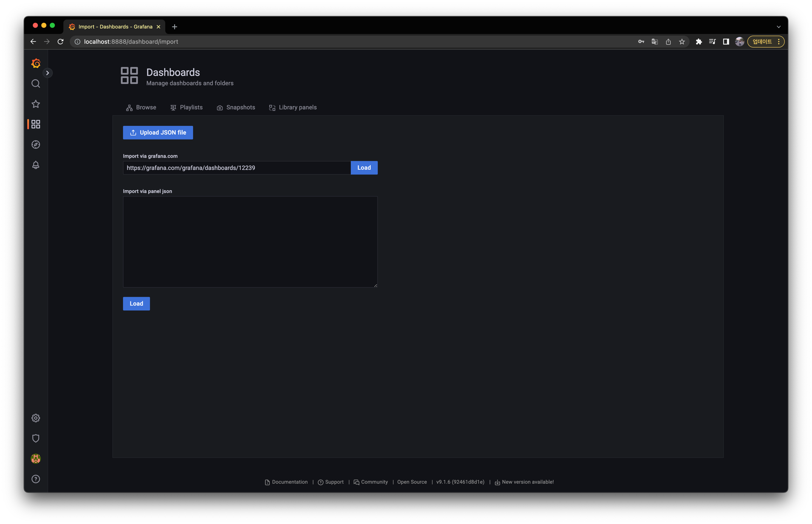
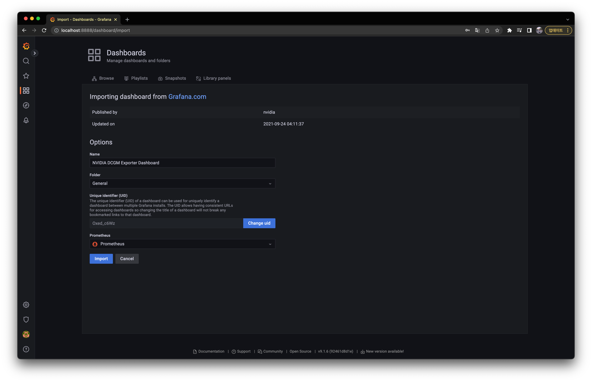

## 들어가며

### 배경

지난 몇 달간 팀에서의 첫 정식 작업으로, 팀에서 운영하는 쿠버네티스에 GPU 환경 셋업하는 일을 담당했다.
팀에 합류하기 이전에는 그저 클라우드만 사용해봤었고, 쿠버네티스에서의 GPU 역시 클라우드에서 제공해주는 대로만 사용했던 터라, GPU 셋업에 대해 별로 생각해본적은 없었다.
그런데 이번에 온-프레미스 환경의 쿠버네티스를 처음 접해보며, GPU 셋업에 이런 컴포넌트들이 필요하구나 라는걸 처음 알게 되었다.

내가 작업해온 것들을 다시 하나씩 정리하며, 이번 글에서는 쿠버네티스에 GPU 노드를 추가한 이후에 GPU 환경을 셋업하는 방법과 과정에 대해 적어본다.
기본적으로 나를 위한 정리이긴 하지만, 나처럼 GPU 노드를 쿠버네티스 클러스터에서 사용하고자 하는 분들에게도 도움이 되면 좋겠다.

### 작업 전 상황

먼저 쿠버네티스 클러스터는 다음과 같은 상황이었다.

- 이미 GPU 노드가 클러스터에 워커 노드로 추가가 되어있다.
  - 구체적으로 다음과 같았다.
    ```bash
    $ kubectl get nodes
    
    node1   Ready    control-plane   46d   v1.24.4
    node2   Ready    control-plane   46d   v1.24.4
    node3   Ready    <none>          46d   v1.24.4
    node4   Ready    <none>          46d   v1.24.4
    node5   Ready    <none>          46d   v1.24.4
    node6   Ready    <none>          46d   v1.24.4
    node7   Ready    <none>          30d   v1.24.4
    ```
  - `node5`, `node6`, `node7` 이 GPU 노드다.
- GPU 벤더는 Nvidia고, Nvidia GPU 드라이버가 노드에 이미 설치되어있다.
- 쿠버네티스 버전은 `1.24.4` 이다.

### 요구사항

"GPU 환경을 셋업"을 좀 더 구체적인 요구사항으로 정리하면 다음과 같다.

- 클러스터 사용자는 GPU를 사용할 수 있어야 한다.
  - 클러스터에 GPU 노드를 추가한다고 해서 사용자가 바로 GPU를 사용할 수 있는 건 아니다. 별도의 작업이 필요하다.
- GPU를 사용하는 파드는 Resource Binpack 알고리즘으로 스케줄링 되어야 한다.
  - GPU는 비교적 비싼 자원이기 때문에, 클러스터 내 리소스 사용 효율을 높여야 한다.
- GPU 리소스 사용에 대한 모니터링이 가능해야 한다.
  - 어떤 네임스페이스에서, 어떤 파드가 얼마나 GPU 리소스를 사용하고 있는지,
  - 어떤 GPU 노드들이 현재 가용한지 등의 내용을 쉽게 알 수 있어야 한다.

특히 우리 팀은 멀티 테넌트 환경의 클러스터이기 때문에, 사용자는 사용이 쉬워야하고, 관리자는 리소스 효율과 관리가 복잡해지지 않도록 특히 신경을 써야했다.

## GPU Operator로 GPU를 사용할 수 있게 하기

### Chart 다운 받기

위에서도 이야기했지만, 클러스터에 GPU 노드를 추가한다고 해서 사용자가 바로 GPU를 사용할 수 있는 건 아니다.
GPU를 노드에서 인식할 수 있도록 드라이버를 (없다면) 설치해야하고, 
컨테이너 환경에서 GPU를 사용할 수 있게 무언가의 일들을 해야하며,
쿠버네티스 클러스터의 파드에서 GPU 리소스를 사용할 수 있도록 Device Plugin을 배포해야한다.

쿠버네티스에서는 이런 일련의 설치 및 배포 작업을 [GPU Operator](https://github.com/NVIDIA/gpu-operator)를 통해 손쉽게 해결할 수 있다.
GPU Operator는 NVIDIA에서 제공하는 Operator로, 관련 CR을 배포하면 GPU 환경 셋업과 관련된 일련의 쿠버네티스 오브젝트들이 순차적으로 배포된다.
여기에 사용하는 CRD와 Operator는 사실상 Helm Chart를 통해서 제공된다.

GPU Operator Helm Chart를 다운 받아보자.
먼저 다음처럼 GPU Operator Helm Chart를 Local로 받아온다.

> 여기서는 Helm 버전으로 `v3.9.4` 를 사용하고 있다.

```bash
# Add and update helm repo
$ helm repo add nvidia https://helm.ngc.nvidia.com/nvidia
$ helm repo update

# Download helm chart
$ helm pull nvidia/gpu-operator --untar

# Move to helm chart directory
$ cd gpu-operator
```

내가 받은 Helm Chart의 버전은 `v1.11.1` 이다.
Chart 버전에 내용이 달라질 수 있음을 인지해두자.

### Chart 내부 살펴보기

Chart 내부를 살펴보면 이렇다.
(아래에서 추가 설명할 부분은 하이라이팅 해두었다.)

```bash{6,8,11,12}
$ tree -L 2
.
├── Chart.lock
├── Chart.yaml
├── charts
│   └── node-feature-discovery
├── crds
│   └── nvidia.com_clusterpolicies_crd.yaml
├── templates
│   ├── _helpers.tpl
│   ├── clusterpolicy.yaml
│   ├── operator.yaml
│   ├── podsecuritypolicy.yaml
│   ├── readonlyfs_scc.openshift.yaml
│   ├── role.yaml
│   ├── rolebinding.yaml
│   └── serviceaccount.yaml
└── values.yaml
```

Chart에 대해 간단히 살펴보면,

- `charts/node-feature-discovery` 가 존재한다는 것에서 알 수 있듯이, 이 Chart는 `node-feature-discovery` Chart에 의존성이 있다.
  - `node-feature-discovery` 가 이미 클러스터에 배포되어있다면 `values.yaml` 에서 `nfd.enabled` 값을 `false` 로 수정하면 된다. (기본 값은 `true` 다.)
  - 여기서는 `node-feature-discovery` 도 `gpu-operator` Chart와 함께 배포하기로 한다.
- `crds/nvidia.com_clusterpolicies_crd.yaml` 에 `ClusterPolicy` 라는 CRD가 존재한다.
  - `templates/clusterpolicy.yaml` 에 이 CR이 포함되어 있다.
- `templates/operator.yaml` 를 통해 알 수 있듯이, GPU Operator의 동작 흐름은 `ClusterPolicy` 라는 CR을 제출하면 Operator가 이를 모니터링하여 관련한 컴포넌트들을 띄우는 방식이다.
- `ClusterPolicy` CRD에 이렇게 배포되는 컴포넌트들에 대해 정의가 되어있고, `values.yaml` 에서 이를 조정할 수 있다.

### 컴포넌트들의 역할과 동작 과정


컴포넌트들이 배포되는 과정과 각 컴포넌트들의 역할에 대해 좀 더 설명해보겠다.

**`Operator (Deployment)`** 가 **`ClusterPolicy (CR)`** 을 모니터링하며 `ClusterPolicy` 에 설정된 값에 따라 컴포넌트들을 배포한다.

한편, Chart 의존성에 따라 `node-feature-discovery` Chart가 배포되는데,
구체적으로는 `Node Feature Discovery Worker` 와 `Node Feature Discovery Master` 가 배포된다.

- **`Node Feature Discovery Worker (DaemonSet)`**
  - 각 노드에서 노드의 정보를 취합하여 `Master` 로 전송한다.
- **`Node Feature Discovery Master (Deployment)`**
  - `Worker` 로부터 각 노드 정보를 받아서 이를 각 노드에 라벨로 추가한다.

`node-feature-discovery` Chart 배포가 완료되면, `ClusterPolicy` 에 따라 다음의 컴포넌트들이 GPU 노드에 배포된다.

- **`GPU Feature Discovery (DaemonSet)`**
  - Driver, CUDA, Core 개수 등 GPU 관련 정보를 추출하여 `Node Feature Discovery` 에게 전송한다.
  - 실제로 노드에 라벨을 작성하는건 `Node Feature Discovery` 가 담당한다.
- **`Nvidia Driver Installer (DaemonSet)`**
  - 노드에서 GPU를 감지할 수 있게 GPU Driver를 노드에 설치한다.
  - 이미 노드에 GPU Driver가 설치되어 있다면, 이 컴포넌트는 `values.yaml` 에서 `enabled: false` 로 설정하면 된다.
- **`Nvidia Device Plugin (DaemonSet)`** 
  - 파드의 GPU 사용은 파드 스펙 내에 `resources.nvidia.com/gpu: 1` 와 같이 작성하여 사용할 수 있다.
  - 이 컴포넌트는 `nvidia.com/gpu` 리소스를 감지하고 처리할 수 있게 한다.
  - 참고로, `Device Plugin` 은 일반적으로 이런 커스텀 리소스(`cpu`, `mem` 이 아닌)를 감지하고 처리하는 컴포넌트다.
- **`Nvidia Container Toolkit (DaemonSet)`** 
  - 컨테이너 환경에서 GPU를 사용할 수 있게 한다.
- **`GPU Operator Validator (DaemonSet)`** 
  - GPU를 사용하는 컨테이너를 실행함으로써, 최종적으로 GPU 환경이 잘 세팅되었는지 확인한다.
- **`DCGM Exporter (DaemonSet)`**
  - GPU 관련 Metric을 특정 엔드포인트에 출력한다.
  - 이를 통해 GPU 사용량, GPU 온도, 사용중인 파드, 네임스페이스 등을 알 수 있다.

위 다이어그램에 표기한 것 처럼 1 -> 2 -> 3 순으로 배포가 진행된다.
3에서는 일부 컴포넌트간 의존성이 존재하는데, 이는 다음과 같다.


화살표는 동작 흐름이다. 
예를 들어, `Nvidia Driver Installer` 가 잘 동작해야 `Nvidia Container Toolkit` 이 그 다음에 잘 동작한다. 
만약 직전 컴포넌트가 잘 동작하지 않는다면 뒤에 있는 컴포넌트는 앞의 컴포넌트가 잘 동작할 때까지 계속해서 기다리게 된다.

> 여기서는 거의 필수적으로 배포해야 하는 컴포넌트들만 설명했다.
> GPU Operator에서 제공하는 전체 컴포넌트는 [공식 문서](https://docs.nvidia.com/datacenter/cloud-native/gpu-operator/overview.html)에서 확인할 수 있다.

### GPU 노드에 테인트 추가하기

Chart 배포 이전에 해야할 일이 하나 있다.
GPU 노드에 테인트를 붙여주지 않으면, GPU를 사용하지 않는 파드도 GPU 노드에 스케줄링될 것이다.
이를 방지하기 위해 GPU 노드에 특정 테인트를 붙여야 한다.

특정 테인트 값은 `values.yaml` 에서 `tolerations` 로 검색해보면 다음처럼 알 수 있다.

```yaml
# values.yaml

daemonsets:
  ...
  tolerations:
  - key: nvidia.com/gpu
    operator: Exists
    effect: NoSchedule

...

node-feature-discovery:
  worker:
    tolerations:
    ...
    - key: "nvidia.com/gpu"
      operator: "Equal"
      value: "present"
      effect: "NoSchedule"
```

이제 다음과 같이 노드에 테인트를 추가하자. 

```bash
$ kubectl taint node node{5..7} nvidia.com/gpu=present:NoSchedule
```

### Chart 배포하기

이제 Chart를 배포해보자.
여기서는 꼭 필요하지 않은 컴포넌트는 배포하지 않을거라, `values.yaml` 에서 다음 컴포넌트들은 `enabled: false` 로 수정한다.

```yaml
# values.yaml

driver:
  enabled: false  # 노드에 이미 드라이버가 설치되어있기 때문에 false로 둔다. (드라이버 자체는 필수다)
...
migManager:
  enabled: false
...
vgpuManager:
  enabled: false

vgpuDeviceManager:
  enabled: false

vfioManager:
  enabled: false
```

이제 다음처럼 Chart를 배포한다.

```
$ helm install gpu-operator gpu-operator -n gpu-operator --create-namespace
```

배포가 성공적으로 되면 다음과 같은 오브젝트들이 배포된 것을 확인할 수 있다.

```bash
$ kubectl get clusterpolicy -n gpu-operator
NAME             AGE
cluster-policy   6h27m

$ kubectl get all -n gpu-operator
NAME                                                              READY   STATUS      RESTARTS   AGE
pod/gpu-feature-discovery-99gq7                                   1/1     Running     0          44s
pod/gpu-feature-discovery-bmncd                                   1/1     Running     0          44s
pod/gpu-feature-discovery-qk5qx                                   1/1     Running     0          44s
pod/gpu-operator-677fd4ff77-6mw6j                                 1/1     Running     0          46s
pod/gpu-operator-node-feature-discovery-master-856648b975-4m996   1/1     Running     0          6h27m
pod/gpu-operator-node-feature-discovery-worker-5cqv5              1/1     Running     0          6h27m
pod/gpu-operator-node-feature-discovery-worker-n4kxd              1/1     Running     0          45s
pod/gpu-operator-node-feature-discovery-worker-rctp8              1/1     Running     0          6h27m
pod/gpu-operator-node-feature-discovery-worker-vgcbx              1/1     Running     0          6h27m
pod/gpu-operator-node-feature-discovery-worker-vmsgd              0/1     Running     0          47s
pod/gpu-operator-node-feature-discovery-worker-vt958              1/1     Running     0          6h27m
pod/gpu-operator-node-feature-discovery-worker-zt7n6              0/1     Running     0          47s
pod/nvidia-container-toolkit-daemonset-4lv5b                      1/1     Running     0          6h26m
pod/nvidia-container-toolkit-daemonset-fnrqk                      1/1     Running     0          6h26m
pod/nvidia-container-toolkit-daemonset-x25wz                      1/1     Running     0          6h26m
pod/nvidia-cuda-validator-7b8rw                                   0/1     Completed   0          6h26m
pod/nvidia-cuda-validator-95qwr                                   0/1     Completed   0          6h26m
pod/nvidia-cuda-validator-htqw7                                   0/1     Completed   0          6h26m
pod/nvidia-dcgm-exporter-qkjnc                                    1/1     Running     0          39s
pod/nvidia-dcgm-exporter-svv84                                    1/1     Running     0          34s
pod/nvidia-dcgm-exporter-x227h                                    1/1     Running     0          44s
pod/nvidia-device-plugin-daemonset-8hgf8                          1/1     Running     0          34s
pod/nvidia-device-plugin-daemonset-pjnpm                          1/1     Running     0          42s
pod/nvidia-device-plugin-daemonset-vqj4w                          1/1     Running     0          28s
pod/nvidia-device-plugin-validator-hmfmf                          0/1     Completed   0          6h26m
pod/nvidia-device-plugin-validator-kwn7s                          0/1     Completed   0          6h26m
pod/nvidia-device-plugin-validator-nzhgr                          0/1     Completed   0          6h26m
pod/nvidia-operator-validator-6w7bn                               1/1     Running     0          6h26m
pod/nvidia-operator-validator-n5w2q                               1/1     Running     0          6h26m
pod/nvidia-operator-validator-tlj27                               1/1     Running     0          6h26m

NAME                                                 TYPE        CLUSTER-IP      EXTERNAL-IP   PORT(S)    AGE
service/gpu-operator                                 ClusterIP   10.233.14.169   <none>        8080/TCP   6h26m
service/gpu-operator-node-feature-discovery-master   ClusterIP   10.233.22.56    <none>        8080/TCP   6h27m
service/nvidia-dcgm-exporter                         ClusterIP   10.233.42.33    <none>        9400/TCP   6h26m

NAME                                                        DESIRED   CURRENT   READY   UP-TO-DATE   AVAILABLE   NODE SELECTOR                                      AGE
daemonset.apps/gpu-feature-discovery                        3         3         3       3            3           nvidia.com/gpu.deploy.gpu-feature-discovery=true   6h26m
daemonset.apps/gpu-operator-node-feature-discovery-worker   7         7         5       3            5           <none>                                             6h27m
daemonset.apps/nvidia-container-toolkit-daemonset           3         3         3       3            3           nvidia.com/gpu.deploy.container-toolkit=true       6h26m
daemonset.apps/nvidia-dcgm-exporter                         3         3         3       3            3           nvidia.com/gpu.deploy.dcgm-exporter=true           6h26m
daemonset.apps/nvidia-device-plugin-daemonset               3         3         3       3            3           nvidia.com/gpu.deploy.device-plugin=true           6h26m
daemonset.apps/nvidia-operator-validator                    3         3         3       3            3           nvidia.com/gpu.deploy.operator-validator=true      6h26m

NAME                                                         READY   UP-TO-DATE   AVAILABLE   AGE
deployment.apps/gpu-operator                                 1/1     1            1           6h27m
deployment.apps/gpu-operator-node-feature-discovery-master   1/1     1            1           6h27m

NAME                                                                    DESIRED   CURRENT   READY   AGE
replicaset.apps/gpu-operator-677fd4ff77                                 1         1         1       46s
replicaset.apps/gpu-operator-node-feature-discovery-master-856648b975   1         1         1       6h27m
```

## Binpack 스케줄링으로 리소스 사용 효율화 하기

### Resource Fragmentation 문제

GPU를 사용하는 파드를 배포할 때 Default 스케줄러를 그대로 사용하면 문제가 될 수 있다.

먼저 GPU 리소스를 쓰는 파드 하나를 다음처럼 배포해보자.

```yaml
# pod-gpu-1.yaml

apiVersion: v1
kind: Pod
metadata:
  name: pod-gpu-1
spec:
  containers:
  - name: cuda-vector-add
    image: k8s.gcr.io/cuda-vector-add:v0.1
    command: ["sleep"]
    args: ["100000"]
    resources:
      limits:
        nvidia.com/gpu: 1
  restartPolicy: Never
  tolerations:
  - effect: NoSchedule
    key: nvidia.com/gpu
    operator: Exists
```

```bash
$ kubectl apply -f pod-gpu-1.yaml -n gpu-operator
pod/pod-gpu-1 created

$ kubectl get pods -o wide -n gpu-operator | grep pod-gpu
pod-gpu-1         1/1     Running   0          8s      10.233.100.157   node7    <none>           <none>
```

별 문제없이 잘 뜬다.

같은 파드 스펙을 이름만 바꿔 하나 더 배포해보자.

```yaml
# pod-gpu-2.yaml

...
metadata:
  name: pod-gpu-2
...
```

```bash
$ kubectl apply -f pod-gpu-2.yaml -n gpu-operator
pod/pod-gpu-2 created

$ kubectl get pods -o wide -n gpu-operator | grep pod-gpu
pod-gpu-2         1/1     Running   0          5s      10.233.97.186    node5    <none>           <none>
```

마찬가지로 별 문제없다. 
그럼 대체 무엇이 문제가 될 수 있는걸까?

여기서 문제가 될 수 있는 부분은 `pod-gpu-1` 는 `node7`에, `pod-gpu-2` 는 `node5` 에 스케줄링되었다는 것이다.
GPU를 쓰는 파드가 여러 GPU 노드에 분산되어 스케줄링되었다.
이는 "Resource Fragmentation" 문제를 일으키는데, 쉽게 말해 클러스터 전체적으로 GPU 리소스가 남음에도 불구하고, 모두 분산되어 있어 쓸 수 없는 문제다.

예를 들어, 2개의 GPU 노드가 각각 4개 코어씩 가지고 있다고 하자.
현재 2개 코어를 쓰는 파드와 1개 코어를 쓰는 파드가 각 노드에 모두 배포되어 있다.
이 때 2개 코어를 쓰는 파드가 제출되었을 때, 이 파드는 스케줄링될 노드가 없다.
이 상황을 다음 그림이 보여준다.


*출처: [The Burgeoning Kubernetes Scheduling System – Part 3: Binpack Scheduling That Supports Batch Jobs](https://www.alibabacloud.com/blog/the-burgeoning-kubernetes-scheduling-system-part-3-binpack-scheduling-that-supports-batch-jobs_597321)*

만약 두 번째 노드의 1개 코어를 쓰는 GPU 파드가 첫 번째 노드로 스케줄링 되었다면, 
두 번째 노드는 2개 코어가 남기 때문에, 2개 코어를 쓰는 파드는 이 두 번째 노드로 스케줄링 될 수 있었을 것이다.
이 상황을 다음 그림이 보여준다.


*출처: [The Burgeoning Kubernetes Scheduling System – Part 3: Binpack Scheduling That Supports Batch Jobs](https://www.alibabacloud.com/blog/the-burgeoning-kubernetes-scheduling-system-part-3-binpack-scheduling-that-supports-batch-jobs_597321)*

이렇게 이미 사용 중인 노드로 (리소스가 허용가능하다면) 파드를 스케줄링 하는 방법을 "Binpack 스케줄링" 이라고 한다.
이 스케줄링 방법을 쓰면, 파드가 몇몇 노드들에 모이기 때문에 시스템적인 측면에서 안정성은 떨어지지만, 
리소스가 차곡차곡 쌓이며 노드를 최대한으로 사용하므로, 리소스를 좀 더 효율적으로 사용할 수 있다.

기본적으로 쿠버네티스 스케줄러는 Binpack 스케줄링을 사용하지 않는다.
대신 `LeastRequestedPriority` 방식으로 스케줄링을 한다. 
이는 예약된 리소스가 가장 적은 사용되는 노드에 파드를 스케줄링하는 방식으로, 결과적으로 전체 클러스터의 리소스가 모든 노드에 고르게 분배된다.
쿠버네티스 스케줄링 정책은 기본적으로 리소스 효율성보다는 안정성에 좀 더 손을 들어준 것이다.
일반적인 파드라면 대부분 항상 동작해야하고, 안정성이 중요하므로 나도 이게 맞다고 생각한다.

그러나 GPU를 쓰는 파드는 이런 일반적인 파드가 아니다.
GPU를 쓰는 파드는 주로 머신러닝 모델 훈련을 실행하거나 데이터를 전처리하는 파이프라인성 파드들이다.
즉 항상 동작해야하는 것이 아니라 "일시적"으로 동작하고 내려가는 특성이 있다.

따라서 GPU를 쓰는 파드는 안정성을 중시하는 쿠버네티스 기본 스케줄링 방식인 `LeastRequestedPriority` 보다 리소스 효율성을 중시하는 Binpack 방식으로 스케줄링되는게 더 잘 어울린다.

그럼 Binpack 방식으로 파드를 스케줄링 하려면 어떻게 해야할까?

### 스케줄러의 동작 과정 이해하기

먼저 쿠버네티스 스케줄러가 파드를 노드에 어떻게 스케줄링하는지 그 과정에 대해 조금 알아볼 필요가 있다.


*출처: [Kubernetes Documentation - Scheduling Framework](https://kubernetes.io/docs/concepts/scheduling-eviction/scheduling-framework/)*

구체적인 스케줄링 과정은 조금 복잡하지만, 여기서 이해해야할 핵심 과정만 간추리면 다음과 같다.

**1. 필터링 (Filtering)**
  - 클러스터 내 전체 노드 항목에서 파드를 스케줄링하기 적합하지 않은 노드들을 거르는 과정이다.
  - 예를 들어 노드가 `SchedulingDisabled` 상태이거나, 파드를 스케줄링하기에 리소스가 부족한 상태라면, 이 노드는 스케줄링 대상에서 제외된다.
  - 이 과정에서 걸리지지 않은 노드들은 최종적으로 스케줄링될 노드의 후보가 된다.

**2. 스코어링 (Scoring)**
  - 후보 노드들 중에서 어떤 노드에 배치해야할 지, 각 노드들의 점수를 매김으로써 최종적으로 스케줄링될 노드를 결정하는 과정이다.
  - 점수를 매기는 방법은 스케줄링 정책에 따라 달라진다. (이 방법이 곧 스케줄링 정책이다.)
  - `LeastRequestedPriority` 이 스케줄링 기본 정책으로 쓰이고 있는 것이고, 만약 우리가 Binpack 방법을 사용하고 싶다면, 스코어링 관련 설정 값을 수정해야 한다.
  - 노드를 스코어링하는 예시는 [공식 문서](https://kubernetes.io/docs/concepts/scheduling-eviction/resource-bin-packing/#node-scoring-for-capacity-allocation)를 참고하자.

**3. 바인딩 (Binding)**
  - 최종적으로 결정된 노드에 실제로 파드를 연결하는 과정이다.
  - 바인딩 이후 etcd에 바인딩 정보를 저장하게 되면, Kubelet이 이를 읽어 실제로 바인딩하게 된다.

스케줄러 관련 설정 중 스코어링 정책을 수정해야 함을 알았다.
이렇게 스케줄러 관련 설정을 수정하여 내 입맛대로 스케줄러를 커스터마이징하는 것을 "스케줄러 확장" 한다라고 한다.
이제 스코어링 정책에 대해 스케줄러를 확장하고, 이를 배포하는 방법에 대해 알아보자.

> 스케줄러 동작 과정에 대해 좀 더 자세히 알고 싶다면 [NETPPLE 블로그 - kube-scheduler 글](https://netpple.github.io/docs/deepdive-into-kubernetes/k8s-scheduler)을 읽어보길 추천한다.

### 스케줄러의 스코어링 정책 설정하기

스케줄러를 확장하는 방법 중 하나는 `KubeSchedulerConfiguration` 오브젝트에서 플러그인을 조정하는 것이다.

`KubeSchedulerConfiguration` 오브젝트는 스케줄러의 설정 값을 담는다.
이 오브젝트는 다음처럼 생겼다.

```yaml
apiVersion: kubescheduler.config.k8s.io/v1
kind: KubeSchedulerConfiguration
profiles:
  - schedulerName: non-multipoint-scheduler
    plugins:
      score:
        enabled:
        - name: MyPlugin
      filter:
        enabled:
        - name: MyPlugin
```

조금 더 설명을 붙이면,

- `profiles` 항목 안에 여러 개의 프로필이 들어갈 수 있다.
- 프로필 안에 `schedulerName` 으로 스케줄러 이름을 지정해줄 수 있다. 이는 쿠버네티스에 여러 개의 스케줄러를 띄울 때, 스케줄러 간 구분 값이 된다.
- 프로필 안의 `plugins` 항목에 플러그인을 추가하거나 삭제할 수 있다. 플러그인은 쿠버네티스에서 제공해주는 것들을 추가해도 되고, 자기가 직접 만든 뒤 추가해도 된다.

> 쿠버네티스에서 제공해주는 플러그인들은 [공식 문서](https://kubernetes.io/docs/reference/scheduling/config/#scheduling-plugins)에서 확인할 수 있다.

스코어링 정책으로 Binpack 방법을 사용하기 위해 `KubeSchedulerConfiguration` 를 다음처럼 작성한다.

```yaml
apiVersion: kubescheduler.config.k8s.io/v1beta1
kind: KubeSchedulerConfiguration
profiles:
- schedulerName: gpu-binpack-scheduler
  plugins:
    score:
      enabled:
      - name: RequestedToCapacityRatio
  pluginConfig:
  - name: RequestedToCapacityRatio
    args: 
      shape:
      - utilization: 0
        score: 0
      - utilization: 100
        score: 10
      resources:
      - name: nvidia.com/gpu
        weight: 100
      - name: cpu
        weight: 1
      - name: memory
        weight: 1
leaderElection:
  leaderElect: false
```

조금 더 설명을 붙이면,

- `RequestedToCapacityRatio` 는 [쿠버네티스에서 제공해주는 플러그인](https://kubernetes.io/docs/concepts/scheduling-eviction/resource-bin-packing/#enabling-bin-packing-using-requestedtocapacityratio) 중 하나다. 이 플러그인을 활성화한다.
- `RequestedToCapacityRatio` 를 통해 리소스의 사용량에 따라 스코어링 결과를 계산할 수 있다.
- 인자로 `shape` 과 `resources` 두 가지가 있다.
  - `shape` 은 리소스 사용량이 곧 점수 몇점에 해당되는지에 대한 매핑 정보를 담는다. 여기서는 사용량이 0이면 0점으로, 사용량이 100이면 10점이 되도록 설정했다. 즉 사용량이 많은 노드가 높은 점수를 받아 최종적으로 스케줄링될 가능성이 더 높아진다.
  - `resources` 는 이러한 스코어링 정책을 어떤 리소스를 기준으로 가중치를 매길지에 대한 정보를 담는다. 우리는 GPU 리소스에 대해서만 비교할 것이므로, `nvidia.com/gpu` 에만 가중치 `100` 을 설정한다.
- `leaderElection` 는 스케줄러 HA 구성을 위한 리더 선출에 참여하느냐에 대한 설정인데, 여기서 자세한 설명은 생략한다.

> 스케줄러 설정에 대한 더 자세한 내용이 궁금하다면 [공식 문서](https://kubernetes.io/docs/reference/scheduling/config)를 읽어보길 추천한다.

### 커스텀 스케줄러 만들고 배포하기

위의 `KubeSchedulerConfiguration` 로 설정된 스케줄러를 배포해보자.

쿠버네티스에서 이미 사용 중인 기본 스케줄러를 수정한 뒤 재배포하는 방법도 있겠지만, 여기서는 별도의 스케줄러로 배포한다.
즉 쿠버네티스에 스케줄러가 2개가 배포되는 셈이다.

이렇게 하는 이유는 다음과 같다.

- 기본 스케줄러는 이미 동작 중이기 때문에, 작업 과정에서 혹시나 모를 사이드 이펙트를 최소화하기 위해서다.
- GPU 스케줄러 자체를 애초에 기본 스케줄러와 분리하여 그 역할과 책임을 명확히 다르게 가져간다.

쿠버네티스 스케줄러를 배포하는 방법은 일반 파드를 배포하는 것과 다르지 않다.
파드 이미지로 `registry.k8s.io/kube-scheduler:v1.22.5` 를 사용하고, `KubeSchedulerConfiguration` 스펙을 가진 설정 파일을 사용한다.

다음처럼 스케줄러 배포를 위한 파일들을 작성한다.

```bash
$ mkdir gpu-binpack-scheduler
$ cd gpu-binpack-scheduler
```

```yaml
# gpu-binpack-scheduler/configmap.yaml

apiVersion: v1
kind: ConfigMap
metadata:
  name: gpu-binpack-scheduler-config
  namespace: kube-system
data:
  gpu-binpack-scheduler-config.yaml: |
    apiVersion: kubescheduler.config.k8s.io/v1beta1
    kind: KubeSchedulerConfiguration
    profiles:
    - schedulerName: gpu-binpack-scheduler
      plugins:
        score:
          enabled:
          - name: RequestedToCapacityRatio
      pluginConfig:
      - name: RequestedToCapacityRatio
        args: 
          shape:
          - utilization: 0
            score: 0
          - utilization: 100
            score: 10
          resources:
          - name: nvidia.com/gpu
            weight: 100
          - name: cpu
            weight: 1
          - name: memory
            weight: 1
    leaderElection:
      leaderElect: false
```

```yaml
# gpu-binpack-scheduler/serviceaccount.yaml

apiVersion: v1
kind: ServiceAccount
metadata:
  name: gpu-binpack-scheduler
  namespace: kube-system
```

```yaml
# gpu-binpack-scheduler/rbac.yaml

kind: ClusterRole
apiVersion: rbac.authorization.k8s.io/v1
metadata:
  name: gpu-binpack-scheduler
  namespace: kube-system
rules:
- apiGroups:
  - ""
  resources:
  - configmaps
  verbs:
  - get
  - list
  - watch
---
apiVersion: rbac.authorization.k8s.io/v1
kind: ClusterRoleBinding
metadata:
  name: gpu-binpack-scheduler
  namespace: kube-system
subjects:
- kind: ServiceAccount
  name: gpu-binpack-scheduler
  namespace: kube-system
roleRef:
  kind: ClusterRole
  name: gpu-binpack-scheduler
  apiGroup: rbac.authorization.k8s.io
---
apiVersion: rbac.authorization.k8s.io/v1
kind: ClusterRoleBinding
metadata:
  name: gpu-binpack-scheduler-as-kube-scheduler
  namespace: kube-system
subjects:
- kind: ServiceAccount
  name: gpu-binpack-scheduler
  namespace: kube-system
roleRef:
  kind: ClusterRole
  name: system:kube-scheduler
  apiGroup: rbac.authorization.k8s.io
---
apiVersion: rbac.authorization.k8s.io/v1
kind: ClusterRoleBinding
metadata:
  name: gpu-binpack-scheduler-as-volume-scheduler
  namespace: kube-system
subjects:
- kind: ServiceAccount
  name: gpu-binpack-scheduler
  namespace: kube-system
roleRef:
  kind: ClusterRole
  name: system:volume-scheduler
  apiGroup: rbac.authorization.k8s.io
```

```yaml
# gpu-binpack-scheduler/deployment.yaml

apiVersion: apps/v1
kind: Deployment
metadata:
  labels:
    component: scheduler
    tier: control-plane
  name: gpu-binpack-scheduler
  namespace: kube-system
spec:
  selector:
    matchLabels:
      component: scheduler
      tier: control-plane
  replicas: 1
  template:
    metadata:
      labels:
        component: scheduler
        tier: control-plane
    spec:
      nodeSelector:
        node-role.kubernetes.io/control-plane: ""
      tolerations:
      - key: "node-role.kubernetes.io/master"
        operator: "Exists"
        effect: "NoSchedule"
      serviceAccountName: gpu-binpack-scheduler
      containers:
      - name: kube-scheduler
        command:
        - /usr/local/bin/kube-scheduler
        - --authentication-kubeconfig=/etc/kubernetes/scheduler.conf
        - --authorization-kubeconfig=/etc/kubernetes/scheduler.conf
        - --config=/etc/kubernetes/gpu-binpack-scheduler/gpu-binpack-scheduler-config.yaml
        - --kubeconfig=/etc/kubernetes/scheduler.conf
        - --bind-address=0.0.0.0
        - --port=0
        image: registry.k8s.io/kube-scheduler:v1.22.5
        livenessProbe:
          failureThreshold: 8
          httpGet:
            path: /healthz
            port: 10259
            scheme: HTTPS
          initialDelaySeconds: 10
          periodSeconds: 10
          timeoutSeconds: 15
        startupProbe:
          failureThreshold: 30
          httpGet:
            path: /healthz
            port: 10259
            scheme: HTTPS
          initialDelaySeconds: 10
          periodSeconds: 10
          timeoutSeconds: 15
        resources:
          requests:
            cpu: 100m
        volumeMounts:
          - name: config-volume
            mountPath: /etc/kubernetes/gpu-binpack-scheduler
            readOnly: true
          - name: kubeconfig
            mountPath: /etc/kubernetes/scheduler.conf
            readOnly: true  
      priorityClassName: system-node-critical
      restartPolicy: Always
      hostNetwork: false
      hostPID: false
      volumes:
        - name: config-volume
          configMap:
            name: gpu-binpack-scheduler-config
        - name: kubeconfig
          hostPath:
            path: /etc/kubernetes/scheduler.conf
            type: FileOrCreate
```

[공식 문서](https://kubernetes.io/docs/tasks/extend-kubernetes/configure-multiple-schedulers/)에 있는 내용을 따라했다.
내용을 봐도 `KubeSchedulerConfiguration` 를 Configmap에 넣어 파드에 마운트한 것 말고는 따로 특별한 것은 없다.

이제 이를 다음처럼 배포하자.

```bash
$ kubectl apply -f gpu-binpack-scheduler -n kube-system
```

### Binpack 스케줄링 확인하기

이제 의도한대로 잘 스케줄링이 되는지 확인해보자.

위에서 작성한 `pod-gpu-1.yaml` 을 다음처럼 수정한다.

```yaml {21}
# pod-gpu-1.yaml

apiVersion: v1
kind: Pod
metadata:
  name: pod-gpu-1
spec:
  containers:
  - name: cuda-vector-add
    image: k8s.gcr.io/cuda-vector-add:v0.1
    command: ["sleep"]
    args: ["100000"]
    resources:
      limits:
        nvidia.com/gpu: 1
  restartPolicy: Never
  tolerations:
  - effect: NoSchedule
    key: nvidia.com/gpu
    operator: Exists
  schedulerName: gpu-binpack-scheduler
```

주목할만한 부분은 `schedulerName` 이 추가되었다는 것이다. 
`schedulerName` 의 값으로는 위에서 `KubeSchedulerConfiguration` 에서 정의한 `schedulerName` 을 작성해주었다.

이제 다음처럼 배포한다.

```bash
$ kubectl apply -f pod-gpu-1.yaml -n kube-system
pod/pod-gpu-1 created

$ kubectl get pods -o wide | grep pod-gpu
pod-gpu-1         1/1     Running   0          8s      10.233.100.157   node7    <none>           <none>
```

`node7` 노드에 스케줄링 되었다.

같은 파드 스펙을 이름만 바꿔 하나 더 배포해보자.
이 때 우리가 의도한대로면, 이 파드도 `node7` 노드에 스케줄링 되어야 한다.

```bash
$ kubectl apply -f pod-gpu-2.yaml -n kube-system
pod/pod-gpu-2 created

$ kubectl get pods -o wide | grep pod-gpu
pod-gpu-2         1/1     Running   0          5s      10.233.100.157   node7    <none>           <none>
```

`node7` 노드에 배포되었다.
GPU 리소스를 사용하는 다른 파드들을 배포해도 `node7` 노드에 리소스가 남는한 `node7` 노드로 스케줄링될 것이다.

이제 GPU 리소스를 클러스터 차원에서 좀 더 효율적으로 사용할 수 있게 되었다.

> Binpack 스케줄링 구현을 위한 또 다른 방법으로 오픈소스인 [gpushare-scheduler-extender](https://github.com/AliyunContainerService/gpushare-scheduler-extender)
> 를 활용하는 방법도 있다.
> 이 오픈소스는 기존 플러그인을 활용하지 않고, 별도의 Device Plugin과 Extend Webhook 서버를 통해 GPU 리소스를 스케줄링 한다. (이 역시 스케줄러 확장 방법 중 하나다.)
> 
> 다만 여기서는 외부 의존성을 되도록 최소화 하기 위해 오픈소스를 사용하지는 않았다. 
> 위 링크의 README에 동작 과정에 대해 잘 설명되어 있으니, 관심있는 분은 살펴보면 좋을거 같다.

## OPA로 `SchedulerName` 검증하기

### `SchedulerName` 를 작성해주지 않는다면

지금까지의 작업도 꽤 괜찮지만, 한가지 걸리는게 있다.
파드 스펙에 매번 `schedulerName: gpu-binpack-scheduler` 를 작성해줘야한다는 것이다.
만약 이를 작성해주지 않으면 파드는 기본 스케줄러에 의해 스케줄링 되어 Binpack 스케줄링이 깨지게 되고, 다시 Resource Fragementation 문제가 발생하게 된다.
따라서 파드 스펙에 `schedulerName: gpu-binpack-scheduler` 는 "반드시" 작성되어야 한다.

클러스터 사용자에게 "파드 스펙을 작성하실 때 반드시 `schedulerName: gpu-binpack-scheduler` 를 붙여주세요." 정도의 가이드는 해주겠지만, 모든 사용자가 이를 지키리라는 보장이 없다. 
의도치 않게 실수로 제출될 가능성도 크다.

따라서 파드 스펙에 `schedulerName: gpu-binpack-scheduler` 이 작성되지 않는 경우, 아예 API Server 단에서 거절해야한다.
그러면 어떻게해야 거절하도록 할 수 있을까?

### Dynamic Admission Controller와 OPA

API Server로 제출된 파드를 확인하여 조건에 부합하는지, 그리고 추가로 더 주입해줄 부분은 없는지 확인하는 일은 Dynamic Admission Controller을 통해 가능하다.


*출처: [쿠버네티스 공식 문서](https://kubernetes.io/blog/2019/03/21/a-guide-to-kubernetes-admission-controllers/)*

위 다이어그램에서 Mutating Admission Webhook과 Validation Admission Webhook이 Dynamic Admission Controller이라고 보면 된다.

> Dynamic Admission Controller에 대한 자세한 내용은 [커피고래님 블로그 - 쿠버네티스 Admission Control #1](https://coffeewhale.com/kubernetes/admission-control/2021/04/28/opa1/)를 참고하고,
여기서는 이런 역할을 하는게 Dynamic Admission Controller라는 것 정도만 알아두자.

Dynamic Admission Controller를 구현하려면 결국 코딩을 해야하는데, 이걸 쉽고 확장성있게 할 수 있도록 돕는 프레임워크가 바로 [OPA(Open Policy Agent)](https://www.openpolicyagent.org/)다.

OPA는 Rego 스크립트라는 언어로 허용/불가에 대한 규칙을 정할 수 있는데, 특정 플랫폼 (쿠버네티스, 클라우드 등)에 국한되지 않고 범용적으로 사용할 수 있다.
예를 들어, Rego 스크립트로 작성한 규칙을 쿠버네티스, 파이썬, 테라폼 등등에 통합하여 사용할 수 있다.

이렇듯 OPA는 "정책 작성을 위한 프레임워크" 정도로 이해하면 된다.

> OPA에 대한 자세한 내용은 다음 두 글을 읽어보기를 추천한다.
> 
> - [커피고래님 블로그 - 쿠버네티스 Admission Control #2 - Open Policy Agent](https://coffeewhale.com/kubernetes/admission-control/2021/05/04/opa2/)와
> - [쿠버네티스 Admission Control #3 - Open Policy Agent 적용](https://coffeewhale.com/opa3)
> 
> 위 두 글을 읽고나면 앞으로 나올 Rego 스크립트를 조금 더 잘 이해할 수 있을 것이다.

### Validation Admission Webhook을 위한 Rego 스크립트

우리는 파드 스펙에 `schedulerName: gpu-binpack-scheduler` 이 작성되지 않는 경우, 이를 거절해야한다고 했다.
이러한 일은 Validation Admission Webhook에서 담당하면 될 것이고, 이 Webhook 내 규칙은 OPA의 Rego 스크립트를 통해 구현할 수 있을 것이다.

Rego 스크립트를 다음처럼 작성한다.
(여기서는 현시점 OPA의 가장 최근 버전인 `v0.44.0` 를 기준으로 작성한다.)

```
$ mkdir opa
$ cd opa
```

```rego {32-48}
# opa/main.rego

package system

import future.keywords.in

main := {
  "apiVersion": "admission.k8s.io/v1",
  "kind": "AdmissionReview",
  "response": response,
}

default uid := ""

uid := input.request.uid

response := {
    "allowed": false,
    "uid": uid,
    "status": {
        "message": reason,
    },
} {
    reason = concat(", ", deny)
    reason != ""
}

else := {"allowed": true, "uid": uid}

has_key(x, k){ _ = x[k] }

deny[msg] {
  input.request.operation == "CREATE"
  input.request.kind.kind == "Pod"
  some container in input.request.object.spec.containers
  has_key(container.resources.limits, "nvidia.com/gpu")
  not input.request.object.spec.schedulerName
  msg := "spec.schedulerName value must be `gpu-binpack-scheduler` when you use nvidia.com/gpu"
}

deny[msg] {
  input.request.operation == "CREATE"
  input.request.kind.kind == "Pod"
  some container in input.request.object.spec.containers
  has_key(container.resources.limits, "nvidia.com/gpu")
  input.request.object.spec.schedulerName != "gpu-binpack-scheduler"
  msg := "spec.schedulerName value must be `gpu-binpack-scheduler` when you use nvidia.com/gpu"
}
```

규칙을 정의한 부분에 대해서만 좀 더 설명하면

- 파드 생성이 제출되었을 때,
- 파드 내 `nvidia.com/gpu` 리소스를 사용하는 컨테이너가 있고, 
  - 파드 스펙 내 `schedulerName` 이 정의되어 있지 않다면
  - 또는 `schedulerName` 이 정의되어 있지만 그 값이 `gpu-binpack-scheduler` 이 아니라면
- 이 제출은 에러 메시지와 함께 거절한다.

쉽게 말해, GPU 리소스를 쓰는 컨테이너가 파드 내에 포함되어 있다면 `schedulerName: gpu-binpack-scheduler` 이 반드시 파드 스펙에 있어야
정상적으로 제출된다는 것이다.

> 파드 생성에 대한 Rego 스크립트 결과는 다음 [Rego Playgroud](https://play.openpolicyagent.org/p/ACVmOnT1i4)에서 확인할 수 있다.

### OPA 배포하기

위 Rego 스크립트를 포함하여 OPA를 배포해보자.

> 배포 과정에 대한 자세한 설명은 [공식 문서](https://www.openpolicyagent.org/docs/latest/kubernetes-tutorial/)를 참고하자.
> 여기서는 그저 공식 문서에 나온대로 따라간다.

OPA를 배포할 네임스페이스를 다음처럼 생성한다.

```bash
$ kubectl create namespace opa
```

위에서 생성한 `opa` 디렉토리에서 다음처럼 TLS 인증서를 만들어둔다. 

```bash
# Communication between Kubernetes and OPA must be secured using TLS. 
# To configure TLS, use openssl to create a certificate authority (CA) and certificate/key pair for OPA
$ openssl genrsa -out ca.key 2048
$ openssl req -x509 -new -nodes -sha256 -key ca.key -days 100000 -out ca.crt -subj "/CN=admission_ca"

# Generate the TLS key and certificate for OPA:
$ cat >server.conf <<EOF
[ req ]
prompt = no
req_extensions = v3_ext
distinguished_name = dn

[ dn ]
CN = opa.opa.svc

[ v3_ext ]
basicConstraints = CA:FALSE
keyUsage = nonRepudiation, digitalSignature, keyEncipherment
extendedKeyUsage = clientAuth, serverAuth
subjectAltName = DNS:opa.opa.svc,DNS:opa.opa.svc.cluster,DNS:opa.opa.svc.cluster.local
EOF

$ openssl genrsa -out server.key 2048
$ openssl req -new -key server.key -sha256 -out server.csr -extensions v3_ext -config server.conf
$ openssl x509 -req -in server.csr -sha256 -CA ca.crt -CAkey ca.key -CAcreateserial -out server.crt -days 100000 -extensions v3_ext -extfile server.conf
```

다음처럼 TLS 인증서를 클러스터에 배포한다.

```bash
$ kubectl create secret tls opa-server --cert=server.crt --key=server.key --namespace opa
```

다음처럼 OPA Deployment와 연관된 리소스를 작성한 뒤 배포한다.

```yaml
# opa/admission-controller.yaml

# Grant OPA/kube-mgmt read-only access to resources. This lets kube-mgmt
# replicate resources into OPA so they can be used in policies.
kind: ClusterRoleBinding
apiVersion: rbac.authorization.k8s.io/v1
metadata:
  name: opa-viewer
roleRef:
  kind: ClusterRole
  name: view
  apiGroup: rbac.authorization.k8s.io
subjects:
- kind: Group
  name: system:serviceaccounts:opa
  apiGroup: rbac.authorization.k8s.io
---
# Define role for OPA/kube-mgmt to update configmaps with policy status.
kind: Role
apiVersion: rbac.authorization.k8s.io/v1
metadata:
  namespace: opa
  name: configmap-modifier
rules:
- apiGroups: [""]
  resources: ["configmaps"]
  verbs: ["update", "patch"]
---
# Grant OPA/kube-mgmt role defined above.
kind: RoleBinding
apiVersion: rbac.authorization.k8s.io/v1
metadata:
  namespace: opa
  name: opa-configmap-modifier
roleRef:
  kind: Role
  name: configmap-modifier
  apiGroup: rbac.authorization.k8s.io
subjects:
- kind: Group
  name: system:serviceaccounts:opa
  apiGroup: rbac.authorization.k8s.io
---
kind: Service
apiVersion: v1
metadata:
  name: opa
  namespace: opa
spec:
  selector:
    app: opa
  ports:
  - name: https
    protocol: TCP
    port: 443
    targetPort: 8443
---
apiVersion: apps/v1
kind: Deployment
metadata:
  labels:
    app: opa
  namespace: opa
  name: opa
spec:
  replicas: 1
  selector:
    matchLabels:
      app: opa
  template:
    metadata:
      labels:
        app: opa
      name: opa
    spec:
      containers:
        # WARNING: OPA is NOT running with an authorization policy configured. This
        # means that clients can read and write policies in OPA. If you are
        # deploying OPA in an insecure environment, be sure to configure
        # authentication and authorization on the daemon. See the Security page for
        # details: https://www.openpolicyagent.org/docs/security.html.
        - name: opa
          image: openpolicyagent/opa:0.44.0-rootless
          args:
            - "run"
            - "--server"
            - "--tls-cert-file=/certs/tls.crt"
            - "--tls-private-key-file=/certs/tls.key"
            - "--addr=0.0.0.0:8443"
            - "--addr=http://127.0.0.1:8181"
            - "--log-format=json-pretty"
            - "--set=status.console=true"
            - "--set=decision_logs.console=true"
          volumeMounts:
            - readOnly: true
              mountPath: /certs
              name: opa-server
          readinessProbe:
            httpGet:
              path: /health?plugins&bundle
              scheme: HTTPS
              port: 8443
            initialDelaySeconds: 3
            periodSeconds: 5
          livenessProbe:
            httpGet:
              path: /health
              scheme: HTTPS
              port: 8443
            initialDelaySeconds: 3
            periodSeconds: 5
        - name: kube-mgmt
          image: openpolicyagent/kube-mgmt:2.0.1
          args:
            - "--replicate-cluster=v1/namespaces"
            - "--replicate=networking.k8s.io/v1/ingresses"
      volumes:
        - name: opa-server
          secret:
            secretName: opa-server
```

```bash
$ kubectl apply -f admission-controller.yaml -n opa
```

다음처럼 OPA Webhook 서버를 AdmissionController의 ValidatingWebhook에 등록해야 한다.
이를 위해 `ValidatingWebhookConfiguration` 오브젝트도 다음처럼 작성한다.

```yaml
# opa/webhook-configuration.yaml

kind: ValidatingWebhookConfiguration
apiVersion: admissionregistration.k8s.io/v1
metadata:
  name: opa-validating-webhook
webhooks:
  - name: validating-webhook.openpolicyagent.org
    namespaceSelector:
      matchExpressions:
      - key: openpolicyagent.org/webhook
        operator: NotIn
        values:
        - ignore
    rules:
      - operations: ["CREATE", "UPDATE"]
        apiGroups: [""]
        apiVersions: ["v1"]
        resources: ["pods"]
    clientConfig:
      caBundle: "..."
      service:
        namespace: opa
        name: opa
    admissionReviewVersions: ["v1"]
    sideEffects: None
```

이 때 위에서 생략한 `caBundle` 값은 다음처럼 얻을 수 있다.

```bash
$ echo $(cat ca.crt | base64 | tr -d '\n')
```

`kube-system` 과 `opa` 네임스페이스에 한해서는 OPA의 Validation 기능을 꺼두도록 하자.
이를 위해서는 다음처럼 네임스페이스에 라벨을 추가해주면 된다.

```bash
$ kubectl label ns kube-system openpolicyagent.org/webhook=ignore
$ kubectl label ns opa openpolicyagent.org/webhook=ignore
```

이제 작성한 `ValidatingWebhookConfiguration` 를 다음처럼 배포하자.

```bash
$ kubectl apply -f webhook-configuration.yaml -n opa
```

이제 마지막이다.
위에서 작성한 `main.rego` 를 컨피그맵으로 배포한 뒤, OPA 서버가 이를 읽어갈 수 있게 라벨을 추가한다.

```bash
$ kubectl create cm main -n opa --from-file=main.rego 
$ kubectl label  cm main -n opa openpolicyagent.org/policy=rego 
```

> Rego 스크립트에 문제가 없다면, 다음처럼 컨피그맵 조회 시 `annotations` 내 `openpolicyagent.org/policy-status` 값이 `'{"status":"ok"}'` 이 되어 있는 것을 볼 수 있다.
> ```bash
> $ kubectl get cm main -o yaml
> 
> kind: ConfigMap
> metadata:
>   annotations:
>     openpolicyagent.org/policy-status: '{"status":"ok"}'
> ...
> ```

### 작동 확인하기

OPA Webhook이 잘 작동하는지 확인해보자.

다음처럼 GPU 리소스를 사용하며, 스펙에 `ScheculerName` 을 작성하지 않은 파드를 제출한다.

```yaml
# pod-gpu-3.yaml

apiVersion: v1
kind: Pod
metadata:
  name: pod-gpu-3
spec:
  containers:
  - name: cuda-vector-add
    image: k8s.gcr.io/cuda-vector-add:v0.1
    command: ["sleep"]
    args: ["100000"]
    resources:
      limits:
        nvidia.com/gpu: 1
  restartPolicy: Never
  tolerations:
  - effect: NoSchedule
    key: nvidia.com/gpu
    operator: Exists
#  schedulerName: gpu-binpack-scheduler
```

```bash
$ kubectl create ns test
$ kubectl apply -f pod-gpu-1.yaml -n test

Error from server: error when creating "pod-gpu-1.yaml": admission webhook "validating-webhook.openpolicyagent.org" denied the request: spec.schedulerName value must be `gpu-binpack-scheduler` when you use nvidia.com/gpu
```

위처럼 에러 메시지와 함께 파드 제출이 거절되는 것을 볼 수 있다.
또, `schedulerName` 이 `gpu-binpack-scheduler` 이 아닌 경우에도 위와 같은 에러를 내는 것을 확인할 수 있다.

이제 사용자는 파드 스펙에 `schedulerName: gpu-binpack-scheduler` 를 반드시 붙여주어야 정상적인 파드 제출이 가능하게 되었다.

## 리소스 모니터링하기

### Prometheus와 Grafana 배포하기

GPU 사용량 등의 Metric을 모니터링하기 위해 Prometheus와 Grafana를 사용할 것이다.
(정확히 말하면 Prometheus Operator를 사용할 것이다.)

> Prometheus와 Grafana는 여기서 다루기에 너무 큰 주제라, 여기서는 이 둘에 대해 별도로 설명하지는 않는다.
> 만약 처음 들어보시는 분이라면, 구글링해서 찾아보시길 추천한다. 검색하면 입문자들이 읽어볼만한 좋은 글들이 많이 나온다.

먼저 클러스터에 Prometheus와 Grafana를 배포해야한다.
만약 이미 클러스터에 배포된 상태라면 이 내용은 패스해도 좋다.

이 둘을 배포하는 가장 쉬운 방법 중 하나는 `kube-prometheus-stack` Helm Chart를 배포하는 것이다.

다음처럼 Helm Chart를 받아온다.

```bash
$ helm repo add prometheus-community https://prometheus-community.github.io/helm-charts
$ helm repo update
$ helm pull prometheus-community/kube-prometheus-stack --untar
$ cd kube-prometheus-stack
```

내가 받은 Chart의 버전은 `40.1.2` 이다.
Chart 버전에 내용이 달라질 수 있음을 인지해두자.

`values.yaml` 에서 다음 파라미터들을 수정한다.

```yaml
prometheus:
  prometheusSpec:
    serviceMonitorSelectorNilUsesHelmValues: false
    podMonitorSelectorNilUsesHelmValues: false
```

이 값을 `false` 로 두면, 다른 네임스페이스에 존재하는 `ServiceMonitor` 오브젝트들도 이 Prometheus 오브젝트에서 관리하게 된다.
(이 값이 `true` 면 별도의 라벨링을 추가해야 한다.)

이제 Chart를 다음처럼 배포한다.

```bash
$ helm install kube-prometheus-stack kube-prometheus-stack -n kube-prometheus-stack --create-namespace
```

성공적으로 배포했다면, 다음과 같은 리소스들이 배포된다.

```
$ kubectl get all -n kube-prometheus-stack
             
NAME                                                           READY   STATUS    RESTARTS   AGE
pod/alertmanager-kube-prometheus-stack-alertmanager-0          2/2     Running   0          29s
pod/kube-prometheus-stack-grafana-559b476bcb-79k5b             3/3     Running   0          35s
pod/kube-prometheus-stack-kube-state-metrics-8ff55f6c9-wj5f7   1/1     Running   0          35s
pod/kube-prometheus-stack-operator-65c968d89f-j7lsg            1/1     Running   0          35s
pod/kube-prometheus-stack-prometheus-node-exporter-7zhs4       1/1     Running   0          35s
pod/kube-prometheus-stack-prometheus-node-exporter-89hmf       1/1     Running   0          34s
pod/kube-prometheus-stack-prometheus-node-exporter-bd89s       1/1     Running   0          35s
pod/kube-prometheus-stack-prometheus-node-exporter-hr6xc       1/1     Running   0          34s
pod/kube-prometheus-stack-prometheus-node-exporter-psmxb       1/1     Running   0          35s
pod/kube-prometheus-stack-prometheus-node-exporter-qcm46       1/1     Running   0          34s
pod/kube-prometheus-stack-prometheus-node-exporter-qscls       1/1     Running   0          34s
pod/prometheus-kube-prometheus-stack-prometheus-0              2/2     Running   0          28s

NAME                                                     TYPE        CLUSTER-IP     EXTERNAL-IP   PORT(S)                      AGE
service/alertmanager-operated                            ClusterIP   None           <none>        9093/TCP,9094/TCP,9094/UDP   29s
service/kube-prometheus-stack-alertmanager               ClusterIP   10.233.27.81   <none>        9093/TCP                     35s
service/kube-prometheus-stack-grafana                    ClusterIP   10.233.2.62    <none>        80/TCP                       35s
service/kube-prometheus-stack-kube-state-metrics         ClusterIP   10.233.45.1    <none>        8080/TCP                     35s
service/kube-prometheus-stack-operator                   ClusterIP   10.233.5.111   <none>        443/TCP                      35s
service/kube-prometheus-stack-prometheus                 ClusterIP   10.233.9.65    <none>        9090/TCP                     35s
service/kube-prometheus-stack-prometheus-node-exporter   ClusterIP   10.233.49.24   <none>        9100/TCP                     35s
service/prometheus-operated                              ClusterIP   None           <none>        9090/TCP                     28s

NAME                                                            DESIRED   CURRENT   READY   UP-TO-DATE   AVAILABLE   NODE SELECTOR   AGE
daemonset.apps/kube-prometheus-stack-prometheus-node-exporter   7         7         7       7            7           <none>          35s

NAME                                                       READY   UP-TO-DATE   AVAILABLE   AGE
deployment.apps/kube-prometheus-stack-grafana              1/1     1            1           36s
deployment.apps/kube-prometheus-stack-kube-state-metrics   1/1     1            1           36s
deployment.apps/kube-prometheus-stack-operator             1/1     1            1           36s

NAME                                                                 DESIRED   CURRENT   READY   AGE
replicaset.apps/kube-prometheus-stack-grafana-559b476bcb             1         1         1       36s
replicaset.apps/kube-prometheus-stack-kube-state-metrics-8ff55f6c9   1         1         1       36s
replicaset.apps/kube-prometheus-stack-operator-65c968d89f            1         1         1       36s

NAME                                                               READY   AGE
statefulset.apps/alertmanager-kube-prometheus-stack-alertmanager   1/1     30s
statefulset.apps/prometheus-kube-prometheus-stack-prometheus       1/1     29s
```

### GPU Metric을 위한 ServiceMonitor 배포하기

GPU Metric은 GPU Operator로 배포한 DCGM Exporter가 수집해준다.
이는 다음처럼 확인할 수 있다.

```bash
$ kubectl get svc -n gpu-operator

NAME                                         TYPE        CLUSTER-IP      EXTERNAL-IP   PORT(S)    AGE
...
nvidia-dcgm-exporter                         ClusterIP   10.233.42.33    <none>        9400/TCP   32h
```

Metric이 정말 찍히고 있는지 다음처럼 확인할 수 있다.

```bash
$ kubectl port-forward svc/nvidia-dcgm-exporter 9400:9400 -n gpu-operator
```


이제 이 Metric 정보를 Prometheus에서 수집하기 위해 다음처럼 `ServiceMonitor` 를 추가하자.

```yaml
# servicemonitor.yaml

apiVersion: monitoring.coreos.com/v1
kind: ServiceMonitor
metadata:
  name: dcgm-exporter
  labels:
    app.kubernetes.io/name: dcgm-exporter
spec:
  selector:
    matchLabels:
      app: nvidia-dcgm-exporter
  endpoints:
  - port: gpu-metrics
    path: "/metrics"
    relabelings:
    - action: replace
      sourceLabels:
      - __meta_kubernetes_pod_node_name
      targetLabel: node
    metricRelabelings:
    - action: labeldrop
      regex: "Hostname"
```

중간에 Relabeling 하는 내용이 있는데, 기존 Metric에서 `Hostname` 라벨 값이 올바르지 않아 이를 수정하는 작업이라 보면 된다.
(아무래도 DCGM Exporter 쪽의 버그같다.)

다음처럼 배포한다.

```bash
$ kubectl apply -f servicemonitor.yaml -n gpu-operator
```

그러면 다음처럼 Prometheus 대시보드에서 이 Metric이 정상적으로 수집되는 것을 볼 수 있다.

```bash
$ kubectl port-forward svc/kube-prometheus-stack-prometheus 9090:9090 -n kube-prometheus-stack
```


> DCGM Exproter가 찍어주는 Metric에 대한 정보는 [공식 문서](https://docs.nvidia.com/datacenter/dcgm/1.6/dcgm-api/group__dcgmFieldIdentifiers.html)에서 확인할 수 있다.

### Grafana에 대시보드 추가히기

Metric 수집까지 마쳤으니, 이제 Grafana에 수집한 Metric을 가지고 대시보드를 만들어보자.

먼저 다음처럼 웹 브라우저에서 Grafana 대시보드에 접속한다.

```bash
$ kubectl port-forward svc/kube-prometheus-stack-grafana 8888:80 -n kube-prometheus-stack
```


초기 계정 아이디는 `admin` 비밀번호는 `prom-operator` 이다.

Nvidia에서 기본적으로 DCGM Exporter에 대한 Grafana 다음과 같은 대시보드 만들어두었다.

```
https://grafana.com/grafana/dashboards/12239
```

대시보드에 이를 추가한다.





`Import` 버튼을 누르면 다음처럼 대시보드가 추가된다.


> 사실 위 대시보드로는 내게는 조금 부족하여, 다음처럼 직접 별도로 만들었다.
> 
> 궁금하신 분은 [이 Repository](https://github.com/heumsi/grafana-dashboards/tree/main/kube-gpu-resources-cluster)를 참고하길 바란다.


## 나가며

위의 내용을 다시 회고하며, 지금까지 한 작업을 정리하면 다음과 같다.

- GPU Operator로 쿠버네티스에서 GPU를 사용할 수 있는 환경을 세팅했다.
- GPU를 사용하는 파드들을 좀 더 리소스 효율적으로 스케줄링 하기위해 Binpack 스케줄러를 별도로 배포했다.
- OPA를 통해 GPU를 사용하는 파드들은 반드시 Binpack 스케줄러를 사용하게끔 제한을 두었다.
- Prometheus와 Grafana로 GPU 사용량을 볼 수 있도록 대시보드를 세팅했다.

이 이상으로 GPU 리소스를 어떻게 더 잘 사용할 수 있을지에 대해서는 상황에 따라 달라지지 않을까 싶다.
앞으로도 이와 비슷한 작업을 하거나 이 과정 중 무언가를 알게 되면 별도의 글에 더 적어봐야겠다.

적다보니 글이 꽤 길어졌다. 
글을 두 개로 쪼개볼까 생각도 해봤는데, 그래도 묵직하게 하나의 글로 남겨두는게 낫겠단 생각에 이대로 글을 남겨둔다.

## 참고

- [NVIDIA Documentation - GPU Operator](https://docs.nvidia.com/datacenter/cloud-native/gpu-operator/overview.html)
- [Alibaba Cloud - The Burgeoning Kubernetes Scheduling System – Part 3: Binpack Scheduling That Supports Batch Jobs](https://www.alibabacloud.com/blog/the-burgeoning-kubernetes-scheduling-system-part-3-binpack-scheduling-that-supports-batch-jobs_597321)
- [Kubernetes Documentation - Scheduling Framework](https://kubernetes.io/docs/concepts/scheduling-eviction/scheduling-framework)
- [Kubernetes Documentation - Scheduler Configuration](https://kubernetes.io/docs/reference/scheduling/config/)
- [Netpple - Deepdive into kubernetes 6편. kube-scheduler](https://netpple.github.io/docs/deepdive-into-kubernetes/k8s-scheduler)
- [CLOVA Engineering 블로그 - NSML 분산 학습 플랫폼의 스케줄링 요구 사항과 해결 방안](https://engineering.clova.ai/posts/2022/08/nsml-scheduler-part-1)
- [OPA - Tutorial: Ingress Validation](https://www.openpolicyagent.org/docs/latest/kubernetes-tutorial/)
- [커피고래님 블로그 - 쿠버네티스 Admission Control #1](https://coffeewhale.com/kubernetes/admission-control/2021/04/28/opa1/)
- [커피고래님 블로그 - 쿠버네티스 Admission Control #2 - Open Policy Agent](https://coffeewhale.com/kubernetes/admission-control/2021/05/04/opa2/)
- [커피고래님 블로그 - 쿠버네티스 Admission Control #3 - Open Policy Agent 적용](https://coffeewhale.com/opa3)