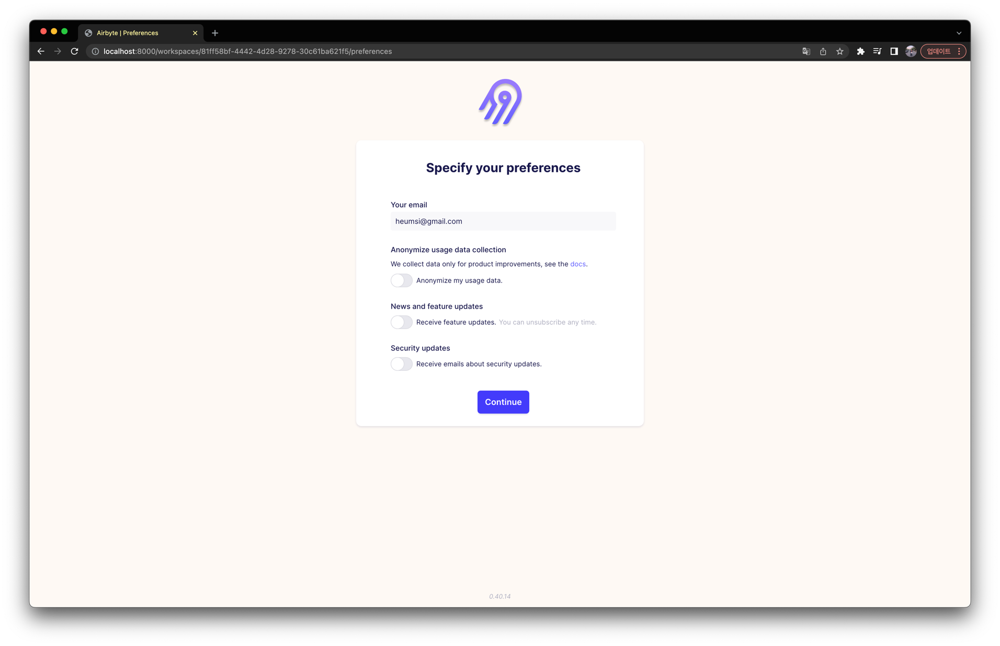
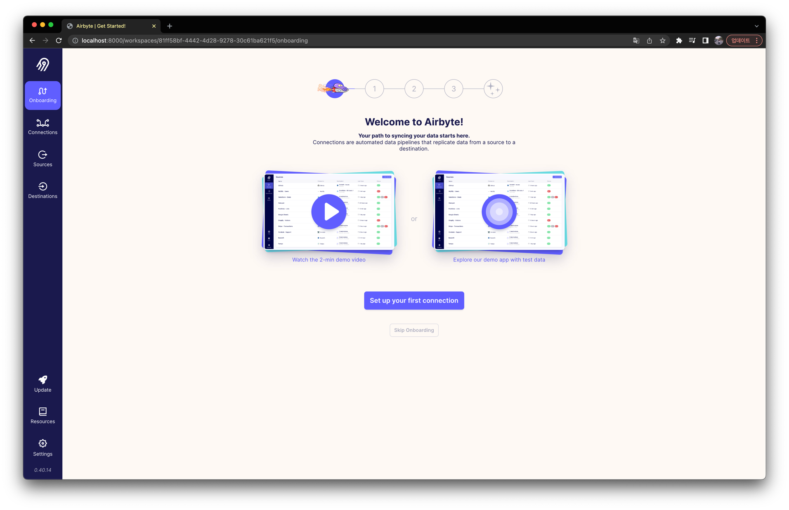
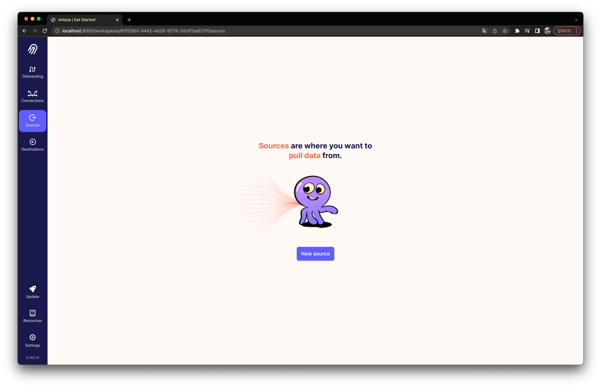

Demo는 [여기서](https://demo.airbyte.io/workspaces/b734c3d7-ece6-47e0-8f07-c4be707fbcfa/) 볼 수 있다.

## 설치 및 실행하기

[공식 문서](https://docs.airbyte.com/quickstart/deploy-airbyte/)를 따라 간다.

현재 가장 최신 버전은 `v0.40.14` 이다.

```bash
$ git clone https://github.com/airbytehq/airbyte.git
$ cd airbyte
$ docker-compose up
```

```bash
$ docker-compose ps

       Name                     Command               State                                               Ports
-----------------------------------------------------------------------------------------------------------------------------------------------------------
airbyte-bootloader   /bin/bash -c ${APPLICATION ...   Exit 0
airbyte-cron         /bin/bash -c ${APPLICATION ...   Up
airbyte-db           docker-entrypoint.sh postgres    Up       5432/tcp
airbyte-server       /bin/bash -c ${APPLICATION ...   Up       8000/tcp, 0.0.0.0:8001->8001/tcp
airbyte-temporal     ./update-and-start-temporal.sh   Up       6933/tcp, 6934/tcp, 6935/tcp, 6939/tcp, 0.0.0.0:7233->7233/tcp, 7234/tcp, 7235/tcp, 7239/tcp
airbyte-webapp       /docker-entrypoint.sh ngin ...   Up       0.0.0.0:8000->80/tcp
airbyte-worker       /bin/bash -c ${APPLICATION ...   Up       0.0.0.0:9000->9000/tcp
init                 /bin/sh -c ./scripts/creat ...   Exit 0
```





## 소스 데이터 추가하기

> ```bash
> $ docker run -d --rm \
>   --name mysql-employee \
>   -p 33060:3306 \
>   -e MYSQL_ROOT_PASSWORD=college \
>   -v $PWD/data:/var/lib/mysql \
>   ac0mz/mysql8.0-employees:8.0.27-aarch64
> ```
> 
> ```bash
> $ docker exec -it mysql-employee-8 bash
> $ mysql -uroot -p$MYSQL_ROOT_PASSWORD employees
> mysql> select * from employees limit 5;
> +--------+------------+------------+-----------+--------+------------+
> | emp_no | birth_date | first_name | last_name | gender | hire_date  |
> +--------+------------+------------+-----------+--------+------------+
> |  10001 | 1953-09-02 | Georgi     | Facello   | M      | 1986-06-26 |
> |  10002 | 1964-06-02 | Bezalel    | Simmel    | F      | 1985-11-21 |
> |  10003 | 1959-12-03 | Parto      | Bamford   | M      | 1986-08-28 |
> |  10004 | 1954-05-01 | Chirstian  | Koblick   | M      | 1986-12-01 |
> |  10005 | 1955-01-21 | Kyoichi    | Maliniak  | M      | 1989-09-12 |
> +--------+------------+------------+-----------+--------+------------
> ```
> 
> 만약 위처럼 조회가 안된다면
> 
> ```
> $ cd /initdb/test_db
> $ mysql -uroot -p$MYSQL_ROOT_PASSWORD < initdb.sql
> ```




## 목적지 추가하기

## 결과 확인하기

