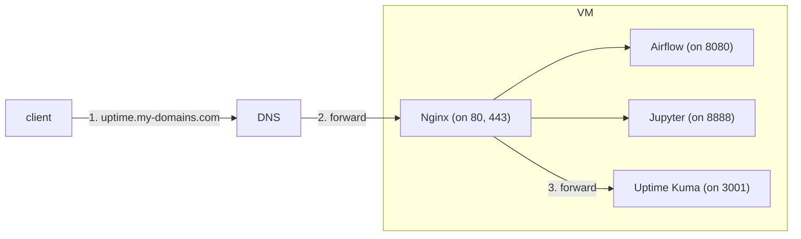
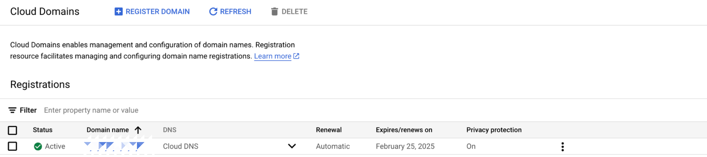
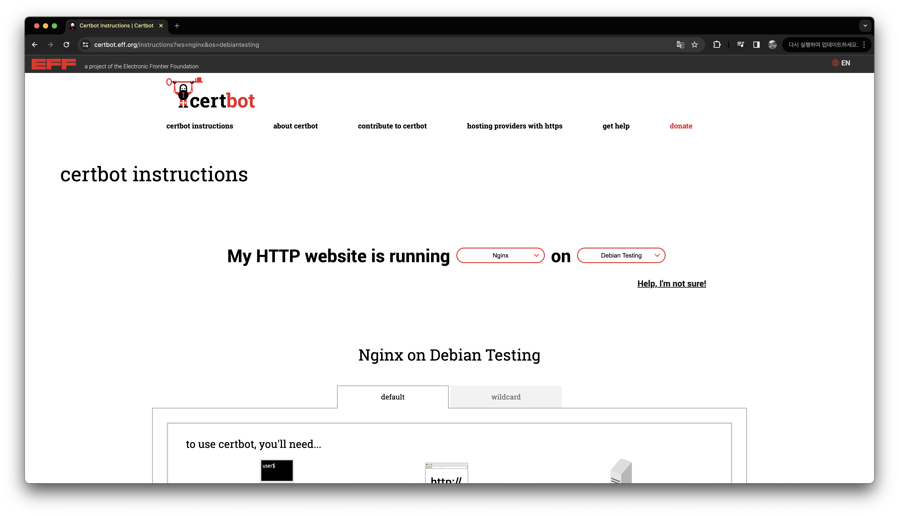
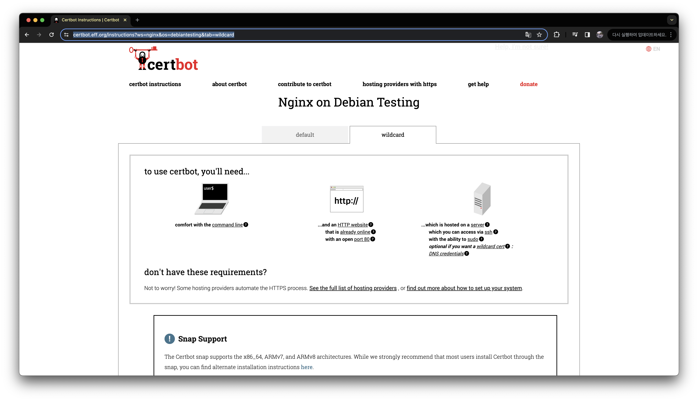
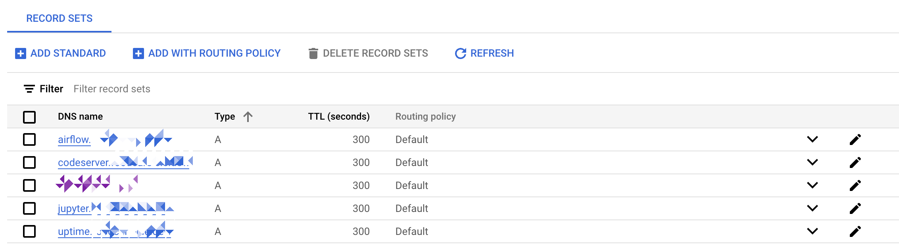
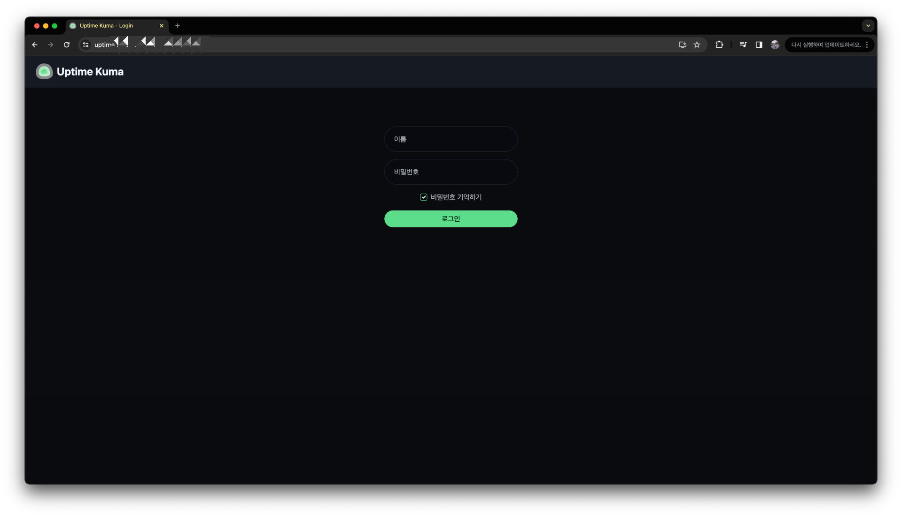

최근에 GCP VM에서 IP로 접속하던 서비스들을 서브 도메인으로 바꾸고 HTTPS 설정한 과정에 대해 기록해둔다.

## 배경

나는 GCP에서 [VM(GCE)](https://cloud.google.com/products/compute?hl=ko)를 하나 띄워 둔 후, 여기에 이런저런 서비스들을 다음처럼 도커로 배포해서 사용하고 있었다.

```bash
$ docker ps

CONTAINER ID   IMAGE                             COMMAND                  CREATED        STATUS                  PORTS                                       NAMES
64f1b7650b5e   notebook:latest                   "tini -g -- start.sh…"   3 days ago     Up 3 days (healthy)     8888/tcp                                    jupyter-hyeonwoo-2echeon03
ada70c59cabd   jupyterhub                        "jupyterhub -f /srv/…"   3 days ago     Up 3 days               0.0.0.0:8000->8000/tcp, :::8000->8000/tcp   jupyterhub
65370b9f3659   louislam/uptime-kuma:1            "/usr/bin/dumb-init …"   9 days ago     Up 9 days (healthy)     0.0.0.0:3001->3001/tcp, :::3001->3001/tcp   uptime-kuma
a77ca2560ebe   apache/airflow:2.8.0-python3.10   "/usr/bin/dumb-init …"   5 weeks ago    Up 5 weeks (healthy)    0.0.0.0:8080->8080/tcp, :::8080->8080/tcp   airflow-airflow-webserver-1
aaab37ca1c23   apache/airflow:2.8.0-python3.10   "/usr/bin/dumb-init …"   5 weeks ago    Up 5 weeks (healthy)    8080/tcp                                    airflow-airflow-scheduler-1
98aadb5bb4b2   postgres:13                       "docker-entrypoint.s…"   2 months ago   Up 2 months (healthy)   5432/tcp                                    airflow-postgres-1
d32b43a154a7   linuxserver/code-server:4.20.0    "/init"                  2 months ago   Up 2 months             0.0.0.0:8443->8443/tcp, :::8443->8443/tcp   stoic_spence
```

보면 알겠지만, 대부분 데이터 팀에서 사용할 법한 서비스들이다.

서비스 접속은 `https://123.123.123.123:8080` 와 같이 IP와 포트를 이용했다.
도메인 쓰려면 돈 내야했기 때문에, 일단 고정 IP만 VM에 붙이고, 방화벽에서 서비스가 사용하는 포트만 열어두었다.

이 서비스에 접근하는 사람이 처음엔 나 뿐이 었는데, 이제는 다른 사람들(개발자 아님)도 접속하게 되었다.
그들이 IP로 접속하는건... 좀 그렇기도 하고, 사실 무엇보다 내가 브라우저에서 IP 뭐더라하고 있는게 너무 귀찮아서, 이제 도메인을 도입해야할 때가 왔다고 생각이 들었다.

## 목표

작업 목표 2개 였다.

1. 도메인 사서 서비스 별로 서브 도메인 적용하자. (ex. `uptime.my-domain.com`)
2. HTTPS도 적용하자.

다음과 같은 구조가 적용될 것이다.



## 작업 과정

### 도메인 구매

먼저 다음처럼 [GCP Cloud Domains](https://cloud.google.com/domains/docs/overview?hl=ko)에서 도메인을 구매했다.


*이미지에서 도메인 이름은 가렸다.*

연 12달러! 생각보다 얼마 안하네.
도메인 따라 가격 차이가 조금 있긴 한데, 대부분 이쯤 하는거 같다.

상태가 `Active` 들어온 거 보고 바로 `nslookup` 으로 확인해봤다.

```bash
$ nslookup my-domains.com

Server:		1.214.68.2
Address:	1.214.68.2#53

Non-authoritative answer:
Name:	my-domain.com
Address: 123.123.123.123
```

도메인에 붙여둔 VM IP가 잘 나온다.

GCP에서 작년에 Cloud Domains를 매각했다고 해서 GCP에서 도메인 구매가 안될 줄 알았는데, 아직까지는 잘 되는거 같다.

### HTTPS에서 쓸 인증서 발급받기

이제 HTTPS에서 사용될 인증서를 발급받아야 한다.

GCP에서 인증서 발급해주는 서비스가 있을거 같았는데... 없는거 같다.
[하나](https://cloud.google.com/load-balancing/docs/ssl-certificates/google-managed-certs?hl=ko) 있긴 한데 이걸 쓰려면 GCP 로드밸런서를 추가로 써야한다.
로드밸런서 쓰면 최소 VM 비용 하나 더 나가니까, 이건 안쓰기로 했다.

검색해보니, 나처럼 VM에 직접 Nginx 띄우고 인증서 붙이는 사람들은 [Certbot](https://certbot.eff.org/)을 많이 쓰는거 같았다.
특히 [이 블로그 글](https://velog.io/@hannah3406/GCPnginx-SSL-%EC%9D%B8%EC%A6%9D%EC%84%9C-%EB%B0%9C%EA%B8%89%EB%B0%9B%EC%95%84-%EC%A7%81%EC%A0%91-%EB%A1%9C%EB%93%9C%EB%B0%B8%EB%9F%B0%EC%84%9C-%EC%84%A4%EC%A0%95%ED%95%B4%EC%A3%BC%EA%B8%B0) 보니까 별로 어렵지 않은 느낌이 확 왔다.
공식 문서에도 설치 및 실행 과정이 매우 자세히 나와있어서, 이걸 사용해보기로 했다.

먼저 어떤 버전을 설치할 지 알기 위해 VM에 접속한 후 OS 버전 확인.

```bash
$ cat /etc/issue

Debian GNU/Linux 11 \n \l
```



위처럼 `nginx` 와 `debian` 을 선택하면 아래처럼 설치 방법이 나온다.
나는 서브 도메인을 사용할거라 `wildcard` 옵션을 선택했다.



이 설명 따라서 설치하면 된다.

먼저 certbot 설치.

```bash
$ sudo apt update
$ sudo apt install snapd
$ sudo snap install --classic certbot
$ sudo ln -s /snap/bin/certbot /usr/bin/certbot
```

또 나는 GCP Cloud Domains를 사용 중이기 때문에, [공식 문서](https://certbot-dns-google.readthedocs.io/en/stable/)를 참고해서 다음처럼 `google` 플러그인 설치.

```bash
$ sudo snap set certbot trust-plugin-with-root=ok
$ sudo snap install certbot-dns-google
```

이제 certbot 설치는 완료되었고, 이 certbot이 사용할 GCP 서비스 계정을 하나 만들어 주어야한다.

GCP 웹 콘솔에서 `certbot` 이름으로 서비스 계정 하나 만들고, `DNS Administrator` 역할을 부여했다.
그리고 certbot이 사용할 수 있도록 JSON 키 발급 받아서 VM에 올려두었다.

이제 다음처럼 `certbot` 명령어로 인증서를 발급받는다.

```bash
$ sudo certbot certonly \
    --dns-google \
    --dns-google-credentials /home/user/nginx/certbot-credentials.json \
    -d "*.my-domains.com" \
    -d my-domains.com \
    -i nginx
```

`/home/user/nginx/certbot-credentials.json` 는 방금 만든 GCP 서비스 계정의 JSON 키 파일 경로다.  
`-d` 옵션으로 여러 도메인을 지정할 수 있는데, 나는 `*.my-domains.com` 와 `my-domains.com` 두개를 지정했다.  
`-i` 옵션은 Nginx를 사용하고 있기 때문에 `nginx` 로 지정했다.

실행 결과를 통해 다음과 같은 경로에 인증서가 저장되었다는 걸 볼 수 있다.

```bash
Certificate is saved at: /etc/letsencrypt/live/my-domains.com/fullchain.pem
Key is saved at:         /etc/letsencrypt/live/my-domains.com/privkey.pem
```

결국 [Let's Encrypt](https://letsencrypt.org/ko/)에서 인증서를 발급받는 건데, 발급받기 쉽게 certbot이 한번 래핑해주는 거 같다.

위 인증서 파일은 다음처럼 확인할 수 있다.

```bash
$ sudo openssl x509 -text -in /etc/letsencrypt/live/my-domains.com/fullchain.pem

Certificate:
... (생략함)
-----BEGIN CERTIFICATE-----
... (생략함)
-----END CERTIFICATE-----
```

### Nginx 설정 및 배포

이제 Nginx 설정 파일을 작성하고 배포 해보자.

설정 파일은 ChatGPT 4.0 도움을 받았다.

```bash
$ cat nginx.conf

events {
    worker_connections 1024;
}

http {
    # SSL 설정 및 기타 전역 HTTP 설정
    ssl_session_cache shared:SSL:1m;
    ssl_session_timeout  10m;
    ssl_ciphers HIGH:!aNULL:!MD5;
    ssl_prefer_server_ciphers on;

    # Uptime Monitor: uptime.my-domains.com를 3001 포트로 프록시
    server {
        listen 443 ssl;
        server_name uptime.my-domains.com;

        ssl_certificate /etc/letsencrypt/live/my-domains.com/fullchain.pem;
        ssl_certificate_key /etc/letsencrypt/live/my-domains.com/privkey.pem;

        location / {
            proxy_pass http://localhost:3001;
            proxy_set_header Host $host;
            proxy_set_header X-Real-IP $remote_addr;
            proxy_set_header X-Forwarded-For $proxy_add_x_forwarded_for;
            proxy_set_header X-Forwarded-Proto $scheme;
        }
    }

    # HTTP 요청을 HTTPS로 리디렉트
    server {
        listen 80;
        server_name uptime.my-domains.com;
        return 301 https://$server_name$request_uri;
    }
}
```

`server` 블록 내에 `ssl_certificate` 와  `ssl_certificate_key` 를 통해 방금 발급받은 인증서를 지정했다.
이후에 추가할 백엔드 서비스가 또 생기면 `server` 블록을 하나 더 추가하면 된다.

이제 도커로 Nginx를 배포하자.

```bash
$ docker run --name nginx -d \
  --network="host" \
  -v /home/user/nginx/nginx.conf:/etc/nginx/nginx.conf \
  -v /etc/letsencrypt:/etc/letsencrypt:ro \
  nginx:1.24.0
```

`--network="host"` 옵션으로 Nginx가 호스트 네트워크를 사용해야, 기존에 배포되어 있는 다른 컨테이너 네트워크에 포워딩할 수가 있다.
이 옵션을 안넣어주면, `nginx` 컨테이너가 다른 컨테이너 네트워크에 접근할 수가 없다.
호스트 네트워크를 사용한다는게 보안적으로 조금 찜찜하긴 하지만, 일단은 이렇게 하기로 했다.

`-v /etc/letsencrypt:/etc/letsencrypt:ro` 옵션으로 인증서 파일을 Nginx 컨테이너에 마운트했다.

### 서브 도메인 레코드 추가

마지막으로 `uptime.my-domains.com` 로 접근하면 해당 VM으로 접속할 수 있도록 DNS에 A 레코드를 추가하자.



A 레코드의 IP 값은 모두 같은 VM의 IP 값으로 지정했다.
이제 위 도메인으로 요청하면, 모두 같은 VM 내 Nginx가 이를 처리해서 적당한 서비스로 포워딩해줄 것이다.

## 결과

이제 `https://uptime.my-domains.com` 로 접속하면, 다음과 같이 HTTPS가 적용되어 잘 동작하는 것을 확인할 수 있다.



Nginx 설정 파일에 작성해둔 포워딩 규칙대로 나머지 서브 도메인에 대해서도 잘 동작하는 것을 확인했다.

이제, 처음 목표한대로 HTTPS가 적용된 서브 도메인으로 접속할 수 있게 되었다.