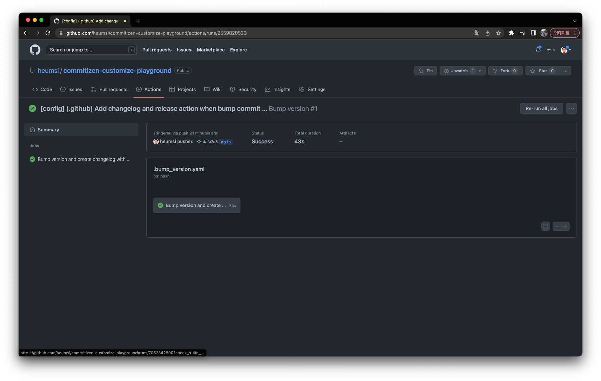
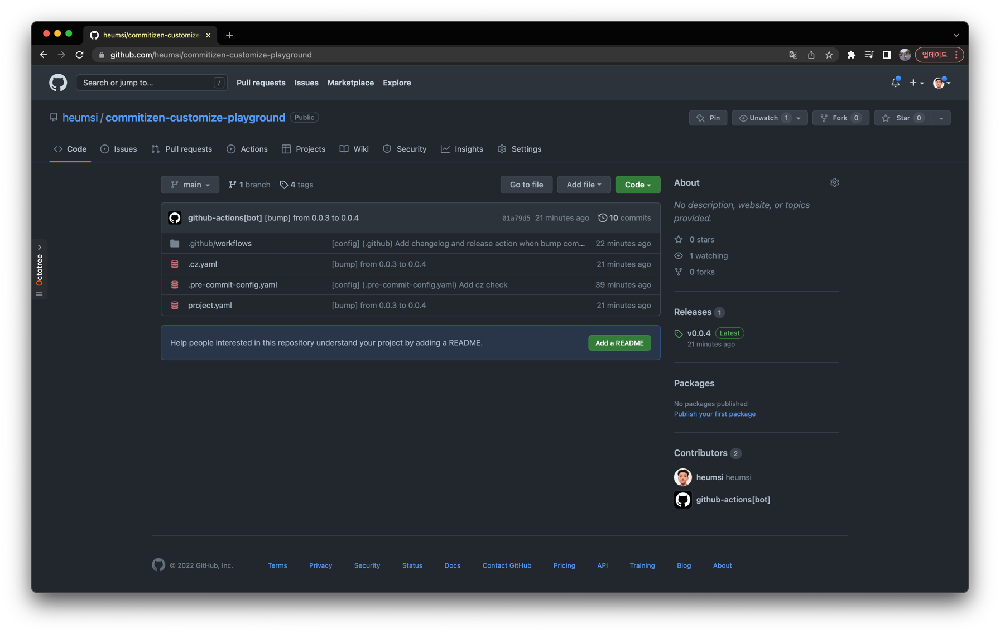
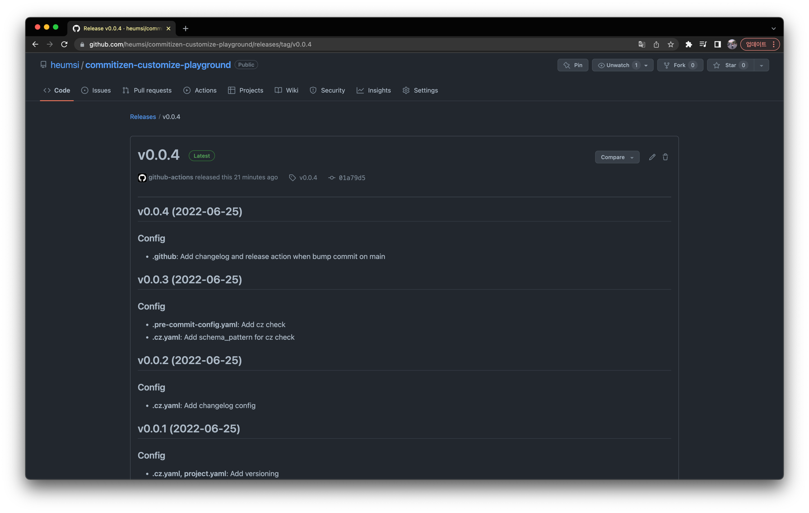
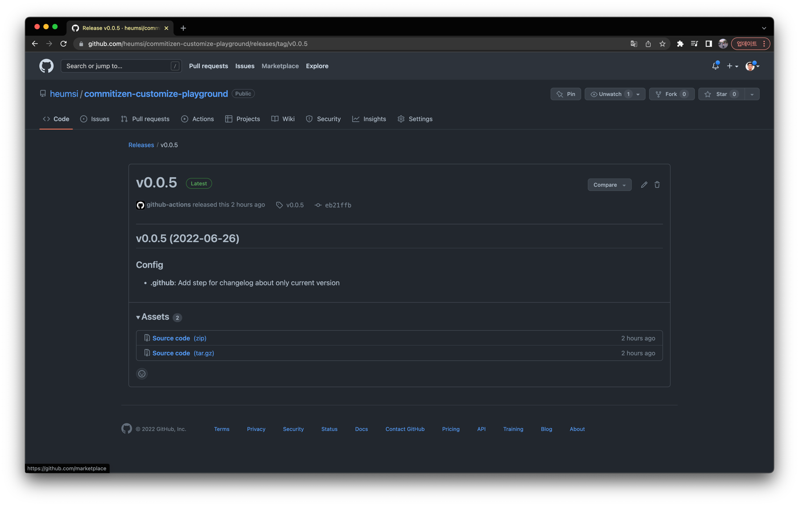

## 들어가며

[Commitizen](https://commitizen-tools.github.io/commitizen/)은 git commit 관리 및 프로젝트 versioning 자동화에 매우 유용한 도구다.
이전에 ["Commitizen으로 커밋, 버전 관리하기"](https://dailyheumsi.tistory.com/266) 글을 통해 Commitizen이 무엇이고 어떻게 쓰는지를
소개했었다. 저 글을 쓴 이후에도 나는 쭈욱 잘 쓰고있다.

그렇게 쭈욱 쓰다보니 경우에 따라서 Commitizen을 커스터마이징하여 쓰고 싶을 때도 종종 있었는데, 커스터마이징하는 정확한 방법을 잘 몰라서 공식 문서 읽는 것을 미뤄만 뒀다.
그러다 이번 기회에 공식 문서를 정독하며 커스터마이징하는 방법을 살펴보았다.

이 글에서는 Commitizen 설정을 차근차근 커스터마이징해나가는 과정에 대해 소개해보려한다.
Commitizen을 커스터마이징해서 쓰고 싶은 분들에게 이 글이 도움이 되면 좋겠다.

> Commitizen을 처음 접하는 분들에겐 이 내용이 어려울 수 있다.
만약 Commitizen에 대해 먼저 알고싶다면 이전에 작성한 글인 ["Commitizen으로 커밋, 버전 관리하기"](https://dailyheumsi.tistory.com/266)을 먼저 읽어보기를 권장한다.

## 설정 파일 생성하기

Commitizen 설정 값은 다음 중 하나의 파일에 작성한 뒤, 프로젝트 루트 경로에 저장하면 된다.

- `pyproject.toml`
- `cz.toml` 혹은 `.cz.toml`
- `cz.yaml` 혹은 `.cz.yaml`
- `cz.json` 혹은 `.cz.json`

이 중에서 `pyproject.toml` 은 파이썬을 안쓰는 분들에게는 좀 낯설 수 있는데, 이 파일은 파이썬 프로젝트에서 메타 정보를 담을 때 사용되는 파일이다.
나머지 파일 포맷은 여타 다른 라이브러리 설정 파일들과 비슷한 형태같다.

설정 파일은 `.yaml` 포맷에 담는게 아무래도 이쁜거 같으니, 먼저 다음처럼 `.cz.yaml` 을 만든 뒤 다음처럼 작성한다.

```yaml
# .cz.yaml

commitizen:
  name: cz_conventional_commits
```

> 사실 `cz init` 명령어로 `.cz.yaml` 파일을 만들어도 된다. 다만 여기서는 처음부터 직접 작성해본다.

## 프리셋 살펴보기

`name` 에는 다음과 같은 값들이 들어갈 수 있다.

- `cz_conventional_commits`
- `cz_jira`
- `cz_commitizen_emoji`
- `cz_customize`

이 중 위에 3개는 프리셋이다. 즉 미리 만들어진 설정 값들이고, 그냥 가져다 쓰면 알아서 적용된다.
그리고 마지막 `cz_customize` 는 이 글에서 목적으로하는 커스터마이징을 할 때 사용한다.

커스터마이징하기 앞서, 먼저 위 3개의 프리셋을 간단히 살펴보자.

### `cz_conventional_commits`

[conventional commits](https://www.conventionalcommits.org/en/v1.0.0/) 을 따르는 설정이다.
이는 프리셋의 기본 값으로 위처럼 설정 파일을 따로 작성하지 않으면 이 설정을 그대로 따르게 된다.
아마 Commitizen을 사용하는 거의 대부분의 사람들이 이 프리셋을 그대로 사용하지 않을까 싶다.

셸에서 `cz c` 했을 때 등장하는 모습은 다음과 같다.
가장 마지막에 최종 커밋의 형태가 나온다.

```bash
$ cz c

? Select the type of change you are committing (Use arrow keys)
   fix: A bug fix. Correlates with PATCH in SemVer
   feat: A new feature. Correlates with MINOR in SemVer
 » docs: Documentation only changes
   style: Changes that do not affect the meaning of the code (white-space, formatting, missin
   refactor: A code change that neither fixes a bug nor adds a feature
   perf: A code change that improves performance
   test: Adding missing or correcting existing tests
   build: Changes that affect the build system or external dependencies (example scopes: pip,
   ci: Changes to our CI configuration files and scripts (example scopes: GitLabCI)

? What is the scope of this change? (class or file name): (press [enter] to skip)
 README.md

? Write a short and imperative summary of the code changes: (lower case and no period)
 프로젝트 소개 부분에 있는 오타를 수정한다

? Provide additional contextual information about the code changes: (press [enter] to skip)
 프로젝트 소개에 이전에 잘못한 부분을 수정한다

? Is this a BREAKING CHANGE? Correlates with MAJOR in SemVer No
? Footer. Information about Breaking Changes and reference issues that this commit closes: (press [enter] to skip)


docs(README.md): 프로젝트 소개 부분에 있는 오타를 수정한다

프로젝트 소개에 이전에 잘못한 부분을 수정한다.
```

### `cz_jira`

이름 그대로 jira의 커밋 컨벤션을 따르는거 같은데, 사실 나도 안써봐서 잘 모른다.

셸에서 `cz c` 했을 때 등장하는 모습은 다음과 같다.
가장 마지막에 최종 커밋의 형태가 나온다.

```bash
$ cz c

? Git commit message (required):
 프로젝트 소개 부분에 있는 오타를 수정한다
? Jira Issue ID(s) separated by spaces (required):
 H-0001
? Workflow command (testing, closed, etc.) (optional):

? Time spent (i.e. 3h 15m) (optional):
 1h
? Jira comment (optional):


프로젝트 소개 부분에 있는 오타를 수정한다 H-0001 #time 1h
```

### `cz_commitizen_emoji`

`conventional commits` 에 이모지가 붙은 형태다.
이 프리셋을 사용하려면 먼저 다음처럼 `commitizen-emoji` 패키지를 설치해야 한다.

```bash
$ pip install commitizen-emoji
```

셸에서 `cz c` 했을 때 등장하는 모습은 다음과 같다.
가장 마지막에 최종 커밋의 형태가 나온다.

```bash
$ cz c

? Select the type of change you are committing (Use arrow keys)
   🐛 fix: A bug fix
   🎉 feat: A new feature
 » 📜 docs: Documentation only changes
   😎 style: Changes that do not affect the meaning of the code (white-space, formatting, missing semi-colons, e
   🔧 refactor: A code change that neither fixes a bug nor adds a feature
   🚀 perf: A code change that improves performance
   🚦 test: Adding missing or correcting existing tests
   🚧 build: Changes that affect the build system or external dependencies (example scopes: pip, docker, npm)
   🛸 ci: Changes to our CI configuration files and scripts (example scopes: GitLabCI)
? Scope. Could be anything specifying place of the commit change (users, db, poll):
 README.md
? Subject. Concise description of the changes. Imperative, lower case and no final dot:
 프로젝트 소개 부분에 있는 오타를 수정한다
? Time spent (i.e. 3h 15m) (optional):
 1h
? Tasks ID(s) separated by spaces (optional):
 H-0001
? Is this a BREAKING CHANGE? No
? Body. Motivation for the change and contrast this with previous behavior:
 프로젝트 소개에 이전에 잘못한 부분을 수정한다

📜 docs(README.md): 프로젝트 소개 부분에 있는 오타를 수정한다 >>> ⏰ 1h >>> Tasks: #H-0001

프로젝트 소개에 이전에 잘못한 부분을 수정한다
```

## 커스터마이징 시작하기

위 프리셋을 안쓰고, 내가 원하는대로 설정 값을 작성하고 싶다면, 직접 Commitizen 설정 파일을 작성하며 커스터마이징 해야한다.
프리셋도 살펴봤으니 이제 본격적으로 커스터마이징을 시작해보자.

먼저 다음처럼 `.cz.yaml` 에서 `name` 의 값을 `cz_customize` 로 수정하고 `customize` 을 추가한다.

```yaml
# .cz.yaml

commitizen:
  name: cz_customize
  customize:
```

프리셋을 쓰지 않고, 직접 커스터마이징해서 쓰겠다는 표현이다.
그리고 대부분의 커스터마이징 설정 값들은 `customize:` 내에 담길 예정이다.

## 질문 작성하기

가장 먼저할 일은 `cz c` 명령어 시에 어떤 질문 리스트를 보여줄 것인가를 결정하는 일이다.
`.cz.yaml` 을 다음처럼 수정한다.

```yaml{6-24}
# .cz.yaml

commitizen:
  name: cz_customize
  customize:
    questions:
    - choices:
      - name: new feature
        value: feature
      - name: bug fix
        value: bug fix
      - name: config
        value: config
      - name: breaking changes
        value: break
      message: 'Select type:'
      name: type
      type: list
    - message: 'Changed files or directory scope:'
      name: changed_scope
      type: path
    - message: 'Input message:'
      name: message
      type: input
```

`questions` 에 대한 내용을 추가했다. 이 값들은 `cz c` 하면 제일 먼저 보이는 질문들이다.

`questions` 는 `message`, `name`, `type` 키를 가진 오브젝트를 담으며, `type` 값에 따라 `choices`와 같은 키가 추가로 붙기도 한다.
이 `type` 값의 종류는 위에 등장한 `input`, `path`, `list` 말고 더 있는데,
이에 대해 더 궁금하면 [공식 문서](https://commitizen-tools.github.io/commitizen/customization/#detailed-questions-content)를 참고하자.

`questions` 내 오브젝트들은 각각이 하나의 질문이 되며 유저는 이 질문에 대한 값을 입력하게 된다.
사용자가 입력한 값은 `name` 으로 정의한 변수에 담기게 되는데, 예를 들어 사용자가 `Select type:` 질문에 `config` 를 입력했다면,
`type` 이라는 변수에는 `config` 라는 값이 담기게 되는 것이다.

## 메시지 템플릿 작성하기

이제 커밋 메시지 형태를 구성해보자.
`.cz.yaml` 을 다음처럼 수정한다.

```yaml{25-26}
# .cz.yaml

commitizen:
  name: cz_customize
  customize:
    questions:
    - choices:
      - name: new feature
        value: feature
      - name: bug fix
        value: bug fix
      - name: config
        value: config
      - name: breaking changes
        value: break
      message: 'Select type:'
      name: type
      type: list
    - message: 'Changed files or directory scope:'
      name: changed_scope
      type: path
    - message: 'Input message:'
      name: message
      type: input
    example: '[bug fix] (README.md) Fix Typo'
    message_template: '[{{ type }}] ({{ changed_scope }}) {{ message }}'
```

`example` 과 `message_template` 을 추가했다.

- `example` 은 커밋 메시지의 예시를 보여준다.
  - `cz example` 명령 시 이 예시 문구가 출력된다.
- `message_template`는 실제로 커밋 메시지를 구성하는 방식이다.
  - 위에서 입력받은 변수들을 가지고 메시지를 어떻게 구성할지에 대해 정의한다.
  - 파이썬을 써본 사람들은 알겠지만, jinja2 템플릿 문법을 사용한다. (jinja2를 몰라도 상관없다. 다만 위같은 형태로 구성한다 정도만 알아도 충분하다.)

여기까지 작성하고 `cz c` 를 치면 다음과 같이 의도한대로 잘 작동하는 것을 알 수 있다.

```bash
$ cz c

? Select type: config
? Changed files or directory scope: .cz.yaml
? Input message: Add .cz.yaml

[config] (.cz.yaml) Add .cz.yaml
```

실제로 `git log`를 통해 커밋 메시지를 확인해보자.

```bash
$ git log --oneline

e9e996c (HEAD -> main) [config] (.cz.yaml) Add .cz.yaml
```

`message_template` 에서 정의한대로 메시지가 잘 작성되었다.

## Bump 규칙과 메시지 작성하기

이쯤에서 `cz bump` 명령어를 실행해보자.

```bash
$ cz bump

[NO_VERSION_SPECIFIED]
Check if current version is specified in config file, like:
version = 0.4.3
```

버전이 지정되지 않아서 아무런 일도 일어나지 않는다.

`cz bump` 를 제대로 실행시키기 위해 우리는 구체적으로 다음의 것들을 생각해야 한다.

- 어떤 메시지(feature, bug fix 등)를 담은 커밋을 bump 규칙에 포함시킬 것인지?
- 각 커밋 메시지는 Semantic Versioning에서 어디(MAJOR, MINOR, PATCH 등)에 해당하는지?
- bump 커밋 메시지는 어떤 내용을 담을지?
- 현재 버전은 몇이고, Versioning이 명시된 다른 파일이 있는지?

이러한 내용을 담아 `.cz.yaml` 을 다음처럼 수정하자.

```yaml{27-37}
# .cz.yaml

commitizen:
  name: cz_customize
  customize:
    questions:
    - choices:
      - name: new feature
        value: feature
      - name: bug fix
        value: bug fix
      - name: config
        value: config
      - name: breaking changes
        value: break
      message: 'Select type:'
      name: type
      type: list
    - message: 'Changed files or directory scope:'
      name: changed_scope
      type: path
    - message: 'Input message:'
      name: message
      type: input
    example: '[bug fix] (README.md) Fix Typo'
    message_template: '[{{ type }}] ({{ changed_scope }}) {{ message }}'
    bump_pattern: feature|bug fix|config|break
    bump_map:
      break: MAJOR
      bug fix: PATCH
      config: PATCH
      feature: MINOR
  bump_message: '[bump] from $current_version to $new_version'
  tag_format: v$major.$minor.$patch$prerelease
  version: 0.0.0
  version_files:
  - project.yaml:version
```

- `bump_pattern` 은 bump 규칙에 포함할 커밋 메시지의 패턴이다.
  - 커밋 메시지에 `feature`, `bug fix`, `config`, `break` 이 포함되어 있다면 이 커밋은 bump 작업에 포함된다.
- `bump_map` 은 각 커밋 메시지가 Semantic Versioning 중 어디에 해당하는지를 매핑에 대한 정의다.
  - `bump_pattern` 에서 정의한 커밋 메시지 패턴 값들을 키로 가지고, Semantic Versioning 하나를 값으로 가진다.
  - 예를 들어 bump할 때 `config` 가 하나라도 있으면, 해당 bump는 MINOR 버전을 업데이트 한다.
- `bump_message` 는 bump 커밋 메시지에 대한 정의다.
  - `$current_version` 와 `$new_version` 로 직전 버전과 현재 bump하는 버전 값을 가져올 수 있다.
- `tag_format` 은 bump로 만들어지는 태그의 포맷이다.
- `version` 은 현재 프로젝트의 버전이다.
- `version_files` 은 Semantic Versioning이 명시된 다른 파일 목록과 키 또는 변수 목록이다.
  - `{파일 이름(경로 포함)}:{키 또는 변수 명}` 포맷으로 작성한다.
  - bump 시 이 목록의 아이템들도 같이 버전업을 한다.
  - 항상 필요한 설정은 아닌데, 만약 프로젝트에서 `.cz.yaml` 말고 다른 곳에서도 프로젝트 Versioning을 명시해주고 있다면 이 설정이 필요하다.


`version_files` 에 해당하는 `project.yaml` 을 생성한 뒤 다음처럼 작성하자.

```yaml
# project.yaml

version: 0.0.0
```

> 종종 프로젝트 내부에 프로젝트에 대한 메타 데이터를 명시한 별도의 파일을 만들어두곤 한다.
프로젝트 입장에서는 `.cz.yaml` 은 그냥 커밋 관리 도구에 대한 설정 파일일 뿐이니, `.cz.yaml` 에 의존할 게 아니라 위와 같은 별도의 메타 파일에 의존하는게 옳다고 판단하는 것이다.
마찬가지로 `.cz.yaml`도 이 메타 파일에 의존하는 것이고, 이를 `cz.yaml` 에서 `version_files` 에 명시해주는 것이다.

지금까지의 변경사항을 커밋해두자.

```bash
$ git add .cz.yaml project.yaml
$ cz c

? Select type: config
? Changed files or directory scope: .cz.yaml, project.yaml
? Input message: Add versioning

[config] (.cz.yaml, project.yaml) Add versioning
```

이제 `cz bump` 명령어를 실행해보자.

```bash
$ cz bump

Tag v0.0.0 could not be found.
Possible causes:
- version in configuration is not the current version
- tag_format is missing, check them using 'git tag --list'

? Is this the first tag created? Yes
[bump] from 0.0.0 to 0.0.1
tag to create: v0.0.1
increment detected: PATCH
```

이번엔 성공적으로 잘 작동했다!

`git log` 명령어로 커밋 메시지와 태그가 잘 생성되었는지 확인해보자.

```bash
$ git log --oneline

e397a76 (HEAD -> main, tag: v0.0.1) [bump] from 0.0.0 to 0.0.1
74f5e18 [config] (.cz.yaml, project.yaml) Add versioning
06d292b [config] (.cz.yaml) Add .cz.yaml
```

태그가 잘 생성된 것을 확인했다.

이제 이 bump 커밋이 프로젝트 내 어떤 부분을 수정했는지를 다음처럼 확인해보자.

```bash
$ git show e397a76

diff --git a/.cz.yaml b/.cz.yaml
-  version: 0.0.0
+  version: 0.0.1

diff --git a/project.yaml b/project.yaml
-version: 0.0.0
+version: 0.0.1
```

`.cz.yaml` 내 `commitizen.version` 의 값과 `project.yaml` 내 `version` 의 값을 모두 동일하게 수정한 것을 알 수 있다.

## Changelog 관련 설정 작성하기

다음처럼 `cz changelog` 명령어를 실행해보자.

```bash
$ cz changelog
$ ls

CHANGELOG.md project.yaml
```

실행 결과로 `CHANGELOG.md` 파일이 생성되었는데, 이 파일을 확인해보자.

```bash
$ cat changelog

## v0.0.1 (2022-06-25)

- [bump] from 0.0.0 to 0.0.1
- [config] (.cz.yaml, project.yaml) Add versioning
- [config] (.cz.yaml) Add .cz.yaml
```

버전과 해당 버전에 포함되는 커밋 목록들을 나열하고 있다.
뭐 이렇게만 써도 문제는 없지만, 보통 Changelog에는 타입별로 커밋 목록들이 구분되어있는게 일반적이다.
이제 이를 위한 이제 커스터마이징 설정을 작성해보자.

먼저 [공식문서](https://commitizen-tools.github.io/commitizen/changelog/#description)에 따르면 Commitizen은 Changelog를 다음과 같은 포맷으로 작성한다고 한다.

```
# <version> (<date>)

## <change_type>

- **<scope>**: <message>
```

우리의 `CHANGELOG.md` 에는 현재 `## <change_type>` 이 없는 것을 알 수 있다.

`.cz.yaml` 을 다음처럼 수정하자.

```yaml{33-43,49}
# .cz.yaml

commitizen:
  name: cz_customize
  customize:
    questions:
    - choices:
      - name: new feature
        value: feature
      - name: bug fix
        value: bug fix
      - name: config
        value: config
      - name: breaking changes
        value: break
      message: 'Select type:'
      name: type
      type: list
    - message: 'Changed files or directory scope:'
      name: changed_scope
      type: path
    - message: 'Input message:'
      name: message
      type: input
    example: '[bug fix] (README.md) Fix Typo'
    message_template: '[{{ type }}] ({{ changed_scope }}) {{ message }}'
    bump_pattern: feature|bug fix|config|break
    bump_map:
      break: MAJOR
      bug fix: PATCH
      config: PATCH
      feature: MINOR
    commit_parser: \[(?P<change_type>feature|bug fix|config|break)\](\s\((?P<scope>.*)\))?\s(?P<message>.*)?
    change_type_map:
      feature: Feature
      bug fix: Fix
      config: Config
      break: Break
    change_type_order:
      - Break
      - Feature
      - Fix
      - Config
  bump_message: '[bump] from $current_version to $new_version'
  tag_format: v$major.$minor.$patch$prerelease
  version: 0.0.0
  version_files:
  - project.yaml:version
  changelog_file: 'CHANGELOG.md'
```

추가된 부분을 하나씩 살펴보자.

- `commit_parser` 는 Changelog 를 만들기 위해 커밋을 파싱하는 패턴이다.
  - 파이썬의 정규표현식으로 작성한다.
  - 전반적으로 패턴은 `message_template` 으로 만들어지는 커밋 메시지 형태를 고려하여 작성한다.
  - 패턴 중간에 보면 `change_type`, `scope`, `message` 있다. 위 Changelog 포맷에 들어가는 변수들이다.
- `change_type_map` 는 `commit_parser` 를 통해 파싱한 커밋 메시지에서 `change_type` 값에 대한 Alias 매핑이다.
  - 예를 들어 `change_type` 이 `feature` 였던 커밋은 Changelog 내 `Feature` 하위 항목에 작성된다.
  - 이 설정 값은 필수는 아니다. `change_type_map` 을 이처럼 명시해주지 않으면, 기본적으로 `change_type` 값 그대로 Chnagelog 내 들어간다.
- `change_type_order` 은 Changelog 내 `change_type` 이 작성되는 순서를 정의한다.
  - 여기서는 `Break` -> `Feature` -> `Fix` -> `Config` 순으로 작성된다.
- `changelog_file` 은 `cz changelog` 명령 실행 시, Changelog 가 작성되는 파일 이름이다.

여기까지 작성했으면 일단 기존의 `CHANGELOG.md` 파일은 삭제하고 변경한 내용을 커밋해두자.

```bash
$ rm CHANGELOG.md
$ git add .cz.yaml
$ cz c

? Select type: config
? Changed files or directory scope: .cz.yaml
? Input message: Add changelog config

[config] (.cz.yaml) Add changelog config
```

이제 Changelog가 잘 작성되는지 확인해보자.
아까처럼 `cz changelog` 명령어를 실행해도 되지만, `cz bump` 와 함께 사용해보자.
다음처럼 `cz bump` 명령어에 `--changelog` 옵션을 추가해주면 된다.

```bash
$ cz bump --changelog

[bump] from 0.0.1 to 0.0.2
tag to create: v0.0.2
increment detected: PATCH
```

bump 됨과 동시에 `CHANGELOG.md` 파일도 새로 생기게 되는데 잘 작성되었는지 확인해보자.

```bash
$ cat CHANGELOG.md

## v0.0.2 (2022-06-25)

### Config

- **.cz.yaml**: Add changelog config

## v0.0.1 (2022-06-25)

### Config

- **.cz.yaml, project.yaml**: Add versioning
- **.cz.yaml**: Add .cz.yaml
```

아까와 다르게 `## change_type` 추가 되고, 각 커밋이 잘 분류되었다!


> 하나 주의해야할게, `cz bump --changelog` 를 한다고 해서 bump 커밋에 `CHANGELOG.md` 생성 이력이 추가되는 것은 아니다.
`cz bump --changelog` 명령 이후 `git status` 로 확인해보면 `CHANGELOG.md` 는 아직 스테이징으로 올라오지 않은 것을 알 수 있다.
>
> ```bash
> $ git status
> 현재 브랜치 main
> 추적하지 않는 파일:
>  (커밋할 사항에 포함하려면 "git add <파일>..."을 사용하십시오)
>        CHANGELOG.md
> ```
>
> `CHANGELOG.md` 를 저장소에 담으려면 결국 커밋을 한번 더 찍어야 한다.
> 이게 귀찮기 때문에 사실 필자는 `CHANGELOG.md` 를 따로 생성하지 않고, Github Releases 에만 담는다.
> 이 글 후반부에서 이 방법에 대해 다룰 것이다.


## pre-commit 사용하기

프로젝트에 커밋 찍을때 항상 `cz c` 명령어를 사용하면 문제가 없다.
그런데 누군가가 `git commit` 으로 커밋을 찍는다면, 커밋 메시지 규칙 항상 지켜지리란 법은 없다.
이 때문에 [pre-commit](https://pre-commit.com/) 같은 툴로 커밋이 생성되기 전에 커밋 메시지가 규칙에 따라 잘 작성되었는지 확인해야 한다.
이제 pre-commit을 이용하여, 커밋할 때 커밋 메시지가 Commitizen에서 설정한 커밋 메시지 규칙대로 잘 작성되었는지 검증하는 작업을 추가해보자.

Commitizen에서는 `cz check -m "커밋 메시지"` 명령어를 통해 `"커밋 메시지"` 가 Commitizen에서 설정한 커밋 메시지 규칙을 따르는지 검증할 수 있다.

`.cz.yaml` 파일을 다음처럼 수정한다.

```yaml{44}
# .cz.yaml

commitizen:
  name: cz_customize
  customize:
    questions:
    - choices:
      - name: new feature
        value: feature
      - name: bug fix
        value: bug fix
      - name: config
        value: config
      - name: breaking changes
        value: break
      message: 'Select type:'
      name: type
      type: list
    - message: 'Changed files or directory scope:'
      name: changed_scope
      type: path
    - message: 'Input message:'
      name: message
      type: input
    example: '[bug fix] (README.md) Fix Typo'
    message_template: '[{{ type }}] ({{ changed_scope }}) {{ message }}'
    bump_pattern: feature|bug fix|config|break
    bump_map:
      break: MAJOR
      bug fix: PATCH
      config: PATCH
      feature: MINOR
    commit_parser: \[(?P<change_type>feature|bug fix|config|break)\](\s\((?P<scope>.*)\))?\s(?P<message>.*)?
    change_type_map:
      feature: Feature
      bug fix: Fix
      config: Config
      break: Break
    change_type_order:
      - Break
      - Feature
      - Fix
      - Config
    schema_pattern: \[(?P<change_type>feature|bug fix|config|break|bump)\](\s\((?P<scope>.*)\))?\s(?P<message>.*)?
  bump_message: '[bump] from $current_version to $new_version'
  tag_format: v$major.$minor.$patch$prerelease
  version: 0.0.0
  version_files:
  - project.yaml:version
  changelog_file: 'CHANGELOG.md'
```

- `schema_pattern` 는 커밋 메시지 검증을 위해 쓰이는 커밋 메시지 스키마다.
  - `cz check -m "메시지"` 명령 쓰이는 설정 값으로, 인자로 넘어온 메시지가 이 패턴을 따르는지 확인한다.
  - 파이썬 정규표현식으로 작성한다.
  - 사실상 `commit_parser`와 동일하다.

변경 이력을 먼저 저장하자.

```bash
$ git add .cz.yaml
$ cz c

? Select type: config
? Changed files or directory scope: .cz.yaml
? Input message: Add schema_pattern for cz check

[config] (.cz.yaml) Add schema_pattern for cz check
```

이제 `cz check -m "메시지"` 명령어로 잘 작동하는지 확인해보자.

```bash
$ cz check -m "[config] Valid Commit"
Commit validation: successful!

$ cz check -m "[config] (file) Valid Commit"
Commit validation: successful!

$ cz check -m "config: InValid Commit"
commit validation: failed!
please enter a commit message in the commitizen format.
commit "": "config: InValid Commit"
pattern: \[(?P<change_type>feature|bug fix|config|break)\](\s\((?P<scope>.*)\))?\s(?P<message>.*)?
```

위처럼 규칙을 잘 따르는 메시지는 "successful" 을, 따르지 않는 메시지는 "failed" 를 반환하는 것을 알 수 있다.

이제 이를 pre-commit을 통해 사용해보자.
먼저 다음처럼 `pre-commit` 패키지를 설치한다.

```bash
$ pip install pre-commit
$ pre-commit -V

pre-commit 2.19.0
```

`.pre-commit-config.yaml` 파일을 만든 뒤, 다음처럼 작성한다.

```yaml
# .pre-commit-config.yaml

repos:
- repo: local
  hooks:
    - id: commitizen
      name: My commitizen check
      entry: cz
      args: ['check', '--commit-msg-file', '.git/COMMIT_EDITMSG']
      pass_filenames: false
      language: system
      stages: [commit-msg]
```

이제 다음 명령어로 `pre-commit` 설치를 완료한다.

```bash
$ pre-commit install --hook-type commit-msg
```

정말 잘 동작하는지 확인해보자.
`cz c` 가 아니라 `git commit` 으로 일부러 규칙에 어긋난 커밋 메시지로 커밋을 시도해본다.

```bash
$ git add .pre-commit-config.yaml
$ git commit -m "Add .pre-commit-config.yaml"

My commitizen check......................................................Failed
- hook id: commitizen
- exit code: 14

commit validation: failed!
please enter a commit message in the commitizen format.
commit "": "Invalid commit"
pattern: \[(?P<change_type>feature|bug fix|config|break)\](\s\((?P<scope>.*)\))?\s(?P<message>.*)?
```

의도한대로 커밋에 실패했다!

이번엔 규칙을 따르는 커밋 메시지로 커밋을 시도해보자.

```bash
$ git commit -m "[config] (.pre-commit-config.yaml) Add cz check"

My commitizen check......................................................Passed
[main 1a0ca15] [config] (.pre-commit-config.yaml) Add cz check
 1 file changed, 10 insertions(+)
 create mode 100644 .pre-commit-config.yaml
```

의도한대로 성공적으로 커밋이 찍혔다!

## Github Actions으로 자동화하기

### 메뉴얼대로 사용하기

지금까지 Commitizen을 사용하는 것도 물론 충분히 좋다. 하지만 매번 버전을 올릴 때마다 개발자가 직접 `cz bump` 명령어를 실행해야 한다.
결국 `cz bump` 와 `git push` 를 매번 해줘야 하는데, 이게 매우 번거롭다.

Github Action을 사용하면 개발자가 직접 bump 할 일 없이, bump 와 Github Releases 작성을 자동화할 수 있다.
이를 한번 구현해보자.

먼저 `.github/workflows/bump_version.yaml` 를 만들고 다음처럼 작성한다.

```yaml
# .github/workflows/bump_version.yaml

name: Bump version

on:
  push:
    branches:
      - main

jobs:
  bump-version:
    if: "!startsWith(github.event.head_commit.message, '[bump]')"
    runs-on: ubuntu-latest
    name: "Bump version and create changelog with commitizen"
    steps:
      - name: Check out
        uses: actions/checkout@v2
        with:
          token: "${{ secrets.GITHUB_TOKEN }}"
          fetch-depth: 0
      - name: Create bump and changelog
        uses: commitizen-tools/commitizen-action@master
        with:
          github_token: ${{ secrets.GITHUB_TOKEN }}
          changelog_increment_filename: body.md
      - name: Release
        uses: softprops/action-gh-release@v1
        with:
          body_path: "body.md"
          tag_name: v${{ env.REVISION }}
        env:
          GITHUB_TOKEN: ${{ secrets.GITHUB_TOKEN }}
```

Github Action을 사용해본 사람이라면 쉽게 알겠지만, 모르는 분들을 위해 위 내용에 대해 간략히 설명해본다.

- Github Repo의 main branch에 push 이벤트가 발생할 때 이 워크플로우가 실행된다.
  - 이 때 커밋 메시지가 `[bump]` 로 시작하지 않는 경우에만 실행하는 조건이 붙는다.
    - 로컬에서 `cz bump` 명령어로 커밋 메시지를 만든 뒤 push 하는 경우를 고려한 조건이다.
    - 로컬에서 이미 bump한 경우 Github Action으로 또 bump할 필요가 없기 때문이다.
- 워크 플로우 내용은 다음과 같다.
  - `cz bump` 한 뒤 Github Repo로 커밋과 태그를 push한다.
  - Changelog 내용을 Releases에 게시한다.

여기까지 작성한 내용을 저장하자.

```bash
$ git add .github/
$ cz c

? Select type: config
? Changed files or directory scope: .github
? Input message: Add changelog and release action when bump commit on main

[config] (.github) Add changelog and release action when bump commit on main
```

이제 Github Repo로 `git push` 하자.

```bash
$ git push origin main
```

웹 브라우저에서 Github Repo에 들어가 Actions 탭을 확인해보면 다음처럼 워크플로우가 성공적으로 잘 작동한 것을 볼 수 있다.



이제 Repo의 Code 탭에 들어와 확인해보면 bump 커밋이 생긴것과, Releases가 생성된 것을 볼 수 있다.



Releases를 클릭해 그 내용을 확인해보면 Changelog 내용이 잘 들어가있는 것을 확인할 수 있다.



### 직접 커스터마이징 하기

위 내용은 공식 문서 메뉴얼에 있는 내용을 그대로 사용한 것이다.
그런데 이대로하면 Releases에 과거 버전부터 현재 버전까지 모든 내용이 담기게 된다.
버전이 업되고 커밋이 점점 많아지면 릴리즈 노트에 한 번에 많은 양이 담기게 된다.
또한 현재 릴리즈에 대한 내용만 있는게 아니라 관심 없는 이전의 내용도 한번에 봐야한다.

> `cz changelog "특정 버전 이름"` 명령어를 주면 모든 버전이 아닌 특정 버전에 대해서만 Changelog를 생성할 수 있다.
> 또한 `--dry-run` 옵션을 주면 `CHANGELOG.md` 파일을 생성하지 않고, stdout에 내용을 출력해준다.

Githun Action 워크 플로우를 수정하여, 현재 bump 되는 버전의 Changelog만 Releases에 담기도록 수정해보자.

`.github/workflows/bump_version.yaml` 을 다음처럼 수정한다.

```yaml{20-44}
# .github/workflows/bump_version.yaml
name: Bump version

on:
  push:
    branches:
      - main

jobs:
  bump-version:
    if: "!startsWith(github.event.head_commit.message, '[bump]')"
    runs-on: ubuntu-latest
    name: "Bump version and create changelog with commitizen"
    steps:
      - name: Check out
        uses: actions/checkout@v2
        with:
          token: "${{ secrets.GITHUB_TOKEN }}"
          fetch-depth: 0
      - name: Set git user
        uses: fregante/setup-git-user@v1
      - name: Set up Python 3.9
        uses: actions/setup-python@v2
        with:
          python-version: 3.9
      - name: Bump
        run: |>
          # Install commitizen.
          python -m pip install --upgrade pip
          pip install commitizen
          
          # Bump version.
          cz bump
          
          # Push bump commit and tag.
          git push origin main
          git push origin "HEAD:main" --tags
          
          # Save current version into environment var.
          echo "REVISION=$(cz version --project)" >> $GITHUB_ENV
      - name: Create Changelog
        run: |>
          # Create Changelog for release.
          cz changelog --dry-run ${{ env.REVISION }} > "body.md"
      - name: Release
        uses: softprops/action-gh-release@v1
        with:
          body_path: "body.md"
          tag_name: v${{ env.REVISION }}
        env:
          GITHUB_TOKEN: ${{ secrets.GITHUB_TOKEN }}
```

이전에는 Commitizen 측에서 만들어둔 `commitizen-tools/commitizen-action@master` 워크 플로우를 가져다 사용했는데, 이제는 가져오지 않고 직접 워크플로우를 작성한다.

수정된 워크플로우는 다음과 같다.
- 뒤에 있을 `git push` 를 위해 git 유저를 셋업한다.
- `pip` 를 사용할 수 있도록 `python` 을 설치 및 셋업해둔다.
- `pip`로 `commitizen` 을 설치한다.
- `cz bump` 명령어를 실행하고, 만들어진 bump 커밋과 태그를 push 한다.
- 방금 bump 된 현재 버전을 저장해둔다.
- `cz changelog "현재 버전"` 명령으로 Changelog를 만들고, 이를 Releases에 작성한다.

변경 내용을 저장하고 `git push` 해보자.

```bash
$ git add .github/
$ cz c

? Select type: config
? Changed files or directory scope: .github
? Input message: Add step for changelog about only current version

[config] (.github) Add step for changelog about only current version

$ git push origin main
```

다음처럼 Action이 잘 성공한 뒤 Releases가 의도한대로 잘 작성된 것을 알 수 있다.



## 나가며

사실 커스터마이징할려면 생각보다 작성해야할게 많기 때문에, 되도록이면 기존에 있는 프리셋을 사용하기를 권장한다.
내 경험상 대부분 따로 설정안하고 프리셋 기본 값인 Conventional Commit을 따라가도 충분했다.
그럼에도, 일반적인 상황이 아니거나 이미 나름의 커밋 규칙이 있는 팀들은 Commitizen을 커스터마이징해서 사용하지 않을까 싶다.

개인적으로 Commitizen은 간단하면서도 참 잘만든 도구라 생각한다.
Semantic Versioning에 묶여있기는 하지만, 아직까지 Semantic Versioning이 별로라 생각든적이 잘 없다.
다른 Versioning 방법으로 Calander Versioning이 있기는 한데, 글쎄? 아직까진 굳이 Semantic Versioning과 Commitizen을 쓰지 않을 이유를 찾지 못했다.

추후에 이렇게 쓰다 문제가 생기게 되면, 그 때 다시 관련 글을 적어봐야겠다.

> 여기서 실습한 내용은 [여기](https://github.com/heumsi/commitizen-customize-playground)에서 확인할 수 있다.

## 참고한 글

아래 내용들을 참고했다.

- https://commitizen-tools.github.io/commitizen/
- https://github.com/commitizen-tools/commitizen-action