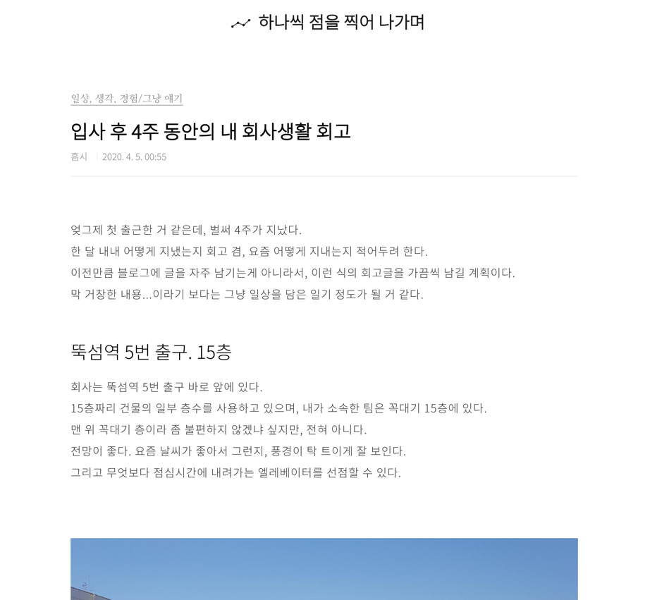
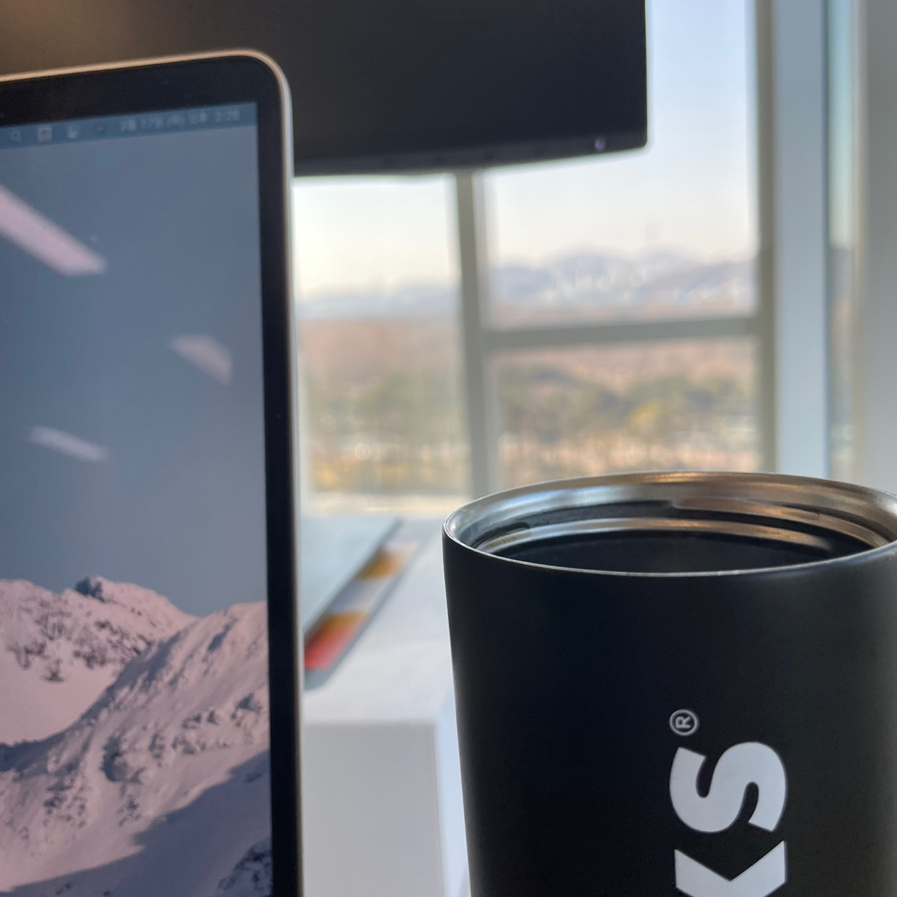
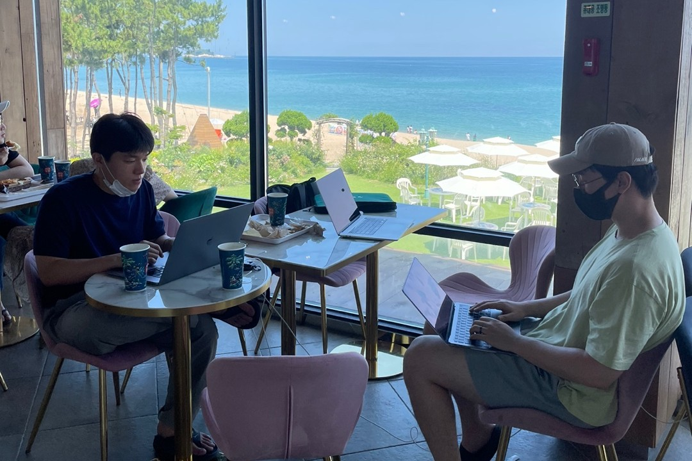
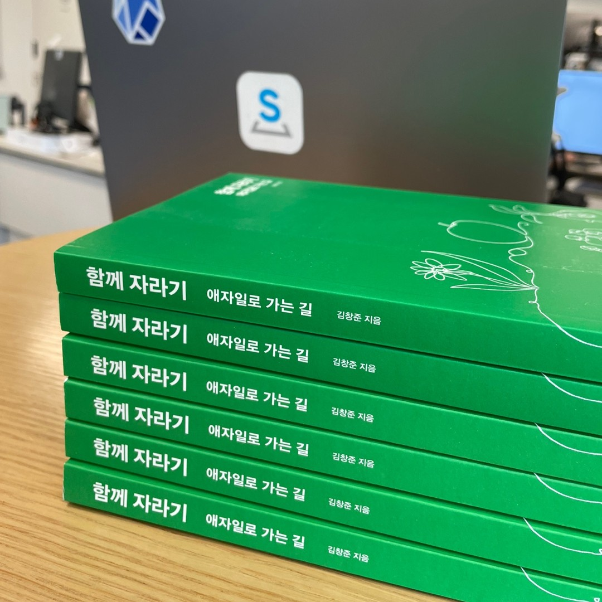
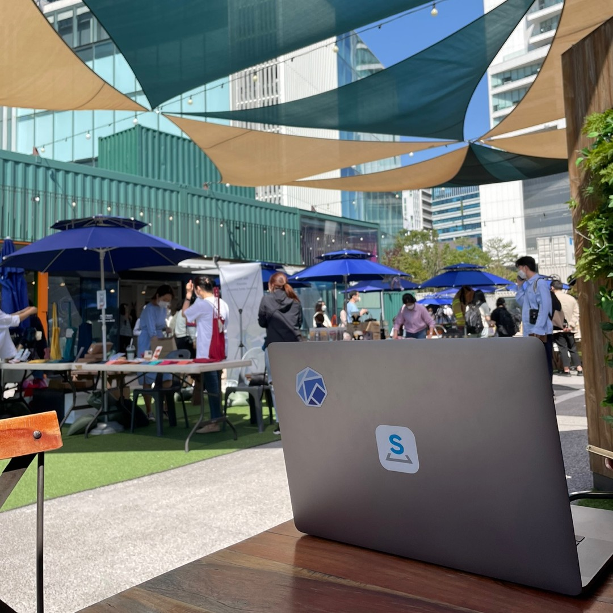
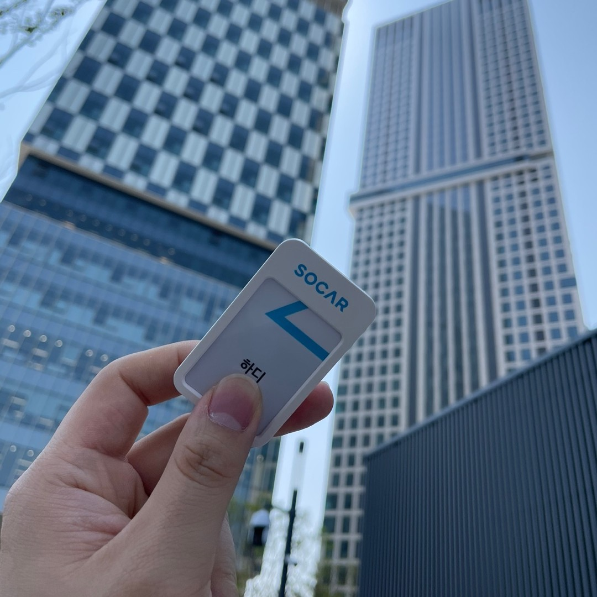

지난주 금요일, 마지막 출근을 했다.

쏘카를 다닌 지 어연 2년이 조금 넘었다. 시간 빠르다 정말.
특히 블로그에 입사한지 얼마 안 되었을 때 작성한 회고가 그대로 있는 걸 보면... 기분 참 이상하다.

*입사한 지 4주 정도 되었을 때 작성했던 [회고](https://dailyheumsi.tistory.com/215?category=864097)*

이번 주부터 아침에 조금씩 늦게 일어나고, 운전면허를 (드디어!) 따려고 학원 다니는 내 모습을 보면, 퇴사한 게 조금씩 실감이 난다.

퇴사 이후 더 느슨한 상태로 쉬기 전에, 귀찮더라도 지난 2년간의 쏘카 생활을 회고해 보고 싶다. 팀에서 주로 하던 3L(Liked, Learned, Lacked) 방식으로 쏘카의 지난 2년을 회고해 보겠다.

## 좋았던 것들 (Liked)

먼저 좋았던 것들이다! 생각나는대로 주저리 주저리 적어본다.

### 작지만 임팩트 있는 서비스를 운영해볼 수 있는 경험

나는 입사하자마자 쏘카 차량의 대여 가격 산출 서버를 개발을 시작으로, 몇 달 뒤엔 쏘카 면책 가격 산출 서버도 개발하게 되었다. 둘 다 쏘카라는 서비스의 MSA 일부여서, 그 자체로 큰 범위의 기능은 아니었지만, 회사 매출에 직접적으로 상당한 기여를 담당하는 서비스들이었다.

팀장님과 둘이서 초기에 개발을 담당하다 보니, 서비스 컨셉이나 전체 시스템 디자인을 모두 알 수 있었다. 배포 역시 직접 함으로써, 회사에서 내가 담당하는 서비스가 개발되고 배포되어 트래픽이 들어오는 것을 모두 경험할 수 있었다. 또한 1년 정도 운영하며 서비스를 운영하며 발생하는 여러 귀찮은 일들, 장애들을 경험해 보며, 운영 담당자들과 소통하는 법, 내가 좀 덜 귀찮아지는 법 등을 배울 수 있었다.

다시 이런 운영 경험을 바탕으로 현 운영 환경에 맡게 기존 시스템을 다시 디자인하며 새로 개발할 수 있었는데, 이때에는 내가 공부했던 클린 코드나, 아키텍처적인 지식들을 녹여보려는 시도도 해볼 수 있었다.

물론 모든 과정이 쉽게 잘 흘러간 것은 아니며, 이상과 다르게 현실적으로 타협한 부분이나 지금 생각해 보면 Best Practice가 아닌 것도 많다. 또한 혼자 고민해 봐야 하는 상황이 많았고, 이 와중에 서투르지만 잘해보기 위해 노력하며 현실적으로 힘든 부분들도 있었다.

그럼에도, 쏘카 정도되는 유니콘 규모의 회사에서 신입 개발자가 이런 기회를 갖는 것은 결코 흔한 일은 아니며, 나에겐 매우 좋은 기회였음에 감사하다. 사내에 데이터 조직이 나름대로 힘이 있었고, 자유로운 성향이 강한 나를 잘 이끌어주신 훌륭하신 팀장님 덕분에 가능했다고 생각한다.

### 원하는 걸 할 수 있는 환경

쏘카에서는 주기적으로 팀장님과 1:1 미팅을 하곤 한다. 이때 내가 키우고 싶은 커리어에 맞는 방향으로 추후 프로젝트에 담당할 일에 대해 논의해 볼 수 있다. 나는 초기에는 팀 내에서 개발 관련 일을 담당하고 싶다고 했고, 이후에는 인프라 관련 일을 맡고 싶다고 하였다. 그리고 실제로 이에 관련된 일 위주로 일을 할 수 있었다.

사실 개발부터 인프라까지 다 다뤄보는 게 가능한 이유는 내가 있던 팀이 데이터 조직의 모든 엔지니어링 파트를 맡고 있기 때문이다. 좀 더 구체적으로 말하면, GCP 관리부터 쿠버네티스(Managed) 클러스터, 그리고 클러스터에 배포되는 데이터 애플리케이션까지 모두 우리 팀이 메인테이너다.

따라서 GCP에서 제공하는 리소스를 사용해야겠다고 하면, 언제든지 사용할 수 있으며, 쿠버네티스 클러스터 구성 방식이나, 이 위에서 로그 수집은 어떻게 할지, CI/CD는 어떻게 할지 등등 뭔가 만들어보고 싶은 게 있으면 언제든 자유로이 가능했다.

나를 비롯한 우리 팀원들은 이런 자유로운 환경을 적극적으로 이용해서, 필요한 것들이나 새로운 툴들을 빠르게 PoC 하고 운영해 볼 수 있었다. 물론 팀의 자유도가 높아지는 만큼 책임과 운영 리소스 또한 따라오지만, 그래도 이런 환경은 엔지니어라면 누구나 반길만한 환경이 아닐까 싶다.

*서울숲과 남산이 보였던, 모두가 탐내던 내 자리*

### 같이 개선해나가고자 하는 동료들과 팀 문화

마지막으로 가장 좋았던 것은, 함께하는 동료들과 이 동료들과 함께 만들어나가는 팀 문화다.

내가 입사한지 1년 정도 뒤에, 험프리, 그랩, 디니가 팀에 합류했고, 몇 달 뒤 우리는 데이터 플랫폼팀이라는 이름으로 함께 일하게 되었다. 우리는 나이대도 비슷했고, 경력 연차도 비슷했다. 그리고 열정이나 팀에 기여하고자 하는 마음가짐도 비슷했다고 생각한다.

여하튼 우리 넷은 같이 일하며, 팀이 일하는 방식부터 다시 고민하기 시작했고, 어떻게 하면 더 효과적으로 일할 수 있을까를 목표하며 이런저런 시도를 많이 했다. 생각나는 걸 조금 적어보면, 오전 데일리 미팅 바로 직후에 코드나 문서 리뷰하는 시간을 30분 가지기라든가, 팀의 각종 컨벤션들은 GitHub Repo를 Source Of Truth 생각하고, 이 안에서 제안(PR) 하기 변경(Commit) 하기, 문서 템플릿 등은 어떻게 할지, 팀 Notion 문서는 어떤 식으로 활용할지 등등.. 사이클을 2주로 잡아 시도해 보고 회고하고, 또 개선해나가고의 반복이었다.

사실 이렇게 시도하고 회고하고 개선하는 식의 사이클은 많은 에너지와 리소스를 요구했다. 그래도 팀원 서로가 서로의 노력을 인지하고 있고, 우리 모두 같은 마음임을 알기 때문에 조금은 덜 지치지 않았나 싶다.

결과적으로, 우리는 Best Practice는 아니더라도 빠르게 우리가 느끼는 문제점들을 개선해나갈 수 있었고, 이런 개선 사이클은 우리 팀의 문화가 되었다. 마치 소프트웨어처럼, 상황에 따라 아주 유연하게 변화할 수 있는 우리 팀이 나는 가장 좋았다.

*여름에는 동해에 가서 동료인 험프리와 그랩과 며칠간 여행하며 일하기도 했다.*

## 배운 것들 (Learned)

다음으론 배운 것들이다. 크게 기술적인 것과 비기술적인 것들로 나눠볼 수 있을 거 같다. 각각 2개씩 생각나는 대로 적어본다.

### 파이썬 기반의 애플리케이션을 개발하는 일

2년간 가장 많이 사용한 프로그래밍 언어는 파이썬이다. 웹 페이지 만들 때 자바스크립트를 본 것 빼고는 사실상 거의 파이썬만 쓴 거 같다.

나는 작은 애플리케이션을 하나 만들어도 잘 만들고 싶었다. 흔히 말하는 "우아한" 코드와 아키텍처를 다뤄보고 싶었다. 지금 생각해 보면 어쩌면 시간이 남아돌아서 이랬을 수도 있겠단 생각이 들기도 하지만.. 뭔가 자꾸 정답을 찾고자 하는 내 성향 때문인 거 같기도 하다.

여하튼 이 때문에 클린 코드나 파이썬 관련 서적을 몇 번 읽어보기도 했으며, 다른 언어로 쓰인 아키텍처 책이나, 객체지향같이 설계의 기본이 되는 서적도 읽어보았다. "우아한 파이썬" 코드에 대해 논의해 보기 위해 카카오톡 오픈 채팅방도 만들기도 했고, 특정 라이브러리를 좀 더 공부해 보고 싶어 스터디도 진행해 보았다.

결과적으로 파이썬으로 무언가를 잘 만드는 것에 대해 많이 배웠다. FastAPI를 쓰느냐 Django를 쓰느냐 이런 것이 중요한 게 아니라, 남이 읽기에 충분히 가독성이 좋고 유연한 코드와 아키텍처일까? 지금 상황에서 이거는 오버 엔지니어링이 아닐까? 운영에 필요한 요소들이 잘 들어가 있는 걸까? 이런 것들에 대해서 팀원들과 주로 논의했고, 이제는 나름의 감이 생겼다고 생각한다.

2년 전, 그렇게 클린 코드와 아키텍처에 집착하던 내가, 이제는 집착하지 않게 되었다. 이것만으로도 많이 성장했다고 느낀다.

### 쿠버네티스 위에서 앱들을 배포하고 클러스터를 운영하는 일

우리 팀은 쿠버네티스 클러스터(GKE)를 4개 가지고 있었다. 클러스터의 노드 구성은 어떻게 하면 좋을지, 또 운영을 위해 클러스터에 어떤 앱들이 필요한지 고민하고 운영해 볼 수 있었다.

좀 더 구체적으로 말하자면, 클러스터에 앱 배포를 Helm으로 하면 발생하는 문제점들을 절실히 느낄 수 있었고, Single Source of Truth가 얼마나 유용한지, 왜 GitOps와 ArgoCD가 트렌드를 이끌고 있는지 알 수 있었다. 또 실제로 운영해 보니, 이런저런 문제점들도 경험해 볼 수 있었고, 다른 대안은 또 없는지 종종 관심을 가질 수 있었다.

또한 클러스터 모니터링이 왜 중요한지, PLG 스택을 배포하고 운영하면서 왜 별로인지, 데이터독이 클러스터 운영에 리소스를 들이기 어려울 때 얼마나 편리한지도 알 수 있었다.

사실 우리 팀은 일반적인 운영 서비스를 위한 쿠버네티스 클러스터가 아니라, 데이터 조직을 위한 백오피스 서비스용 쿠버네티스 클러스터였기 때문에, 그렇게 다이나믹하거나 긴급한 경우가 있다거나 하지는 않았다. 또한 Managed 서비스를 사용했기 때문에 쿠버네티스 자체를 그렇게 깊게 이해하지 않고 사용하는 정도였다.

그럼에도, 약 1년 조금 넘게 쿠버네티스 관리자이자 이용자로써 쿠버네티스가 왜 좋은지, 클러스터에 어떤 것들이 왜 필요한지에 대해서 알 수 있었다.

### 데이터 팀의 구성과 역할, 그리고 엔지니어링 팀의 책임

쏘카 데이터 조직은 약 30명으로 이루어져 있다. 조직은 데이터 모델링 팀, 비즈니스 팀, 사이언스 팀, 엔지니어링 팀으로 다시 나뉜다. (물론 현재는 더 복잡하게 바뀌어 있지만, 큰 맥락은 비슷하다.)

약 2년 정도 일하며, 각 팀에서 어떤 일들을 하는지 지켜볼 수 있었다. 그리고 각 팀이 맡은 역할과 책임이 무엇인지도 자연스럽게 알 수 있었다.

30명이라는 적지 않은 숫자지만, 조직 차원에서 교류할 수 있는 기회가 많았고, 나 역시 엔지니어링 팀을 제외한 다른 팀원분들과 친하게 지낼 수 있었다. 가끔 밥이나 술 먹으며, 각 팀이 어떤 고충을 가지는지, 어떤 것들이 문제인지도 느껴볼 수 있었다.

또한 회사가 성장하거나 긴급함에 따라 데이터 조직 구성이 때로는 복잡하게, 때로는 단순하게 바뀌는 것도 볼 수 있었는데, 이걸 본 것 자체만으로도 데이터 조직은 어떻게 변화는 가에 대해서 많은 배움이 되었던 것 같다.

아직 다른 회사를 경험해 보진 않았지만, 그래도 쏘카의 데이터 조직은 꽤 잘 구성되어 있다고 생각한다. 물론, 다른 회사에서 일해보면 평가가 바뀔 수도 있겠지만, 그래도 이런 기준점을 만들어준 것만으로도 내게 의미가 있다.

### 팀이 더 나아지기 위한 이런저런 방법들

팀원들과 같이 팀이 일하는 방식을 비롯하여, 이런저런 팀 문화를 개선하는 시도를 하는 과정에서 여러 개선 방법에 대해 경험하고 각 장단점들을 직접적으로 배울 수 있었다.

예를 들면, Notion의 Linked Database를 이용하여 팀 내 문서를 한 군데로 중앙화하고, 태깅과 필터링을 통해 여러 페이지에서 이 문서들을 가져오는 방법. 그리고 이를 칸반 보드에 녹임으로써, 테스크 관리와 히스토리를 좀 더 효율적으로 관리하는 방법. 태스크나 회의 템플릿을 명확히 하여, 비대면 커뮤니케이션을 좀 더 극대화하는 방법. Slack에 #idea_pool 채널을 만들어, 수시로 떠오르는 개선 방향의 아이템을 팀 내 공유하고 컨센서스를 확보하는 방법 등이 있었다.

또한 좋은 사람들이 회사에 들어왔으면 하는 마음에 내가 직접 테크 블로그를 관리하기도 했었는데, 테크 블로그에 좋은 글이 올라가면, 실제로 이 글을 보고 좋은 분들이 많이 지원한다는 것을 느낄 수 있었다. 사실 나만 해도 다른 회사의 테크 블로그가 매력적이면 그 팀에 대해 굉장히 좋은 인상을 받았었는데, 이게 나만 그런 게 아니구나라는 걸 확신할 수 있었다.

이 밖에도, 데이터 조직에서 진행하는 해피아워, 어셈블, 그룹 스터디 등을 통해 팀이 더 나아지기 위한 여러 방법들을 지켜보고 경험해 볼 수 있었다. 내가 추후에 다른 조직에 가면 괜찮다고 생각하는 것 몇 개쯤은 제안해 봐도 좋지 않을까 싶다!

*그랩이 입사 후 팀원 모두에게 선물했던 책, 함께 자라기.*

## 아쉬웠던 것들 (Lacked)

마지막으로 아쉬웠던 것들이다. 그래도 이제 퇴사했으니 비교적 가벼운 마음으로 솔직하게 적어본다.

### 넓은 R&R과 내 역량의 부족

팀에서 다양하게 할 수 있는 일이 많다는 의미는 또 그만큼 다뤄야 할 스코프 역시 넓다는 걸 의미하기도 한다. 우리 팀은 인프라(비록 클라우드 기반이긴 하지만)부터 애플리케이션 레벨까지 모든 영역을 커버했다. 즉 팀의 Role & Responsibilty는 넓었고, 이 때문에 기술적인 것들을 역시 넓지만 얕게 알았다.

예를 들면, 쿠버네티스 클러스터를 구축했지만 추후 확장성을 고려하여 노드 풀을 설정하고, 라벨링을 잘 했는지는 모르겠다. 클러스터에 리소스 모니터링은 하고 있지만, 여전히 많은 부분이 리소스 최적화가 되어있지 않았다. 시크릿이나 로그 모니터링 툴은 PoC 레벨인 상태인 경우가 많았고, 다른 더 좋은 대안을 찾지 못하거나 찾을 시간이 부족한 경우도 많았다.

또한 이런저런 서비스에서의 운영 이슈와, 외부 팀으로부터 들어오는 애드 혹 요청, 갑자기 일어난 서비스 장애, 팀에 필요한 애플리케이션 개발 등 다양한 일들을 동시에 진행했는데, 컨텍스트 스위치가 쉽지 않았다. 우리 팀은 별도의 PM이 없었고, 개발자 스스로 생각해서 일을 시작하고 끝내야 했다. 이러다 보니, 스프린트에 올렸던 일들이 미처 못 끝내기도 하며, 가끔은 언제 끝날지 모르는 일이 몇 차례의 스프린트에 늘어져 있는 경우도 종종 있었다. 내가 기술적으로나, 일적으로나 너무 얕게 알아서, 쉽게 끝날 수 있는 일을 쉽게 못 끝내는 건가 싶은 생각이 종종 들었다.

물론 기본적으로 내 역량이 많이 부족했다 생각한다. 내가 좀 더 찾아보고, 좀 더 공을 들이는 노력을 했다면 분명 더 나아졌을 거라 생각한다.

### 통합적 아키텍처 파악의 어려움

내가 배포한 운영 서비스에 누가 언제 어떻게 요청하는지 잘 모를 때가 많았다. MSA 특성상 여러 서비스 간 통신하게 되고, 서비스가 잘게 나누어질수록 전체적인 복잡도는 더 커지게 된다. 이때 일종의 컨텍스트 맵이나, 서비스 매시 같은 게 있어서 가시적으로 서비스 간 연관관계를 볼 수 있는 게 있으면 참 좋았을 텐데, 이런 게 별도로 존재하지는 않았다. 따라서 내가 무언가 외부에 영향을 줄만한 수정을 하게 되면, 관련 담당자가 누군지 슬랙 채널을 통해 찾아 DM을 통해 소통해야 했다.

사실 데이터 조직은 개발 조직과 별도로 존재했으므로, 무언가를 같이 진행한다거나 공유하는 소통이 적었다고 생각한다. 이런 상황에서 MSA 형태로 개발을 하니, 데이터를 통합적으로 봐야 하는 DBA나 BI 관련 일을 하시는 데이터 엔지니어들이 매우 힘들었을 것이다.

데이터 엔지니어링과 개발을 하는 조직이 별도로 존재하는 게 맞는가 싶기도 하고, 뭔가 더 통합적으로 바라보며 깔끔하게 전체적인 아키텍처를 그려나가며 일할 수 있는 방법이 있는지는 여전히 궁금하다.

### 재택으로 인해 점점 줄어드는 초기의 조직 소통 문화

코로나 때문에 작년부터 일 년 넘게 재택근무를 진행했던 거 같다. 재택근무도 물론 편하고 좋기는 하지만, 이 때문에 이전만큼 조직의 소통이 줄어든 거 같아 아쉽다. 재택근무 이전의 회사 생활을 떠올려보면, 다 같이 점심에 뭐 먹을지 고민하기도 하고, 커피 들고 서울숲 산책하는 게 일상다반사였다. 또 오후 다섯시쯤 되면 일이 잘 안돼서 다른 동료들 자리 어슬렁어슬렁 거리다가 이야기하며 깔깔거리는 게 회사 생활의 힐링 포인트였다. 퇴근 이후 동료들과 술도 종종 먹었었는데, 이 때문에 엔지니어링 팀 말고 데이터 조직 내 다른 팀원들과 쉽게 친해질 수 있었다.

여하튼 그때 생각하면, 참 재밌었는데... 재택근무가 1년 넘게 기본이 되어 버리니, 이런 즐거움도 많이 줄었다고 느낀다. 어쩌겠는가, 코로나가 우리를 그렇게 만들어 버린걸... 그래도 나는 재택 이전의 재미있는 회사 생활을 경험해 볼 수 있어서 다행이라 생각한다.

*출근하면 회사 앞 카페에서 티타임도 종종 했었다.*

## 안녕, 나의 첫 회사, 쏘카

쏘카는 내가 정규직으로 일한 첫 회사다. 그래서 그런지 뭔가 아련한 느낌이 있다. 모든 게 처음이었으니깐.

되돌아보면... 참 재밌었다. 일을 처음 배운 것도. 재미있고 잘 맞는 동료들 만난 것도. 요즘 핫한 서울 숲 옆에 있는 회사에 출퇴근한 것도. 모든 게 다 감사하다. 난 정말 복받은 거 같다.

*안녕, 나의 첫 회사, 쏘카*

나는 이제 쏘카를 졸업하고, 또 다른 여정을 향해 나아간다. 누군가가 남는 건 사람이라 했던가. 같이 일해왔던 많은 동료들 얼굴이 떠오른다. 우리, 언젠간 또 볼 거라 생각한다. 그분들께 감사의 인사를 올리며 글을 마무리해 본다.

Thanks to 토마스, 카일, 디케이, 녹스, 플래시, 제프, 바트, 키노, 샘, 알렉스, 도달, 폴제이, 윤, 야마니, 세레나, 캐롯, KP, 햇님, 우민, 정, 레니, 햄니, 샨짜이, 프로토, 셀라, 클로버, 치즈, 에스더, 브루노, 위니, 루치, 파스모, 가비, 에코, 제이든, 알티.

Specially Thanks to 험프리, 그랩, 디니.