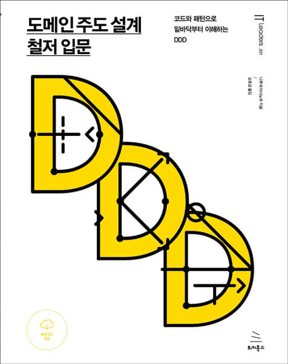

이 글은 [도메인 주도 설계 철저 입문 (위키북스)](https://www.aladin.co.kr/shop/wproduct.aspx?ItemId=252622256) 를 읽고 개인적으로 정리한 글입니다.  

## 들어가며

평소 궁금해했던 도메인 주도 설계, 일명 DDD 관련 책이 최근에 나와 읽어보았다.  
도메인 주도 설계는 [에릭 에반스님의 책](http://www.yes24.com/Product/Goods/5312881)이 고전으로 가장 유명한데, 사실 이 책을 읽을 엄두가 안났다.  
늘 그렇듯 고전 자체를 읽기란.. 분량도 그렇고, 뭔가 시작부터 쉽지 않기 때문이다.
그러던 차, 나같은 입문자를 위한 "도메인 주도 설계 철저 입문" 이라는 책이 아주 따끈따근하게 나왔으니, 이 책부터 가볍게 읽어보면, DDD에 어렵지 않게 접근할 수 있겠다 싶었다.

분량은 약 350페이지 가량되는데, 내용이 "입문"이라는 단어에 딱 맞게 어렵지 않아 금방 읽는다.  
나는 다 출퇴근 + 주말에 읽는데 약 2주가량 걸린 거 같다.  

평소 아키텍처 공부나 프레임워크 코드를 사용하는 사람들은, `Value Object`, `Entity`, `Repository` 등의 네이밍을 자주 보았다. 그리고 이런 개념은 어디서 나왔을까? 라는 궁금증이 생겼었다.  
이 책을 읽으며 이런 궁금증에 대한 갈증이 어느정도 해소할 수 있었다. 또한 여러 설계 패턴들을 보며, 좀 더 객체지향적으로, 그리고 더 나은 코드의 분리법을 배울 수 있었다. 나처럼 평소 이런 용어들과 패턴들에 대해 궁금했던 분들은 꼭 읽어보길 바란다. 기존에 사용하던 코드들을 새로운 시각으로 볼 수 있지 않을까 싶다.

책에서는 C# 으로 코드를 설명하지만, 내 정리에서는 난 파이썬을 쓰겠다.  
또, 개인적으로 중요하지 않은 부분은 과감히 생략할 것이며, 예제 코드 일부도 내 식대로 살짝 바꿔 정리할 것이다.  
(혹여나 출판사로부터 저작권 관련 문제 요청을 받을까봐 최대한 이를 피해가며 정리하려 한다.)

## 목차

DDD 개념 자체에 대한 내용은 생략한다.
책에서 주로 다루고 있으며, 정리할만한 내용은 다음과 같다.

- 지식 표현을 위한 패턴
    - 값 객체 (Value Object)
    - 엔티티 (Entity)
    - 도메인 서비스 (Domain Service)
- 애플리케이션을 구성하는 패턴
    - 리포지토리 (Repository)
    - 애플리케이션 서비스 (Application Service)
    - 팩토리 (Factory)
- 지식 표현을 위한 고급 패턴
    - 애그리게이트 (Aggregate)
    - 명세 (Specification)
- 아키텍처
    - 계층형 아키텍처 (Layered Architecture)
    - 헥사고날 아키텍처 (Hexagonal Architecture)
    - 클린 아키텍처 (Clean Architecture)
    - 프로젝트 구조 구성 방법

사실 난 이 목차를 보고 평소 궁금해하던 키워드들이 많이 보여, 설레는 마음으로 바로 책을 구매했다.
내용의 순서를 보면, 상향식(Bottom - Up) 구성으로, 실제로 도메인 주도 설계(DDD)를 세워나가는 과정과 같다고 한다.

다음 포스팅부터 짬짬이 정리를 시작해보겠다.