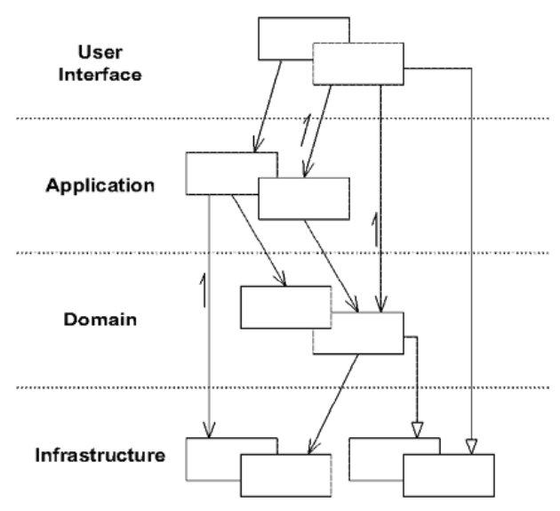
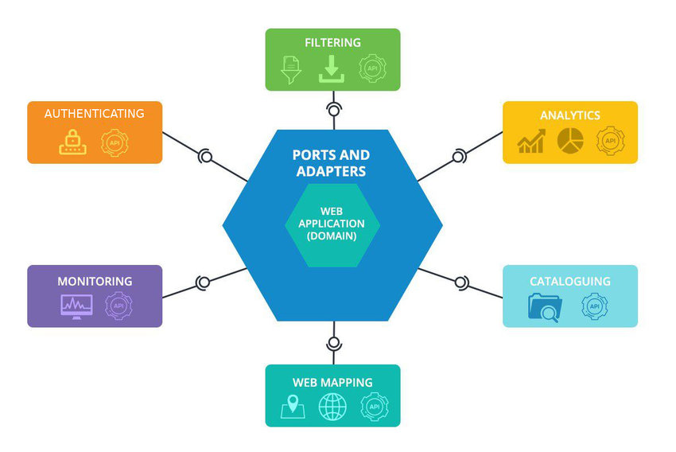
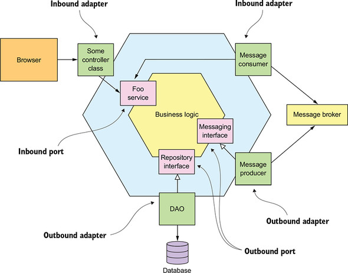
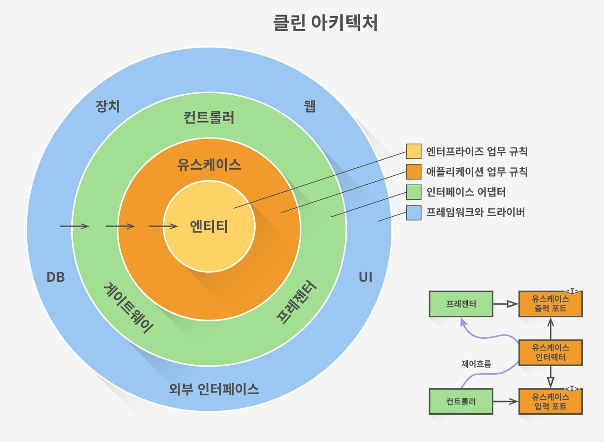
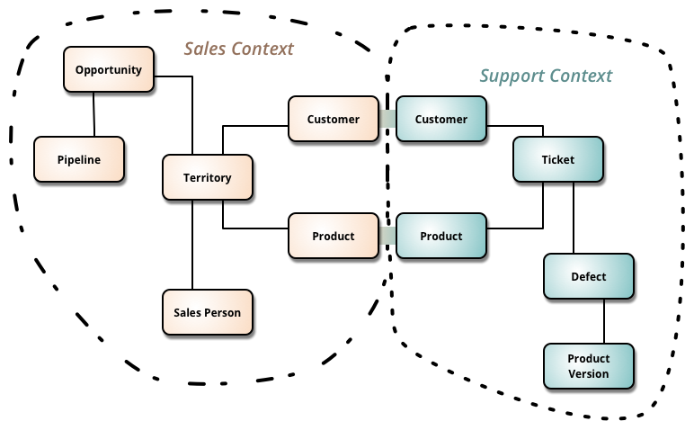

이 글은 [도메인 주도 설계 철저 입문 (위키북스)](https://www.aladin.co.kr/shop/wproduct.aspx?ItemId=252622256) 를 읽고 개인적으로 정리한 글입니다.


---

## 0\. 들어가며

이번 글에서는 DDD와 함께 자주 언급되는 아키텍처에 대해 다룬다.  
책에서는 아키텍처에 대해 다음처럼 소개하고 있다.

> 아키텍처는 간단히 말해 코드를 구성하는 원칙이다. 코드가 어디에 배치돼야 하는지에 대해 답을 명확히 제시하며, 로직이 무질서하게 흩어지는 것을 막는다. **개발자는 아키텍처가 제시하는 원칙에 따르면서 "어떤 로직을 어디에 구현할 것인지"를 고민하지 않아도 된다.** 이로써 개발자가 DDD의 본질인 **"도메인을 파악하고 표현하는 것"에 집중**할 수 있게 해 준다.

**DDD에서 아키텍처 역할의 핵심은 "도메인 객체"를 지켜내는 것이다.**  
이것이 가능하다면 다음 아키텍처 중 어떤 것을 사용해도 무방하다.

-   계층형 아키텍처 (Layered Architecture)
-   헥사고날 아키텍처 (Hexagonal Architecture)
-   클린 아키텍처 (Clean Architecture)

아키텍처에 대한 언급 뒤, 이 책에서 DDD에 다루지 못함과 동시에 더 알아야 할 내용들을 간략히 소개하며 글을 마무리하겠다.


---

## 1\. 아키텍처

### 1.1 계층형 아키텍처 (Layered Architecture)

#### 1) 컨셉

계층형 아키텍처는 DDD와 함께 언급되는 아키텍처 중 가장 전통적이고 유명한 아키텍처다.  
이름 그대로 여러 층이 쌓인 구조다.



_(출처: [https://dhsim86.github.io/programming/2019/04/25/domain\_driven\_design\_04-post.html](https://dhsim86.github.io/programming/2019/04/25/domain_driven_design_04-post.html))_

계층형 아키텍처는 다음 4가지 계층으로 구성된다.

-   **프레젠테이션(= UI) 계층**
    -   인터페이스와 애플리케이션이 연결되는 곳
    -   출력의 표시와 입력의 해석
    -   웹 통신 프레임워크, CLI 인터페이스 등 주로 통신과 입출력의 변환을 담당.
-   **애플리케이션 계층**
    -   도메인 객체의 직접적인 클라이언트가 되며, 유스케이스를 구현하는 객체가 모이는 곳
    -   애플리케이션 서비스가 여기에 속함.
-   **도메인 계층**
    -   도메인과 관련된 객체들이 모이는 곳
    -   도메인 모델(엔티티, 값 객체), 도메인 서비스 등
    -   리포지토리 인터페이스도 여기에 속한다.
-   **인프라스트럭처 계층**
    -   다른 계층을 지탱하는 기술적 기반을 담은 객체들이 모이는 곳
    -   리포지토리를 구현하는 ORM, 인메모리 등의 구현체 클래스가 여기에 속함.

이제 다시 위 다이어그램을 보면 이해가 갈 것이다.  
중요한 점은 **의존성의 방향이 위에서 아래(프레젠테이션 -> 애플리케이션 -> 도메인)로 향하고 있다. 이 방향을 거스르는 의존은 허용되지 않는다.** (도메인 -> 인프라스트럭처는 의존 관계가 아니라 추상화 -> 구현 관계가 일반적이다. 위 다이어그램에서는 도메인이 인프라스트럭쳐에 의존하는 화살표가 하나 보이는데, 현재는 자주 쓰이는 패턴은 아니라고 한다.)


#### 2) 구현

이 계층형 아키텍처를 코드로 구현한 예시를 살짝 보자.  
`User` 에 대해 CRUD를 제공하는 간단한 REST API 시스템의 일부다.  
(물론 실제 동작 여부와는 괴리가 있고, 예외 처리 등은 하지 않았다. 책의 코드와도 다소 다르다. 컨셉만 이해하자.)

##### 2.1) 프레젠테이션(UI) 계층

```python
"""
프레젠테이션 계층에 속한 UserController 객체

REST API 형태로 클라이언트에게 입력을 받고, 이를 애플리케이션 서비스가 활용할 수 있는 형태로 바꾸어 전달한다.
애플리케이션 서비스가 결과를 내놓으면 이를 REST API 에서 약속한 형태로 변환하여 클라이언트에게 전달한다.
"""

class UserController:
    def __init__(self, user_application_service: UserApplicationService) -> None:
        self._user_application_service

    @app.route("/user/<int:user_id>", methods=["GET"])
    def get_user(self, user_id: int) -> GetUserJsonReponse:
        # 클라이언트로부터 받은 입력을 애플리케이션 서비스가 받아들일 수 있는 형태로 변환하자.
        input_dto = GetUesrInputDto(user_id)

        # 실제 유스케이스 로직은 애플리케이션 서비스에게 위임한다.
        # 애플리케이션 서비스는 결과를 DTO에 담아 필요한 정보만 줄 것이다.
        output_dto = self._user_application_service.get_user(input_dto)

        # 이를 웹 통신 형식(json)에 맞게 변환하여 내보낸다.
        return GetUserJsonReponse(result)

    @app.route("/user", methods=["POST"])
    def post_user(self) -> PostUserJsonResponse:
        input_dto = RegisterUserInputDto(request.json["user_name"])
        output_dto = self._user_application_service.register_user(input_dto)
        return PostUserJsonResponse(result)
```

##### 2.2) 애플리케이션 계층

```python
"""
애플리케이션 계층에 속한 UserApplicationService 객체

프레젠테이션 계층에서 넘겨받은 입력(InputDto)를 도메인 객체를 이용하여 처리한다.
이 때 도메인 객체는 도메인 서비스, 리포지터리 인터페이스, 엔티티, 값 객체가 되겠다.
이후 다시 프레젠테이션 계층에게 처리한 결과(OutputDto)를 넘겨준다.
"""

class UserApplicationService:
    def __init__(self, 
                 user_repository: UserRepository, 
                 user_domain_service: UserDomainService) -> None:
        self._user_repository = user_repository
        self._user_domain_service = user_domain_service

    def get_user(input_dto: GetUesrInputDto) -> GetUserOutputDto:
        user = self._user_repository.find_by_id(input_dto.user_id)
        if user is None:
            raise Exception(f"[user_id = {str(user_id)}] 에 해당하는 사용자가 없습니다.")
        return GetUserOutputDto(user)

    def register_user(input_dto: RegisterUserInputDto) -> RegisterUserOutputDto:
        user = User(input_dto.user_name)
        if self._user_domain_service.exists(user):
            raise Exception(f"[{str(user)}] 는 이미 등록된 사용자 입니다.")
        self._user_repository.save(user)
        return RegisterUserOutputDto(user)
```

참고로, `InputDto` 와 `OutputDto` 역시 애플리케이션 계층에 속한다.

```python
@dataclass(frozen=True)
class GetUesrInputDto:
    user_id: UserId

@dataclass(frozen=True)
class GetUesrOutputDto:
    user_id: UserId
    user_name: UserName

... # (RegisterUser 관련 DTO 는 생략)
```

##### 2.3) 도메인 계층

```python
"""
도메인 계층에 속한 UserDomainService 객체

도메인 엔티티가 스스로 해결할 수 없는 동작들을 처리한다.
도메인 계층이기 때문에 도메인 규칙을 담기도 한다.
"""

class UserDomainService:
    def __init__(self, user_repository: UserRepository) -> None:
        self._user_repository

    def exists(user: User) -> bool:
        user = self._user_repository.find_by_name(user.name)
        if user is None:
            return False
        else:
            return True
```

```python
"""
도메인 계층에 속한 UserName, UserId 객체(값 객체)와 User 객체(엔티티)
"""

# 값 객체
@dataclass(frozen=True)
class UserId:
    value: InitVar[str] = None

    def __post_init__(self, value: str) -> None:
        if value is None:
            self.value = uuid.uuid4().hex
        else:
            self.value = value

class UserName:
    value: InitVar[str]

    def __post_init__(self, value: str) -> None:
        if len(value) > 30:
            raise Exception(f"사용자 이름은 30자 미만이어야 합니다. [입력된 사용자 이름 : {value}]")
        else:
            self.value = value

# 엔티티
@dataclass
class User:
    id: UserId = field(init=False, default_factory = UserId)
    name: UserName = field(compare=False)
```

```python
"""
도메인 계층에 속한 UserRepository 객체

인터페이스로, 실제 구현 객체는 인프라스트럭쳐 계층에 있다.
"""

class UserRepository(metaclass=ABCMeta):
    @abstractmethod
    def save(user: User) -> None:
        pass

    @abstractmethod
    def find_by_id(self, user_id: UserId) -> Optional[User]:
        pass

     @abstractmethod
    def find_by_name(self, user_name: UserName) -> Optional[User]:
        pass
```

##### 2.4) 인프라스트럭쳐 계층

```python
"""
인프라스트럭처 게층에 속한 InMemoryUserRepository 객체

UserRepository를 인메모리 형태로 구현한 객체다.
"""

class InMemoryUserRepository(UserRepository):
    def __init__(self) -> None:
        self.users = []  # 유저 객체를 이 리스트에 저장하게 된다.

    def save(user: User) -> None:
        self.users.append(user)

    def find_by_name(user_name: UserName) -> Optional[User]:
        for user in self.users:
            if user.name == user_name:
                return user
        return None

    def find_by_id(user_id: UserId) -> Optional[User]:
        for user in self.users:
            if user.id == user_id:
                return user
        return None
```

> **\[앞의 포스팅과 코드가 일부 다른 이유\]**
> 
> 위 코드는 결국 이전 포스팅에 설명한 것들을 아키텍처에 맞게 순서대로 구성한 것이다.  
> 그런데 몇몇 코드 일부는 이전 포스팅에서 보였던 코드와 조금 다르다.  
> 그렇다고 뭐 크게 다르진 않고 어노테이션이나 파이썬 문법을 좀 더 활용한 정도다.  
> 아무튼 다른 이유는... 나도 정리하면서 좀 더 고민하고 공부하며, 이곳저곳에 질문하며 좀 더 올바르다고 생각한 코드로 수정해나갔기 때문이다. 결과적으로, 이전 포스팅의 코드보다 위 코드들이 좀 더 정교하다고 생각한다.  
> 혹여나 뭔가 이상하거나 조잡스러운 부분이 보이면 댓글로 알려주시면 정말 땡스합니다~!


### 1.2. 헥사고날 아키텍처 (Hexagonal Architecture)

#### 1) 컨셉

육각형이 모티브인 아키텍처로, 애플리케이션과 그 외 인터페이스를 자유롭게 탈착 가능하게 하는 것이 주요 컨셉이다.  
플레이스테이션 같은 게임기를 생각해보면 좀 와 닿는데, 게임을 실행시키는 애플리케이션 자체는 바뀌지 않되, 게임을 출력해줄 모니터나, 입력 패드, 디스크 등은 사용자 취향에 따라 제조사나 타입을 선택할 수 있다. 즉 **애플리케이션을 중심으로, 애플리케이션 외의 모듈은 어댑터와 포트 모양만 맞추면 언제든 바꿀 수 있게 하는 것이다.**



_(출처: [https://www.researchgate.net/figure/TerraBrasilis-Hexagonal-Architecture-Ports-and-Adapters-Design-Pattern\_fig3\_337224879](https://www.researchgate.net/figure/TerraBrasilis-Hexagonal-Architecture-Ports-and-Adapters-Design-Pattern_fig3_337224879))_

헥사고날 아키텍처는 어댑터가 포트 모양만 맞으면 동작하는 것 같다고 해서 **포트 앤 어댑터(Ports-and-Adapters)**라고 부르기도 한다.  
게임기를 생각해보자. 모니터를 끼우는 포트는 게임기에 달려있다. 모니터는 어댑터를 이용해 이 포트에 끼우기만 하면 게임기와 이어질 수 있다. 게임기는 애플리케이션, 모니터는 외부 모듈이라 생각할 수 있다.

애플리케이션에서는 외부 모듈이 사용할 수 있는 인터페이스(퍼블릭 메서드)를 제공한다. 즉 이 메서드는 **프라이머리 포트**라 불린다. 그리고 프레젠테이션(=UI) 계층과 이 애플리케이션 계층 사이에 존재하는 어떤 객체가 이 포트를 사용해 두 계층을 연결한다. 이 객체는 **프라이머리 어댑터**라 불린다.

위 `User` 관련 REST API 시스템 예제를 생각해보면 좀 더 쉽게 와 닿을 수 있다.  
`UserController` 객체가 바로 프라이머리 어댑터고, `UserApplicationService` 의 퍼블릭 메서드들이 이 어댑터가 사용하는 프라이머리 포트가 된다.

```python
class UserController:
    def __init__(self, user_application_service: UserApplicationService) -> None:
        self._user_application_service

    @app.route("/user/<int:user_id>", methods=["GET"])
    def get_user(self, user_id: int) -> GetUserJsonReponse:
        input_dto = GetUesrInputDto(user_id)

        # 애플리케이션에서 제공하는 get_user 라는 포트(프라이머리 포트)를 사용하고 있다.
        output_dto = self._user_application_service.get_user(input_dto)

        # 애플리케이션 포트를 사용하므로 이 객체는 어댑터(프라이머리 어댑터)의 역할을 하고있다.
        ...
```

한편 포트 앤 어댑터의 방침에 맞게, **애플리케이션 역시 내부적으로 필요한 기술들을 원하는 대로 언제든 갈아 끼울 수 있어야 한다.**  
예를 들면, 애플리케이션의 내부 저장소는 인메모리가 될 수도 있고, 파일을 이용하거나 DB를 이용할 수도 있다. 이처럼 애플리케이션 내부에서 필요한 포트들이 있을 것이다. 이때 이렇게 애플리케이션 내부에서 사용하기 위해 정의되는 인터페이스(퍼블릭 메서드)들을 **세컨더리 포트**라고 부르고, 이 구현체를 **세컨더리 어댑터**라고 부른다.

`UserRepository` 의 퍼블릭 메서드들이 바로 세컨더리 포트이며, 이 인터페이스의 구현체인 `InMeomoryRepository` 가 세컨더리 어댑터가 된다.

```python
class UserRepository(metaclass=ABCMeta):

    # 애플리케이션은 save 라는 포트를 통해 내부에 필요한 모듈에 접근한다.
    @abstractmethod
    def save(user: User) -> None:
        pass

    ...
```

```python
class InMemoryUserRepository(UserRepository):
    def __init__(self) -> None:
        self.users = []

    # 그리고 위 포트를 실제로 제공해주는, 구현 객체가 어댑터(세컨더리 어댑터)의 역할을 하게된다.
    def save(user: User) -> None:
        self.users.append(user)

    ...
```

지금까지 설명한 내용을 잘 표현한 다이어그램은 다음과 같다.



_(출처: [https://livebook.manning.com/book/microservices-patterns/chapter-2/53](https://livebook.manning.com/book/microservices-patterns/chapter-2/53))_

#### 2) 구현

**계층형 아키텍처와 큰 차이점은 인터페이스를 이용해 의존관계를 관리한다는 것**이다. (포트가 실제 코드에서는 인터페이스 속에 녹아든다.) 계층형 아키텍처에서는 논리적 계층만 분리되어 있을 뿐 인터페이스를 강제하지는 않는다. 그러나 실무에서는 계층형 아키텍처를 택하더라도 대부분 인터페이스를 이용한 의존 관계를 관리하기 때문에 헥사고날 아키텍처와 계층형 아키텍처의 실질적인 차이는 거의 없다.

위 코드에서 `UserApplicationService` 를 인터페이스화 한 뒤, 구현 객체를 따로 두는 방법이 곧 구현 예가 되겠다.

> **\[관련해서 보면 좋은 글\]**
> 
> 헥사고날 아키텍처에 대해 잘 설명된 글들이 있어 공유한다. 여기서 많이 참고했다.
> 
> -   [지속 가능한 소프트웨어 설계 패턴: 포트와 어댑터 아키텍처 적용하기 - 라인 블로그](https://engineering.linecorp.com/ko/blog/port-and-adapter-architecture/)
> -   [Ports & Adapters Architecture - getoutsidedoor 블로그](https://getoutsidedoor.com/2018/09/03/ports-adapters-architecture/)


### 1.3. 클린 아키텍처 (Clean Architecture)

#### 1) 컨셉



_(출처 : Credit: 도서출판 인사이트)_

사실 클린 아키텍처에 관한 내용은 책 보다 이전 포스팅 ["클린 아키텍처 5부 - 아키텍처"](https://dailyheumsi.tistory.com/239) 에 더 잘 설명되어 있다고 생각한다.  
간단히 말하면, 헥사고날 아키텍처가 추구하는 것과 마찬가지로 코어 한 부분(헥사고날 아키텍처에서는 애플리케이션, 클린 아키텍처에서는 도메인이라 불리는 부분)과 외부 모듈(세부사항, 구체적인 구현체들)과의 접점을 캡슐화 + 인터페이스로 느슨하게 만드는 것이 핵심이다.  
다만 클린 아키텍처에서는 헥사고날 아키텍처보다 조금 더 구체적으로 구현 방법을 말해준다.  
자세한 내용은 위 포스팅을 확인하자.

> **\[이쯤에서 클린 아키텍처와 관련된 내 생각\]**
> 
> 사실 클린 아키텍처를 처음 접했을 때, InputPort라는 용어를 쓰는 것이 매우 어색했다. 그런데 헥사고날 아키텍처의 포트와 어댑터 개념을 이해하고 다시 클린 아키텍처를 보니 개념 이해가 더 잘 와 닿는다. 역시 아키텍처는 시간의 흐름에 따라 공부하는 게 가장 잘 이해되는 길인 거 같다.
> 
> 개인적인 생각인데, 나는 계층형 아키텍처, 헥사고날 아키텍처보다 클린 아키텍처를 적절히 응용한 게 제일 깔끔한 아키텍처 패턴이라고 생각한다. 일단 유스케이스를 메서드가 아닌 클래스로 표현하기 때문에, 코드를 열어보지 않고 프로젝트 패키지 구조만 보더라도 대충 뭐가 있는지 한눈에 들어온다. 또한 헥사고날 아키텍처의 의존성 관리라는 장점을 그대로 가져갔기 때문에, 이전의 아키텍처보다 훨씬 더 진보하고 뚜렷한 형태라고 생각한다.

#### 2) 구현

개인적으로 jahoy 님 블로그에 있는 ["Python으로 클린 아키텍처 적용하기2"](https://velog.io/@jahoy/Python%EC%9C%BC%EB%A1%9C-%ED%81%B4%EB%A6%B0-%EC%95%84%ED%82%A4%ED%85%8D%EC%B2%98-%EC%A0%81%EC%9A%A9%ED%95%98%EA%B8%B02) 포스팅에서 가장 잘 다루었다고 생각한다.  
클린 아키텍처를 조금 변형하여 적용한 내용은 이전 포스팅인 ["파이썬으로 구현하는 클린 아키텍쳐 - rentomatic"](https://dailyheumsi.tistory.com/240) 에서 볼 수 있다.


---

## 2\. 앞으로의 학습

이 책에서는 DDD에 쓰이는 패턴들을 중심적으로 소개했다. 이렇게 패턴만 도입하는 것을 경량 DDD라고 한다.  
책에서 소개하지 않은 DDD 내용들도 있는데 다음과 같이 간단하게만 소개한다.

-   **보편 언어 (Ubiquitous language)**
    -   도메인 전문가와 협업하며 일관되고 통일된 도메인 표현 쓰기
    -   예를 들면, 보편 언어에서 "사용자 정의하기" 라는 도메인 표현을 쓰기로 했다면 코드에서도 `register_user` 와 같이 표현되어야 한다. (`save_user` 와 같이 보편 언어와 일관되지 않은 표현은 지양해야 한다.)
-   **컨텍스트 경계 (Bounded context)**
    -   같은 단어라도 도메인 내 컨텍스트 영역에 따라 다른 대상을 나타내는 것일 수도 있다.
    -   예를 들어, 로그인 및 인증 관련 시스템에서 말하는 `User` 와 유저 그룹과 관련된 시스템에서 말하는 `User` 는 서로 다른 엔티티 일 수 있다. 이럴 때는 두 엔티티를 각각 컨텍스트 영역에서 별게의 엔티티로 정의하는 것이 좋다.
    -   시스템의 규모가 점점 커지면 이처럼 컨텍스트가 복잡해지게 되고, 컨텍스트의 경계를 잘 긋고 시스템을 분할하는 것이 중요해진다.
    -   이렇게 컨텍스트 경계와 관계를 잘 표현하고, 전체 도메인을 잘 내려다볼 수 있는 컨텍스트맵을 만들어야 한다.



_(출처: [https://happycloud-lee.tistory.com/94](https://happycloud-lee.tistory.com/94))_

저자는 DDD는 도메인부터 차근차근 세워나가는 상향식(Bottom-Up)에 가깝다고 설명한다.  
즉, 그만큼 **도메인 전문가와의 협업, 대화, 용어 및 모델 설계가 소프트웨어 자체를 설계하는 것보다 중요하다는 것이다.**  
이게 나는 DDD 철학의 핵심이라고 생각한다.

마지막으로 저자는 DDD 고전이라 불리는 [에릭 에반스의 "도메인 주도 설계"](http://www.yes24.com/Product/Goods/5312881)를 꼭 읽어보라고 추천해주며 글을 마친다.

> **\[책 부록 내용은 생략한다.\]**
> 
> 부록에는 프로젝트(패키지) 구성에 대한 내용이 간략히 나온다. 즉, 코드 파일을 어디에 두고, 패키지 네이밍은 어떻게 할지 등의 내용을 다룬다.  
> 이 내용도 정리할까 했으나, 프로젝트 구성은 워낙 변형이 많기도 하고 단순히 다룰만한 내용은 아니다 싶어 생략한다.  
> 프로젝트 구성과 관련된 정리는 나중에 따로 공부하여 포스팅하고자 한다.


---

## 3\. 나가며

DDD에 평소에 궁금한 게 많았던 터인데, 아주 깔끔한 입문 서적이었다고 생각한다.  
특히 이전에 [클린 아키텍처](http://www.yes24.com/Product/Goods/77283734) 책을 먼저 봤던 터라, 이해가 더 잘 가서 술술 읽혔다.  
설명 역시 C# 언어로 간단한 예제 코드를 하나씩 보여줬기에 아주 맘에 들었다.  
전체 페이지도 350쪽가량 되는, 크게 부담 없는 분량이었다.

나도 글로 정리하는 과정 중에 DDD 관련하여 계속해서 찾아보고 이해하려고 했다.  
핫한 주제인 만큼 관련 정리 글도 많다.  
(나는 정말 후발 주자로서 혜택을 많이 받는다...)

하지만 아직 Bounded Context와 CQRS, 이벤트 소싱 등은 잘 이해가 안 간다.  
구체적인 코드를 보고 내가 직접 코딩해봐야 잘 이해가 갈 거 같은데..  
이 부분은 앞으로 더 공부해서 추후 다시 파이썬으로 코딩해볼 수 있었으면 좋겠다.