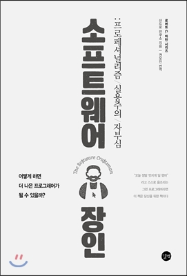
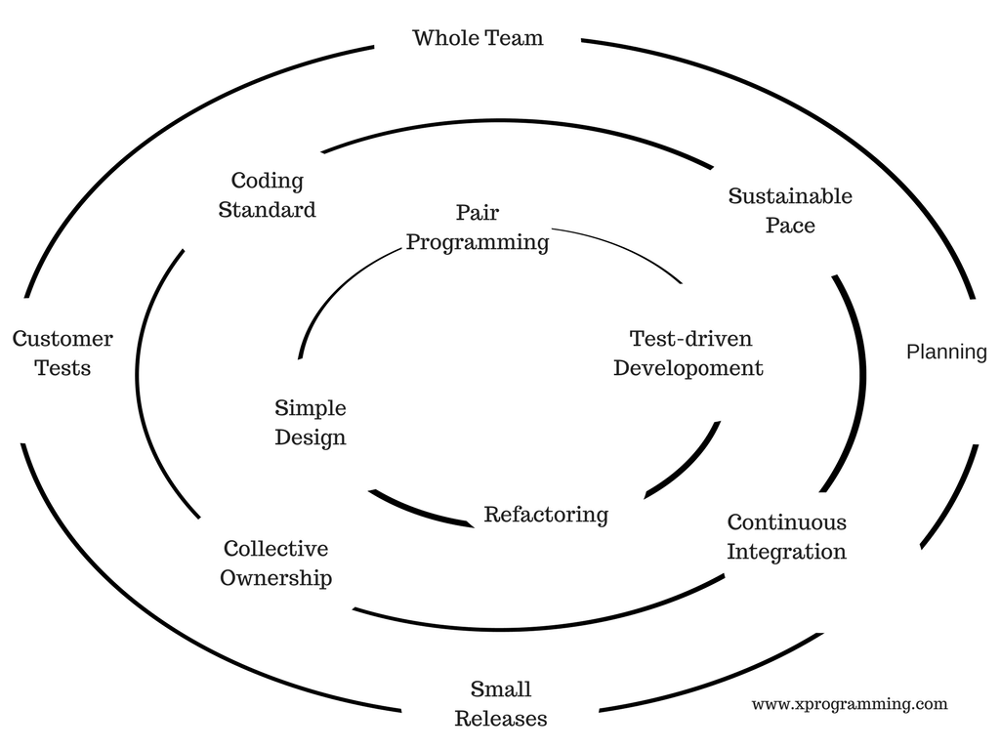

## 들어가며

최근 [산드로 만쿠소 님의 소프트웨어 장인](http://www.yes24.com/Product/Goods/20461940)이라는 책을 읽고 좋았던 문구들, 느낀 점들을 적어보려 한다.  
내용 정리라기 보단, 지극히 주관적으로 느꼈던 생각 위주의 글이 될 거 같다.

표지에 나와있듯 "더 나은 프로그래머"가 되기위해 고민하고 노력하는 사람들이 읽으면 좋을 책이다.

 

## 소프트웨어 장인과의 첫 만남

서문에는 다음의 내용이 등장한다.  
팀으로 합류한지 얼마 안 되어 빠르게 일을 마무리했다고 생각한 저자가 그의 상사 나무르에게 깨지는 내용이다.

> "이 코드가 얼마나 무례한지 알고 있습니까?" 그는 조용히 말했다. 코드는 겨우 200라인 남짓이었다.  
> 나무르가 제기한 문제들 에 답을 하지도, 적당히 되받아 치지도 못했다.
> 
> 충격에 휩싸였다. 아무 말도 없이 천천히 일어서서 문쪽으로 걸어갔다.  
> "산드로." 문에 다다랐을 때, 나는 멈춰 서서 그를 돌아봤다.  
> "일을 하는 것도 중요하지만 그에 못지 않게, 일을 어떻게 하느냐도 중요합니다."
> 
> ...
> 
> 담배 몇 개비로 마음을 안정시킨 후 무슨 일이 일어난 건지 되새겨 보았다.  
> 내게 시간을 들여 좋은 코드를 만드는 방법을 보여 주는 사람을 찾았다는 사실을 깨달았다.  
> 다른 사람들이 성장할 수 있도록 진심으로 도와주는, 나보다 더 나은, 훨씬 경험이 있는 누군가를 찾았다.  
> 더 훌륭하고, 더 높은 품질의 소프트웨어를 만드는 데 가치를 두는 사람을 찾았다.  
> 나를 가르치는 데 기꺼이 시간을 투자하는 사람을 만났다.  
> 10년도 더 지난 후에 그때가 소프트웨어 장인을 만난 첫 경험이었다는 것을 알았다.
> 
> \- 저자 서문 중

책을 열고 이 부분을 딱 읽는 순간, 왠지 모르게 가슴이 뜨거워졌다.  
좀 오바해서 말하면 눈물도 조금 낫다. 이유는 모르겠다.

> "일을 하는 것도 중요하지만 그에 못지않게, 일을 어떻게 하느냐도 중요하다."

이 책을 꿰뚫는 핵심 문장이다.  
그렇다. "그저 그렇게 일을 하는게" 아니라, "프로페셔널한 프로그래머로서" 일을 하는 것. 이런 사람을 소프트웨어 장인이라고 한다. 이는 삶과 커리어를 대하는 하나의 태도이자 정신이다.

어떻게 하면 더 나은 프로페셔널한 프로그래머가 될 수 있을까?  
프로그래머는 어떤 책임을 지어야 하는가?  
우리는 어떻게 일해야 하고, 그 방법은 무엇일까?  
이 책은 온통 이 얘기들로 가득하다.  
보는 내내 뜨거운 마음으로, 저자처럼 나도 열정적인 사람이 되야겠다는 생각이 들었다.

 

## 소프트웨어 장인 정신

> 소프트웨어 장인정신은 마스터가 되어가는 긴 여정이다.  
> 소프트웨어 장인정신은 소프트웨어 개발자가 스스로 선택한 커리어에 책임감을 가지고, 지속적으로 새로운 도구와 기술을 익히며 발전하겠다는 마음가짐이다.  
> 소프트웨어 장신정신은 책임감, 프로페셔널리즘, 실용주의 그리고 소프트웨어 개발자로서의 자부심을 의미한다.
> 
> \- 3장 소프트웨어 장인정신, p57 중

소프트웨어 장인은 쉽게 되는 것이 아니다. 의식하고 꾸준히 노력하며 훈련해야 한다.  
자기 자신을 "단순히 노동자"로 스스로를 생각하는 사람이 아니다. "자기 자신과 팀, 그리고 회사가 더 좋게 되도록 노력하는 소프트웨어 개발자"다.

> 내가 일하고 있는 회사에서 책을 사주지 않거나, 교육 프로그램이나 콘퍼런스에 전혀 보내주지 않는다면 어떻게 할 것인가? 우리가 새로운 것을 배우는 방법이 그것밖에 없을까?
> 
> 고객을 만족시키기 위한 투자는 스스로 해야 한다. 고객은 프로에게 좋은 서비스 및 최선의 방법으로 문제가 해결되기를 기대하며 대가를 지불한다. 고객은 교육이 아닌 그의 지식과 기술에 대한 돈을 지불하는 것이다.  
> 소프트웨어 프로페셔널로 대우받기를 원한다면 프로처럼 행동해야 한다. 스스로를 발전시키는 데 자신의 돈과 시간을 들여야 한다는 것이다.
> 
> \- 4장 소프트웨어 장인의 태도, p78 중

주위 환경 탓으로 돌릴 것이 아닌, 스스로의 역량과 시야를 강조하는 그의 말이 너무 멋있었다.  
그리고 나 역시도 늘 가져야 할 태도라고 생각했다.

 

## 4가지 독서의 범주

좋은 팀, 회사 이전에 자기 자신부터 더 나은 소프트웨어 개발자가 되도록 노력해야 한다. 자기 자신이 커리어의 주인이 되도록 생각하고 실천해야 한다. 이에 대한 여러 가지 학습 방법(독서, 자기 계발, 커뮤니티, 토이 프로젝트 등)들을 말하고 있는데, 난 그중에서 독서에 대한 내용이 가장 인상 깊었다.  
독서는 크게 다음과 같이 분류될 수 있다고 한다.

-   특정 기술에 대한 서적
    -   업무를 위해 어떤 프레임워크나 프로그래밍 언어 등의 이용 방법을 급하게 알아야할 때 필요하다.
    -   당장의 업무에는 유용하지만, 그 가치가 오래가지는 않는다.
    -   자바, Node.js, Hibernate 같은 기술책이 이 범주에 속한다.
-   특정 개념에 대한 서적
    -   새로운 개념이나 패러다임 또는 실행 관례들을 소개한다.
    -   커리어를 진전시킬때 필요한 기초를 쌓을 수 있는 책이다.
    -   당장 활용하기는 어렵고, 제대로 이해하고 습득하는 데 긴 시간이 필요할 때도 있다.
    -   하지만 그 개념 자체는 광범위하게 적용될 수 있는 일반적인 내용이다.
    -   TDD, DDD, OOP, 함수형 프로그래밍, 데이터베이스 모델 같은 것들이 있다.
-   행동양식에 대한 서적
    -   효율적으로 팀에서 일할 수 있게 안내하거나, 일반적인 상황에서 더 나은 프로페셔널이 될 수 있도록 조언한다.
    -   팀 동료나 고객 등 사람들을 어떻게 대하고 일정을 어떤 방식으로 관리하면 되는지 설명한다.
    -   애자일 방법론, 소프트웨어 장인정신, 린 소프트웨어 개발, 심리학, 철학, 경영에 대한 책들이 그러하다.
-   혁명적 서적(고전)
    -   일하는 방식이나 개인의 가치관을 바꾸는 책이다.
    -   소프트웨어 개발자라면 이미 읽어 보았음직한 것들로 일상적인 업무 중 대화에서도 그 내용이 흔하게 언급된다.
    -   실용주의 프로그래머(1999, 앤드류 헌트), 디자인 패턴(1994, GoF), 테스트 주도 개발(2002, 켄트 백) 등의 책들이 있다.

앞으로 읽어야할 책 리스트가 많은데, 위 분류를 생각하며 골고루 계획을 잘 잡아놔야겠다.

 

## 프로답게 일한다는 것

> 마음 깊은 곳에서는 인정과 명예를 원했다. 우리는 프로젝트를 구한 영웅으로, 불가능한 일을 해낸 사람으로 보이고 싶었던 것이다. 결국 그 모든 노력은 헛고생으로 끝났다. 우리는 전혀 프로답지 못했다. 한 번도 '아니오'라고 말하지 않았기 때문이다.
> 
> ...
> 
> 프로답게 행동하고 고객을 만족시킨다는 것이 고객의 요구사항을 모두 받아들이라는 뜻은 아니다. 고객이 무엇을 가장 필요로 하는지, 그것을 얻기 위한 최선의 방법을 도우며 조언하는 것이 우리의 일이다.  
> 의도한 대로 동작할 수 없거나, 실행 불가능한 무리한 일정에 대해서 "아니오"라고 답하는 것은 우리의 의무다.
> 
> \- 5장 영웅, 선의 그리고 프로페셔널리즘, p108, 123 중

저자는 젊은 시절, 우리는 해낼 수 있다라는 생각으로 말도 안 되는 프로젝트 일정에 팀원들과 함께 일을 한 경험이 있다고 한다. 야근을 하며 차에서 잠을 자면서 결국은 불가능을 해내는 영웅이 되고 싶었다고 한다.

지나고 보니, 이는 프로답지 않은 못하고 가슴 아픈 일이었다고 말한다. 일을 잘못하고 있었다고 말한다.  
불가능한 것을 해내는 영웅이 아니라, 현실적으로 "최선"의 대안을 줄 수 있는 프로가 되어야 한다고 한다.

 

## 기술적 실행관례와 실용주의

소프트웨어 장인정신은 "현재" 익스트림 프로그래밍(XP)의 기술 관례들을 활용한다.  
즉 TDD, 페어 프로그래밍, 리팩토링, 단순한 디자인, 지속적인 통합 등을 사용한다.

위에서 "현재" 라고 표현한 이유는, "늘 언제나, 그리고 앞으로도" 지금의 기술 관례를 따라야 하는 건 아니기 때문이다.

> 우리는 지속적으로 일하는 더 나은 방법을 찾고 고객을 만족시켜야 한다.  
> 그 결론이 TDD를 도입하는 것이라면 그렇게 해야 한다.  
> 언제든지 TDD보다 더 나은 가치와 더 빠른 피드백 루프를 줄 수 있는 다른 것이 있다면 그것을 TDD 대신 도입해야 한다.
> 
> 어떤 실행 관례를 도입했다고 해서 영원히 사용해야 하는 것은 아니다.  
> 소프트웨어 장인으로서, 우리의 일에 항상 최선의 기술, 도구, 절차, 방법론 그리고 실행 관례를 선택할 수 있도록 개방적인 사고방식을 가져야 한다.
> 
> 실행 관례에 대한 도입을 이야기하기 전에, 먼저 우리가 이루려는 것이 무엇인지 논의해야 한다.  
> 소프트웨어 개발/납품 절차 중에서 어떤 부분을 얼마만큼 개선하길 원하는가?  
> 이러한 것이 정의되고 나면, 그것을 달성하기 위해 어떤 실행 관례를 도입할지 말할 수 있다.
> 
> \- 7장 기술적 관례, p163 중

 

## 면접, 생산적인 파트너십 알아보는 방법

> 개발자는 면접을 볼 때 그 회사에 대해 파악할 수 있는 중요한 기회로 삼아야 한다.  
> 일자리를 구걸하는 입장이 아니라는 것을 기억해야 한다.  
> 비즈니스 협상을 하는 것이다.
> 
> \- 10장 소프트웨어 장인 면접하기, p201 중

좋은 소프트웨어 개발자를 뽑기 위해서는 면접에서 어떻게 해야 할까?  
반대로, 좋은 소프트웨어 개발자를 인정해주는 회사에 들어가려면 어떻게 해야 할까?  
좋은 소프트웨어 개발자를 구하는 회사에 좋은 소프트웨어 개발자가 합류한다면, 정말 생산적인 파트너십을 이루게 될 것이다. 이를 위해서는 양쪽 모두 서로에 대해 사전에 잘 알아야 할 것인데, 이에 대해 책에서 회사와 지원자의 관점 두 가지 모두 소개한다.

 

### 회사 입장에서의 관점

-   질문을 많이 하는 지원자를 우선시하는 것이 좋다.
    -   능력이 더 있다는 증거는 아니지만, 최소한 지원자 스스로 즐겁게 일할 수 있는 곳을 찾고 있다는 증거가 될 수 있다.
-   과거 수행한 프로젝트나, 성취한 사항들을 이야기할 때 얼마나 열정적이고 애착을 보이는가?
-   실패 사례에 대해 어떻게 표현하는가?
-   실패에 대한 책임감을 느끼는가 아니면 남 탓을 하는가?
-   잘못된 상황을 정상으로 되돌리기 위해 무엇이든 노력해본 적이 있는가?

 

### 지원자 입장에서의 관점

-   면접관이 흘려 말하는 이런저런 과장들은 모두 흘려듣는 게 좋다. 세부적인 요소들에 집중하면 진실이 무엇인지 힌트를 얻을 수 있다.
-   면접관들의 질문들은 대게 면접관이 중요하게 생각하는 것들을 반영한다. 그 팀에 합류했을 때 지원자에게 기대하는 것들을 담고 있다.
-   지원자의 반응은 당황스러운 상황에 어떻게 대처하는지를 보여준다.
    -   함께 일할만한 사람인지?
    -   대립적인 논쟁에서도 편안할 수 있는지?

특히 "회사 입장에서의 관점"은 나 자신을 돌아볼 때 유용한 거 같다.  
하기는, 내가 면접에 들어가도 저런 것들을 볼 거 같다.  
가끔 회고글을 올릴 때 저 항목들을 생각하며 주요 생각을 정리해가야겠다는 생각이 든다.

 

## 실용주의 장인정신

이 장에서는, 평소 궁금했던 비즈니스 상황 <-> 코드 퀄리티에 대한 이야기를 곳곳에서 다뤄준다.  
특히 TDD가 급박한 비즈니스 상황에서도, 정답일까? 에 대한 궁금증이 있었는데, 이러한 답변이 이 대목에서 등장한다.

> 테스트 주도 개발이 항상 필요할까  
> 실용적인 대답은 '아니다'다.
> 
> "TDD를 하면서 시장 타이밍을 맞추기에는 제품 개발 시간이 너무 부족하다."  
> "아직 무엇을 해야 할지 몰라서 잠재적인 투자자에게 시연하고 시장을 시험할 수 있는 걸 빨리 만들어 내야 하는 상황에서도 TDD를 해야 하나?"  
> TDD 회의론자나 스타트업 개발자들이 이렇게 말할 때가 있다.
> 
> 도구나 실행 관례를 선택할 때는 실제로 처한 맥락을 반드시 고려해야 한다.  
> 한 가지 안타까운 것은 것은 TDD에 능숙한 사람 중 그런 말을 하는 사람이 없다는 점이다.  
> 유능한 개발자라면 TDD 때문에 개발 일정이 지연되지 않는다. 그것이 진실이다.
> 
> \- 10장 실용주의 장인정신, p291 중

또 회사에서 프로젝트 코드를 만들어 놓은 후, 스스로 맘에 들지 않던 때가 꽤 있었다.  
이럴 때마다 "아 그냥 다시 리팩토링할 겸 뒤엎어 볼까?"라는 생각이 들었다.  
이에 대한 답변도 다음 대목에서 등장한다.

> 리팩토링을 위한 리팩토링은 시간낭비다.  
> 할 일이 없어서 시간이 남아도는 것이 아니라면, 특별한 이유도 없이 코드를 열어서 재정리하는 일은 아무런 의미가 없다. 실용적인 관점에서는 그저 시간 낭비일 뿐이다.
> 
> 새롭게 추가할 기능이 레거시 코드에 큰 영향을 준다면 사전에 영향이 가해지는 부분을 리팩토링하는 것이 바람직하다. 분명한 필요에 의해 시스템을 변경하고, 그 와중에 작은 리팩토링을 꾸준히 하는 것이 실용적인 관점에서 바람직한 애플리케이션 개선 방법이다.
> 
> \- 10장 실용주의 장인정신, p293 중

디자인 패턴을 생각하며 설계해아할까?라는 것에 대한 답변도 있다.

> TDD에 능숙한 개발자는 개발 초기부터 디자인 패턴을 적용하는 일이 극히 드물다. 테스트 코드는 비즈니스 요구사항을 맞추는 일이지 디자인 패턴에 맞추는 것은 아니다.
> 
> 디자인 패턴 자체가 나쁜 것은 아니다. 하지만 패턴이 먼저가 아니다. 문제에 적합한 리팩토링을 단순한 설계와 SOLID 원칙에 따라서 먼저 시도해야 한다.
> 
> \- 10장 실용주의 장인정신, p303 중

마지막으로, 이 장은 다음의 내용으로 마무리된다.

> 품질은 비싼 것이 아니다. "스킬 부족"이 잘 작성된 코드를 비싼 것으로 만드는 원인이다.  
> 장인으로서 우리의 역할은 특별히 이슈가 되지 않을 정도까지 품질 비용을 낮추는 것이다. 그렇게 하기 위해서는 좋은 실행 관례들을 마스터하고 실용주의적인 입장을 취할 필요가 있다.
> 
> \- 10장 실용주의 장인정신, p307 중

XP 실행 관례들을 공부하고, 훈련하며, 계속해서 새로운 것들을 학습해나가야 될 이유다.

 

## 나가며

지하철로 출퇴근하며 틈틈이 읽었던 책이다.  
책 모든 곳곳에 프로그래머라는 직업에 대한 열정, 사랑, 자부심, 그리고 같은 프로그래머들에 대한 연대 의식이 보였다.  
이런 사람이 내 근처에 멘토로 있었으면 좋겠다, 저 사람과 함께 일한 사람들이 참 부럽다는 생각을 하면서도, 그래도 책으로나마 같이 연대해주는 느낌을 주는 저자에게 고마웠다.

요즘 개발을 하며 더 올바르게 개발하는 법, 그리고 더 성장하는 법에 대해서 고민하곤 했다. 나름의 이런저런 공부도 시도해보지만 답답한 경우가 많았다. 이런 시행착오 자체가 두렵기도 했고, 알아주는 사람도 잘 없었기에 내가 올바르게 행하고 있나에 대해 자신감이 떨어질 때도 있었다. 그리고 그러는 와중에 점점 사기가 떨어질 때도 종종 있었다.

이 책은 그런 나에게 따스한 조언을 해주는 멘토의 책이었다. 소프트웨어 계에서 매우 유명한 로버트 마틴이나 마틴 파울러 같은 분들과는 다르게, 왠지 어딘가 소프트웨어 회사에 팀장으로 있을 것만 같은 사람이 쓴 느낌이 났다. 그래서 그런지, 나도 그 처럼 되고 싶다는 생각이 든다. 철저하게 깨져가며 배우고, 성장하고, 또 전파하고 장인 정신에 연대하는 사람이 되고 싶다.

글을 정리하는 이 시점에서는, 아직 내가 1년도 안된 신입이라 오로지 주니어 관점에서의 내용만 정리한 거 같다.  
훗날, 내가 팀장 정도의 위치에 오른다면 다시 한번 읽어보고 싶은 책이다.  
그때 가면 또 다르게 느껴질 것만 같다.