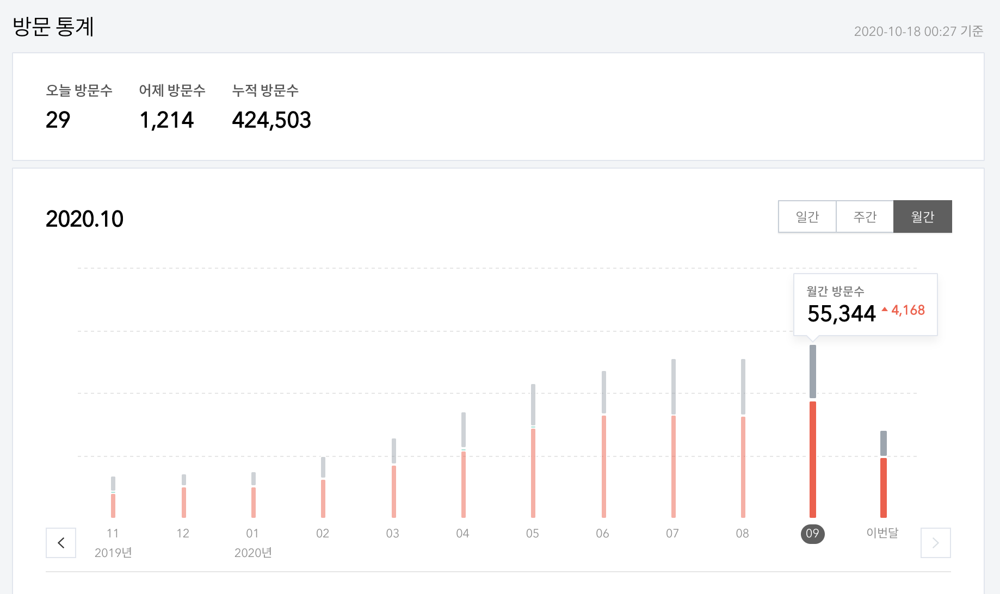

요즘 글을 안썼다.
이미 테크 블로그와는 거리가 멀어진 거 같아, 그냥 끄적거리는 글을 써도 괜찮을 거 같다.
고등학생 땐 싸이월드 다이어리에 이 시간쯔음 해서 이루펀트 - 졸업식 같은 갬성 힙합 들으면서 글 끄적거리곤 했는데.
지금 딱 그 감성인거 같다. 뭔가 일을 계속 하고 있으면서, 간간히 새벽이 되서야 적는 그런 글.

### 늘어난 블로그 글 조회수

블로그 글 조회수가 꾸준히 늘었다. 
이제 평일 방문수는 2000을 넘고, 누적 방문수는 40만을 찍었다.
딱히 테크 블로그도 아닌데, 꾸준히 유입되는 글 몇 개 때문에 방문수가 꾸준히 찍히는 거 같다.

근데 사실 조회수에 비해, 댓글 같은건 잘 안달린다.
싸이월드 투데이 수는 올라가는데, 방명록은 0인 그런 느낌이랄까. 
여하튼 쉽게 노출되는 만큼, 그 전만큼 글을 막 올리기 보단 좀 더 잘 정리해서 퀄리티 있게 내고 싶다는 생각이 든다. (이런 뻘글 제외)

한편, 퀄리티 정성을 낸 글을 쓰게 된다면 그 글을 이 블로그에 담을 지도 고민이다. 뻘 글이 워낙 많은 블로그라. 
처음에는, 플랫폼보다는 컨텐츠가 우선이지! 라고 생각해서 시작한 티스토리 였는데, 이제 나도 좀 더 괜찮은 다른 플랫폼으로 갈아타볼까라는 생각이 슬슬 들고 있다....

근데 사실 그 전에 내가 고퀄 글을 쓸만한 능력이 되야할 듯... 아직은... 배우고 정리할 게 너무 많다.

### 타이밍과 시간

취업하고 나서는 신났었다. 앞으로 나는 창창 올라갈 길만 남았구나. 내 실력을 키워 어디가서도 인정받고 아주 멋지게 살겠노라고.  
그렇게 마음의 안정감을 찾고나니, 주변이 하나 둘씩 눈에 다시 들어왔다. 무엇보다 부모님의 축처진 피부와 손이 눈에 들어왔다. 

"세대" 라는 말이 와닿았다. 자식들이 이제 막 사회에 하나 둘 취직하기 시작할 때, 부모님들은 이제 곧 퇴직하신다. 이 싸이클. 어느 가족에게나 예외는 잘 없을 것이다. 타이밍이란게 이렇다. 세대의 흐름이라는 순리가 이렇게 느껴진다.

아주 어렸을 때, 부모님은 내게 아마 가장 큰 사람이었을 것이다.  
학창 시절엔, 사회적으로 잘 클 수 있도록 만들어주는 든든한 서포터이자 중심이였고. 대학생과 취준할 때까지도 꾸준히 아침과 빨래를 해주시는 정말 "부모님" 이었다.

이제 퇴근 후, 간간히 부모님과 이야기하며, 그들의 젊은 시절에 대해 종종 물어본다. 생각보다 말씀이 많으시다. 현재 내 나이때 일하시던 것을 추억하며 말씀하시기도 하고, 말도 안되게 힘들었던 시절을 말씀해주곤 하신다. 참 다사다난한 삶이었던 거 같다. 
이렇게 말씀하는 걸 즐거워 하시는데, 지금까지 나 살기 바빠 부모님에게 이런 관심과 이야기도 들을 여유가 없었나 싶다.
이제 부모님을 한 '인간'으로 봄과 동시에, 내가 잘해주어야 할 애틋한 사람으로 보인다.
그리고 무엇보다, 이전에 별로 느끼지 못했던 "시간"이 그렇게 많이 남지 않았음을 절실히 느낀다.
내가 돈도, 시간도 더 벌어야 하는 이유다.

### 연애

내 마지막 연애는 작년 3월 쯤이니까, 일년 반정도가 지난거 같다.  
취준할 때는 정말 외로웠던거 같은데, 지금은 잘 기억이 안난다. 보통 독서실 알바 끝나고 새벽에 술로 달랬던 거 같다.

취업하고 나서는 소개팅도 몇 번 하고, 연애라고 하기 뭐한 짧은 만남도 있긴 했다. 근데 마음이 잘 안생겨서 였던 건지, 주말에는 거의 카페 가서 노트북 키는게 일상이었다. 하고싶은 공부가 있어서 그랬을까. 안 외로웠다면 거짓말이겠지만, 엄청나게 외롭진 않았다. 다만, 매번 똑같은 주말 패턴 (집 늦잠 & 밥 -> 할리스가서 할 일 -> 오버워치 -> 집 밥 -> 집에서 남은 할 일 -> 노트북으로 영화보고 잠) 인지라, 주말에 남들 다 연애하며 다채롭게 사는거 보면 조금 현타가 올 때도 있었다. 자꾸 혼자가 익숙해진다. 이러면 나중에 연애 못하는데.

주위를 둘러보면, 이제 짧게 만나는 친구들은 잘 없다. 알던 형, 누나들은 하나 둘 결혼하기 시작한다. 다들 어쩜 그렇게 잘 만나서 잘 연애하는 걸까. 주위에 흔하게 있는 현상이지만, 좀만 더 생각해보면 이렇게 남녀가 잘 만나는건 정말 신기한 일이다. 신기해.

사실 연애가 내 맘대로 되는 것도 아니니까, 뭐 딱히 더 어떻게 해보자는 그런 생각은 없지만... 하여튼 주위에 솔로는 점점 없어지고, 결혼 소식이 하나둘 들려오니 참 기분이 이상하다. 내가 나이 먹었구나 하는 생각이 이런 때에 든다.

### 운동

이제 다들 운동을 한다. 다들 퇴근하고 연애 아니면 운동을 한다.  
나도 한다. 취준생 때는 별 생각없이 했는데, 이제는 일하면서 퇴근 후에 꾸준하게 운동하는 사람들은 "진짜" 라는 걸 느낀다. 이렇게 피곤한데 다들 어떻게 그렇게 꾸준히들 한거냐고...

살. 더럽게 안빠진다. 근데 나이먹으면 더 안빠진다고 뺄거면 지금 빼랜다.  
맞는 말이다. 뺴자 살. 군대 막 전역하고 살 빼자고 다짐했던 그 때가 사실 제일 리즈였을줄을 누가 알았으리....

### 이것이 바로 20대 후반..?

이제 다들 "자신의 삶"을 산다. 자신의 일, 연애 그리고 건강을 챙긴다. 별거 없다. 다들 이러고 사는거 같다.  
대학생 때 같은 패기, 재미 그런거 잘 없다. 
그 때는 돈 만원이면 애들이랑 삼삼오오 모여 술먹었던거 같은데, 이제 술 한번 먹으면 인당 오만원씩 나온다.   
신촌이나 홍대보단 동네가 편해졌다. 동네에는 친구는 많이 없어졌다.  

나 역시도 내 할 일, 가족, 운동, 종종 있는 연애의 찬스를 가지고 산다.  
작년 가을 때까지만 해도 이렇게까지 느끼지는 않았는데, 뭔가 올해는 뭔가 변화한 느낌이 강하게 든다.  
그리고 20대 후반의 근 몇년 동안은 이렇게 적응하고 살 거 같다는 생각이 든다.

