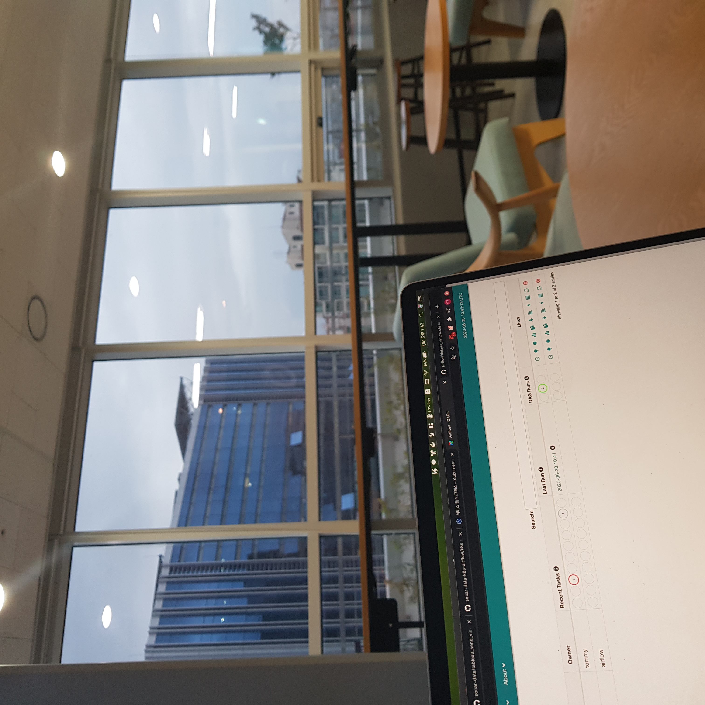
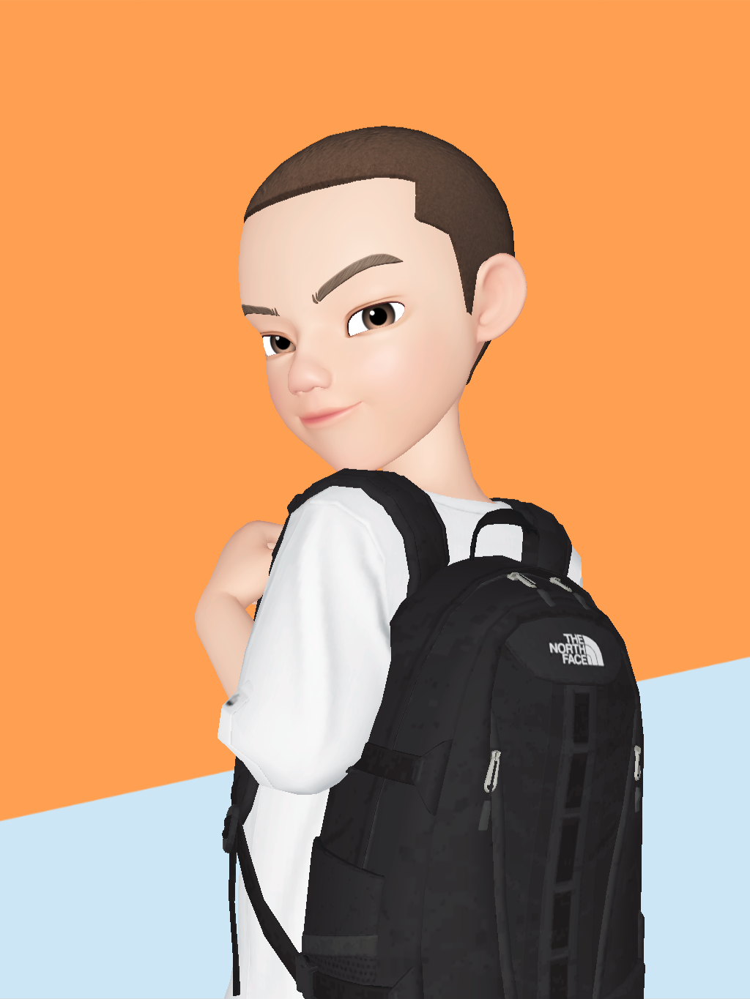
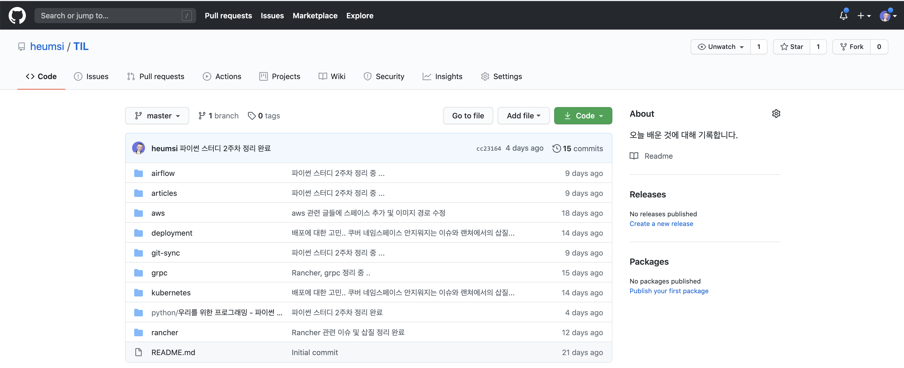

# 요즘 근황, 생각

이 글 처음 쓰려고 시작하던 때가 7월 5일인데, 다시 쓰려고 보니 7월 16일이 되어있다.  
시간이 미친듯이 빠르다... 😳

늦게나마 요즘 근황과 생각을 적어본다.

### 안정적인 직장 생활을 하고있다.

팀 내 나의 포지션이 그래도 조금씩 잡히고 있다.  
주로 파이썬을 이용한 시스템 개발 및 배포 쪽을 담당하고 있다.  
데이터 엔지니어링팀이지만, 파이프 라인 외에도 생각보다 다루는 범위가 많다.  
아무래도 데이터 그룹 소속이다 보니, 데이터 드라이븐 프로세스 개발은 우리 팀이 맡게 되는 거 같다.  
한편 나의 커리어를 생각해주어 팀에서도 일거리를 조금씩 주고있다.  
이전에 단순히 개발뿐 아니라, MSA 환경에서의 통신과 배포 과정까지. 덕분에 내가 해보고 싶었던 것들은 차근차근 해보고 있다.  

최근에는 다음의 기술 스택들을 다뤄볼 수 있었다.

- grpc
- 쿠버네티스에서의 배포와 helm chart
- rancher 를 통한 CI/CD 와 배포
- 쿠버네티스 에어플로우

배우는 건 어렵진 않지만 Best practice 를 알고 적재 적소에 활용하는 것은 어렵다.  
공부도, 경험도 여전히 많이 필요하다고 느껴진다...

한편 서비스 중심 회사라서 좀 더 기술 core 하게 가지는 않는다.  
기술을 빠르게 익히고, 빠르게 적용하고, 더 잘 수행할 수 있도록 설계해나가는 것이 중심이 된다.  
그러다 보니 테스크 하나 하나의 일정이 꽤 빠르다.  
도메인을 잘 이해하고, 스스로 능동적으로 요구사항들을 정의해 나가야할 때가 있다.  
짧은 기간 동안 MVP를 만들어 운영해보고, 새롭게 발생하는 수정 사항들을 빠르게 반영해나간다.  

물론 난 빠르게 개발해 나가면서도, 견고하고 유연하며 읽기 좋은 코드를 짜고싶다.  
앞으로 내가 꾸준히 갖춰야되는 덕목이라고 생각한다.

### 회사 동료 인턴들이 떠났다.

데이터 그룹의 인턴이었던 프로토, 레니, 샨짜이가 인턴 기간 종료로 인해 회사를 떠났다.  
비슷한 또래의 친구들이었고, 나도 취준시기에 인턴 생활해봤어서 그런지 더 마음이 가는 사람들이었다.  
티는 안나도 치열하게 살던 사람들이었을 것이다.  
쏘카에서 배우고 얻은게 의미있기를 바래본다.  
다들 원하는 대로 잘 되서 추후에 다른 자리에서 볼 수 있었으면 좋겠다.  
고생들 했다 😥 .... 👍

### 제페토 캐릭터를 만들었다.

우리 그룹의 슬랙에서 나만 실제 얼굴이 나오는 프사를 사용하고 있었다.  
나도 좀 괜찮은 걸로 바꾸고 싶었는데, 딱히 없어서 레니가 사용 중인 제페토를 이용해보기로 했다.
만드는데 레니가 많이 도와줬다.  

앞으로 여기저기서 잘 써먹을 예정이다.
땡스 투 레니.

### TIL 을 시작했다.

나 그저께 뭐했지? 이런거 생각해보면 잘 기억이 안난다.  
분명 회사에서 뭐 안되서 끙끙거리며 고민하고 그랬을텐데. 기억이 안나...   
치매도 아니고 억울해 ....

이런 고민과 시행착오의 흔적이 아까워서 TIL(Today I learned) 을 시작했다.  
[여기](https://github.com/heumsi/TIL) 깃허브 레포 있다.  

최대한 매일매일 일하거나 공부했던거 올려두려고 한다.  
그렇다고 뭐 일일커밋이나 그런거에 목매는건 아니고.. (난 일일커밋 그닥 의미가 크다고 생각하진 않는다.)  
암튼 블로그에 올리긴 그렇고, 그냥 로컬에 기록해서 두기엔 뭔가 흔적이 안남는거 같은 이 아쉬움을 TIL 로 풀어본다.

비슷하게 blog 라는 레포도 만들어뒀는데, 이 블로그의 글들을 이 레포에서 관리할 거 같다. 
TIL 에서 이것저것 정리한 뒤, 좀 엮어서 내보낼만한 글들은 blog 로 보낼 예정이다.
그리고 이 blog 레포에 올라온 글은, 다시 티스토리 블로그에 올릴 예정...  

한편, 언제까지 티스토리 쓸지 모르겠다는 생각이 요즘애 점점 든다.  
그냥 점점 일기장이 되어가는 거 같다는 생각도 들고...  
테크 블로그용으로 하나 만들까 생각도 들고...  
아무튼 백업 대비용으로 이 레포를 잘 관리해놔야겠다.  

### 노션으로 테스크 관리를 해야겠다.

노션.

회사에서 업무 관리용으로 노션을 쓰는데, 나도 좀 내 공부/스터디 등 테스크 관리용으로 노션을 좀 써봐야 겠다.  
노션 사용법도 좀 익힐겸.

노션으로 이런 것들을 해보고 싶다.

- 출퇴근길에 종종 보는 아티클들 보고 내 식대로 정리해두기.
  - 어릴 때 신문스크랩 같은거 하던 느낌으로.
  - 아티클 읽고 그냥 그렇구나~ 하고 넘어가지 말고, 간단히 내용 요약, 새로 알게된 점, 느낀점 등을 정리해두면 한 번 더 머리에 남을 거 같다.
- TODO 리스트 정리
  - 올해 공부하고 싶은 것들이 있는데, 공부 계획을 안세우고 생각만 하다보면 어느샌가 올해가 훅 지나가 버릴거 같다.
  - 기록 하다보면, 좀 더 구체적으로 해야할 일들을 정의하고 수행해나갈 수 있을거 같다.
- 이 외에도.. 더 하고싶은 것들이 생기지 않을까..?
- 내가 쓰는 Typora 에디터는 그냥 메모장으로, 문서 관리는 노션으로 둬도 괜찮겠다 싶다!

아무튼. 말만하지 말고, 해야겠다. 하자. 하자!!!! 하자!!!!!!!!

---

벌써 7월 중순이다.  
회사에서 맡은 일은 나에게는 챌린저블하지만 재미있고 긴장되며,  
여전히 나는 공부해야할게, 하고싶은게 너무나 많다.  

과연 올해 말에 나의 한 해를 회고를 하게 될 때, 나는 얼마나 바뀌어 있으며 무슨 말을 하게 될까.   
그 떄 생각해서 부끄럽지 않게 열심히 살자 🔥