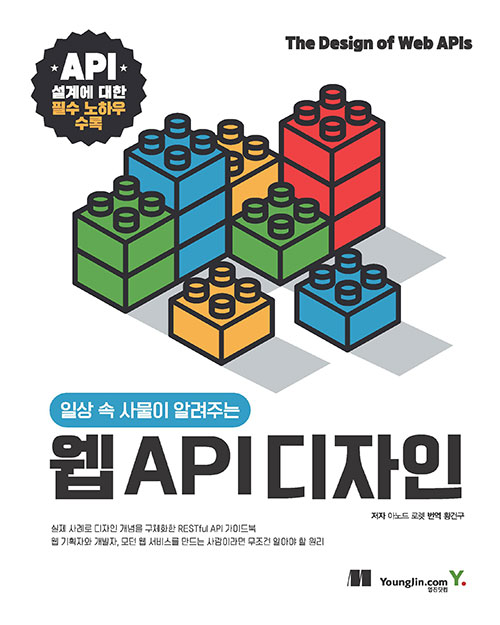
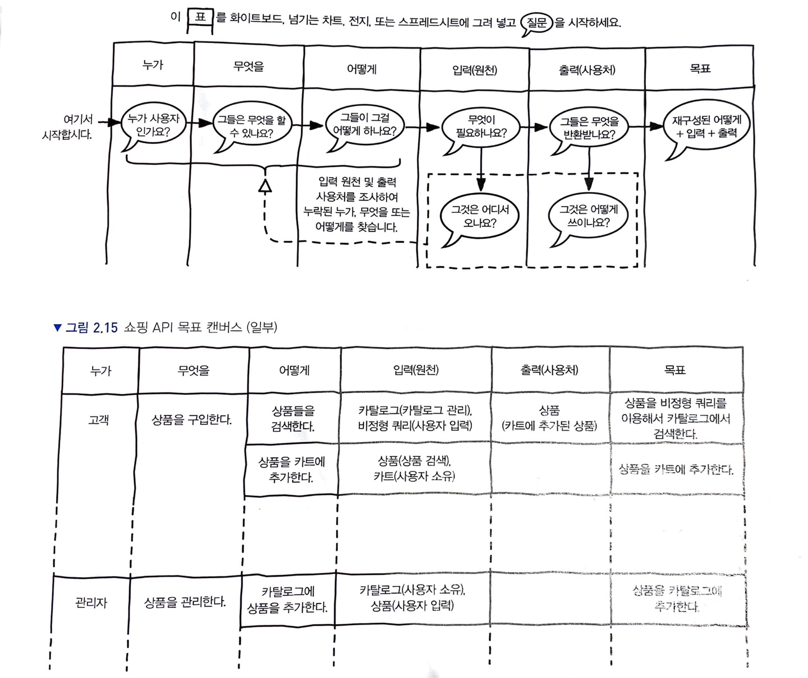
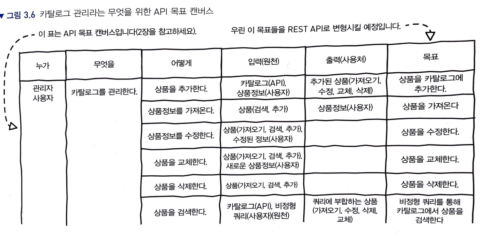

## 배경

지난 일 년동안 회사에서 몇 개의 마이크로 서비스 서버를 개발하고 운영해볼 기회가 있었다. 이미 돌고있는 레거시 서버 코드를 걷어내고 새로 짜는 일이었어서 통신 인터페이스에 대해서는 사실 내가 바꿀 수 있는게 거의 없었고, 따라서 별로 고민해보지도 않았었다.  

그런데 실제로 운영해보니 모니터링 용도로 연동해놓은 슬랙 채널에 생각치도 못한 로그들이 등장했다. 클라이언트 쪽에서 우리가 정의한대로 요청을 제대로 하지 않는 경우가 종종 있던 것이다. 예를 들면  `string` 형태로 담겨있어야 할 요청 값이 `bool` 형태로 넘어와 이에 대한 에러로그가 있었다. 지금와서 생각해보면 이런 요청은 `400` 이나 `422` status를 내보내야하는건데, 개발 당시에는 이에 대한 고려 없이 `500` 에러를 내보냈던 것이다. status code에 대해 잘 몰랐고, 그냥 프레임워크가 제공해주는 기본 설정을 따랐던 것 같다.

또 한편으론 서버의 응답을 받아 사용하는 분들은 정보가 더 필요하다며 JSON 리스폰스 바디에 이런 저런 내용을 더 추가해달라는 요청을 했다. 이 때마다 리스폰스 바디는 덕지덕지 커졌으며, 나중에는 추가할 내용을 어디에 넣을지 고민이 생기기 시작했다. 그리고 어느 순간부터는 초기 설계가 뭔가 잘못되어 있음을 깨달았다.

결국 "올바른 인터페이스는 어떤 것이고 어떻게 설계하는 걸까?" 에 생각이 다다랐다. 그 유명한 REST에 대해서 구글링해봐도 뭔가 속시원한 예시가 없었다. 제시해주는 모범 예시가 다른 경우도 있었다. 그래서 결국은 책을 찾게되었다. 회사 동료인 카일에게 이전에 했던 "일상 속 사물이 알려주는 웹 API 디자인"을 읽게 되었다. 

이 글은 책을 읽고 내게 인상 깊었던 것들만 정리하여 남기기 위한 글이다. 책에는 API 디자이너 관점에서 이런저런 친절한 설명이 많이 나오는데, **나는 개발자 관점에서 궁금했던 것들 위주로만 정리해본다.** 

> 한 페이지 내에 다 작성해보려 했는데, 생각보다 길어졌다...  
> 해야지 해야지 하다가 계속 밀리기도 하고, 이러다가 아예 안할거 같아서 여러 편에 걸쳐 글을 써보겠다.

---

## API 설계는 어떻게 해야하는 걸까?

책에서 말하는 **API 목표 캔버스**는 이러한 고민을 어느정도 해소해주는 도구다.  
아래 그림을 보자.

위에 있는 테이블이 API 목표 캔버스이고 아래 있는 테이블은 그 예시다.   
아래 설명을 보고 예시를 다시 보면 좀 더 잘 이해가 될거 같다.

1. **사용하는 사람 입장에서 무엇을 하고 싶은지**를 한 문장으로 정의한다.
    - 문장은 "누가" "무엇을 한다"로 구성한다.
        - ex. "고객"이 "상품을 구입한다."
    - 이 문장은 사용자 입장에서 원하는 커다란 하나의 기능사항이다.
    - 사용자 스토리라 부르는 것과 같은 듯 하다.
2. 이제 **이 스토리의 구체적인 단계**에 대해 사용자 관점에서 작성한다.
    - 각 단계는 "어떻게"로 구성되며 "어떻게" 역시 하나의 문장으로 구성한다.
        - ex. 고객이 상품을 구입하려면 다음의 과정을 거쳐야 한다.
            1. 상품들을 검색한다.
            2. 상품을 카트에 추가한다.
    - "어떻게"는 유즈케이스라 부르는 것과 같은 듯 하다.
3. "어떻게"를 진행하기 위해 **어떤 입력이 필요하고 무엇을 출력해줄지**에 대해 작성한다.
    - 입력은 어디에서 오는지(원천), 반환 값은 어디에서 사용될지(사용처)도 작성한다.
        - ex. 상품들을 검색하는 경우
            - 상품들(카탈로그)은 카탈로그 관리 목록으로부터 온다.
            - 검색은 비정형 쿼리로 하고, 이는 사용자 입력으로부터 온다.
    - 구체적이 목표를 작성한다.
        - ex. 상품 검색의 경우, "상품"을 "비정형 쿼리"를 이용해서 "카탈로그"에서 검색한다가 된다.
4. 입력의 원천과 출력을 조사하여 **누락된 "누가", "무엇을" 또는 "어떻게"를 찾는다.**
    - 찾은 것들을 가지고 다시 1~4을 반복한다.
        - ex. 위의 경우, "카탈로그"가 어디서 오는지 명시되어 있지 않다.
        - 따라서 "카탈로그"가 어떻게 추가 및 관리되는지를 생각해본다.

위 과정을 거치면 아래와 같은 API 목표 캔버스가 어느정도 작성된다.

API 목표 캔버스에서 중요한 점은 

- 아무튼 간 **사용자 입장에서부터 생각을 시작해보라는 것**과
- **핵심이 되는 사용자 스토리, 유즈 케이스**부터 하나씩 채워나가라는 것

이다.

대체로 막연한 상태인 **처음부터 모든 목표를 완벽하게 식별할 수는 없다.** 그러니 사용자 관점에서 **중요한 스토리들부터 하나씩 식별**하고, 식별된 "어떻게" 의 입출력의 원천과 사용처를 통해 **하나씩 누락된 것을 찾아나가야 한다.**

