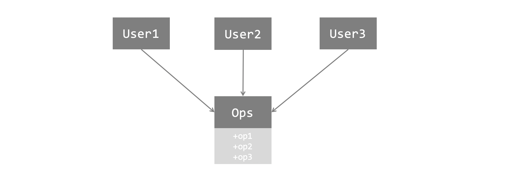
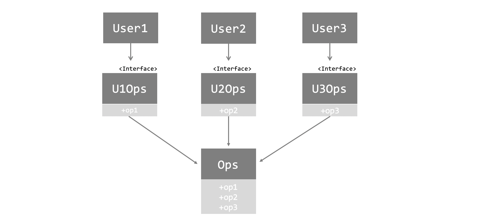

이 글은 [로버트 C. 마틴의 클린 아키텍처](http://www.yes24.com/Product/Goods/77283734)를 읽고 나름대로 중요하다고 생각한 부분만 정리한 글이다.

<br>

## 들어가며

3부 설계 원칙에서는 SOLID 원칙에 대해서 다룬다.
SOLID 원칙은 과거 몇 년 동안 수차례 여기저기서 언급되고, 이미 너무나 유명한 원칙들이기 때문에, 책에서는 SOLID 원칙이 무엇인지 처음부터 친절히 설명해주지는 않는다. 다만, **각 SOLID 원칙을 하나씩 다시 되짚어 보며 각 원칙이 지니는 핵심 의미를 다시 살펴본다.** SOLID 원칙을 처음 정립한 사람에게, 수 년 뒤에 다시 듣는 SOLID 원칙의 핵심 의미라... 꽤나 의미 있지 않을까?

밥 아저씨가 말하는 SOLID 원칙의 전반적인 의미는 다음과 같다.

- SOLID 원칙은 **함수와 데이터 구조를 클래스로 배치하는 방법, 그리고 클래스 간 결합하는 방법**을 설명해준다.
- SOLID 원칙의 목적은 중간 수준의 소프트웨어 구조가 아래와 같도록 만드는데 있다.
    - **변경에 유연**하다
    - **이해하기 쉽다.**
    - 많은 소프트웨어 시스템에 사용될 수 있는 **컴포넌트의 기반**이 된다.

여기서 중간 수준이라 함은 "모듈 수준"에서 작업하는 경우를 말한다. 내가 이해하기론, 클래스 그리고 이 클래스들을 위치시키는 모듈 정도의 범위를 말하는 것 같았다. 이해하기 어렵다면, 일단 그냥 클래스 정도로 이해하면 될 듯 하다.

클린 코드가 건물을 짓기 위한 좋은 벽돌이라면, SOLID 원칙은 이 벽과 방에 올바르게 벽돌을 배치하는 방법을 알려주는 원칙이라고 볼 수 있다.

<br>

## SRP : 단일 책임 원칙

SRP는 흔히 "하나의 모듈, 하나의 함수는 단 하나의 일만 해야한다." 라고 알려진 경우가 많다. 사실 나도 책을 알기 전까진 SRP 을 말하는 여럿 설명 중 이 한 마디가 제일 와닿았다. 그런데 밥 아저씨는 이는 코드를 리팩토링 할 때 사용되는 저수준 레벨의 원칙이며, SRP 원칙 그 자체는 아니라고 말한다.

SRP 원칙에 대해 이런저런 설명이 있지만, 밥 아저씨가 말하는 SRP 의 최종 버전은 다음과 같다.

> 하나의 모듈은 하나의, 오직 하나의 액터에 대해서만 책임져야 한다.

여기서 **액터란 이해 관계를 가진, 변경을 요청하는 집단**을 말한다.
예를 들면, 급여 애플리케이션을 회계팀, 인사팀, 기술팀이 사용한다고 하자. 여기서 액터는 이 세 집단이 된다.
SRP 원칙대로라면 **코드는 단일 액터만을 책임질 수 있도록 묶여야 한다.** 위 예의 경우, 각 회계팀, 인사팀, 기술팀 별로 클래스 혹은 모듈을 나누는게 된다. 

사실 클래스가 여러 개로 나눠지면, 클라이언트 쪽(클래스를 사용하는 쪽) 입장에서는 알아야될 클래스가 많아진다. 클라이언트는 액터보다, 유저의 행동에 따라 로직을 짤 수 있기 때문이다.
이럴 때는 **퍼사드 패턴으로 액터를 외부로 숨길 수 있다.** 

>  이 구조를... 왠만하면 그림을 그려서 표현하고 싶은데, 지금 그림을 그릴 수가 없으므로.... 코드로 나마 표현해본다. (나중에 아이패드 사면 제대로 그려서 수정할 예정...)

```python
# 기본적으로 액터에 따라 클래스(모듈)를 나눈다.

class PayCalculator:
    """회계팀이 사용한다."""
    def calculate_pay():
        pass
 
class HourReporter:
    """인사팀이 사용한다."""
    def report_hour():
        pass

class EmployeeSaver:
    """기술팀이 사용한다."""
    def save_employee():
        pass
```

위 처럼 3가지 클래스가 있다면, 클라이언트는 3개 클래스를 다 알아야 사용할 수 있다.
그런데 다음 처럼 Facade 용 클래스를 만들면, 클라이언트는 3개의 클래스를 몰라도 하고 싶은 "행동" 위주로 로직을 진행할 수 있다.

```python
class EmployeeFacade:
    def __init__(self):
        self.pay_calculator = PayCalculator()
        self.hour_reporter = HourReporter()
        self.employee_saver = EmployeeSaver()
    
    def calculate_pay(self):
        self.pay_calculator.calculate_pay()
        
    def report_hour(self):
        self.hour_reporter.report_hour()
        
    def save_employee(self):
        employee_saver.save_employee()
```

다시 SRP로 돌아가서... 사실 나는 프로그래밍할 때 "여러 액터" 를 고려하는 경우는 별로 없었다. 내가 위 예처럼 회사에서 사용하는 급여 관리 시스템을 짜본 적은 없으니깐 말이다.

그럼에도, "액터" 라는 표현이 되게 신경쓰인다. 꼭 시스템을 사용하는 집단이 사람이 아닐 수도 있다. 그건 또 다른 시스템 집단일 수도 있고, 다른 클래스일 수도 있겠다는 생각이 든다. 

**"무엇이 액터인가?" 그리고 "액터가 책임질만한 범위로 코드를 분리했는가?" 를 늘 생각해봐야 한다**는 점이, 이번 SRP 원칙에서 내가 느낀 교훈이었다.

 <br>

## OCP : 개방 폐쇄 원칙

개방 폐쇄 원칙은 다음과 같이 알려져있다.

> 소프트웨어 개체는 확장에는 열려 있어야 하고, 변경에는 닫혀있어야 한다.

OCP의 목표는 다음 두 가지라고 말한다.

- 확장하기 쉽도록 만든다.
- 변경으로 인해 시스템이 너무 많은 영향을 받지 않도록 한다.

이를 위해 다음 두가지를 잘해야 한다.

- 시스템을 **컴포넌트 단위로 분리**하고
- 저수준 컴포넌트에서 발생한 변경으로부터 고수준 컴포넌트를 보호할 수 있는 형태의 **의존성 계층구조**가 만들어지도록 해야한다.

즉, "의존성"과 "책임" 을 생각해서 잘 분리하고 잘 결합하라는 말이다.
다시 말해, SRP와 DIP가 잘 되어있으면 OCP도 잘 지킬 수 있다.

<br>

## LSP : 리스코프 치환 원칙

리스코프 치환원칙은 사실 조금 명제가 길다.  
그래서인지 직관적인 이해가 닿지 않는데, 내가 이해한 식대로 표현하면 다음과 같다.

> 추상 클래스의 서브 타입 클래스들은 서로 치환가능해야 한다.

여기서 추상 클래스라 함은 직관적으로 인터페이스를 떠올리면 되고, 서브 타입 클래스들은 이 인터페이스를 구현하는 클래스들이라 생각하면 된다.  
서로 치환 가능하다는 말은, 추상 클래스 A의 서브타입 클래스 B를 쓰다가 A의 서브타입 클래스 B로 코드를 바꿔도 코드를 실행하는데 문제가 없어야 함을 말한다.
즉, **애초에 인터페이스와 상속 관계를 잘 생각하여 코드를 짜면 LSP 원칙은 잘 지키는 셈이다.**

OOP 에서는 이게 클래스 수준이었다면, 아키텍처에서 이는 모듈, 서비스, 컴포넌트 단위가 된다. 예를 들면 REST 서비스에서는 URI가 일종의 인터페이스가 된다. 즉 통신하는 하위 서비스들은 이 URI 양식을 지켜야 한다.

보통 자주 변하는 세부적인 것들이 서브 클래스의 개념이 되는데, 이 때 **서브 클래스간 치환이 가능한가?** 를 생각하자. 만약  어떤 서브 클래스가 치환이 안된다면, 이 서브 클래스는 이 추상클래스에 속하는 개념이 아닐 수 있다.

<br>

## ISP : 인터페이스 분리 원칙

일반적으로 인터페이스 분리 원칙은 다음과 같다.

>  자신이 사용하지 않는 메소드에 의존 관계를 맺지 않고 분리 시켜야 한다.

다음 예를 보자.



`User1`은 `op1`을 사용하고,  `User2`는 `op2`를, `User3`는 `op3` 를 사용한다. 그런데 이 메서드들은 모두 `Ops` 라는 클래스 한 곳에 모여있다. `User1` 입장에서는, 사용하지 않을 메서드가 `Ops` 에 다 모여있는 꼴이다.

ISP 를 적용하면 다음과 같이 된다.



이제, 각 클래스는 자기가 사용하는 메서드만 가지고 있는 객체(인터페이스)를 사용한다. 
이렇게 분리시켜 놓으면, 훨씬 유연하고 결합도가 낮아지게 된다.
또한 불필요한 컴파일과 재배포를 막을 수 있다.

여기서 얻을 수 있는 교훈은 "불필요한 점을 실은 무언가에 의존하면 예상치 못한 문한 문제를 일으킬 수 있다"는 것이다. **내가 짜고 있는 코드나 컴포넌트가 불필요한 의존관계를 가지고 있지는 않은지 늘 경계하자.**

<br>

## DIP : 의존성 역전 원칙

의존성 역전 원칙이 추구하는 방향은 다음과 같다.

> 의존성은 추상에 의존해야 하며, 구체에 의존하지 않아야 한다.

이 규칙을 완전히 지키는 것은 비현실적이다. 소프트웨어 시스템은 분명히 구체적인 많은 장치에 의존하기 때문이다.  
**우리가 의존하지 않도록 피하고자하는 것은 "변동성이 큰" 구체적인 요소다. 그리고 이 구체적인 요소는 우리가 열심히 개발하는 중이라 자주 변경될 수 밖에 없는 모듈들**이다.

안정된 아키텍처는 변동성이 큰 구현체에 의존하는 일은 지양하고, 안정된 추상 인터페이스에 의존해야 한다.  
조금 더 구체적인 실천법은 다음과 같다.

- 변동성이 큰 구체 클래스를 참조하지 말자.
    - 대신 추상 인터페이스를 참조하자.
- 변동성이 큰 구체 클래스로부터 파생(상속)하지 말자.
- 구체 함수를 오버라이드 하지 말자.

모두 의존성을 높이지 않기 위함이 목적이다.
앞으로 살펴보면 알겠지만, DIP는 클린 아키텍처에서 가장 눈에 드러나는 원칙이 된다.

