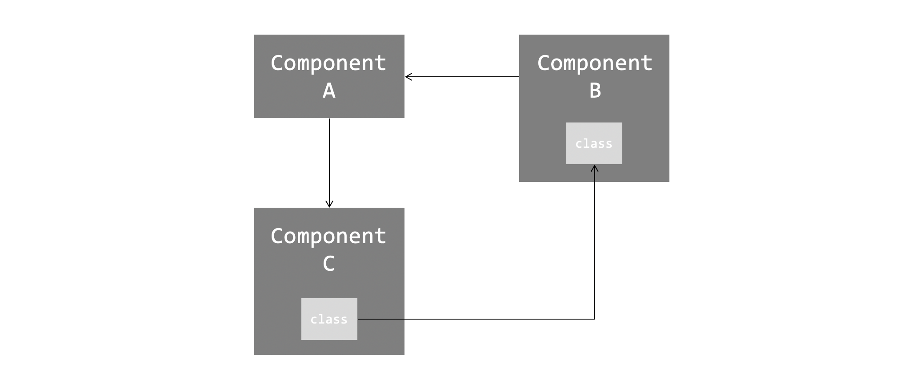
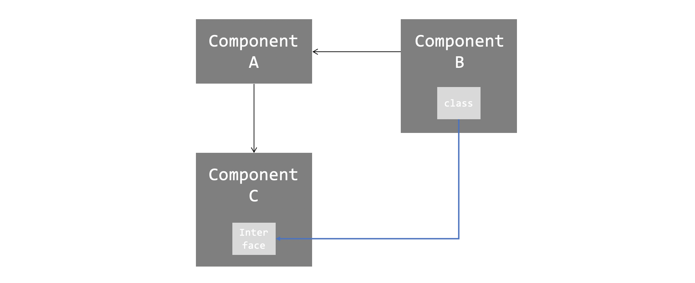
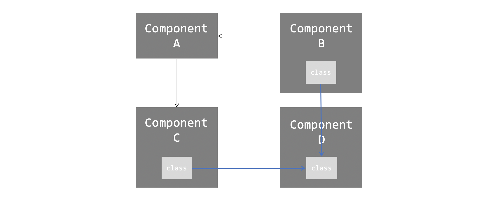
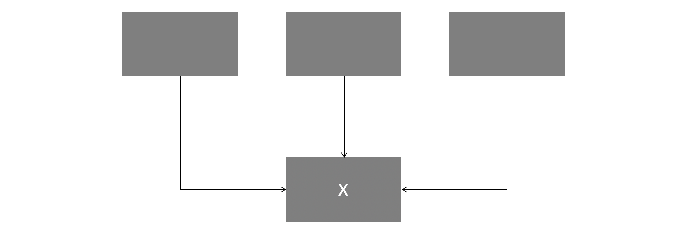
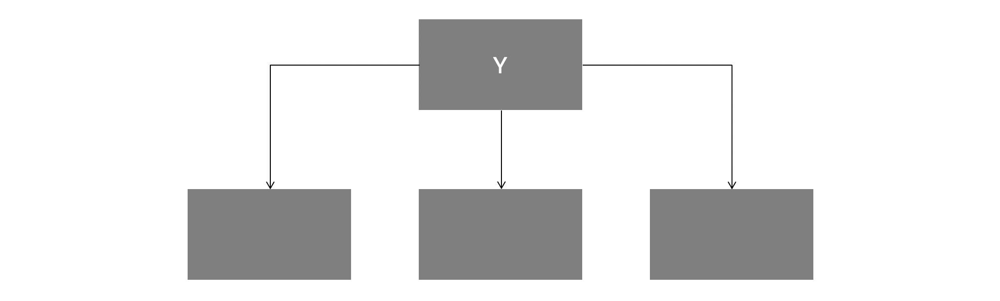
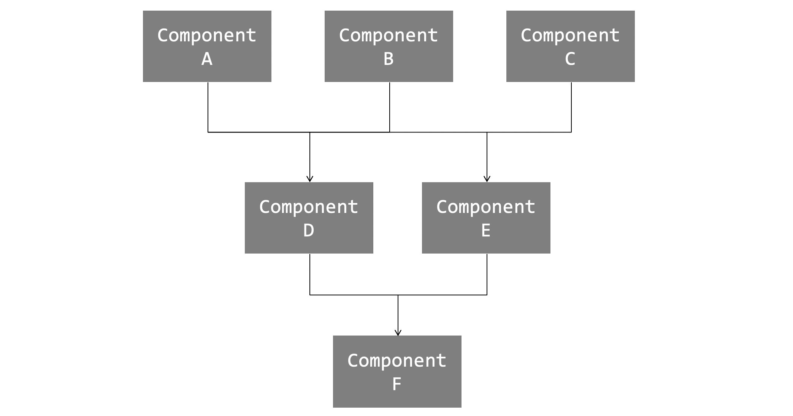
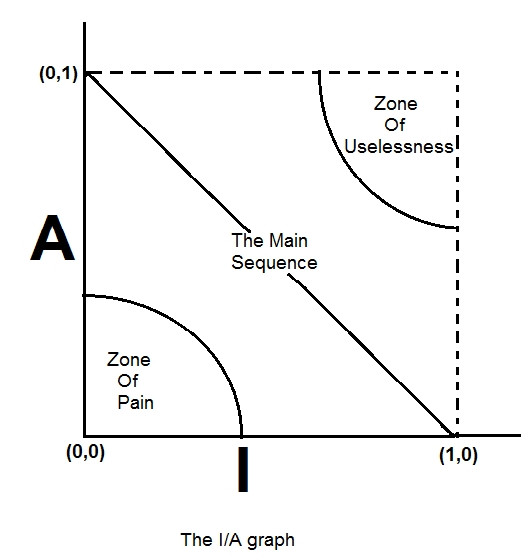
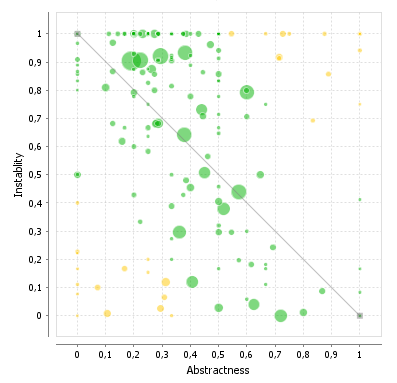

이 글은 [로버트 C. 마틴의 클린 아키텍처](http://www.yes24.com/Product/Goods/77283734)를 읽고 나름대로 중요하다고 생각한 부분만 정리한 글이다.

 

## 들어가며

이전 부서에서 SOLID 원칙이 벽과 방에 벽돌을 배치하는 방법을 알려준다면, 컴포넌트 원칙은 빌딩에 방을 배치하는 방법을 알려준다. 큰 빌딩과 마찬가지로, **대규모 소프트웨어 시스템은 작은 컴포넌트들로 만들어진다.**

 

## 컴포넌트

**컴포넌트는 배포 단위다.** 시스템의 구성 요소로 배포할 수 있는 가장 작은 단위다.  
라고, 책에 써져있기는 한데. 솔직히 말해서 이게 무슨 말이지 싶었다. 배포 단위면 컨테이너 이미지 정도를 말하는 건가?  
솔직히 말해 나는 와닿지 않아, [CBD에 관한 글](https://boxfoxs.tistory.com/401)을 참고하며 이해했다.

내가 생각한 컴포넌트는 "사용 가능한 단위"다. 즉 실행 가능한 소스 코드 뭉치고, 이를 사용할 수 있는 인터페이스가 있다.  
예를 들어 **어플리케이션과 데이터베이스, 코드에서 사용하는 써드파티 라이브러리는 각각 독립된 컴포넌트들**이다.  
또, 하나의 시스템을 **Main, View, Controller, Database, Entity 등 여러 독립된 컴포넌트로 분리**시킬 수 있다.  

잘 설계된 컴포넌트는 독립적으로 개발, 배포가 가능해야하며 어떤 컴포넌트가 다른 컴포넌트를 사용할 때 **"플러그인"**처럼 사용할 수 있어야 한다. 즉 두 컴포넌트는 완전히 독립적이고, 언제든지 갈아끼울 수 있는 형태임을 말한다.

 

## 컴포넌트 응집도

**어떤 클래스를 어느 컴포넌트에 포함시켜야 할까?** 클래스나 모듈을 어디에 위치시키고 정의할 것인지는 꽤나 중요한 문제다. 다음 원칙들은 이러한 결정에 도움을 준다.

 

### REP : 재사용/릴리스 등가 원칙

REP는 Reuse/Release Equivalence Principle 의 약자로, 정의는 다음과 같다.

> 재사용 단위는 릴리스 단위와 같다.

쉽게 말해, 배포할 때 `0.0.1` 과 같은 "릴리스 번호"가 있어야 하고, 이게 곧 컴포넌트를 사용하는데 기반이 된다는 말이다.  
당연한 말이다. `0.0.1` 일 때 컴포넌트와 `0.0.2` 일 때 컴포넌트가 다를 수 있기 때문이다. 따라서 이 컴포넌트를 사용하는 개발자 입장에서는 이 릴리스 번호를 알아야 한다.

이 원칙에서 교훈은 **"컴포넌트를 잘 분리하고, 재사용을 위해 릴리스 버전 관리를 잘하자"**는 것이다.
뭐... 당연한 말인듯 싶고... 이 원칙만으로는 "그래서 클래스와 모듈을 어떤 컴포넌트에 묶어야 되는데?" 라는 구체적인 방법은 얻을 수 없다. 하지만 이 원칙을 지키지 않는다면 쉽게 발견할 수 있고, 나머지 두 원칙을 통해 좀 더 자세한 구체적인 방법을 얻을 수 있다.

 

### CCP : 공통 폐쇄 원칙

CCP는 Common Closure Principle 의 약자로, 정의는 다음과 같다.

> 동일한 이유로 동일한 시점에 변경되는 클래스를 같은 컴포넌트에 묶어라.
> 서로 다른 시점에 다른 이유로 변경되는 클래스는 다른 컴포넌트로 분리하라.

이 원칙은 SRP 원칙을 컴포넌트 관점에서 다시 쓴 것이다.  즉 클래스와 모듈을 어떤 컴포넌트에 묶지? 에 대한 생각이 들면, 이 클래스와 모듈의 **"액터"**를 생각하면 된다. "액터"가 너무 추상적이라 느껴진다면 그냥 **"같은 이유로 변경될 가능성이 있는 클래스는 모두 한 곳으로 묶어라"** 정도로 이해해도 되겠다.

CCP의 Closure는 OCP의 Close와 같은 의미다. 즉, 변경 사항이 생겼을 때 그 여파를 최소화 시키기 위해 우리는 전략적으로 폐쇄(Closure) 해야하며, 클래스 단위에서는 OCP, 컴포넌트 단위에서는 CCP가 그 기반 원칙이 된다.

 

### CRP : 공통 재사용 원칙

CRP는 Common Reuse Principle 의 약자로, 정의는 다음과 같다.

> 컴포넌트 사용자들을 필요하지 않는 것에 의존하게 강요하지 말라.

이 원칙은 ISP 원칙을 컴포넌트 관점에서 다시 쓴 것이다. 클래스와 다르지 않다. 컴포넌트 역시 **없어도 될 의존성(필요하지 않은 것)을 컴포넌트 사이에 두지 않도록 분리**해야 한다.  
이 원칙을 생각하며 클래스와 모듈을 위치시키다보면, 같이 사용되는 클래스와 모듈은 같은 컴포넌트에 묶이게 된다. 그래서 CRP를 다른 말로 **"같이 재사용되는 경향이 있는 클래스와 모듈들은 같은 컴포넌트에 포함해야 한다."**가 된다. 공통 재사용(Common Reuse)의 의미가 바로 이것이다. 

 

### 정리와 내 생각

책에 등장하는 "컴포넌트 응집도에 대한 균형 다이어그램" 부분은 이 글에서 생략했다.  
전반적으로 내가 아직 경험이 별로 없어서 그런지 별로 와닿지가 않는다. 위에 나름 정리해두긴 했지만, REP, CCP, CRP가 당연한 말을 하는 것 같고, SOLID 원칙에서 말하고자 하는 것과 별로 달라보이지도 않는다. (두번 세번 읽어도 지금의 나한테는 그렇다...)

책에서는 프로젝트 초기에는 "개발 가능성"에 좀 더 초점을 두고 개발하며 프로젝트가 진행될 수록 "재사용성"에 초점을 두어 아키텍처가 점점 진화한다고 한다. 이 둘은 트레이드-오프의 관계인데, 내가 이해하기론, 컴포넌트에 많은 클래스와 모듈이 있으면 바로바로 접근하고 수정하기 쉬운 반면, 다른 컴포넌트에서 사용하기 어려워진다. 즉 개발하기는 좋으나, 재사용하기는 어렵다는 뜻. 그런데 프로젝트가 진행될수록 더 많은 컴포넌트들로 분리되게 되고 그러면서 자연스럽게 재사용하기 쉽도록 코드를 리팩토링하게 된다. 문제는 이 리팩토링의 수준(얼마나 분리하고 결합할 지)을 어떻게 균형있게 잡아나갈 것인데, 이를 잘 고려하라고 한다. **솔직히 말해 당연한 얘기하고 있는 것 같다.**

아무튼 이런 과정을 REP, CCP, CRP의 관점에서 풀어나가고 있긴 한데, 그 말이 그 말 같아서, 따로 적지는 않겠다.
(혹시 제가 잘못이해하고 있는 부분이 있거나 부족한 부분이 있다면 알려주시면 좋겠습니다 ㅠㅠ)

 

## 컴포넌트 결합

이 파트에서는 "컴포넌트 사이의 관계"에 초점을 둔 3가지 원칙을 소개한다.

 

### ADP : 의존성 비순환 원칙

ADP는 Acyclic Dependencies Principle 의 약자로, 정의는 다음과 같다.

> 컴포넌트 의존성 그래프에 순환(Cycle)이 있어서는 안 된다.

즉, **어느 컴포넌트에서 시작하더라도, 의존성 관계를 따라가면 최초의 컴포넌트로 되돌아가지 않게 해야한다.**  
이걸 지키지 않으면 해당 컴포넌트가 어떤 컴포넌트의 릴리즈에 영향을 받는지 명확해지지가 않는다.

다음 그림은 ADP를 지키지 않은 구조의 예이다.

이렇게 되면 사실상 컴포넌트 A, B, C 가 하나의 거대한 컴포넌트가 되어버린다.  
서로의 의존 관계가 모두 엮여있기 때문이다.  
때문에 컴포넌트 분리는 물론, 테스트, 빌드하기도 어려워진다. 특히 빌드 순서를 명확하게 알기 어렵다.

이런 의존성 순환 문제는 다음처럼 풀어낼 수 있다.
첫 번째 방법은 **의존성 역전 원칙을 적용하는 것**이다. 즉, 구조는 다음처럼 바뀐다.

두 번째 방법은 **새로운 컴포넌트를 만드는 것**이다. 구조는 다음처럼 바뀐다.

사실 이 두 방법은 의존성 순환뿐 아니라, 아래서 소개될 SDP에 위배되는 경우에도 똑같이 적용된다.  
즉, **의존성 방향을 제어하는 데에 일반적으로 사용되는 방식**이라고 보면 될 거 같다.

 

### SDP : 안정된 의존성 원칙

SDP는 Stable Dependencies Principle 의 약자로, 정의는 다음과 같다.

> 안정성의 방향으로(더 안정된 쪽에) 의존하라.

안정성에 대해서 좀 더 논의해보자.

**X는 안정된 컴포넌트다.** 세 컴포넌트가 X에 의존하며, 따라서 X가 변경되면 안되는 이유가 세가지나 된다. 이 경우 X는 세 컴포넌트를 책임진다고 말한다. X가 의존하는 컴포넌트는 없으므로 X는 독립적이라고 말한다.

**Y는 상당히 불안정한 컴포넌트다.** 어떤 컴포넌트도 Y에 의존하지 않으므로 Y는 책임성이 없다고 말할 수 있다. 또 Y는 세 개의 컴포넌트에 의존하므로 변경이 발생할 수 있는 외부 요인이 세 가지나 된다. 이 경우 Y는 의존적이라고 말한다.

불안정성을 다음과 같이 수치화할 수 있다.

- `I = Fan-out / (Fan-in + Fan-out)` 
    - `Fan-out`은 컴포넌트가 의존하는 컴포넌트의 개수다. (컴포넌트에서 나가는 화살표의 수)
    -  `Fan-in`은 컴포넌트에 의존하는 컴포넌트의 개수다. (컴포넌트에 들어오는 화살표의 수)
    -  `I = 0` 은 최고로 안정된 컴포넌트고, `I = 1` 은 최고로 불안정한 컴포넌트라는 뜻이다.

**변경이 쉽지 않은 컴포넌트가 변동이 예상되는 컴포넌트에 의존하게 만들어서는 절대 안된다.** 한번 의존하게 되면 변동성이 큰 컴포넌트도 결국 변경이 어려워진다. SDP를 준수하면 변경하기 어려운 모듈이 변경하기 쉽게 만들어진 모듈에 의존하지 않도록 만들 수 있다.

SDP를 준수한 컴포넌트 관계도는 다음처럼 의존성 방향이 안정된 컴포넌트로 향하게 된다.  
즉, `I` 가 점점 감소하는 방향으로 화살표가 진행된다.

(위에서부터 아래로 불안정함 -> 안정함 순으로 배치해놓는게 일반적이라고 한다.)

 

### SAP : 안정된 추상화 원칙

SAP는 Stable Abstractions Principle 의 약자로, 정의는 다음과 같다.

> 컴포넌트는 안정된 정도만큼만 추상화 되어야 한다.

이 원칙은 안정성과 추상화 정도 사이의 관계를 정의한다.  

일반적으로 고수준의 아키텍처나 정책 결정에 관련된 소프트웨어는 안정도 높은 컴포넌트에 배치된다. 그리고 안정도가 높은 컴포넌트는 변경되기 어렵다. 변경되기 어려우므로, 유연하지 않고 확장하기 어렵다. **안정적이면서도 유연한 컴포넌트**를 만들려면 어떻게 해야할까?

바로 "추상화된" 컴포넌트를 만드는 것이다. 즉 **인터페이스와 추상클래스로만 구성된 컴포넌트**를 만드는 것이다. 이렇게하면 안정적이면서도 확장가능한 컴포넌트를 만들 수 있다. **컴포넌트에 대해 DIP를 적용하는 것이다.**

다시 SAP로 돌아와, 안정된 정도만큼만 추상화 되어야 한다는 건 뭘까?  
먼저 컴포넌트의 추상화 정도를 다음과 같이 수치화하여 정의할 수 있다.

- `A = Na / Nc `
    - `Nc`는 컴포넌트의 클래스 개수다.
    - `Na`는 컴포넌트의 추상 클래스와 인터페이스 개수다.
    - `A = 0` 이면 컴포넌트에 추상 클래스가 하나도 없다는 것이다. 반대로 `A = 1` 이면 오로지 추상 컴포넌트만 있다는 뜻이다.

이제 불안정성에 대한 지표 `I` 와 추상화에 대한 지표 `A` 를 가지고, 컴포넌트를 다음 중 그래프 중 어딘가에 위치시킬 수 있다.

그림 출처 : https://prototechsolutions.com/cad-notes/component-design-principles/

 

어떤 컴포넌트가 `I = 0, A = 0` 인 경우, 최고로 안정적이면서도 구체적이라는(유연하지 않은) 뜻이다. 이러한 컴포넌트들은 위 그래프에서 `(0, 0)` 에 위치하게 되고 이 구역을 **고통의 구역(Zone of Pain)**이라고 부른다. 데이터베이스 스키마나 구체적인 유틸리티들이 여기에 위치하곤 한다. 이러한 컴포넌트들은 변경되면 다른 여러 컴포넌트들의 변경이 불가피하게 되어 꽤나 고통스러운 작업을 치뤄야 한다. 여기에는 "변동성"이 거의 없는 컴포넌트가 위치해야한다. 변동성이 있을거라고 예상되는 컴포넌트가 여기에 위치해서는 안된다.

어떤 컴포넌트가 `I = 1, A = 1` 인 경우, 최고로 추상적이면서 어떤 컴포넌트도 이 컴포넌트에 의존적이지 않다. 이러한 컴포넌트는 쓸모가 없다. 따라서 컴포넌트는 위 그래프에서 `(1, 1)` 에 위치하게 되고 이 구역을 **쓸모없는 구역(Zone of Uselessness)**이라고 부른다. 이 영역에 존재하는 컴포넌트는 폐기물과 같다. 누구도 구현하지 않은 채 남겨진 추상 클래스가 대표적인 예다.

위 그래프에서 `(0, 1)` 과 `(1, 0)` 을 잇는 선분을 **주계열(Main Sequence)**이라고 부른다. 이 선분 근처에 위치한 컴포넌트들은 자신의 안정성에 비해 너무 추상적이지도, 추상화에 비해 너무 불안정적이지도 않다. 위 SAP의 정의를 다시 보자. 컴포넌트가 완정화된 정도만큼 추상화가 된다면 이 선분 근처에 위치하게 될 것이다.
가장 이상적인 컴포넌트 위치는 `(0, 1)` 이거나 `(1, 0)` 일 것이다. 하지만 완전히 그렇게 만든다는 것은 이상에 가깝고, 최소한 이 선분 근처에라도 위치하도록 설계해야 한다.

다음과 주계열과의 거리를 수치화하여 지표로 삼는다면, **현재 설계한 컴포넌트들이 잘 설계가 되었는지, 우선적으로 검토해볼만한 컴포넌트는 무엇인지 알 수 있을 것이다.**

그림 출처: http://stan4j.com/advanced/sap/

## 나가며

이번 4부에서는 컴포넌트에 대한 이야기부터 컴포넌트 설계, 관계 등 이래저래 원칙이 많았다.  
솔직히 말해 완전히 납득이 가고 이해가는 내용은 아니었지만, 내 나름대로 핵심만 정리해보면 다음과 같다.

- **클래스와 모듈을 어느 컴포넌트에 넣을 것인가? 를 생각할 때는 SRP처럼 액터 중심으로 생각하자.**
    - 근데, 사실 말이 쉽지 무엇이 액터인지 명확하지 않은 경우가 종종있다. 액터 자체를 내가 정의해야 하는 경우라면?
    - 이에 대한 명확한 답은 아직 모르겠지만... 그래도 유념은 하자.
- **ISP처럼 필요치 않는 의존성을 지닌 컴포넌트는 차라리 새로운 컴포넌트로 분리시켜버리자.**
- **이 두 원칙을 지키면 OCP처럼, 수정에는 닫혀있고 확장에는 더 용이해진다.**
- **컴포넌트 의존성 방향은 불안정성에서 안정성이 높은 방향으로 향해야 한다.** 우리는 안정성이 높은 것에 의존해야 한다.
    - 쉽게 말해, 변하는 것은 잘 안 변하는 것에 의존해야 한다는 말. 당연한 말이다.
    - 근데, 솔직히 말해 이것도 좀 ... 원래 잘 안 변할거라고 생각한 것들이 어느 순간 변해야하는 요구사항에 들어오기 때문이다.
    - 아키텍트는 미래를 내다 봐야하는가..? (근데 이에 대한 답은 뒷장에서 등장한다. 결론만 말하면 어느정도는 yes.)
- **의존성 방향의 제어는 공유하는 새로운 컴포넌트를 만들거나, 의존성 역전을 통해 할 수 있다.**
- **유연하지만 안정성 높은 컴포넌트 설계 역시 의존성 역전을 통해 할 수 있다.**
    - 사실상 의존성 역전 만세! (근데 진짜 그렇다 ㅋㅋㅋㅋ)

 

아직 내 내공이 얕아 내가 잘못 이해하거나, 만족해하지 못하는 부분이 있을거라고 생각한다.  
이런 이유로, 추후 다시 읽어보고 싶단 생각이 계속해서 든다.  

