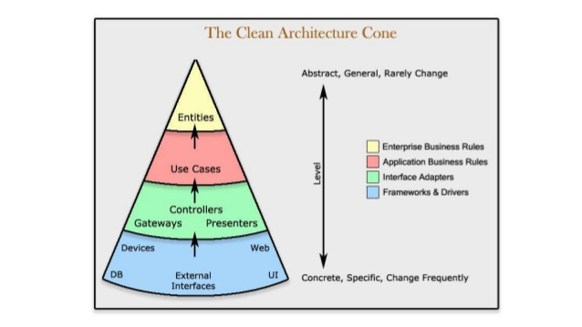
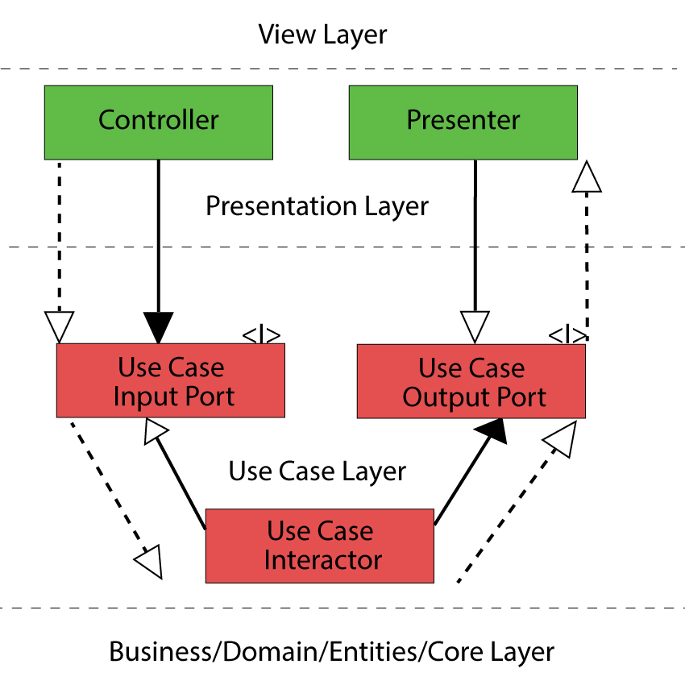
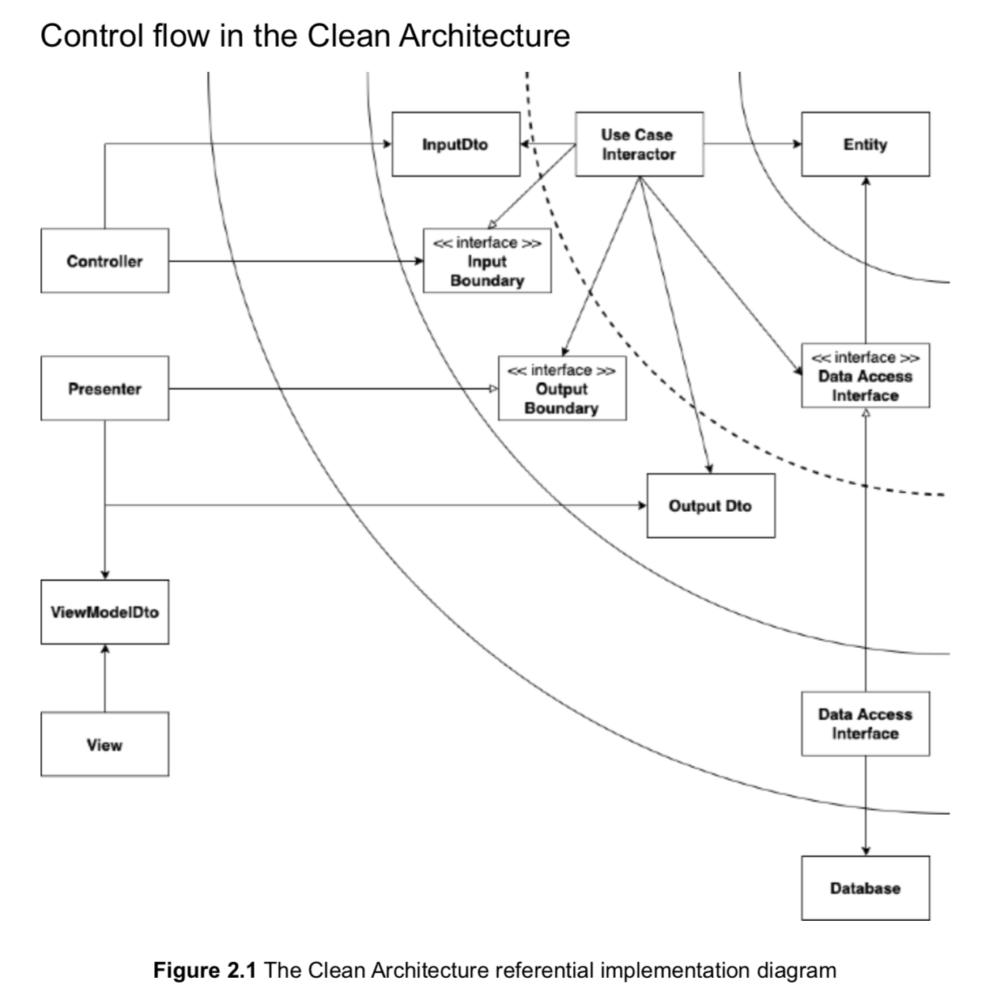

이 글은 [로버트 C. 마틴의 클린 아키텍처](http://www.yes24.com/Product/Goods/77283734)를 읽고 나름대로 중요하다고 생각한 부분만 정리한 글이다.

<br>

## 들어가며

이번 5부에서부터는 본격적으로 아키텍처에 대한 이야기가 나온다.  
사실 대부분의 내용이 이미 잘 정리되어 인터넷 여기저기에 공유가 되어있다.  
(충분히 잘 정리된 글이 많아서 그런지, 굳이 내가 더 정리해야 하나 싶기도 하고... )  
여하튼, 일단 시작해본다..

<br>

## 아키텍처란?

거두절미하고 아키텍처와 관련된 설명만 짤막하게 간추려 본다.

-   좋은 아키텍처는 시스템을 **쉽게** (**이해**하고, **개발**하며, **유지보수**하고, **배포**)할 수 있게 한다.
-   아키텍처는 시스템의 **동작 여부 자체**와는 거의 관련이 없다.
-   아키텍처는 소프트웨어를 **유연하고 부드럽게** 구조화한다.
-   좋은 아키텍트는 시스템의 **핵심적인 요소(정책이라고 한다)를 식별**하고, 동시에 **세부사항은 이 정책에 무관**하게 만들 수 있는 형태로 시스템을 구축한다.
-   좋은 아키텍트는 **세부사항에 대한 결정을 가능한 한 오랫동안 미룰 수 있는 방향으로** 정책을 설계한다.

가장 중요한 것을 딱 한 마디로 요약하면 다음처럼 말할 수 있을 거 같다.

> 좋은 아키텍처는 중요한 것과 중요하지 않은 것을 구분하고,  
> 중요하지 않은 것에 의존하지 않도록 잘 분리하여 설계한다.

<br>

## 클린 아키텍처

클린 아키텍처를 말하기까지 책에서는 이런저런 설명과 과정이 서술의 형태로 주욱 나오는데, 사실 이를 일일이 다 말하기는 참... 힘들다. (절대 정리하기 귀찮은 게 아님...)

결국 이 책에서 말하고자 하는 **"좋은 아키텍처"의 형태**는 다음과 같다.


*(그림 출처 : Credit: 도서출판 인사이트)*

하나씩 살펴보면 다음과 같다.  
먼저 원을 보자. 이 원은 시스템을 구성하는 영역을 크게 4가지로 나눈다.  
(아키텍처는 이 영역 간의 **"경계"**를 잘 긋는거부터 시작된다.)

<br>

### 1) 영역에 대한 설명

4가지 영역은 **안쪽에서 바깥쪽으로 갈수록 "덜 중요한", "세부사항인" 영역**이며, 각 영역은 다음과 같이 정의된다.

#### 엔티티

-   핵심 업무 규칙을 캡슐화한다.
-   메서드를 가지는 객체 거나 일련의 데이터 구조와 함수의 집합일 수 있다.
-   가장 변하지 않고, 외부로부터 영향받지 않는 영역이다.

#### 유스 케이스

-   애플리케이션에 특화된 업무 규칙을 포함한다.
-   시스템의 모든 유스 케이스를 캡슐화하고 구현한다.
-   엔티티로 들어오고 나가는 데이터 흐름을 조정하고 조작한다.

#### 인터페이스 어댑터

-   일련의 어댑터들로 구성된다.
-   어댑터는 데이터를 (유스 케이스와 엔티티에게 가장 편리한 형식) <-> (데이터베이스나 웹 같은 외부 에이전시에게 가장 편리한 형식)으로 변환한다.
-   컨트롤러, 프레젠터, 게이트웨이 등이 여기에 속한다.

#### 프레임워크와 드라이버

-   시스템의 핵심 업무와는 관련 없는 세부 사항이다. 언제든 갈아 끼울 수 있다.
-   프레임워크나, 데이터베이스, 웹서버 등이 여기에 해당된다.

영역은 상황에 따라 4가지 이상일 수 있다.  
핵심은 안쪽 영역으로 갈수록 추상화와 정책의 수준이 높아진다는 것이다.  
반대로 바깥쪽 영역으로 갈수록 구체적인 세부사항으로 구성된다.  
(그래서 안쪽 영역을 갈수록 고수준이라 하며, 바깥쪽으로 갈수록 저수준이라고 한다.)



*(그림 출처 : [https://www.slideshare.net/dotnetcrowd/clean-architecture-148074952](https://www.slideshare.net/dotnetcrowd/clean-architecture-148074952))*

위 설명만으론 구체적으로 어떤 코드, 클래스, 모듈, 그리고 컴포넌트들이 위 영역에 속하는지 와 닿지 않을 수 있다. 그렇다. 나 같은 사람은 결국 예제 코드를 한 번 봐야 이해가 간다. 이러한 예제는 다음 글에서 소개할 예정이다.

<br>

### 2) 영역의 의존성 방향

클린 아키텍처에서 아주 **핵심적인 원칙이 바로 이 의존성 방향에 있다.**

> 의존성 방향은 항상 바깥쪽 원에서 안쪽 원으로 향해야 한다.  
> 즉, 안쪽 원은 바깥쪽 원의 어떤 것도 알지 못한다.

아주 명확한 원칙이다. 컴포넌트를 위 영역 중 어디에 위치시키지? 컴포넌트 간 관계를 어떻게 맺지? 에 대한 생각이 들 때, 이 원칙만 잘 지키면 된다. 다시 한번 말하지만, 안쪽 영역에 있는 컴포넌트는 바깥쪽 영역의 컴포넌트를 알아서도 안되고, 변경에 따라 영향받지도 않아야 한다.

그런데 의존성의 방향과 제어 흐름이 명백히 반대인 경우가 있다. 예를 들어, 유스 케이스에서 프레젠터를 호출해야하는 경우다. 의존성의 방향 원칙대로라면 프레젠터 -> 유스케이스의 흐름인데, 제어흐름은 유스케이스 -> 프레젠터로 가기 때문이다.


이런 경우, **의존성 역전 원칙을 사용하여 해결**한다. 즉 유스케이스 내부에 프레젠터의 인터페이스를 정의하고, 프레젠터에 이 인터페이스를 구현하도록 만드는 것이다.


(OOP의 다형성과 의존성 역전 원칙은 이런 의존성 문제에 항상 키가 되는 거 같다.)

<br>

### 3) 경계를 횡단하는 법

다시, 위의 원 모양의 클린 아키텍처 우측 하단을 보면, 제어 흐름이 경계를 가로지르는 방법이 나온다.  
여기서 경계를 가로지르는 과정은 (인터페이스 어댑터 영역) -> (유즈 케이스 영역) -> (인터페이스 어댑터 영역)이다.  
이를 구현하는 과정을 좀 더 자세히 살펴보면 다음과 같다.



*(그림 출처 : [https://crosp.net/blog/software-architecture/clean-architecture-part-2-the-clean-architecture/](https://crosp.net/blog/software-architecture/clean-architecture-part-2-the-clean-architecture/))*

점선 화살표가 실제 제어 흐름이고, 나머지 화살표가 구현 방법이라고 보면 된다.

<br>

### 4) 전형적인 시나리오



*(그림 출처 : [https://velog.io/@jahoy/Python으로-Clean-Architecture-적용하기](https://velog.io/@jahoy/Python%EC%9C%BC%EB%A1%9C-Clean-Architecture-%EC%A0%81%EC%9A%A9%ED%95%98%EA%B8%B0))*

책에 나오는 그림보다 이 그림이 더 잘 표현되어 있는 거 같아 가져왔다.

음... 글을 쓰다가 그냥 다 지웠는데, 아무리 봐도 [위 그림 출처 블로그 글](https://velog.io/@jahoy/Python%EC%9C%BC%EB%A1%9C-Clean-Architecture-%EC%A0%81%EC%9A%A9%ED%95%98%EA%B8%B0)이 너무나 잘 설명되어 있는거 같다. (심지어 코드까지 나와있다. 유후!)  
개인적으로 아주 인상 깊었던 것은 UseCase와 Presenter를 실제로 구현하는 방식이다.  
위 블로그 글의 일부만 각색하여 가져오면 다음과 같다.

```python
class InputBoundary(abc.ABC):
    @abc.abstractmethod
    def execute(self,
                input_dto: InputDto,
                presenter: OutputBoundary) -> None:
        pass

class UseCase(InputBoundary):
    def __init__(self, 
                 data_access: DataAccess, 
                 output_boundary: OutputBoundary) -> None:
        self._data_access = data_access
        self._output_boundary = output_boundary

    def execute(self, 
                input_dto: InputDto) -> None:
        entity = self._data_access.get_entity(input_dto.entity_id)
        entity.do_something(input_dto.value_1, input_dto.value_2)
        self._data_access.save(entity)

        output_dto = OutputDto(entity.value)
        self._output_boundary.present(output_dto)
```

가장 신선하고 당황스러우며 놀랍고 재밌다고 중요하다고 생각한 부분만 가져왔다.  
"커맨드 패턴"을 통해 제어 흐름을 전달한다니...  
유스 케이스에 들어갈 인풋 데이터 `InputDto`과 아웃풋 컴포넌트 `OutputBoundary` 만 넣어주면, 제어 흐름의 로직은 원하는 대로 잘 흘러간다.  
암튼 아직 낯설긴 하지만, 꽤 재밌는 모양새다.

꼭 위처럼 유스 케이스 내부에서 `OutputDto`를 만들고 `OutputBoundary`를 직접 실행시키지 않아도 된다.  
단지 이 직전의 일까지만 하고, 이러한 일들은 이 유스 케이스를 호출한 컴포넌트에서 처리하게 하면 된다.  
(이는 CQRS 방식의 일종이다. 개인적으로 이런 방식이 더 익숙하긴 하다.)

<br>

## 메인 컴포넌트

**메인 컴포넌트는 가장 낮은 수준의 정책(가장 바깥쪽 원 영역)이며, 시스템의 초기 진입점이다.** 따라서 그 어떤 컴포넌트도 이 메인 컴포넌트를 의존하지 않는다.  
**의존성을 주입하는 일은 바로 이 메인 컴포넌트에서 이뤄져야 한다.** 즉, 메인은 구체적인 "세부사항"들을 생성한다. 메인은 고수준 시스템을 위한 모든 것을 로드한 후, 제어권을 고수준의 시스템에게 넘긴다.

메인은 일종의 Config이자, 플러그인이라고 볼 수 있다. 따라서 개발용 메인, 테스트용 메인, 프로덕션용 메인 컴포넌트 등을 따로 두고, 필요에 따라 다르게 플러그인 할 수 있다.

<br>

## 그 외

위에서 설명한 것 외에도 이런저런 내용이 이 5부의 나머지 부분들을 채우는데, 굳이 다 정리하지는 않겠다.  
다만 핵심적인 문구 몇 개만 정리하면 다음과 같다.

-   **아키텍트 경계를 완벽하게 만드는 데는 비용이 많이 든다.**
-   여러 추상 컴포넌트들이 선행적으로 많이 생겨나는데, 사실 이는 YAGNI 법칙에 위배될 수 있다.
-   이를 위해서 꼭 위에서 소개한 방법대로만 하지 않고 일부 변형하여 사용해도 된다. (책에서는 부분적 경계라고 표현된다.)
-   (개인적인 생각인데, 그래도 의존성 방향과 저수준, 고수준 컴포넌트 영역을 나누는 것은 최소한 지켜야 한다고 생각한다.)
-   아키텍트는 **\[경계 구현 비용 < 그걸 무시해서 생기는 비용\] 인 시기**에 경계를 구현해야 한다.
-   이를 위해서는 계속해서 소프트웨어를 지켜봐야 한다.

<br>

## 나가며

사실 이번 5부는 이 책에서 가장 핵심이 되는 파트였다. 결국 이전 파트에서 말하던 내용들은 이번 파트를 위한 밑밥과 준비과정이었고, 이번 파트에 와서야 아주 시원하게 말하고자 하는 것을 가장 구체적으로 잘 말해주었다. (물론 그래도 추상적인 느낌이 없지 않아 있지만, 이는 아키텍처의 특성인 거 같다.)

나보다 훨씬 잘 정리하신 분들의 글을 많이 참고하였다. 좋은 글들을 아래에 공유한다.

-   [Zedd0202님 블로그 - Clean Architecture](https://zeddios.tistory.com/1065)
-   [Sa-ryong Kang님 미디엄 - Clean Architecture는 모바일 개발을 어떻게 도와주는가?](https://medium.com/@justfaceit/clean-architecture%EB%8A%94-%EB%AA%A8%EB%B0%94%EC%9D%BC-%EA%B0%9C%EB%B0%9C%EC%9D%84-%EC%96%B4%EB%96%BB%EA%B2%8C-%EB%8F%84%EC%99%80%EC%A3%BC%EB%8A%94%EA%B0%80-1-%EA%B2%BD%EA%B3%84%EC%84%A0-%EA%B3%84%EC%B8%B5%EC%9D%84-%EC%A0%95%EC%9D%98%ED%95%B4%EC%A4%80%EB%8B%A4-b77496744616)
-   [jahoy님 블로그 - Python으로 클린 아키텍처 적용하기](https://velog.io/@jahoy/Python%EC%9C%BC%EB%A1%9C-Clean-Architecture-%EC%A0%81%EC%9A%A9%ED%95%98%EA%B8%B0)

사실 이외에도 검색해보면 좋은 자료가 아주 많다!

처음에 잘 이해가 안 가도, 두 번 세 번 보면 점점 이해가 갔다.  
그래도 좀 더 확실한 이해를 위해, 클린 아키텍처를 파이썬으로 구현해보고 그 과정을 다음 글에서 적어볼 예정이다.