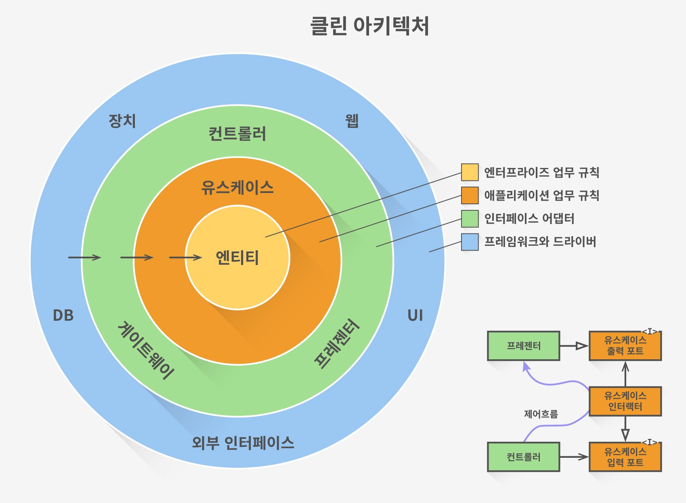
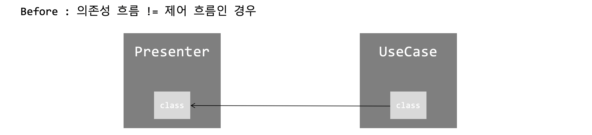
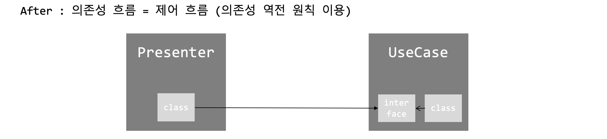

이 글은 [로버트 C. 마틴의 클린 아키텍처](http://www.yes24.com/Product/Goods/77283734)를 읽고 나름대로 중요하다고 생각한 부분만 정리한 글이다.

 

## 들어가며

이번 5부에서부터는 본격적으로 아키텍처에 대한 이야기가 나온다.  
사실 대부분의 내용이 이미 잘 정리되어 인터넷 여기저기에 공유가 되어있다.  
(충분히 잘 정리된 글이 많아서 그런지, 굳이 내가 더 정리해야하나 싶기도 하고... )  
여하튼, 일단 시작해본다..

## 아키텍처란?

거두절미하고 아키텍처와 관련된 설명만 짤막하게 간추려 본다. 

- 좋은 아키텍처는 시스템을 **쉽게** (**이해**하고, **개발**하며, **유지보수**하고, **배포**)할 수 있게 한다.
- 아키텍처는 시스템의 **동작 여부 자체**와는 거의 관련이 없다.
- 아키텍처는 소프트웨어를 **유연하고 부드럽게** 구조화한다.
- 좋은 아키텍트는 시스템의 **핵심적인 요소(정책이라고 한다)를 식별**하고, 동시에 **세부사항은 이 정책에 무관**하게 만들 수 있는 형태로 시스템을 구축한다.
- 좋은 아키텍트는 세부사항에 대한 **결정을 가능한 한 오랫동안 미룰 수 있는 방향으로** 정책을 설계한다.

가장 중요한 것을 딱 한 마디로 요약하면 다음처럼 말할 수 있을 거 같다.

> 좋은 아키텍처는 중요한 것과 중요하지 않은 것을 구분하고, 
> 중요하지 않은 것에 의존하지 않도록 잘 분리되어 설계된다.

## 클린 아키텍처

클린 아키텍처를 말하기까지 책에서는 이런 저런 설명과 과정이 서술의 형태로 주욱 나오는데, 사실 이를 일일이 다 말하기는 참... 힘들다. (절대 정리하기 귀찮은게 아님...)

결국 이 책에서 말하고자 하는 **"좋은 아키텍처"의 형태**는 다음과 같다. 

하나씩 살펴보면 다음과 같다.
먼저 원을 보자. 이 원은 시스템을 구성하는 영역을 크게 4가지로 나눈다. 
(아키텍처는 이 영역 간의 **"경계"**를 잘 긋는거부터 시작된다.)

### 1) 영역에 대한 설명

4가지 영역은 **안쪽부터 바깥쪽으로 갈수록 "덜 중요한, 세부사항인" 영역**이며 다음과 같이 정의된다.

#### 엔티티

- 핵심 업무 규칙을 캡슐화한다.
- 메서드를 가지는 객체거나 일련의 데이터 구조와 함수의 집합일 수 있다.
- 가장 변하지 않고, 외부로 부터 영향 받지 않는 영역이다.

#### 유스케이스

- 애플리케이션에 특화된 업무 규칙을 포함한다.
- 시스템의 모든 유스케이스를 캡슐화하고 구현한다.
- 엔티티로 들어오고 나가는 데이터 흐름을 조정한다.

#### 인터페이스 어댑터

- 일련의 어댑터들로 구성된다.
- 어댑터는 데이터를 (유스케이스와 엔티티에게 가장 편리한 형식) <-> (데이터베이스나 웹 같은 외부 에이전시에게 가장 편리한 형식) 으로 변환한다.
- 컨트롤러, 프레젠터, 게이트웨이 등이 여기에 속한다.

#### 프레임워크와 드라이버

- 시스템의 핵심 업무와는 관련없는 세부 사항이다. 언제든 갈아끼울 수 있다.
- 프레임워크나, 데이터베이스, 웹서버 등이 여기에 해당된다.

영역은 상황에 따라 4가지 이상일 수 있다.  
핵심은 안쪽 영역으로 갈수록 추상화와 정책의 수준이 높아진다는 것이다.  
반대로 바깥쪽 영역으로 갈수록 저수준의 구체적인 세부사항으로 구성된다.

위 설명만으론 구체적으로 어떤 코드, 클래스, 모듈, 그리고 컴포넌트들이 위 영역에 속하는지 와닿지 않을 수 있다. 그렇다. 나같은 사람은 결국 예제 코드를 한 번 봐야 이해가 간다. 이러한 예제는 다음 글에서 소개할 예정이다.

### 2) 영역의 의존성 방향

클린 아키텍처에서 아주 **핵심적인 원칙이 바로 이 의존성 방향에 있다.**

> 의존성 방향은 항상 바깥쪽 원에서 안쪽 원으로 향해야 한다.  
> 즉, 안쪽 원은 바깥쪽 원의 어떤 것도 알지 못한다.

아주 명확한 원칙이다. 컴포넌트를 위 영역 중 어디에 위치시키지? 컴포넌트간 관계를 어떻게 맺지? 에 대한 생각이 들 때, 이 원칙만 잘 지키면 된다.

그런데 의존성의 방향과 제어 흐름이 명백히 반대인 경우가 있다. 예를 들어, 유스케이스에서 프레젠터를 호출해야하는 경우다. 의존성의 방향 원칙대로라면 프레젠터 -> 유스케이스의 흐름인데, 제어흐름은 유스케이스 -> 프레젠터로 가기 때문이다.

이런 경우, **의존성 역전 원칙을 사용하여 해결**한다. 즉 유스케이스 내부에 프레젠터의 인터페이스를 정의하고, 프레젠터에 이 인터페이스를 구현하도록 만드는 것이다.

OOP의 다형성... 그리고 의존성 역전 원칙은 이런 의존성 문제에 항상 키가 되는거 같다.

