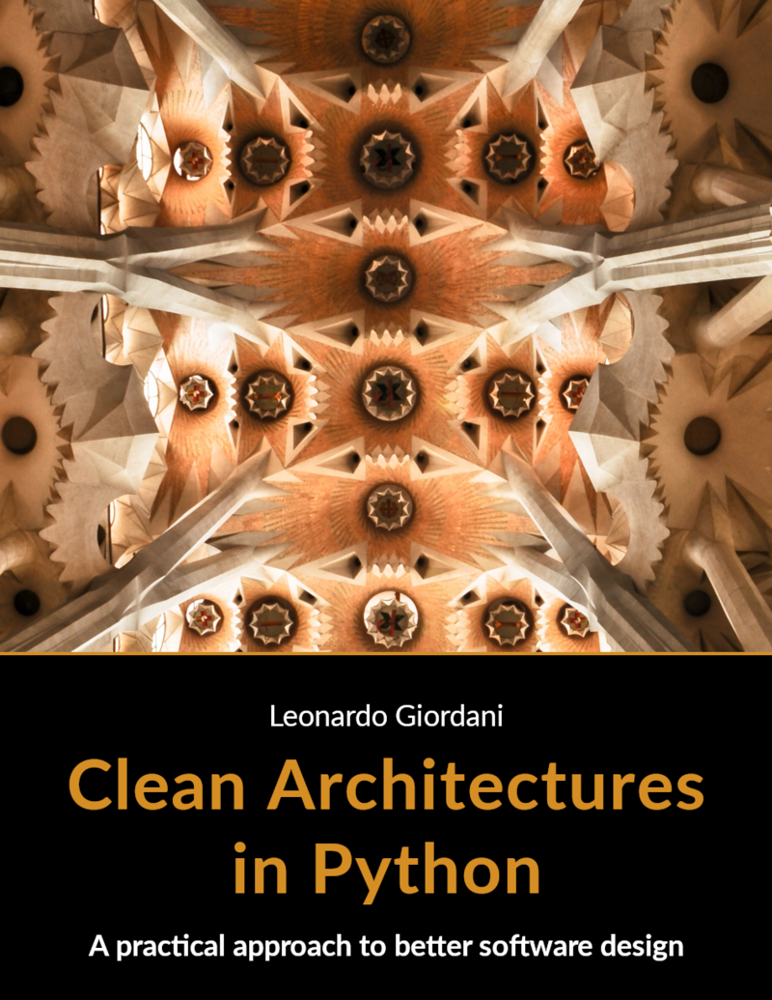
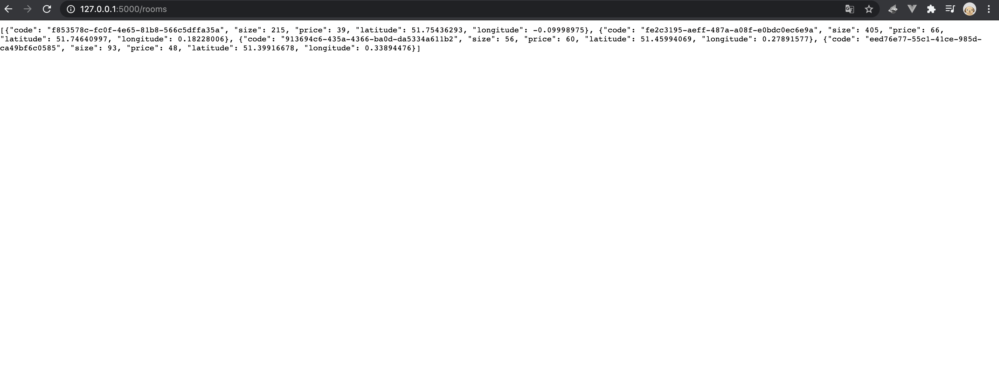
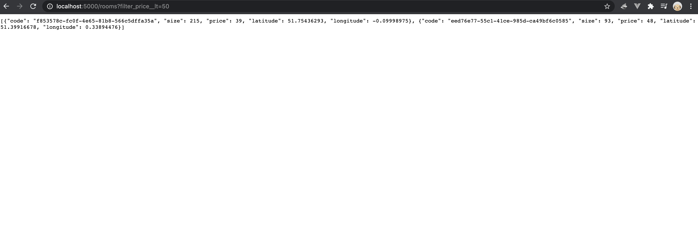
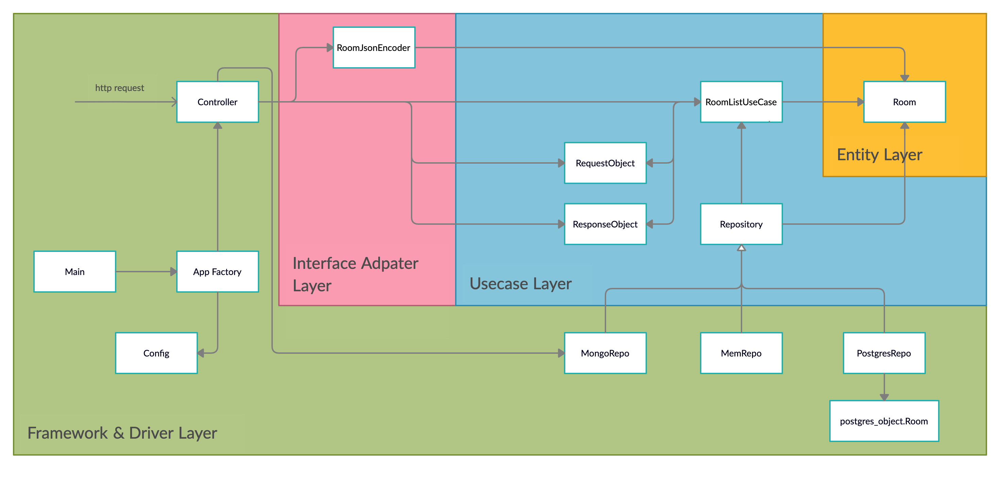

## 0. 들어가며

클린 아키텍처 책을 읽고 나서도, **실제로 구현하지 않고는 이를 구체적으로 체감하기 어렵다는 생각이 들었다.**  
그래서 생각나는대로 스스로 구현해보았다. 무려 일주일이나 고민 고민하며 만들었다.  
그래도, 맘에 들지 않았다. 솔직히 내가 구현한게 올바른 지에 대해서 확신이 없었다.

인터넷을 뒤적거리며 클린 아키텍처를 파이썬으로 구현하는 자료를 찾아보았다.  
그중 발견한 [블로그 글](https://www.thedigitalcatonline.com/blog/2016/11/14/clean-architectures-in-python-a-step-by-step-example/). 매우 세세하게 설명되는 데 양이 꽤 길다.  
더 찾아보니 이 글을 쓴 사람이 [leanpub에 책](https://leanpub.com/clean-architectures-in-python)을 내신 것을 알게 되었다.  
무료다. 180페이지 조금 안되는데, 생각보다 읽어볼 만한 것 같았다.



이 글은 이 책을 읽고 클린 아키텍처를 구현하는 핵심만 정리한 글이다.  
책 자체는 TDD 방식으로 구현을 진행하는데, 이게 무료인가 싶을 정도로 엄청나게 좋다.  
구현하고자 하는 애플리케이션은 아주 간단한 데, 이를 거의 TDD의 정석이다 싶을 정도로 세세하게 다룬다.  
특히 나는 pytest로 데이터 베이스 테스트하는 방법이 이전부터 매우 궁금했었는데, 이러한 내용을 다뤄준다.  
(이 때문에 뽐뿌 와서 TDD와 pytest 잘 다루는 책을 더 읽어보고 싶어 졌다.)

**궁금한 사람은 꼭 읽어보길 추천한다.**  
(나는 퇴근 후 하루에 2시간 정도씩 해서 5일 만에 다 읽었다. 딱 그 정도의 부담 없는 분량이다.)

<br>

## 1. 목표

이 책에서 구현하고자 하는 목표는 **간단한 REST API를 빠르게 만들어 보는 것**이다.  
`Room` 이라는 데이터를 조회(GET)할 수 있는 기능을 제공한다.  
좀 더 구체적으로 말하면, 다음과 같다.

-   `GET /rooms` 요청에 대해, 데이터를 실어 응답한다.
-   `GET` 요청의 파라미터로 조건(`filter`)을 걸어 원하는 데이터만 받을 수 있다.

결과 화면을 예를 들면 다음과 같다.



책에서는 TDD 방식으로 Test code의 양이 꽤 많지만, 이 글에서는 테스트 코드를 다루지는 않는다.  
**클린 아키텍처 모델을 이론적으로 알고 있다고 생각하고, 이를 실제로 어떻게 구현했나 위주로만 빠르게 살펴본다.**

<br>

## 2. 엔티티 레이어

### Entity

가장 먼저 엔티티 레이어의 엔티티를 정의하자.  
엔티티는 비즈니스 로직의 중요한 데이터를 표현하는 핵심 객체다.  
여기서는 방(`Room`)이 핵심 엔티티다.

```python
# rentomatic/domain/entities/room.py

from typing import Dict


class Room:
    def __init__(self, code: str, size: int, price: int, longitude: float, latitude: float):
        self.code = code
        self.size = size
        self.price = price
        self.latitude = latitude
        self.longitude = longitude

    @classmethod
    def from_dict(cls, adict: Dict):
        return cls(
            code=adict["code"],
            size=adict["size"],
            price=adict["price"],
            latitude=adict["latitude"],
            longitude=adict["longitude"],
        )

    def to_dict(self):
        return {
            "code": self.code,
            "size": self.size,
            "price": self.price,
            "latitude": self.latitude,
            "longitude": self.longitude,
        }

    def __eq__(self, other):
        return self.to_dict() == other.to_dict()
```

-   `Dict` 에서 `Room` 인스턴스를, 또 반대로 `Room` 에서 `Dict` 를 생성할 수 있도록 메서드를 추가하였다.

<br>

## 3. 유스 케이스 레이어

### Use case

다음은 비즈니스 로직 그 자체를 담고 있는 유스 케이스를 정의하자.

```python
# rentomatic/domain/use_cases/room_list_use_case.py

from typing import Union

from rentomatic.domain.interfaces.repository import Repository
from rentomatic.domain.request_objects import room_list_request_object as req
from rentomatic.domain.response_objects import response_objects as res
from rentomatic.domain.response_objects.response_objects import ResponseFailure, ResponseSuccess


class RoomListUseCase:
    def __init__(self, repo: Repository):
        self.repo = repo

    def execute(
        self, request_object: Union[req.ValidRequestObject, req.InvalidRequestObject]
    ) -> Union[ResponseSuccess, ResponseFailure]:
        if not request_object:
            return res.ResponseFailure.build_from_invalid_request_object(request_object)

        try:
            rooms = self.repo.list(filters=request_object.filters)
            return res.ResponseSuccess(rooms)
        except Exception as exc:
            return res.ResponseFailure.build_system_error("{}: {}".format(exc.__class__.__name__, "{}".format(exc)))
```

뭔가 아직 정의되지 않은 이런저런 객체들이 있지만, 걱정할 필요 없다. 다 차차 구현할 것들이다.

-   유스 케이스는 `execute()` 로 실행된다.
    -   유스 케이스의 입력은 `request_object` 이다. 이것이 뭔지는 곧 살펴볼 것이다.
    -   유스 케이스의 출력은 `response_object` 에 있는 클래스들이다. 이것이 뭔지도 곧 살펴볼 것이다.
-   전체적인 흐름만 살펴보자.
    -   유스 케이스는 `request_object` 를 입력으로 받아, `repo` 라는 저장소를 호출한다.
    -   `repo` 는 이 요청에 부합하는 데이터를 가져와 반환한다. (`rooms` 에 이 데이터들이 담겨있다.)
    -   그리고 이 데이터를 `response_object` 인스턴스에 넘겨주어 이를 반환한다.
    -   이 과정 중에 이런저런 예외처리 과정들이 있다.

딱 이 정도 까지다. 큰 흐름만 보면 일단은 크게 어려울 건 없다.  
이제 `request_object` 와 `response_object` 가 어떻게 생겼는지 살펴보자.

<br>

### Request object

`request_object` 는 이 유스 케이스에 입력으로 들어가는 객체다.  
즉 유스 케이스를 사용하려는 사람은 이 객체에 대해서 먼저 알아야 어떻게 데이터를 유스 케이스로 넘겨줄지 알 수 있다.

```python
# rentomatic/domain/request_objects/room_list_request_object.py

import collections


class InvalidRequestObject:
    def __init__(self) -> None:
        self.errors = []

    def add_error(self, parameter: str, message: str) -> None:
        self.errors.append({"parameter": parameter, "message": message})

    def has_errors(self) -> bool:
        return len(self.errors) > 0

    def __bool__(self) -> bool:
        return False


class ValidRequestObject:
    @classmethod
    def from_dict(cls, adict: dict):
        raise NotImplementedError

    def __bool__(self) -> bool:
        return True
```

-   먼저, "올바른 요청"과 "올바르지 않은 요청"에 대해 정의한다. 모든 요청은 크게 이 두 요청의 하위 개념이라 할 수 있다.
-   특히 `__bool__` 로 두 요청을 간결히 구분할 수 있도록 해놓았다.

같은 모듈에 마저 코드를 작성하자.

```python
# rentomatic/request_objects/room_list_request_object.py

class RoomListRequestObject(ValidRequestObject):
    accepted_filters = ["code__eq", "price__eq", "price__lt", "price__gt"]

    def __init__(self, filters: dict = None) -> None:
        """
        There are no validation checks in the __init__ method,
        because this is considered to be an internal method that gets called
        when the parameters have already been validated.
        """
        self.filters = filters

    @classmethod
    def from_dict(cls, adict: dict):
        invalid_req = InvalidRequestObject()
        if "filters" in adict:
            if not isinstance(adict["filters"], collections.Mapping):
                invalid_req.add_error("filters", "Is not iterable")
                return invalid_req

            for key, value in adict["filters"].items():
                if key not in cls.accepted_filters:
                    invalid_req.add_error("filters", "Key {} cannot be used".format(key))
        if invalid_req.has_errors():
            return invalid_req

        return cls(filters=adict.get("filters", None))
```

-   `RoomListRequestObject` 는 `RoomListUseCase` 유스 케이스를 위한 요청 객체다.
    -   `execute` 로 넘겨주는 `request_object` 는 일반적으로 바로 이 클래스의 인스턴스다.
    -   일반적이라는 말은, 그렇지 않은 경우도 있다는 뜻이다.
    -   `from_dict` 를 보면, `Dict` (파라미터의 `adict`) 로 부터 이 클래스의 인스턴스를 생성할 수 있도록 해놨는데, `Dict` 가 뭔가 유효하지 않은 경우 `InvalidRqeustObject` 인스턴스를 생성하여 내보낸다.
    -   즉, `excute` 에 `InvalidRqeustObject` 가 넘어갈 때도 있다.
-   `RoomListRequestObject` 는 `filters` 라는 `Dict` 를 가진다.
    -   `filters` 는 원하는 데이터를 얻기 위한 일종의 필터로, `accepted_filters` 에 정의된 값만을 키로 갖는다.

<br>

### Response object

`response_object` 는 이 유스 케이스의 출력으로 나오는 객체다.

```python
# rentomatic/domain/response_objects/response_objects.py

from rentomatic.domain.request_objects import room_list_request_object as req


class ResponseFailure:
    RESOURCE_ERROR = "ResourceError"
    PARAMETERS_ERROR = "ParametersError"
    SYSTEM_ERROR = "SystemError"

    def __init__(self, type_: str, message: str) -> None:
        self.type = type_  # type 이 예약어라 끝에 _를 붙임
        self.message = self._format_message(message)

    def _format_message(self, msg: str) -> str:
        if isinstance(msg, Exception):
            return "{}: {}".format(msg.__class__.__name__, "{}".format(msg))
        return msg

    @property
    def value(self) -> dict:
        return {"type": self.type, "message": self.message}

    def __bool__(self) -> bool:
        return False

    @classmethod
    def build_from_invalid_request_object(cls, invalid_request_object: req.InvalidRequestObject):
        message = "\n".join(
            ["{}: {}".format(err["parameter"], err["message"]) for err in invalid_request_object.errors]
        )

        return cls(cls.PARAMETERS_ERROR, message)

    @classmethod
    def build_resource_error(cls, message: str = None):
        return cls(cls.RESOURCE_ERROR, message)

    @classmethod
    def build_system_error(cls, message: str = None):
        return cls(cls.SYSTEM_ERROR, message)

    @classmethod
    def build_parameters_error(cls, message: str = None):
        return cls(cls.PARAMETERS_ERROR, message)


class ResponseSuccess:
    SUCCESS = "Success"

    def __init__(self, value=None) -> None:
        self.type = self.SUCCESS
        self.value = value

    def __bool__(self) -> bool:
        return True
```

-   마찬가지로, "성공한 응답"과 "실패한 응답"에 대해 정의한다.  
    이 응답 객체들은 꼭 이 유스 케이스뿐만이 아니라, 좀 더 일반적인 범주에서 사용된다.
-   실패한 응답은 `ResponseFailure` 객체로 표현된다.
    -   실패 유형 `type` 과 에러 메시지 `message` 를 담는다.
    -   `@classmethod` 메서드로 이 클래스의 인스턴스를 다양하게 만들 수 있다.
-   성공한 응답은 `ResponseSuccess` 객체로 표현된다.
-   두 응답 모두 `__bool__` 로 구분할 수 있다.

<br>

### Repository

다시 올라가 유스 케이스를 확인해보면, `Room` 데이터를 얻어오기 위해 `Repository` 객체를 사용한다.  
`Repository` 는 말 그대로, 데이터 저장소다. 보통 원하는 데이터를 메서드를 통해 받아온다.  
유스 케이스 레이어에서는 구체적인 구현이 아닌 인터페이스(추상 클래스)만 정의한다.

```python
# rentomatic/domain/interfaces/repository.py

from abc import ABCMeta, abstractmethod
from typing import List

from rentomatic.domain.entities.room import Room


class Repository(metaclass=ABCMeta):
    @abstractmethod
    def list(self, filters: dict = None) -> List[Room]:
        pass
```

<br>

## 4. 인터페이스 어댑터 레이어

### Encoder(Serializer)

인터페이스 어댑터 레이어는 "프레임워크와 드라이버" 레이어와 "유스 케이스" 레이어 통신 간 필요한 어댑터 모듈들이 위치하는 곳이다.

-   "프레임워크와 드라이버" 레이어에서는 REST API로 외부와 데이터를 주고받게 되는데, 이때 json 데이터를 사용한다.
-   한편 "유스 케이스" 레이어에서는 `request_objects/` 패키지와 `response_objects/` 속한 클래스 형식을 사용한다.
-   따라서 `json` <-> `request_objects/`, `response_objects/` 사이에 변환을 담당하는 어댑터 모듈을 여기서 정의한다.

```python
# rentomatic/serializers/room_json_serializer.py

import json


class RoomJsonEncoder(json.JSONEncoder):
    def default(self, o: object):
        try:
            to_serialize = {
                "code": str(o.code),
                "size": o.size,
                "price": o.price,
                "latitude": o.latitude,
                "longitude": o.longitude,
            }
            return to_serialize
        except AttributeError:
            return super().default(o)
```

-   `json.JSONEncoder` 을 상속받아 구현하고 있는데 이는 `json.dumps` 모듈의 `cls` 인자로 쓰기 위함이다.
-   당장 이해가지 않아도 좋다. 다음 레이어 설명에서 이 클래스가 어떻게 사용되는지 등장한다.
-   이 클래스의 역할만 알고 가자. `RoomJsonEncoder` 이름답게, `Room` 객체를 json 형태로 만들어준다.

<br>

## 5. 프레임워크와 드라이버 레이어

### Controller

Controller는 요청에 대해 적합한 유스 케이스로 라우팅 한다.  
이 과정 중에 인터페이스 어댑터 레이어의 Encoder를 이용하여 외부 요청을 유스 케이스에 맞게 변환하고, 유스 케이스로부터의 출력을 외부 응답에 맞게 변환한다.

```python
# rentomatic/rest/room.py

import json

from flask import Blueprint, Response, request

from rentomatic.repository import mongorepo as mr
from rentomatic.domain.request_objects import room_list_request_object as req
from rentomatic.domain.response_objects import response_objects as res
from rentomatic.serializers import room_json_serializer as ser
from rentomatic.domain.use_cases import room_list_use_case as uc

blueprint = Blueprint("room", __name__)

# response_object의 type -> http response type 을 정의
STATUS_CODES = {
    res.ResponseSuccess.SUCCESS: 200,
    res.ResponseFailure.RESOURCE_ERROR: 404,
    res.ResponseFailure.PARAMETERS_ERROR: 400,
    res.ResponseFailure.SYSTEM_ERROR: 500,
}

# repository 에 주입시켜줄 데이터베이스 정보
connection_data = {
    "dbname": "rentomaticdb",
    "user": "root", 
    "password": "rentomaticdb", 
    "host": "localhost"
}


@blueprint.route("/rooms", methods=["GET"])
def room():
    qrystr_params = {
        "filters": {},
    }
    for arg, values in request.args.items():
        if arg.startswith("filter_"):
            qrystr_params["filters"][arg.replace("filter_", "")] = values

    # 외부 요청 형태(http, json) -> 유스케이스 request_object로 변환.
    request_object = req.RoomListRequestObject.from_dict(qrystr_params)

    # 사용할 구체적인 Repository를 생성한다.
    repo = mr.MongoRepo(connection_data)  

    # 유스케이스 인스턴스를 만들어 실행 후 결과인 response_object를 받는다.
    use_case = uc.RoomListUseCase(repo)
    response = use_case.execute(request_object)

    # response_object -> 외부 응답 형태(http, json)로 변환.
    return Response(
        json.dumps(response.value, cls=ser.RoomJsonEncoder),
        mimetype="application/json",
        status=STATUS_CODES[response.type],
    )
```

-   본격적으로 flask 같은 웹 프레임워크가 등장했다.  
    구체적인 세부 사항들이 곳곳에서 생성되고 주입된다.
-   깔끔한 코드라고 생각하여, 굳이 더 설명을 적지는 않겠다.
-   다만 지금 와서 하나 걸리는 게, `repo = mr.MongoRepo(connection_data)` 이 부분은 여기서 생성하지 않고, 더 바깥쪽, 즉 앱을 구동할 때 생성하는 게 더 나아 보인다. (지극히 내 생각이라, 일단 코드는 저자가 짠 그대로 두었음.)

<br>

### Repository implementation

유스 케이스 레이어에서 정의한 `Repository` 추상 클래스를 구체적으로 구현하는 클래스를 정의한다.  
크게 3가지 방법으로 구현해본다.

-   인메모리 : 별도의 데이터베이스를 안 쓰고, 데이터를 메모리에 저장해두는 방식이다.
    -   본격적인 데이터 베이스를 고려하기 전에, 임시로 혹은 캐시 용도로 사용하는 경우가 많다.
-   RDB + ORM : 별도의 관계형 데이터베이스를 사용하여 저장한다. 코드에서 데이터를 다루는 직접적인 방법은 ORM을 사용한다.
    -   여기서는 RDB로 postgres를 사용하고, ORM으로는 sqlalchemy를 사용한다.
-   NoSQL : 별도의 NoSQL 데이터베이스를 사용하여 저장한다.
    -   여기서는 NoSQL DB로 mongodb 를 사용한다.

<br>

#### 1) 인메모리

```python
# rentomatic/repository/memrepo.py

from typing import List

from rentomatic.domain.entities.room import Room
from rentomatic.domain.interfaces.repository import Repository


class MemRepo(Repository):
    def __init__(self, data: List[dict]) -> None:
        self.data = data

    def list(self, filters: dict = None) -> List[Room]:
        result = [Room.from_dict(i) for i in self.data]

        if filters is None:
            return result

        if "code__eq" in filters:
            result = [r for r in result if r.code == filters["code__eq"]]
        if "price__eq" in filters:
            result = [r for r in result if r.price == int(filters["price__eq"])]
        if "price__lt" in filters:
            result = [r for r in result if r.price < int(filters["price__lt"])]
        if "price__gt" in filters:
            result = [r for r in result if r.price > int(filters["price__gt"])]

        return result


""" usage example
    room1 = {
        "code": "f853578c-fc0f-4e65-81b8-566c5dffa35a",
        "size": 215,
        "price": 39,
        "longitude": -0.09998975,
        "latitude": 51.75436293,
    }
    room2 = {
        "code": "fe2c3195-aeff-487a-a08f-e0bdc0ec6e9a",
        "size": 405,
        "price": 66,
        "longitude": 0.18228006,
        "latitude": 51.74640997,
    }
    room3 = {
        "code": "913694c6-435a-4366-ba0d-da5334a611b2",
        "size": 56,
        "price": 60,
        "longitude": 0.27891577,
        "latitude": 51.45994069,
    }

    repo = MemRepo([room1, room2, room3])
"""
```

<br>

#### 2) RDB + ORM

```python
# rentomatic/repository/postgresrepo.py

from typing import List

from sqlalchemy import create_engine
from sqlalchemy.orm import sessionmaker

from rentomatic.domain.entities import room
from rentomatic.domain.interfaces.repository import Repository
from rentomatic.repository import postgres_objects


class PostgresRepo(Repository):
    def __init__(self, connection_data: dict) -> None:
        connection_string = "postgresql+psycopg2://{}:{}@{}/{}".format(
            connection_data["user"], connection_data["password"], connection_data["host"], connection_data["dbname"]
        )
        self.engine = create_engine(connection_string)
        postgres_objects.Base.metadata.bind = self.engine

    def _create_room_objects(self, results: List[postgres_objects.Room]) -> List[room.Room]:
        return [
            room.Room(code=q.code, size=q.size, price=q.price, latitude=q.latitude, longitude=q.longitude)
            for q in results
        ]

    def list(self, filters: dict = None) -> List[room.Room]:
        DBSession = sessionmaker(bind=self.engine)

        session = DBSession()
        query = session.query(postgres_objects.Room)
        if filters is None:
            return self._create_room_objects(query.all())
        if "code__eq" in filters:
            query = query.filter(postgres_objects.Room.code == filters["code__eq"])
        if "price__eq" in filters:
            query = query.filter(postgres_objects.Room.price == filters["price__eq"])
        if "price__lt" in filters:
            query = query.filter(postgres_objects.Room.price < filters["price__lt"])
        if "price__gt" in filters:
            query = query.filter(postgres_objects.Room.price > filters["price__gt"])
        return self._create_room_objects(query.all())


""" usage example 
    repo = PostgresRepo({
        "dbname": "rentomaticdb", 
        "user": "postgres", 
        "password": "rentomaticdb",
        "host": "localhost"
    })
"""
```

```python
# rentomatic/repository/postgres_objects.py

from sqlalchemy import Column, Float, Integer, String
from sqlalchemy.ext.declarative import declarative_base

Base = declarative_base()

# It is important to understand that this is not the class we are using in the business logic,
# but the class that we want to map into the SQL database.
# The structure of this class is thus dictated by the needs of the storage layer, and not by the use cases.

# Obviously, this means that you have to keep the storage
# and the domain levels in sync and that you need to manage migrations on your own.


class Room(Base):
    __tablename__ = "room"
    id = Column(Integer, primary_key=True)
    code = Column(String(36), nullable=False)
    size = Column(Integer)
    price = Column(Integer)
    longitude = Column(Float)
    latitude = Column(Float)
```

여기서 한 가지 주목할 부분은, sqlalchemy로 가져오는 데이터를 바로 `list()` 메서드로 내보내지 않는다는 것이다.  
sqlalchemy를 사용하면 `repository/postgres_objects.py` 에 정의된 `Room` 객체를 얻게 되는데, 이는 `domain/entities/room.py` 의 `Room` 과는 다르다. 따라서 이 레이어에서 사용된 `Room` 객체를 도메인의 `Room` 객체로 만드는 것도 `Repository` 클래스의 몫이다. 여기서는 `_create_room_objects()` 를 통해 이러한 변환 작업을 해주고 있다.

<br>

#### 3) NoSQL

```python
# rentomatic/repository/mongorepo.py

from typing import List

import pymongo

from rentomatic.domain.entities.room import Room
from rentomatic.domain.interfaces.repository import Repository


class MongoRepo(Repository):
    def __init__(self, connection_data: dict) -> None:
        client = pymongo.MongoClient(
            host=connection_data["host"],
            username=connection_data["user"],
            password=connection_data["password"],
            authSource="admin",
        )
        self.db = client[connection_data["dbname"]]

    def list(self, filters: dict = None) -> List[Room]:
        collection = self.db.rooms
        if filters is None:
            result = collection.find()
        else:
            mongo_filter = {}
        for key, value in filters.items():
            key, operator = key.split("__")
            filter_value = mongo_filter.get(key, {})
            if key == "price":
                value = int(value)
            filter_value["${}".format(operator)] = value
            mongo_filter[key] = filter_value
        result = collection.find(mongo_filter)
        return [Room.from_dict(d) for d in result]
```

<br>

### Config(Setting)

Config는 실행환경에 따라 필요한 세팅값들을 담고, 주입시켜주는 역할을 한다.

```python
# rentomatic/settings.py

import os


class Config(object):
    """Base configuration."""

    APP_DIR = os.path.abspath(os.path.dirname(__file__))  # This directory
    PROJECT_ROOT = os.path.abspath(os.path.join(APP_DIR, os.pardir))


class ProdConfig(Config):
    """Production configuration."""

    ENV = "prod"
    DEBUG = False


class DevConfig(Config):
    """Development configuration."""

    ENV = "dev"
    DEBUG = True


class TestConfig(Config):
    """Test configuration."""

    ENV = "test"
    TESTING = True
    DEBUG = True
```

<br>

### App Factory

App Factory는 말 그대로 App 인스턴스를 생성하는 역할을 한다.

```python
# rentomatic/app.py

from flask import Flask

from rentomatic.rest import room
from rentomatic.settings import DevConfig


def create_app(config_object=DevConfig):
    app = Flask(__name__)
    app.config.from_object(config_object)
    app.register_blueprint(room.blueprint)

    return app
```

<br>

### Main

Main은 프로그램 시작점이다.

```python
# wsgi.py

from rentomatic.app import create_app

app = create_app()
```

이제 `wsig.py` 파일이 있는 디렉토리 위치에서 `flask run` 명령을 통해 앱을 구동시킬 수 있다.

<br>

## 6. 컴포넌트 다이어그램과 구조

지금까지 다룬 컴포넌트들의 관계를 정리하면 다음 그림과 같다.



모든 화살표의 방향은 안쪽 레이어를 향하고 있음을 알 수 있다.

작성한 프로젝트의 구조는 다음과 같다.

```
.
├── rentomatic
│   ├── app.py
│   ├── domain
│   │   ├── entities
│   │   │   └── room.py
│   │   ├── interfaces
│   │   │   └── repository.py
│   │   ├── request_objects
│   │   │   └── room_list_request_object.py
│   │   ├── response_objects
│   │   │   └── response_objects.py
│   │   └── use_cases
│   │       └── room_list_use_case.py
│   ├── repository
│   │   ├── memrepo.py
│   │   ├── mongorepo.py
│   │   ├── postgres_objects.py
│   │   └── postgresrepo.py
│   ├── rest
│   │   └── room.py
│   ├── serializers
│   │   └── room_json_serializer.py
│   └── settings.py
└── wsgi.py
```

지금까지 구현한 코드는 [여기서](https://github.com/heumsi/python-clean-architecture-example/tree/rentomatic) 볼 수 있다.

<br>

## 7. 나가며

정말 간단한 기능 하나 구현하는데 꽤나 많은걸 작성했다.  
(이 글에서는 테스트 코드를 아예 생략했는데, 책을 보면 테스트 코드 작성이 동작하는 코드 작성보다 더 많다.)

이렇듯 클린 아키텍처는 레이어 분리, 컴포넌트 분리, 추상화와 구현 분리를 하기 때문에 이런저런 클래스와 모듈들이 많아진다. 따라서 작성하는데 시간이 걸리고, 얼핏 보면 매우 복잡해 보일 수 있다. 어느 정도로 추상화해야 하는지도 처음에는 쉽지 않다.

하지만, 위에 트리로 표현된 프로젝트를 보자.  
**저 구조만 보더라도, 이 애플리케이션이 무엇을 하는지 비교적 잘 알려준다.**

-   `domain/use_cases` 를 보면 어떤 비즈니스 기능들을 지원하는지 알 수 있다.
-   `domain/request_objects` 와 `response_objects` 를 보면 내부적으로 어떤 형태로 데이터를 실어 나르는지 알 수 있다.
-   `domain/interface/repository` 를 필요한 데이터를 어떻게 받아오는지 알 수 있다.
-   **그 밖에 있는 것들은 사실 모두 세부사항이다. 언제든 교체할 수 있다.**

클린 아키텍처는 이렇게 구조 자체만으로도 이 소프트웨어는 무엇을 하는지, 그리고 세부사항은 언제든 변경할 수 있도록 한다. 이것이 이 아키텍처의 주된 의도라고 생각한다.

한편 책의 내용들을 따라 하며, 테스트 코드를 잘 작성하는 것과 pytest를 잘 사용하는 것에 대해 더 관심이 생기게 되었다. 또한 도메인 주도 설계(DDD)도 내 다음 관심사가 되었는데, 앞으로 계속해서 공부해봐야겠다.