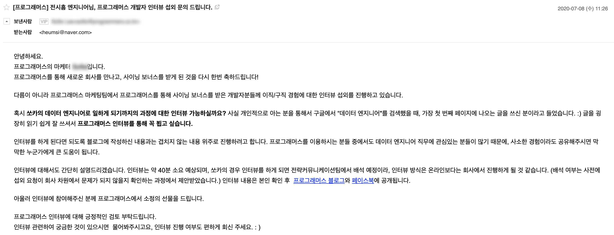
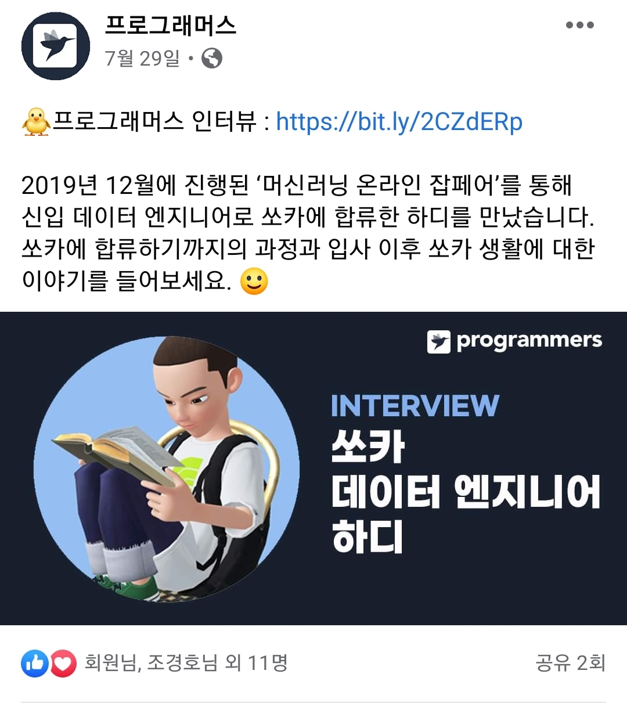
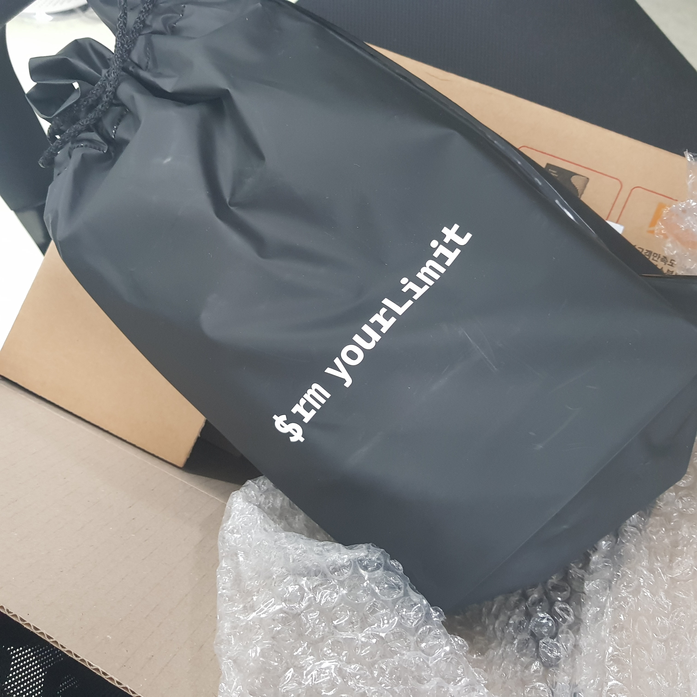
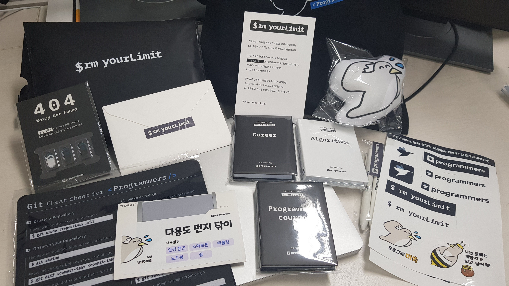
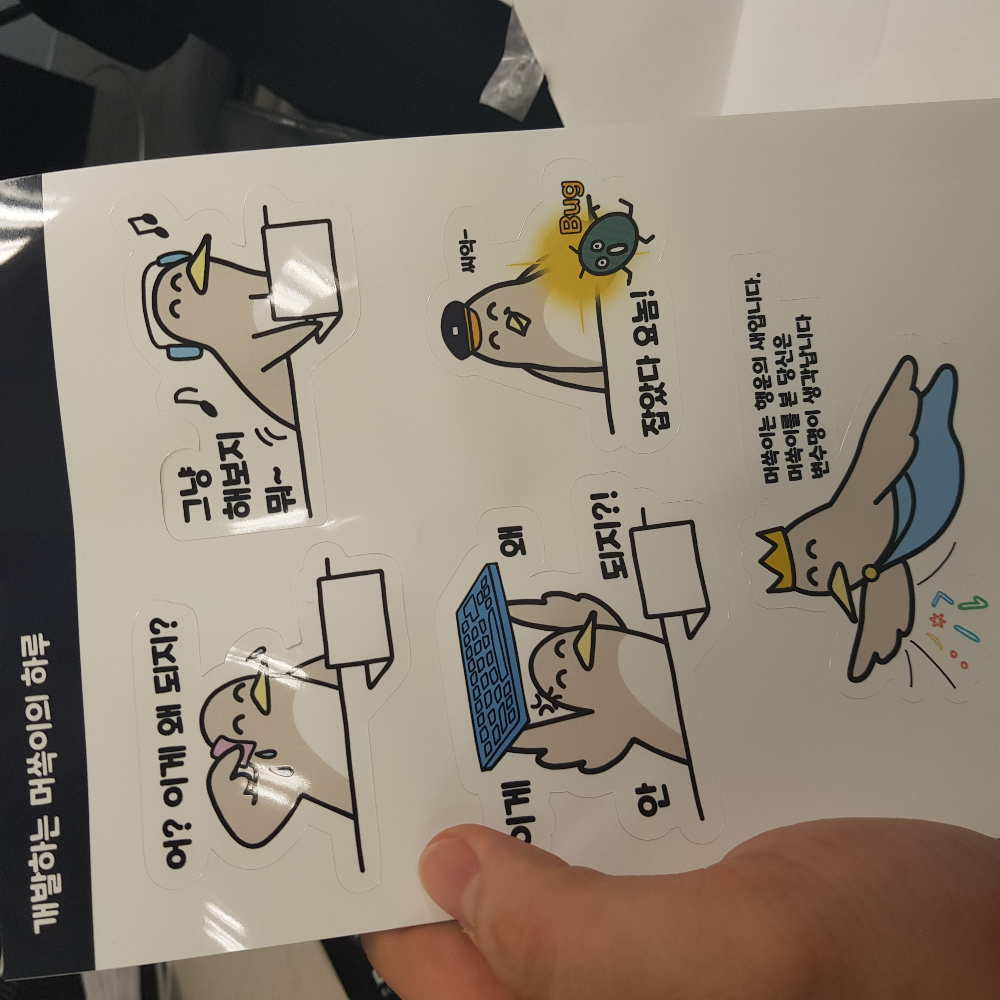

몇 주 전, 프로그래머스에서 연락이 왔었다.  
프로그래머스 머신러닝 잡페어를 통해 입사한 사람들을 인터뷰하고 싶다고 했다.  
나도 그 대상이었다.

하겠다고 했다.  

그리고 며칠 뒤 회사까지 직접 찾아오셨다.  
약 40분 정도의 인터뷰를 했다. 입사하고나서 하는 처음 받는 인터뷰였다.  
생각보다 편안하게 해주셨고, 재밌었다. 
이런 저런 질문에 대답드리긴 했으나, 역시 나는 말을 잘 못 하는거 같다. 부족한 설명이 많았다.

며칠 뒤 페이스북과 프로그래머스 블로그에 올라왔다.

내용은 [프로그래머스 블로그](https://prgms.tistory.com/25) 가면 볼 수 있다.

데이터 엔지니어를 준비하시는 분들이나, 어떤 일을 하는지 궁금해하시는 분들에게 도움이 될만한 내용이 있었으면 좋겠는데, 사실 내가 그런 경험이 잘 없다.  

솔직히 말하면, 나는 운빨로 회사 들어가게 되었다.  
그리고, 입사 후에는 데이터 엔지니어링보다는 개발 일을 주로 맡았다. 그러다 보니, 데이터 엔지니어링 그 자체보다는 데이터 엔지니어링 업무 중 코딩하는 부분에서, 팀원들이 좀 더 올바른 코드를 짤 수 환경을 마련하거나 규칙 세우는 일에 더 관심을 가지곤 했다. 내 레벨이 아직  '엔지니어링' 단계에는 못 미치고, '개발' 단계 정도가 아닐까 싶다.

여하튼... 한 1~2년 뒤에는 나름 이런저런 경험을 공유해서, 데이터 엔지니어로 준비하시는 분들에게 도움이 될 수 있었으면 좋겠다. 그 때 까지 나도 열심히 뭔가를 이뤄내보겠다 ㅎㅎ

그리고 오늘! 바로 인터뷰 답례의 선물이 회사에 도착했다!

색상 좋고, 폰트 좋고.
이 안에 뭐가 들었나 보면 ...

뭐가 많다 ... ㅎㅎ
여하튼 디자인이 너무 맘에 들었음. 색상부터 폰트... 개발자스러우면서도 이쁘달까..?

이런 것도 있고 ㅎ_ㅎ_

프로그래 "머쓱이" 너무 커엽다 ㅋ_ㅋ_
머쓱이 ㅋㅋㅋㅋㅋㅋㅋㅋ 이름 잘 지은듯.

여하튼 인터뷰 & 선물 너무 감사드리고~  
프로그래머스 요새 뭔가 이것저것 많이 하는거 같은데 잘 됐으면 좋겠다~!  
여러분 프로그래머스에서 채용 기회 잡으세요~

